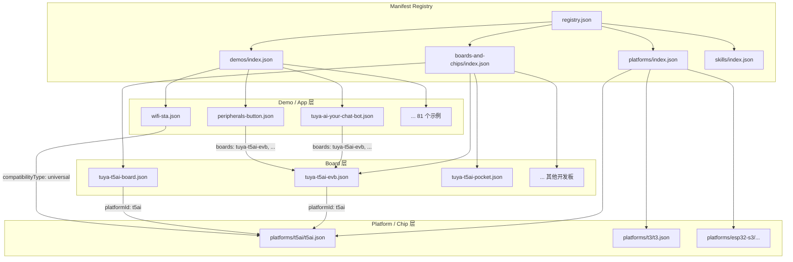
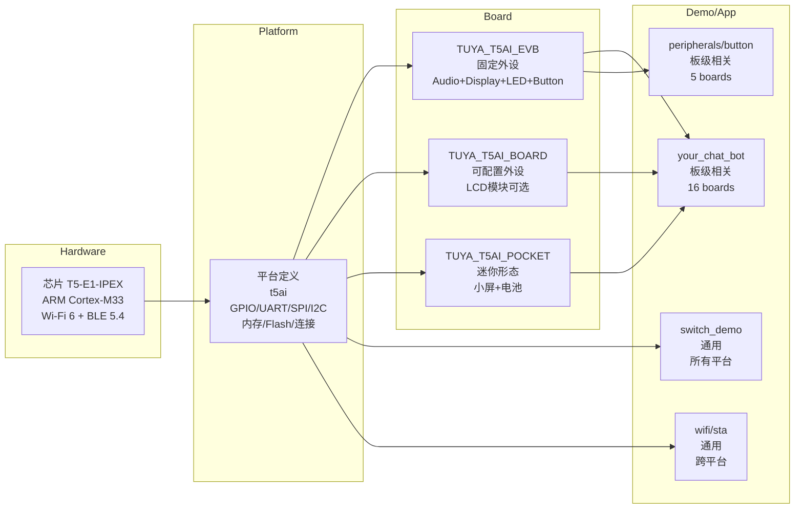
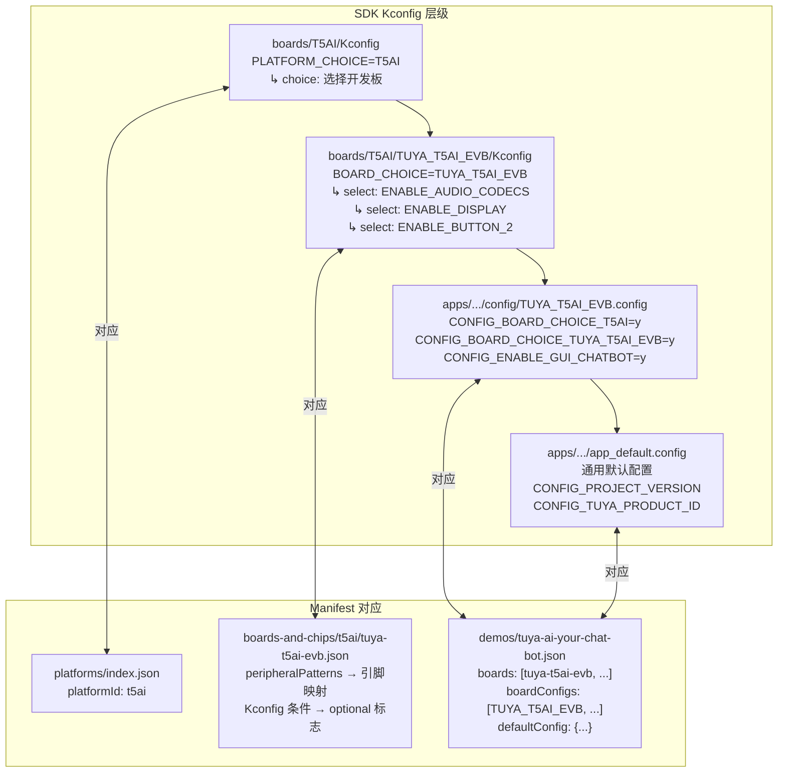
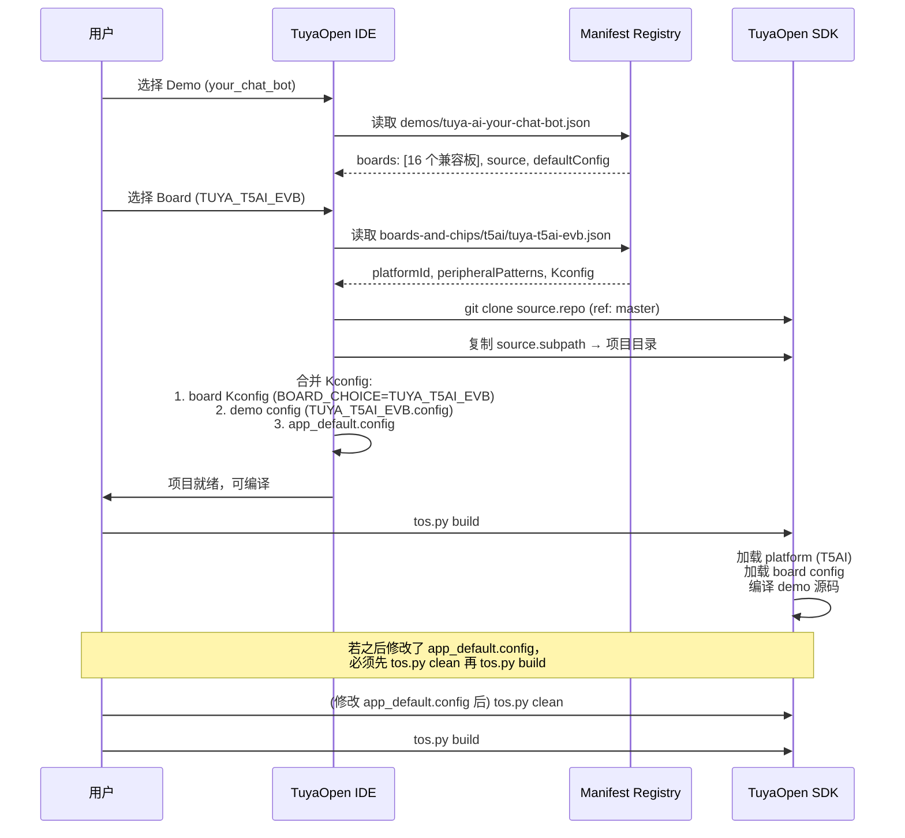
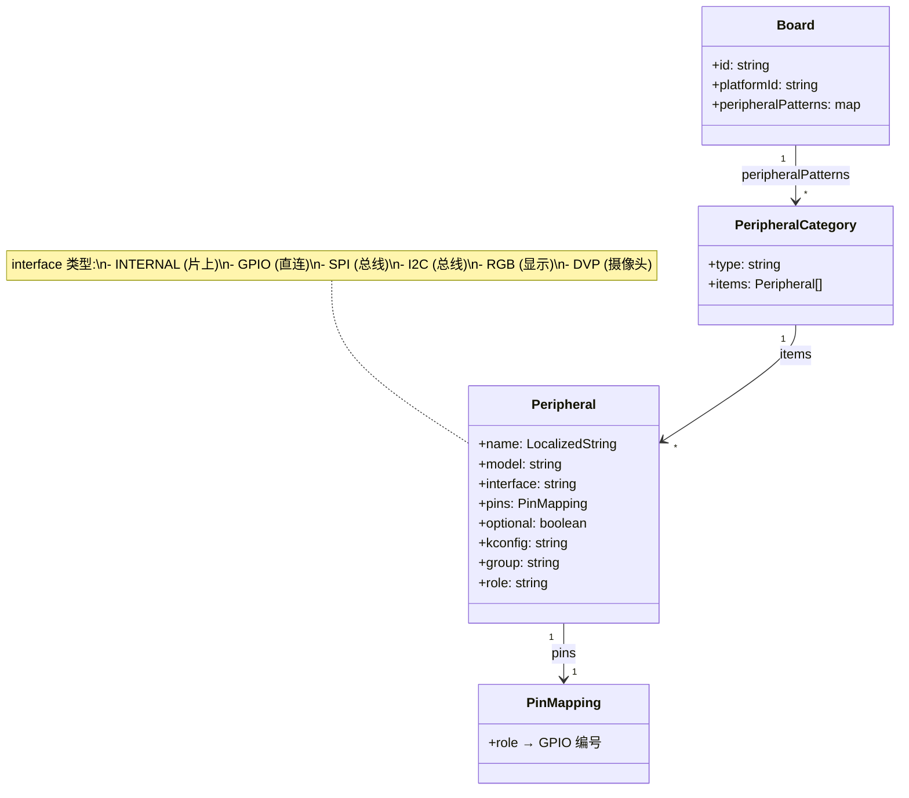

# TuyaOpen Manifest Architecture

## Overview

TuyaOpen IDE Manifest 是连接 IDE、SDK 和硬件的数据层。它定义了从芯片到平台、到开发板、再到示例应用之间的完整层级关系。

---

## 层级架构



---

## 完整依赖关系



---

## Kconfig 与 Manifest 的映射关系



---

## 数据流：创建项目



> ⚠️ **修改 `app_default.config` 后必须 `tos.py clean`**
> 与 `tos.py config choice` / `config menu`（会自动触发 clean）不同，**手动编辑** `app_default.config` 不会触发 clean。此时陈旧的 `.build/cache/using.config` 会被复用，直接 `tos.py build` 会静默忽略你的改动。因此**任何对 `app_default.config` 的手动修改完成后，都需要先执行 `tos.py clean`，再重新 `tos.py build`**，改动才会生效。

---

## 文件系统对照表

### Manifest Registry (声明式元数据)

```
vendor/tuyaopen-ide-manifests/
├── registry.json                          # 入口：4 个域的 URL
├── platforms/
│   ├── index.json                         # 平台列表
│   └── t5ai/
│       └── t5ai.json                      # 芯片详情：架构/内存/引脚/外设能力
├── boards-and-chips/
│   ├── index.json                         # 开发板列表 (id, platformId, summary)
│   └── t5ai/
│       ├── tuya-t5ai-evb.json            # 板级详情 + peripheralPatterns
│       ├── tuya-t5ai-board.json
│       └── ...
├── demos/
│   ├── index.json                         # 81 个 demo 索引
│   ├── tuya-ai-your-chat-bot.json        # 详情：defaultConfig, boardConfigs
│   ├── wifi-sta.json
│   └── ...
└── skills/
    └── index.json                         # IDE AI Skills 注册表
```

### TuyaOpen SDK (构建系统实现)

```
TuyaOpenSDK/
├── platform/
│   ├── platform_config.yaml              # 平台 git 子模块定义
│   └── T5AI/                             # 编译器/工具链/CMake
├── boards/
│   └── T5AI/
│       ├── Kconfig                       # 平台级 Kconfig (选板)
│       ├── TKL_Kconfig                   # 外设驱动 Kconfig
│       ├── config/
│       │   └── T5AI.config              # 平台默认 config
│       ├── TUYA_T5AI_EVB/
│       │   └── Kconfig                  # 板级 Kconfig (启用哪些外设)
│       ├── TUYA_T5AI_BOARD/
│       │   └── Kconfig
│       └── ...
├── apps/                                  # 板级相关应用
│   ├── tuya.ai/
│   │   └── your_chat_bot/
│   │       ├── config/
│   │       │   ├── TUYA_T5AI_EVB.config  # 每个板的配置覆盖
│   │       │   ├── DNESP32S3.config
│   │       │   └── ...
│   │       ├── app_default.config        # 通用默认
│   │       ├── Kconfig                   # App 级可配置项
│   │       └── src/
│   └── tuya_cloud/
│       └── switch_demo/                  # 无 config/ → 通用
│           ├── app_default.config
│           └── src/
└── examples/                              # 通用示例
    ├── peripherals/button/
    │   ├── config/                       # 部分 example 也有板级配置
    │   │   ├── TUYA_T5AI_EVB.config
    │   │   └── ...
    │   └── src/
    └── wifi/sta/                          # 无 config/ → 完全通用
        ├── app_default.config
        └── README.md
```

---

## 关键概念映射

| 概念 | Manifest 字段 | SDK Kconfig | 说明 |
|------|--------------|-------------|------|
| **芯片平台** | `platformId: "t5ai"` | `CONFIG_PLATFORM_CHOICE=T5AI` | 决定工具链和驱动层 |
| **开发板** | `board.id: "tuya-t5ai-evb"` | `CONFIG_BOARD_CHOICE_TUYA_T5AI_EVB=y` | 决定引脚和外设 |
| **外设启用** | `peripheralPatterns.*.optional` | `CONFIG_ENABLE_DISPLAY=y` | Kconfig 条件编译 |
| **兼容性** | `demo.compatibilityType` | 有无 `config/` 目录 | universal=跨平台, board-specific=需选板 |
| **板级配置** | `demo.boardConfigs[]` | `config/*.config` 文件名 | 每个 .config 文件对应一个支持的板 |
| **默认配置** | `demo.defaultConfig` | `app_default.config` 内容 | 项目级通用配置；**修改后须 `tos.py clean` 再构建** |
| **来源** | `demo.source.subpath` | 实际代码路径 | apps/ 或 examples/ 下的子目录 |

---

## 兼容性判断逻辑

```mermaid
flowchart TD
    START[用户选择了一个 Demo] --> CHECK_TYPE{compatibilityType?}
    
    CHECK_TYPE -->|universal| SHOW_ALL[显示所有开发板<br/>该 Demo 跨平台兼容]
    CHECK_TYPE -->|board-specific| CHECK_BOARDS[检查 demo.boards 列表]
    
    CHECK_BOARDS --> FILTER[只显示 boards[] 中<br/>包含的开发板]
    
    SHOW_ALL --> SELECT_BOARD[用户选板]
    FILTER --> SELECT_BOARD
    
    SELECT_BOARD --> GEN_CONFIG[生成项目配置]
    
    GEN_CONFIG --> HAS_BOARD_CONFIG{demo 有该板的<br/>config/*.config?}
    
    HAS_BOARD_CONFIG -->|是| USE_BOARD_CFG[使用板级 config 覆盖]
    HAS_BOARD_CONFIG -->|否| USE_DEFAULT[使用 app_default.config]
    
    USE_BOARD_CFG --> BUILD[tos.py build]
    USE_DEFAULT --> BUILD

    BUILD --> EDIT{修改了<br/>app_default.config?}
    EDIT -->|是| CLEAN[tos.py clean<br/>清除陈旧 .build/cache/using.config]
    EDIT -->|否| DONE[完成]
    CLEAN --> BUILD
```

---

## peripheralPatterns 结构



---

## 总结

**核心设计原则:**

1. **声明式分离** — Manifest 只描述「是什么」和「在哪里」，不包含构建逻辑
2. **懒加载** — registry.json → domain index → detail file，逐层加载
3. **双向映射** — Manifest 的 board ID ↔ SDK 的 Kconfig BOARD_CHOICE
4. **兼容性标签** — `universal` vs `board-specific` 让 IDE 知道何时需要用户选板
5. **Config 文件名 = 支持的板** — `config/TUYA_T5AI_EVB.config` 存在即表示该板兼容
