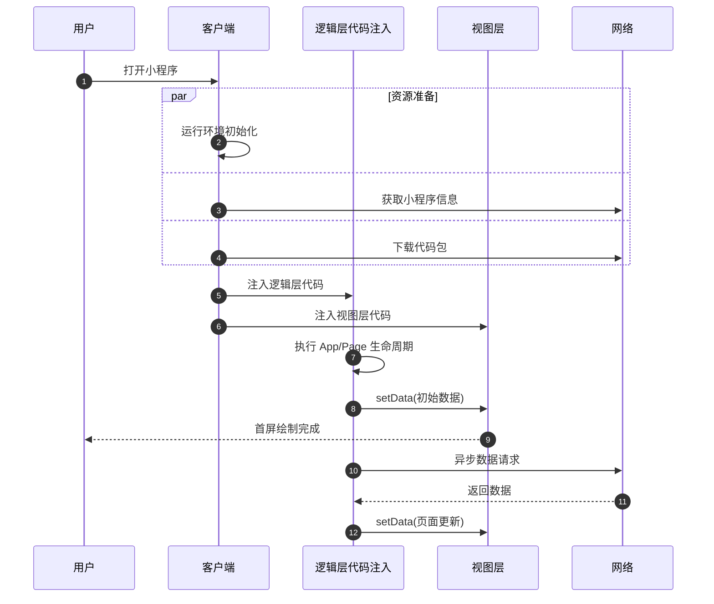

# 性能与体验 (optimization)

[AI-generated summary: 本文档提供了Tuya小程序的全面性能优化指南，涵盖启动性能、运行时性能、用户体验等核心优化方向。通过分析工具定位问题，结合代码注入、首屏渲染、数据更新、资源加载等优化技巧，帮助开发者持续提升小程序的响应速度和流畅度。覆盖内容：setData、FMP、FPS、preDownloadMiniApp、preloadPanel、getStorage、setStorage、navigateTo、redirectTo、reLaunch、onMemoryWarning、onPageScroll、lazyLoad、React.memo、useMemo、useRef、useEffect、usePageEvent、CSS动画、RJS、rpx、safe-area-inset、widthFix、skeleton骨架屏]

## 性能与体验

### 为什么要进行性能优化

小程序的性能与用户体验密切相关。在使用小程序过程中，用户可能会遇到以下问题：

- **启动慢**：点击小程序后等待时间过长
- **页面卡顿**：滑动列表或操作时出现掉帧
- **响应延迟**：点击按钮后反馈不及时
- **白屏时间长**：页面内容迟迟无法展示

这些问题会严重影响用户的使用意愿，导致用户流失。随着小程序功能的迭代和页面的增加，性能问题会愈发突出。因此，开发者在实现功能的同时，也应投入精力进行性能优化，保障良好的用户体验。

### 性能优化的两大主题

小程序性能优化主要分为两个方向：启动性能和运行时性能。

#### 启动性能

启动性能关注的是用户打开小程序到看到首屏内容的耗时。启动耗时越短，用户越快进入小程序，流失率越低。

启动性能优化主要包括：

- [启动流程介绍](/cn/miniapp/develop/ray/guide/optimization/startup/launch-process) - 了解小程序启动的各个阶段
- [代码包体积优化](/cn/miniapp/develop/ray/guide/optimization/startup/package-size) - 减小代码包大小，加快下载速度
- [代码注入优化](/cn/miniapp/develop/ray/guide/optimization/startup/code-injection) - 优化代码执行效率
- [首屏渲染优化](/cn/miniapp/develop/ray/guide/optimization/startup/first-render) - 加快首屏内容展示

#### 运行时性能

运行时性能关注的是用户在使用小程序过程中的流畅度。良好的运行时性能让用户操作更顺滑，体验更好。

运行时性能优化主要包括：

- [合理使用 setData](/cn/miniapp/develop/ray/guide/optimization/runtime/setdata) - 优化数据更新方式
- [渲染性能优化](/cn/miniapp/develop/ray/guide/optimization/runtime/render) - 减少节点数、列表和动画的渲染开销
- [资源加载优化](/cn/miniapp/develop/ray/guide/optimization/runtime/resource) - 图片懒加载、格式和尺寸优化
- [内存优化](/cn/miniapp/develop/ray/guide/optimization/runtime/memory) - 避免内存泄漏和溢出

### 用户体验优化

除了性能优化，以下内容也会影响用户的整体体验：

- [多端适配](/cn/miniapp/develop/ray/guide/optimization/experience/adaptation) - 刘海屏、安全区域等适配方案
<!-- BOOKMARK: 新增主题适配体验优化  -->
### 如何开始优化

#### 1. 使用分析工具定位问题

在进行优化之前，首先需要了解当前小程序的性能状况。可以优先使用 [启动时性能检测](/cn/miniapp/develop/ray/guide/optimization/analysis-tools/startup-performance) 和 [FPS 性能检测](/cn/miniapp/develop/ray/guide/optimization/analysis-tools/fps) 定位启动阶段与运行阶段的瓶颈，再结合 [体验评分](/cn/miniapp/develop/ray/guide/optimization/analysis-tools/experience-score) 做整体体验检查。

#### 2. 按优先级进行优化

建议按以下优先级进行优化：

| 优先级 | 优化方向 | 原因 |
| ------ | -------- | ---- |
| 高 | 启动性能 | 直接影响用户进入小程序的意愿 |
| 高 | setData 优化 | 最常见的性能问题来源 |
| 中 | 首屏渲染 | 影响用户看到内容的时间 |
| 中 | 内存优化 | 避免小程序被系统回收 |

#### 3. 持续监控

性能优化是一个持续的过程。建议在每次版本迭代后，使用分析工具检查性能指标，确保新功能没有引入性能问题。

### 性能指标参考

以下是建议的性能指标参考值：

| 指标 | 建议值 | 说明 |
| ---- | ------ | ---- |
| 启动耗时（首次） | < 3000ms | 包含代码包下载时间 |
| 启动耗时（非首次） | < 1500ms | 使用本地缓存的代码包 |
| FMP（首次有意义渲染） | < 2000ms | 用户可开始使用的时间 |
| FPS（帧率） | >= 30 | 低于 30 会有明显卡顿感 |
| setData 数据量 | < 100KB | 单次 setData 传输的数据大小 |
| 代码包体积 | < 2MB | 超出建议使用分包加载 |
| 体验评分 | >= 85 | 综合性能与体验的评估得分 |

## 分析工具

### 启动时性能检测

启动时性能检测用于观察小程序从打开到首屏完成渲染这一阶段的耗时情况，适合排查"打开慢""首屏白屏时间长"等问题。

#### 开启步骤

在开始检测前，需要先进入调试工具入口。

1. 打开真机上的 Ray 小程序页面。
2. 进入调试工具：
   - **iOS**：点击右上角的 `...` 按钮，在底部弹层中点击 **调试工具**。
   - **Android**：长按右上角的 **X** 按钮，弹出 App 基础信息面板，点击下方的 **打开调试** 按钮。

3. 在调试工具菜单中点击 **打开性能工具**。
4. 重新进入或重新触发一次小程序启动流程，观察启动相关指标。

#### 适用场景

- 页面首次打开明显偏慢
- 版本更新后启动时间变长
- 首屏内容展示过晚
- 需要对优化前后的启动耗时做对比

#### 重点关注指标

**小程序指标**

> 以上排查阈值为行业通用参考值，实际标准以业务验收要求为准。

**App 指标**

| 指标 | 含义 |
| ---- | ---- |
| CPU | 当前 App 占用的 CPU 使用率 |
| Memory | 当前 App 占用的内存大小 |
| 启动耗时 | App 从点击启动到可用的耗时 |

#### 结果判断建议

- **启动耗时偏高**：优先检查主包体积、首屏依赖逻辑是否过重。
- **下载耗时偏高**：优先检查代码包体积、图片和静态资源是否过大。
- **准备阶段耗时偏高**：通常说明运行环境初始化慢，可检查是否有过多同步逻辑阻塞了注入流程。
- **页面渲染耗时偏高**：通常说明首屏渲染内容过重或存在阻塞渲染的异步操作。

如果已经定位到问题，可以继续参考以下文档：

- [代码包体积优化](/cn/miniapp/develop/ray/guide/optimization/startup/package-size)
- [代码注入优化](/cn/miniapp/develop/ray/guide/optimization/startup/code-injection)
- [首屏渲染优化](/cn/miniapp/develop/ray/guide/optimization/startup/first-render)
### FPS 性能检测

FPS（Frames Per Second，每秒帧数）性能检测用于观察页面在运行过程中的流畅度，适合排查滑动卡顿、动画掉帧、操作响应不顺畅等问题。

#### 打开方式

1. 在真机上进入需要检测的页面。
2. 进入调试工具：
   - **iOS**：点击右上角的 `...` 按钮，在底部弹层中点击 **调试工具**。
   - **Android**：长按右上角的 **X** 按钮，弹出 App 基础信息面板，点击下方的 **打开调试** 按钮。
3. 在调试工具菜单中点击 **打开vConsole工具**。
4. 找到**Perf** 栏，点击 "**Open FPS monitor**" 即可开启性能监测。
5. 在页面上执行滚动、切换、动画、拖拽等操作，观察帧率变化。

#### 适用场景

- 列表滑动时出现明显卡顿
- 动画播放不流畅
- 高频交互场景掉帧
- 优化前后需要对比运行时流畅度

#### 重点关注指标

| 指标 | 含义 | 说明 |
| ---- | ---- | ---- |
| FPS | 每秒渲染帧数 | 数值越高，页面越流畅 |

更多指标请查看[调试指南](/cn/miniapp/develop/ray/guide/debug-guide) 

#### 结果判断建议

- **FPS 长时间偏低**：通常说明页面整体渲染负担较重。
- **滚动时 FPS 明显下降**：优先检查长列表渲染、节点数量、重复渲染问题。
- **动画过程中 FPS 明显下降**：优先检查动画是否由频繁的数据更新驱动，是否可以改为更轻量的动画方案。
- **特定操作时瞬时掉帧**：通常与同步计算、批量更新或大数据处理有关。

如果已经定位到问题，可以继续参考以下文档：

- [合理使用 setData](/cn/miniapp/develop/ray/guide/optimization/runtime/setdata)
- [渲染性能优化](/cn/miniapp/develop/ray/guide/optimization/runtime/render)
### 体验评分

体验评分用于在真机环境下评估小程序当前版本的整体体验表现，适合在提测前或版本发布前做一次集中检查。

#### 运行环境要求

开启体验评分前，请先确认以下条件：

| 项目 | 要求 |
| ---- | ---- |
| App 版本 | 下载并安装 `6.5.0` 或以上版本的涂鸦智能 / 智能生活 App |
| 基础库版本 | 切换到 `2.27.0` 或以上版本 |
| 小程序版本 | 仅支持对**体验版小程序**进行体验评分 |

#### 开启步骤

1. 在真机上进入需要检测的 Ray 小程序页面。
2. 进入调试工具：
   - **iOS**：点击右上角的 `...` 按钮，进入面板菜单，点击底部弹层中的 **调试工具**。
   - **Android**：长按右上角的 **X** 按钮，弹出 App 基础信息面板，点击下方的 **打开调试** 按钮。
3. 在调试工具菜单中点击 **开启体验评分**。

4. 开始体验评分，尽量触达尽可能多的页面与交互，保证体验数据质量。
5. 点击 **结束**，打开体验评分数据页面。
6. 查看评分数据，结束流程。

#### 使用说明

- 体验评分更适合在功能基本稳定后进行，不建议在明显未完成的页面上反复评分。
- 评分时尽量按照真实用户路径完成主要操作，这样更容易暴露启动、渲染、交互等方面的问题。
- 如果页面依赖网络、蓝牙或设备联动，建议在真实使用环境下进行评分，避免因测试环境差异导致结果失真。

#### 评分方法与指标

具体的评分方法、评分维度和指标定义，请直接查看官方说明：

- [评分方法与指标说明](/cn/miniapp/devtools/tools/extension/audit/scoring)

## 启动性能

### 启动性能

小程序启动是用户体验中极为重要的一环。启动耗时过长会导致用户流失，影响小程序的留存率。

#### 什么是小程序启动

小程序的启动分为两种类型：

| 类型 | 定义 | 特征 |
| ---- | ---- | ---- |
| **冷启动** | 小程序首次打开，或被系统销毁后重新打开 | 需要经历完整的启动流程，耗时较长 |
| **热启动** | 小程序已在后台运行，用户切回前台 | 无需重新加载，几乎无感知 |

本章节讨论的启动性能优化主要针对**冷启动**场景。

#### 启动耗时的定义

小程序的启动过程以 **"用户打开小程序"** 为起点，到小程序 **"首页渲染完成"** 为止。

- **起点**：用户点击小程序入口
- **终点**：首个页面的 `Page.onReady` 事件触发

#### 启动耗时建议

| 场景 | 建议耗时 |
| ---- | -------- |
| 首次打开（含下载） | < 3000ms |
| 非首次打开（使用本地缓存） | < 1500ms |

#### 启动优化方向

小程序启动流程中，以下环节与小程序本身相关，开发者可以进行优化：

| 优化方向 | 核心目标 | 详细文档 |
| -------- | -------- | -------- |
| 代码包体积优化 | 减小下载体积，加快下载速度 | [代码包体积优化](/cn/miniapp/develop/ray/guide/optimization/startup/package-size) |
| 代码注入优化 | 减少代码执行时间 | [代码注入优化](/cn/miniapp/develop/ray/guide/optimization/startup/code-injection) |
| 首屏渲染优化 | 加快页面内容展示 | [首屏渲染优化](/cn/miniapp/develop/ray/guide/optimization/startup/first-render) |

要了解完整的启动流程细节，请参考 [启动流程介绍](/cn/miniapp/develop/ray/guide/optimization/startup/launch-process)。
### 小程序启动流程介绍

在进行启动优化之前，需要先了解小程序的启动过程。理解各个阶段的作用和耗时因素，可以帮助开发者更有针对性地选择优化手段。

> 小程序启动的各流程不是完全串行的，部分流程会并行执行。总启动耗时不等于各阶段耗时的简单加和。

#### 启动流程概览

小程序启动过程主要包含以下阶段：



#### 1. 资源准备

##### 1.1 运行环境准备

小程序的运行环境包括：

- 小程序进程
- 客户端原生系统组件和 UI 元素（导航栏、tabBar 等）
- 渲染页面使用的 WebView 容器
- JavaScript 运行引擎
- 小程序基础库

部分环境（如 JavaScript 引擎、基础库）需要在执行小程序代码之前准备完成，其他部分会在启动过程中并行初始化。

> 为了降低运行环境准备对启动耗时的影响，客户端会根据用户的使用场景和设备资源状况，在小程序启动前对运行环境进行预加载。

##### 1.2 小程序信息获取

客户端需要从后台获取小程序的基本信息（版本、配置、权限等）。这些信息会在本地缓存，并通过一定机制更新。

| 请求类型 | 触发场景 | 对启动的影响 |
| -------- | -------- | ------------ |
| 同步请求 | 首次访问、发现新版本 | 阻塞启动流程 |
| 异步请求 | 已使用过且无新版本 | 不影响启动流程 |

###### 对启动耗时的影响

- 首次访问或版本更新时，信息获取会增加启动耗时
- 耗时主要受网络环境影响
- 频繁发布版本会导致用户启动时同步请求比例上升，建议合理规划版本发布节奏

##### 1.3 代码包下载

小程序启动时需要下载代码包。和信息获取类似，代码包也有缓存机制：

| 下载类型 | 触发场景 | 对启动的影响 |
| -------- | -------- | ------------ |
| 同步下载 | 首次下载、发现新版本需同步更新 | 阻塞启动流程 |
| 异步下载 | 已使用过，后台异步检测到新版本 | 不影响启动流程 |

###### 对启动耗时的影响

- 下载耗时是启动过程的重要瓶颈
- 耗时与网络环境和代码包压缩后大小直接相关
- 开发者应尽量控制代码包体积，参考 [代码包体积优化](/cn/miniapp/develop/ray/guide/optimization/startup/package-size)

#### 2. 代码注入

##### 2.1 逻辑层代码注入

小程序启动时需要读取代码包中的配置和代码，注入到 JavaScript 引擎中执行。在此过程中会触发：

- `App.onLaunch` 生命周期
- `App.onShow` 生命周期

###### 对启动耗时的影响

- **代码量和复杂度**：代码越多、逻辑越复杂，注入时间越长
- **同步接口调用**：启动时调用同步 API 会阻塞注入过程
- **复杂计算**：启动时执行大量计算会延长注入时间

##### 2.2 视图层代码注入

开发者编写的样式和模板代码会编译为 JavaScript 注入到视图层，包含页面渲染所需的结构和样式信息。逻辑层和视图层的代码注入是并行进行的。

###### 对启动耗时的影响

注入耗时与**页面结构复杂度**和**使用的自定义组件数量**有关。

#### 3. 首页渲染

逻辑层代码注入完成后，小程序框架会：

1. 根据用户访问的页面进行页面组件树初始化
2. 触发 `Page.onLoad`，开发者可在此设置初始数据
3. 生成初始渲染数据发送到视图层，触发 `Page.onShow`
4. 视图层收到数据后进行首屏绘制
5. 首屏绘制完成后触发 `Page.onReady`

`Page.onReady` 触发标志着小程序启动流程完成。

###### 对启动耗时的影响

- 首页渲染耗时是启动过程的最后一环
- 耗时与页面结构复杂度和参与渲染的组件数量相关
- 参考 [首屏渲染优化](/cn/miniapp/develop/ray/guide/optimization/startup/first-render)

#### 4. 首屏内容展示

首页渲染完成后，小程序 Loading 消失。但如果首屏主体内容依赖异步网络请求，用户可能看到的仍是空白或骨架屏，需要等请求返回后通过 `setData` 更新页面才能呈现完整内容。

###### 对启动耗时的影响

异步数据请求不计入启动耗时统计，但会延迟用户看到完整内容的时间，影响实际体验。

#### 生命周期时序总结

```
App.onLaunch → App.onShow → Page.onLoad → Page.onShow → Page.onReady
     ↑                            ↑                           ↑
  逻辑层注入完成               页面初始化完成              首屏渲染完成
```

#### 常见问题

##### 为什么首次打开比后续打开慢很多？

首次打开需要同步下载代码包和获取小程序信息，后续打开会使用本地缓存，省去了下载步骤。

##### 为什么不同设备启动耗时差异很大？

- 设备性能不同（CPU、内存）
- 不同操作系统的进程管理机制不同
- 低端设备预加载的运行环境更容易被系统回收

#### 相关文档

- [代码包体积优化](/cn/miniapp/develop/ray/guide/optimization/startup/package-size)
- [代码注入优化](/cn/miniapp/develop/ray/guide/optimization/startup/code-injection)
- [首屏渲染优化](/cn/miniapp/develop/ray/guide/optimization/startup/first-render)
### 代码包体积优化

代码包体积直接影响小程序的下载耗时。体积越大，首次打开和版本更新时的下载时间越长。控制代码包体积是启动性能优化中最有效的手段之一。

#### 使用分包加载

分包加载是控制启动时代码包体积最有效的方式。通过将小程序拆分为多个分包，启动时只需下载主包，其他分包在需要时再按需加载。[分包加载](/cn/miniapp/develop/miniapp/guide/ability/sub-packages)

**适合场景**：包大小超过 2M 的项目

##### 优化建议

- 将**启动不需要的页面**放入分包
- 主包只保留必要的公共资源和启动页面
- 合理规划分包结构，避免单个分包过大

#### 移除无用代码和资源

随着项目迭代，代码包中可能积累了大量不再使用的代码和资源文件。

##### 排查方法

1. **检查未引用的页面**：`app.json` 中注册但实际未使用的页面
2. **检查未引用的组件**：JSON 中声明但未使用的自定义组件
3. **检查未引用的资源**：项目中存在但没有被引用的图片、字体等文件
4. **检查未使用的依赖**：`package.json` 中安装但未使用的 npm 包

##### 构建依赖分析

`@ray-js/cli` 提供了构建依赖分析能力，可以可视化查看各模块在产物中的体积占比，帮助快速定位体积异常的依赖包。[Ray构建依赖分析](/cn/miniapp/develop/ray/guide/optimization/startup/bundle-analysis)。

#### 图片和资源优化

图片和资源文件通常是代码包体积的大头。

##### 图片上传到 CDN

开发者可以将项目中的静态资源(如图片、音频等)上传到 CDN，运行时会自动替换为对应的 CDN 地址，减少图片体积占用。[涂鸦 CDN 使用指南](/cn/miniapp/develop/ray/guide/cdn/tuya_cdn)。

##### 图片压缩

如果必须使用本地图片，建议：

- 使用合适的图片格式（WebP 通常比 PNG/JPG 更小）
- 避免 base64 内联大资源
- 使用工具压缩图片（如 [Tinypng](https://tinypng.com/)）
- 控制图片尺寸，避免使用超出显示需要的大尺寸图片

#### 对依赖的选择和引入

选择依赖包时，关注包的体积大小：

```javascript
// 推荐：使用轻量工具库
import dayjs from 'dayjs'; // ~2KB

// 避免：使用重量级库
import moment from 'moment'; // ~70KB
```

对于支持按需引入的库，避免全量导入：

```javascript
// 推荐：按需引入
import debounce from 'lodash/debounce';

// 避免：全量引入
import { debounce } from 'lodash';
```

#### 去 react-dom

**环境要求**：@ray-js/ray >= 1.7.39

Ray 的较新版本已去除错误引入的 `react-dom` 依赖，升级后业务包可减少 100k+ 的体积。如果当前版本较旧，升级 Ray 版本即可生效。

#### 去除冗余 iconfont

**环境要求**：@ray-js/ray >= 1.6.0

旧版本中，任何引用了 `@ray-js/ray` 的页面都会将 `iconfont.css` 全量打包进去，导致每个页面都带上了一份多余的字体样式。升级到 @ray-js/ray >= 1.6.0 后，`iconfont.css` 改为按需引入，仅在实际用到图标时才会打包，可明显减少包体积。

```js
// `@ray-js/ray@1.6.0` 版本之后不再内置 Icon 组件，需要单独安装 `@ray-js/icons`
import { Icon } from '@ray-js/icons';
```

#### 按需加载 Smart-UI

**适用场景**：使用 Smart-UI 的项目

**环境要求**：
- `@ray-js/cli` >= 1.7.4
- esbuild 构建模式（不支持 webpack）
- 使用 ESModule `import` 语法
- SmartUI >= 2.4.0

配置后构建时会自动将 Smart-UI 的全量导入转换为按需导入，降低包体积。在 `ray.config.ts` 中增加 `importTransformer` 配置：

```typescript
import { RayConfig } from '@ray-js/types';
import SmartUIAutoImport from '@ray-js/smart-ui/lib/auto-import';

const config: RayConfig = {
  // ...
  importTransformer: [SmartUIAutoImport],
};

export default config;
```

配置后效果：

```typescript
// 构建前
import { Button } from '@ray-js/smart-ui';

// 构建后（自动转换）
import { Button } from '@ray-js/smart-ui/es/button';
```

#### 检查清单

| 检查项 | 优化方法 |
| ------ | -------- |
| 包体积是否超过 2MB | 使用分包加载，启动时只下载主包 |
| 是否有未引用的依赖、组件、资源 | 使用构建依赖分析排查并删除 |
| 是否引入了体积过大的第三方库 | 替换为轻量库，或使用按需引入 |
| 是否有本地图片资源 | 上传到 CDN/压缩后引用 |
| 是否全量引入了 Smart-UI | 配置 importTransformer 开启按需加载 |
| Ray 版本是否过旧 | 升级到 >= 1.6.0 去除冗余 iconfont；升级到 >= 1.7.39 去除 react-dom 依赖 |
### 代码注入优化

代码注入是小程序启动流程中继代码包下载后的关键阶段：基础库将开发者的 JS 代码加载进 JavaScript 引擎，依次完成解析、编译和执行。这个阶段的核心特点是——所有被加载模块的顶层代码都会在此刻立即执行，包括 `App()` 定义、全局变量初始化，以及 `App.onLaunch` / `App.onShow` 生命周期。

因此，优化代码注入耗时的核心思路是：**尽量减少启动时必须执行的代码量，将不紧迫的工作推迟到真正需要时再做**。

#### 控制模块顶层的执行量

JS 模块的顶层代码（函数体以外的代码）在注入时会被立即执行。如果在顶层进行复杂计算、大量数据初始化或同步读取操作，这部分耗时会直接累加到注入阶段。

```javascript
// 顶层的 transform 调用在注入时立即执行
const processedList = rawList.map(item => heavyTransform(item));

// 推迟到真正需要时再处理
function getProcessedList() {
  if (!_cache) _cache = rawList.map(item => heavyTransform(item));
  return _cache;
}
```

#### 减少同步 API 的调用

在启动过程中，高频调用 TTT 能力可能会阻塞 JS 线程，影响代码执行。应尽量减少或不调用同步 API，绝大多数同步 API 以 `Sync` 结尾。

**缓存机制:**

- 基础库对以下接口做了一层缓存，避免重复调用：
  - `getLaunchOptions`
  - `getLaunchOptionsSync`

- 以下接口调用频繁，但含有动态数据，无法直接缓存，可自行处理缓存：
  - `getSystemInfo`
  - `getSystemInfoSync`

> 注意：涉及 `system`、`brand`、`model`、`platform` 等数据可调用 [getDeviceInfo](/cn/miniapp/develop/miniapp/api/base/system/getDeviceInfo) 接口，该接口已做缓存

- 以下接口包含动态数据，暂不处理，业务层可自行缓存逻辑：
  - `getDeviceInfo`
  - `getGroupInfo`
  - `getCustomConfig`

> 非持久化存储可通过 `globalData` 存储，而非 `getStorage` 接口。

#### 精简 App 初始化的工作量

Ray 项目的 `app.tsx` 在注入阶段会立即执行。常见误区是把所有初始化工作都集中在这里：

```tsx
// ❌ 避免：把不紧迫的逻辑堆在启动时执行
initSDK();         // 必要
checkLogin();      // 必要
loadUserConfig();  // 不紧迫，可延迟
reportAnalytics(); // 不紧迫，可延迟
checkAppUpdate();  // 不紧迫，可延迟
```

建议只保留真正影响首屏的逻辑（如登录态检查），其余操作延迟到首页组件挂载后再执行：

```tsx
// ✅ 推荐：非必要初始化推迟到首页挂载后
function HomePage() {
  useEffect(() => {
    loadUserConfig();
    reportAnalytics();
    checkAppUpdate();
  }, []);
}
```

#### 检查清单

| 检查项 | 优化方法 |
| ------ | -------- |
| 模块顶层是否有复杂计算 | 改为懒执行，在需要时再计算 |
| 是否有大量同步 API 调用 | 减少或替换为异步 API，使用基础库缓存接口 |
| App 初始化是否包含非必要逻辑 | 延迟到首页组件挂载后再执行 |
### 首屏渲染优化

代码注入完成后，小程序进入首屏渲染阶段：`Page.onLoad` 触发、组件树初始化、初始数据传输到视图层、视图层完成渲染，直到 `Page.onReady` 触发为止。

这个阶段的耗时主要来自两个方向：**渲染本身的复杂度**（节点数量、数据量大小），以及**数据的等待时间**（网络请求、本地读取）。两者都会影响用户看到可用内容的时机。

#### 精简初始 data

`data` 中的数据在每次渲染前都会从逻辑层传输到视图层，首屏 `data` 的大小直接影响传输耗时和渲染耗时。

- **放了首屏用不到的数据**：数据分页、Tab 切换内容、弹窗内容等不在首屏展示，如果提前放入 `data` 初始值，会参与传输和渲染计算。应在需要展示时才通过 `setData` 更新。
- **把非渲染数据放进了 data**：逻辑计算的中间结果、配置项、静态映射表等与视图无关的数据，放在 `data` 里只会增加传输负担。应挂在 `this` 上作为普通属性。

#### 减少首屏节点数量

页面节点数越多，视图层的布局计算和绘制开销越大。

**常用手段**：

- **条件渲染延迟展示**：屏幕外的区域（如折叠内容、底部区块）首屏渲染完成后再展示
- **长列表分页渲染**：首屏只渲染前几条数据，用户滚动时再追加
- **延迟挂载非必需组件**：过多的自定义组件会增加初始化开销，非首屏必需的组件可以延迟挂载

#### 利用本地缓存

对于变化不频繁的首屏数据，采用"先缓存渲染，后台更新"的策略：
小程序提供 [setStorage](/cn/miniapp/develop/ray/api/storage/setStorage) 和 [getStorage](/cn/miniapp/develop/ray/api/storage/getStorage) 等本地缓存能力，数据存储在本地，返回速度快于网络请求。

1. 上次请求成功后写入本地缓存
2. 下次启动时先从缓存渲染
3. 同时在后台发起请求获取最新数据
4. 数据返回后更新视图

```tsx
import { getStorage, setStorage } from '@ray-js/ray';

function HomePage() {
  const [data, setData] = useState(null);

  useEffect(() => {
    // 先读缓存渲染
    getStorage({
      key: 'panelData',
      success: (res) => setData(res.data),
    });

    // 后台获取最新数据
    fetchPanelData().then((fresh) => {
      setData(fresh);
      setStorage({ key: 'panelData', data: fresh });
    });
  }, []);

  // ...
}
```

#### 使用骨架屏

即使做了请求提前和缓存优化，仍有部分数据需要等待。骨架屏可以在数据返回前展示页面的大致轮廓，让用户感知到"页面在加载"而非"页面没有响应"，降低感知等待时间。

详见[骨架屏生成方案](/cn/miniapp/develop/ray/guide/optimization/experience/skeleton)。

#### 小程序预加载

对于通过卡片或快捷入口打开的小程序，可以调用 [preDownloadMiniApp](/cn/miniapp/develop/ray/api/base/container/preDownloadMiniApp#predownloadminiapp) 和 [preloadPanel](/cn/miniapp/develop/ray/api/base/panel/preloadPanel#preloadpanel) 提前在后台完成代码包下载。用户真正点击时跳过下载阶段直接进入注入流程，首次打开体验会明显更快。
默认投放的首页卡片已内置预下载逻辑，无需额外配置。

**适合场景**：首页投放卡片，点击唤起小程序。默认卡片会预下载小程序资源，当用户点击卡片时，会直接唤起小程序。
#### 利用内存缓存

小程序关闭后短时间内重新进入，基础库的内存缓存机制可以跳过下载和部分注入步骤，加快重新打开的速度。这一能力默认开启，没有特殊需求不要关闭。

详见[内存缓存](/cn/miniapp/develop/ray/guide/ability/memoryCache)。

#### 检查清单

| 问题现象 | 可能原因 | 优化方法 |
| -------- | -------- | -------- |
| 首屏渲染耗时长 | 初始 data 包含非首屏字段，传输数据量过大 | 只保留首屏渲染必需的字段，其余数据按需加载 / 延迟加载 |
| 页面布局计算慢、绘制卡顿 | 首屏节点数过多 | 折叠区块、列表等改为条件渲染或分页渲染，首屏只渲染可见部分 |
| 首屏内容等待网络才能展示 | 每次启动都依赖网络请求返回后才渲染 | 对于不易改动的数据，读取本地缓存先渲染，同时后台请求并更新视图 |
| 用户感知白屏时间长 | 数据加载期间页面无任何内容 | 加入骨架屏，在数据返回前展示页面轮廓 |
| 卡片点击后首次打开慢 | 点击时才开始下载代码包 | 调用 `preDownloadMiniApp` / `preloadPanel` 提前在后台下载 |
| 二次打开速度明显变慢 | 内存缓存被关闭，跳过了缓存加速路径 | 确认未关闭内存缓存，恢复默认配置 |

## 运行时性能

### 运行时性能

运行时性能关注的是用户在使用小程序过程中的流畅度。良好的运行时性能意味着页面滑动流畅、操作响应及时、动画自然顺滑。

#### 常见性能问题

| 表现 | 可能原因 | 优化方向 |
| ---- | -------- | -------- |
| 页面滑动卡顿 | 频繁更新状态、节点过多 | [合理使用 setData](/cn/miniapp/develop/ray/guide/optimization/runtime/setdata)、[渲染性能优化](/cn/miniapp/develop/ray/guide/optimization/runtime/render) |
| 操作响应延迟 | 逻辑层阻塞、大量同步计算 | [合理使用 setData](/cn/miniapp/develop/ray/guide/optimization/runtime/setdata) |
| 页面渲染慢或抖动 | 节点结构复杂、列表未优化、动画方案不当 | [渲染性能优化](/cn/miniapp/develop/ray/guide/optimization/runtime/render) |
| 图片加载慢或布局跳动 | 图片未懒加载、尺寸模式不当 | [资源加载优化](/cn/miniapp/develop/ray/guide/optimization/runtime/resource) |
| 小程序被系统回收 | 内存占用过高 | [内存优化](/cn/miniapp/develop/ray/guide/optimization/runtime/memory) |

#### 小程序架构与性能的关系

涂鸦小程序采用**双线程架构**：

- **逻辑层**：运行开发者的 JavaScript 代码，处理数据和业务逻辑
- **视图层**：负责页面渲染和用户交互

两个线程之间通过消息通信传递数据。`setData` 是逻辑层向视图层发送数据的主要方式，因此 `setData` 的使用方式直接影响小程序的运行时性能。

理解这一架构，是进行运行时性能优化的基础。

#### 优化指南

- [合理使用 setData](/cn/miniapp/develop/ray/guide/optimization/runtime/setdata) - 最关键的优化点
- [渲染性能优化](/cn/miniapp/develop/ray/guide/optimization/runtime/render) - 减少渲染开销
- [资源加载优化](/cn/miniapp/develop/ray/guide/optimization/runtime/resource) - 图片等资源的加载优化
- [内存优化](/cn/miniapp/develop/ray/guide/optimization/runtime/memory) - 避免内存问题

#### 相关文档

- [FPS 性能检测](/cn/miniapp/develop/ray/guide/optimization/analysis-tools/fps) - 检查运行过程中的帧率表现
### 合理管理数据更新

#### 底层工作原理

Ray 框架基于小程序双线程架构运行。当 React 组件的 state 发生变化时，底层流程为：

```
组件调用 setState / useState setter
    ↓
React 执行 reconciliation（diff 计算）
    ↓
Ray 将变化的数据通过 setData 发送到视图层
    ↓
视图层更新 DOM 并重新渲染
```

因此，React 的每次 state 更新最终都会触发底层的 `setData`。优化 state 更新方式，就是在优化 `setData` 的调用。

#### 优化原则

##### 1. state 中只存放渲染相关的数据

与渲染无关的数据不应放在 `state` 或 `useState` 中，否则会触发不必要的组件重渲染和底层 setData。

```tsx
// ❌ 避免：非渲染数据放在 state 中
import React, { useState } from 'react';

export default function Home() {
  const [list, setList] = useState([]);
  const [timer, setTimer] = useState(null);       // 非渲染数据
  const [cache, setCache] = useState({});          // 非渲染数据
  const [requestId, setRequestId] = useState('');  // 非渲染数据

  // ...
}
```

```tsx
// ✅ 推荐：使用 useRef 存储非渲染数据
import React, { useState, useRef } from 'react';

export default function Home() {
  const [list, setList] = useState([]);
  const timerRef = useRef(null);       // 不触发重渲染
  const cacheRef = useRef({});         // 不触发重渲染
  const requestIdRef = useRef('');     // 不触发重渲染

  // ...
}
```

##### 2. 减少不必要的重渲染

React 组件的 state 变化会导致组件及其子组件重新渲染。应避免引起不必要的渲染。

**使用 `React.memo` 缓存子组件：**

```tsx
// ❌ 避免：父组件更新时，子组件每次都重渲染
function ListItem({ item }) {
  return <View><Text>{item.name}</Text></View>;
}
```

```tsx
// ✅ 推荐：使用 memo 避免不必要的重渲染
const ListItem = React.memo(function ListItem({ item }) {
  return <View><Text>{item.name}</Text></View>;
});
```

**使用 `useMemo` 缓存计算结果：**

```tsx
// ❌ 避免：每次渲染都重新计算
export default function Home() {
  const [list, setList] = useState([]);
  const sortedList = list.sort((a, b) => a.name.localeCompare(b.name)); // 每次渲染都排序

  return <View>...</View>;
}
```

```tsx
// ✅ 推荐：使用 useMemo 缓存
import React, { useState, useMemo } from 'react';

export default function Home() {
  const [list, setList] = useState([]);
  const sortedList = useMemo(
    () => [...list].sort((a, b) => a.name.localeCompare(b.name)),
    [list] // 只在 list 变化时重新计算
  );

  return <View>...</View>;
}
```

##### 3. 控制 state 更新频率

高频的 state 更新（如滚动事件、输入事件）会导致频繁的重渲染和 setData 调用。

```tsx
// ❌ 避免：高频更新 state
export default function Home() {
  const [scrollTop, setScrollTop] = useState(0);

  const handleScroll = (e) => {
    setScrollTop(e.detail.scrollTop); // 每次滚动都更新
  };

  return <ScrollView onScroll={handleScroll}>...</ScrollView>;
}
```

```tsx
// ✅ 推荐：使用节流控制更新频率
import React, { useState, useRef, useCallback } from 'react';

export default function Home() {
  const [scrollTop, setScrollTop] = useState(0);
  const throttleRef = useRef(null);

  const handleScroll = useCallback((e) => {
    if (throttleRef.current) return;
    throttleRef.current = setTimeout(() => {
      setScrollTop(e.detail.scrollTop);
      throttleRef.current = null;
    }, 100);
  }, []);

  return <ScrollView onScroll={handleScroll}>...</ScrollView>;
}
```

##### 4. 合并多次 state 更新

React 18+ 自动对多次 state 更新进行批处理（batching），但在异步回调中可能不会自动批处理：

```tsx
// React 会自动批处理同步更新
const handleClick = () => {
  setName('新名称');    // 不会立即触发渲染
  setAge(25);           // 不会立即触发渲染
  setStatus('active');  // 三次更新合并为一次渲染
};
```

```tsx
// 对于关联性强的状态，考虑使用 useReducer 或合并为一个 state
// ❌ 多个相关的 state
const [loading, setLoading] = useState(false);
const [data, setData] = useState(null);
const [error, setError] = useState(null);

// ✅ 合并为一个 state
const [state, setState] = useState({
  loading: false,
  data: null,
  error: null,
});

const fetchData = async () => {
  setState(prev => ({ ...prev, loading: true }));
  try {
    const res = await api.getData();
    setState({ loading: false, data: res, error: null });
  } catch (err) {
    setState({ loading: false, data: null, error: err });
  }
};
```

##### 5. 控制后台页面的更新

页面不可见时应停止 state 更新，避免浪费资源：

```tsx
import React, { useState, useEffect, useRef } from 'react';
import { usePageEvent } from '@ray-js/ray';

export default function Home() {
  const [data, setData] = useState(null);
  const isActiveRef = useRef(true);
  const timerRef = useRef(null);

  usePageEvent('onShow', () => {
    isActiveRef.current = true;
    startPolling();
  });

  usePageEvent('onHide', () => {
    isActiveRef.current = false;
    if (timerRef.current) {
      clearInterval(timerRef.current);
    }
  });

  const startPolling = () => {
    timerRef.current = setInterval(async () => {
      if (isActiveRef.current) {
        const res = await fetchLatestData();
        setData(res);
      }
    }, 3000);
  };

  useEffect(() => {
    startPolling();
    return () => {
      if (timerRef.current) {
        clearInterval(timerRef.current);
      }
    };
  }, []);

  return <View>...</View>;
}
```

#### 检查清单

| 检查项 | 问题表现 | 优化方法 |
| ------ | -------- | -------- |
| state 中是否有非渲染数据 | 不必要的重渲染 | 使用 useRef 存储 |
| 子组件是否被不必要地重渲染 | 性能浪费 | 使用 React.memo |
| 是否有高频 state 更新 | 操作卡顿 | 使用节流/防抖 |
| 是否有重复的计算逻辑 | 渲染慢 | 使用 useMemo 缓存 |
| 多个相关 state 是否分散 | 多次渲染 | 合并为一个 state 或 useReducer |
| 后台页面是否有 state 更新 | 资源浪费 | 页面隐藏时停止更新 |
### 渲染性能优化

渲染性能影响页面的流畅度和响应速度。页面结构越复杂、更新越频繁，渲染压力越大。

#### 减少页面节点数

页面中节点数过多会增加内存占用和布局计算耗时。建议一个页面节点数少于 1000 个，节点树深度少于 30 层。

常用手段：

- **移除冗余嵌套**：减少不必要的 `View` 包裹层，保持结构扁平
- **条件渲染**：暂时不需要展示的内容用 `{condition && ...}` 而不是 `display: none`；如果元素需要频繁切换，改用 `hidden` 属性避免反复创建销毁节点

```tsx
import { View } from '@ray-js/ray';

{/* ✅ 用条件渲染移除不需要的节点 */}
{showDetail && (
  <View className="detail-content">...</View>
)}
```

#### 合理监听滚动事件

`onPageScroll` 和 `ScrollView` 的 `onScroll` 事件触发频率很高，每次触发都会有跨线程通信开销。

注意事项：

- 非必要不监听 scroll 事件
- 不需要时不要传入空的 `onPageScroll` 函数
- 避免在 scroll 回调中频繁调用 `setState` 或同步 API

#### 选择高性能的动画实现方式
动画是提升小程序交互体验的重要手段。选择合适的动画实现方式可以在保证视觉效果的同时避免性能问题。

| 方案 | 适用场景 | 性能 | 复杂度 |
| ---- | -------- | ---- | ------ |
| CSS 动画 / Transition | 简单过渡效果（显隐、位移、缩放） | 高 | 低 |
| GIF / Lottie | 装饰性动画（加载动画、图标动效） | 高 | 低 |
| [RJS](/cn/miniapp/develop/ray/framework/render) | 高频交互动画（跟手拖拽、手势联动） | 高 | 高 |
| setData 驱动 | - | 低 | 低 |

- 优先使用 `transform` 和 `opacity` 属性做动画，它们可以使用 GPU 加速
- 避免对 `width`、`height`、`margin`、`padding` 等属性做动画，它们会触发布局重排

```css
/* ✅ 推荐：使用 transform */
.slide-in {
  transform: translateX(-100%);
  transition: transform 0.3s ease;
}
.slide-in.active {
  transform: translateX(0);
}

/* ❌ 避免：使用 left/right */
.slide-in {
  left: -100%;
  transition: left 0.3s ease;
}
```

避免用 `setState` 每帧更新状态来驱动动画。在 60fps 的要求下每帧只有约 16ms，跨线程通信耗时会导致严重掉帧。高频交互动画（如拖拽跟手）使用 RJS 在视图层直接响应事件和修改样式。

#### 组件化拆分

将页面拆分为独立的子组件，组件内的状态更新只会触发组件自身重新渲染，不会影响整个页面：

```
页面
├── Header 组件（独立更新）
├── ListItem 组件 × N（各自独立更新）
└── Footer 组件（独立更新）
```

#### 检查清单

| 检查项 | 优化方法 |
| ------ | -------- |
| 页面节点数是否过多 | 移除冗余嵌套，简化结构 |
| 是否用 `display:none` 隐藏大量节点 | 改用条件渲染 |
| 是否监听了不必要的滚动事件 | 移除空回调 |
| 动画是否卡顿 | 改用 CSS 动画或 RJS |
| 页面是否进行了组件化拆分 | 将独立模块提取为子组件 |
### 资源加载优化

图片是小程序中最常见的资源类型，也是影响性能的重要因素。不合理的图片使用会导致代码包体积增大、页面加载缓慢、内存占用过高。

#### 使用懒加载

对于页面中大量的图片（如列表页、瀑布流），使用懒加载可以避免一次性加载所有图片，减少首屏渲染压力和网络带宽消耗。

`Image` 组件提供了 `lazyLoad` 属性，开启后图片只有进入或即将进入可视区域时才会开始加载：

```tsx
import { Image } from '@ray-js/ray';

<Image src={item.imageUrl} lazyLoad />
```

适用场景：

| 场景 | 是否使用懒加载 |
| ---- | -------------- |
| 长列表中的图片 | 推荐 |
| 瀑布流 / 图片墙 | 推荐 |
| 首屏可见的关键图片 | 不推荐（会延迟展示） |
| 轮播图 / Banner | 不推荐（应预加载） |

#### 避免滥用 widthFix / heightFix 模式

`Image` 组件的 `widthFix` 和 `heightFix` 模式会在图片加载完成后动态调整图片尺寸，导致页面布局重排和抖动。

优化方法：提前指定宽高，或使用宽高比容器固定占位：

```tsx
import { Image, View } from '@ray-js/ray';

{/* ❌ 避免：使用 widthFix，高度不确定 */}
<Image src={imageUrl} mode="widthFix" style={{ width: '100%' }} />

{/* ✅ 推荐：预先指定宽高 */}
<Image src={imageUrl} mode="aspectFill" style={{ width: '100%', height: '400rpx' }} />

{/* ✅ 推荐：宽高比容器固定占位（以 16:9 为例） */}
<View style={{ position: 'relative', width: '100%', paddingBottom: '56.25%', overflow: 'hidden' }}>
  <Image
    src={imageUrl}
    style={{ position: 'absolute', top: 0, left: 0, width: '100%', height: '100%' }}
  />
</View>
```

#### 图片格式选择

选择合适的格式可以在保证画质的同时减小文件大小：

| 格式 | 特点 | 适用场景 |
| ---- | ---- | -------- |
| **WebP** | 体积最小，支持透明和动画 | 大多数场景（推荐） |
| **JPEG** | 体积较小，不支持透明 | 照片、色彩丰富的图片 |
| **PNG** | 支持透明，体积较大 | 需要透明背景的图标、Logo |
| **SVG** | 矢量格式，无限缩放不失真 | 简单图标、图形 |
| **GIF** | 支持简单动画，色彩有限 | 简单动画效果 |

#### 图片尺寸优化

使用与显示尺寸匹配的图片，避免加载过大的原图。

根据设备像素比选择合适的图片尺寸，使用 2x 图片是画质和性能的较好平衡：

| 显示尺寸 | 1x 图片 | 2x 图片 | 3x 图片 |
| -------- | ------- | ------- | ------- |
| 100 × 100 | 100 × 100 | 200 × 200 | 300 × 300 |

#### 检查清单

| 检查项 | 优化方法 |
| ------ | -------- |
| 列表图片是否一次性全部加载 | 使用 `lazyLoad` 属性开启懒加载 |
| 是否使用了 widthFix / heightFix 模式 | 预先指定宽高或使用宽高比容器固定占位 |
| 图片格式是否合理 | 优先使用 WebP，图标考虑使用 SVG |
| 图片是否加载了超出显示需要的尺寸 | 按需裁剪尺寸 |
### 内存优化

小程序运行在有限的系统资源中。当内存占用过高时，小程序可能被系统销毁或客户端主动回收，导致用户需要重新打开小程序，体验非常糟糕。

#### 内存问题的表现

| 表现 | 可能原因 |
| ---- | -------- |
| 小程序突然闪退 | 内存占用过高，被系统回收 |
| 页面越用越卡 | 内存泄漏，可用内存逐渐减少 |
| 返回之前的页面变慢 | 页面栈过深，占用大量内存 |

#### 监听内存告警

使用 [onMemoryWarning](/cn/miniapp/develop/ray/api/device/memory/onMemoryWarning#onmemorywarning) 监听内存告警事件，在收到告警时进行必要的内存清理：

```tsx
import { onMemoryWarning } from '@ray-js/ray';

onMemoryWarning((res) => {
  console.warn('内存告警，级别:', res.level);
});
```

#### 避免内存泄漏

##### 及时清理定时器

页面组件卸载时，必须清理关联的定时器：

```tsx
import React, { useEffect } from 'react';

function fetchLatestData() {}

function DevicePage() {
  useEffect(() => {
    const timer = setInterval(() => {
      fetchLatestData();
    }, 5000);

    return () => clearInterval(timer); // 组件卸载时自动清理
  }, []);
}
```

##### 及时解绑事件监听

注册的事件监听在组件卸载时应及时解绑：

```tsx
import React, { useEffect } from 'react';
import { onNetworkStatusChange, offNetworkStatusChange } from '@ray-js/ray';

function DevicePage() {
  useEffect(() => {
    const handler = (res) => console.log('网络状态:', res.isConnected);
    onNetworkStatusChange(handler);

    return () => offNetworkStatusChange(handler);
  }, []);
}
```

#### 控制页面栈深度

页面栈过深会占用大量内存，合理选择导航方式：

| 方法 | 效果 | 适用场景 |
| ---- | ---- | -------- |
| `navigateTo` | 新增一层页面栈 | 需要返回的页面跳转 |
| `redirectTo` | 替换当前页面 | 不需要返回的跳转 |
| `reLaunch` | 清空页面栈 | 登录后跳转首页等场景 |

#### 控制数据规模

避免在状态或全局变量中存储过大的数据，使用分页只保留当前展示所需的数据：

```tsx
import React, { useState } from 'react';

async function fetchProducts(params: { page: number; pageSize: number }) {
  return { data: [] };
}

function ProductList() {
  const [list, setList] = useState([]);

  const loadMore = async (page: number) => {
    const res = await fetchProducts({ page, pageSize: 20 });
    setList(prev => [...prev, ...res.data]); // 追加而非全量替换
  };
}
```

#### 控制代码包体积

代码包体积不仅影响下载耗时，也直接影响运行时的内存占用。代码包在加载时需要被解析和执行，体积越大，占用的内存越多。减小代码包体积是降低内存基线的有效手段之一。

详见[代码包体积优化](/cn/miniapp/develop/ray/guide/optimization/startup/package-size)。

#### 检查清单

| 检查项 | 优化方法 |
| ------ | -------- |
| 定时器是否在组件卸载时清理 | 及时清理定时器 |
| 事件监听是否在组件卸载时解绑 | 及时解绑事件监听 |
| 页面跳转方式是否合理 | 不需要返回的场景使用 redirectTo |
| 是否存储了过大的数据 | 使用分页加载，只保留当前页数据 |

## 用户体验

### 多端适配

涂鸦小程序运行在不同的设备和系统上，屏幕尺寸、系统特性各异。做好多端适配可以保证小程序在各种设备上都有良好的显示效果。

#### 刘海屏适配

iPhone X 及以上机型和部分安卓手机采用刘海屏设计，顶部状态栏区域被刘海遮挡。如果不进行适配，页面内容可能被刘海遮挡或与状态栏重叠。

##### 安全区域

安全区域是指屏幕上不被刘海、圆角、传感器等遮挡的可用显示区域。

```
┌──────────────────────┐
│      状态栏           │ ← 非安全区域（顶部）
├──────────────────────┤
│                      │
│                      │
│      安全区域         │ ← 内容应在此区域内
│                      │
│                      │
├──────────────────────┤
│    Home Indicator    │ ← 非安全区域（底部）
└──────────────────────┘
```

##### 使用 CSS 环境变量

使用 `env()` 函数获取安全区域边距：

```css
/* 底部固定按钮适配 */
.bottom-button {
  position: fixed;
  bottom: 0;
  left: 0;
  right: 0;
  padding-bottom: env(safe-area-inset-bottom);
  background-color: #fff;
}

/* 顶部区域适配 */
.custom-header {
  padding-top: env(safe-area-inset-top);
}
```

##### CSS 安全区域变量

| 变量 | 说明 |
| ---- | ---- |
| `env(safe-area-inset-top)` | 顶部安全距离 |
| `env(safe-area-inset-bottom)` | 底部安全距离 |

#### 底部安全区域适配

在 iPhone X 及以上机型中，底部有 Home Indicator 区域。如果页面底部有按钮或操作栏，需要增加额外的底部间距避免被遮挡。

##### 常见场景

```css
/* 底部 TabBar 适配 */
.tab-bar {
  position: fixed;
  bottom: 0;
  left: 0;
  right: 0;
  display: flex;
  height: 50px;
  padding-bottom: env(safe-area-inset-bottom);
  background-color: #fff;
  border-top: 1px solid #eee;
}

/* 底部操作按钮适配 */
.action-bar {
  position: fixed;
  bottom: 0;
  left: 0;
  right: 0;
  padding: 12px 16px;
  padding-bottom: calc(12px + env(safe-area-inset-bottom));
  background-color: #fff;
  box-shadow: 0 -2px 8px rgba(0, 0, 0, 0.06);
}
```

#### 自适应单位

小程序提供了多种尺寸单位，选择合适的单位可以让页面在不同屏幕上自适应。

##### rpx

`rpx` 是小程序提供的响应式像素单位，会根据屏幕宽度自动换算。规定屏幕宽度为 750rpx。

| 设备 | 屏幕宽度 (px) | 1rpx 等于 |
| ---- | ------------- | --------- |
| iPhone 5 | 320px | 0.42px |
| iPhone 6/7/8 | 375px | 0.5px |
| iPhone 12/13 | 390px | 0.52px |

```css
/* 使用 rpx 实现自适应布局 */
.card {
  width: 710rpx;  /* 屏幕宽度留 20rpx 左右边距 */
  margin: 0 20rpx;
  padding: 24rpx;
  border-radius: 16rpx;
}
```

##### rem

`rem` 使用物理设备宽度计算，不受横竖屏旋转影响。

##### 使用建议

| 场景 | 推荐单位 |
| ---- | -------- |
| 一般布局 | `rpx` |
| 文字大小 | `rpx` 或 `px`（小字号用 px 避免模糊） |
| 边框宽度 | `px`（1px 边框不建议用 rpx） |
| 需要固定大小的元素 | `px` |

```css
/* 推荐实践 */
.title {
  font-size: 32rpx;    /* 文字用 rpx */
  line-height: 44rpx;
}

.divider {
  height: 1px;         /* 细线用 px */
  background: #eee;
}

.container {
  padding: 24rpx;      /* 间距用 rpx */
  width: 100%;
}
```
### 骨架屏使用指南

骨架屏可有效减少页面首次打开或页面切换时的白屏时间，提升视觉连续性与加载体验。

#### 适用场景

- 首屏数据较多、接口返回存在一定延迟的页面。
- 页面切换时存在明显空白或闪烁，希望过渡更自然。
- 需要与深色/浅色主题联动的占位展示。

#### 环境要求

- 基础库版本需 `>=2.27.2`
- @ray-js/cli 版本需 `>=1.6.30`
- 开发者工具版本需 `>=0.9.0`

#### 基本使用流程

##### 步骤一：在 IDE 中生成快照骨架代码

1. 打开 IDE 骨架图预览工具。

2. 调整参数直至预览满意后点击“复制代码”。

###### 参数解释
- 选取元素范围：用于标识页面节点层级，控制生成区域。
- 忽略元素大小：过滤过小元素，避免无意义占位。
- 提取文本元素：开启后文字将转换为统一样式占位块，提高整体风格统一性。
- 忽略内联元素：排除宽高不确定的内联元素，避免错位。
- 快照背景色：配置在浅色/深色主题下的背景占位颜色。
- 自定义导航栏：若页面 `navigationStyle = custom`，需勾选以适配导航高度偏移。
- 保持原生样式：使用元素自身背景色作为占位色（关闭则统一骨架色）。
- 叠加透明度：调节色块层级叠加后的深浅效果。

##### 步骤二：创建骨架屏快照文件

在对应页面目录下创建 `页面名.snapshot.html` 文件，并粘贴步骤一复制的代码。

目录示例：

```bash
└── home
    ├── index.config.ts
    ├── index.moudle.less
    ├── index.snapshot.html  # 骨架屏文件
    └── index.tsx
```

##### 步骤三：编译与验证

执行正常构建流程。在构建输出目录 `dist` 中检查对应页面是否包含 `*.snapshot.html`：

打开小程序页面，观察：在业务逻辑与真实内容渲染前，应先显示骨架占位层，随后自然过渡到真实内容。

#### 骨架屏模板示例

```html
<style data-version="v2" data-remove-type="default">
  [is="snapshot-root"] {
    pointer-events: none;
    z-index: 100000;
    position: fixed;
    top: 0;
    left: 0;
    width: 100vw;
    height: 130vh;
    background-color: var(--skeleton-bg);
  }
  [is="snapshot-root"] div {
    position: absolute;
  }
  /* 自定义额外样式，可按需追加 */
</style>
<div style="top: 20px; width: 20vw; height: 20vh; background-color: #eee;">
  骨架图元素
</div>
```

##### 深色主题适配示例

```html
<style>
  [theme="dark"] [is="snapshot-root"] {
    background-color: #1c1c1e; /* 深色模式占位背景 */
  }
</style>
```

##### 自定义导航栏偏移示例

```html
<style>
  [is="snapshot-root"] div {
    transform: translateY(calc(var(--app-device-navbar-height, 44px) + var(--app-device-status-height, 20px)));
  }
</style>
```

#### 参数说明

| 参数 | 可选值 | 说明 | 版本/依赖 |
| ---- | ------ | ---- | -------- |
| `data-version` | `v2` | 骨架样式版本标识（固定值） | - |
| `data-remove-type` | `default` / `manual` | 移除模式：`default` 页面渲染完成后自动移除；`manual` 需手动调用 `removeSnapshot({ animation?: boolean })` 精确控制时机 | `manual` 需基础库 >= 2.29.0 |

当使用 `manual` 模式时，可在页面生命周期中手动移除：

```javascript
usePageEvent('onLoad', () => {
  const pages = getCurrentPages();
  const currentPage = pages[pages.length - 1];
  // 需保证基础库 >= 2.29.0 且骨架模板中设置 data-remove-type="manual"
  currentPage.removeSnapshot({ animation: false }); // animation: true 可开启过渡淡出
});
```

#### 常见问题排查

| 现象 | 可能原因 | 处理方式 |
| ---- | -------- | -------- |
| 某元素未生成 | 元素本身无高度或被继承定位影响 | 检查是否使用 `position: fixed` 导致父容器高度丢失；确保骨架工具选择范围正确 |
| 骨架与真实内容错位 | 自定义导航栏高度未偏移 | 添加导航偏移样式或确认导航配置 |
