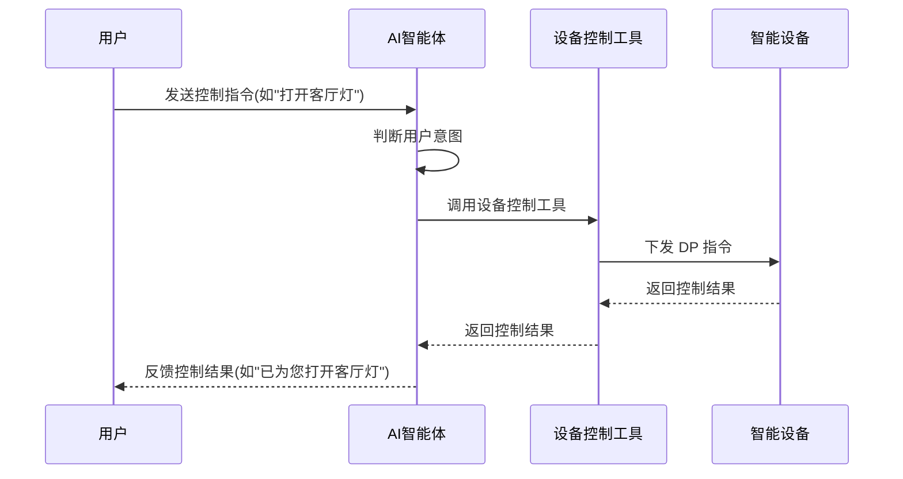

# 通用智能体解决方案 (agent-solution)

[AI-generated summary: 本文档介绍涂鸦AI助手SDK与智能体解决方案，阐述如何在小程序中集成AI对话功能、设备控制和自然语言交互能力。覆盖SDK与独立小程序的对比、核心组件选型、OEM App集成流程和开发实践指南。覆盖内容：t-agent, t-agent-plugin-aistream, t-agent-ui-ray, TTS语音合成, ASR语音识别, 多模态交互, 自然语言理解, 设备控制, 知识库管理, 场景联动, 虚拟滚动, 国际化支持, 工具调用, 对话记忆, OEM App定制]

## AI 助手方案

### AI 助手

#### AI 助手介绍

AI 助手是涂鸦提供的一款基于大语言模型的智能对话小程序，能够精准理解用户通过语音或文字输入的指令和需求。它不仅可以回答用户的各类问题，还能控制智能家居设备、执行定时任务、提供个性化建议等多种功能。通过自然语言交互方式，AI 助手为用户打造更便捷、更智能的生活体验，成为用户日常生活中的智能管家。

#### 应用场景

- **智能家居控制**：用户可以通过语音或文字给助手下达指令，控制家中的智能设备，如"打开客厅的灯"、"将空调温度调到 26 度"等。
- **信息查询**：用户可以询问天气、新闻、日程安排等信息，AI 助手会提供准确的回答。
- **个性化建议**：根据用户的使用习惯和偏好，提供个性化的建议，如节能提示、舒适场景推荐等。
- **定时任务管理**：帮助用户设置和管理各类定时任务，如"每天早上 7 点打开窗帘"、"晚上 10 点关闭所有灯"等。

#### 当前痛点

- **定制和扩展能力有限**：智能体小程序提供名称、图标、主题色等个性化配置，但定制和扩展能力有限。
- **开发成本高**：开发者需要了解智能体相关 API 才能进行开发，上手难度大。

#### 什么是 AI 助手 SDK？

[AI 助手 SDK](https://developer.tuya.com/material/library_oHEKLjj0/component?code=TAgent) 是涂鸦提供的一款 SDK，帮助开发者在自己的小程序中集成 AI 对话功能。它提供了完整的对话界面、对话逻辑管理以及对话数据管理能力。

##### 版本说明

**⚠️ 重要提示**：`@ray-js/t-agent-plugin-assistant` 已被废弃，请使用 `@ray-js/t-agent-plugin-aistream` 替代。

##### 核心组件

- **[@ray-js/t-agent](/cn/miniapp/solution-ai/ability/agent-solution/aiAgentSolution/core-concept/t-agent)**：通用对话框架，支持消息收发、生命周期管理和对话数据管理，具备插件机制。
- **[@ray-js/t-agent-plugin-aistream](/cn/miniapp/solution-ai/ability/agent-solution/aiAgentSolution/core-concept/t-agent-plugin-aistream)**：对接小程序 AI 智能体平台的插件，支持流式对话、语音合成、语音识别等功能。
- **[@ray-js/t-agent-ui-ray](/cn/miniapp/solution-ai/ability/agent-solution/aiAgentSolution/core-concept/t-agent-ray-ui)**：基于 Ray UI 的对话组件库，支持虚拟滚动、国际化、多模态交互等功能。

#### 核心功能

- **自然语言理解**：能够理解用户的口语化表达，无需用户记忆特定的指令格式。
- **多模态交互**：支持语音、文字、图片、视频等多种输入方式，满足不同场景下的使用需求。
- **设备控制**：可以控制涂鸦生态内的各类智能设备，实现一站式智能家居管理。
- **场景联动**：支持创建和执行复杂的场景联动，如"回家模式"、"离家模式"等。
- **知识库查询**：能够回答用户关于设备使用、家居管理等方面的问题。
- **个性化推荐**：根据用户的使用习惯和偏好，提供个性化的建议和推荐。
- **语音合成**：支持 TTS 语音合成，提供更自然的语音交互体验。
- **语音识别**：支持 ASR 语音识别，准确识别用户的语音输入。
- **国际化支持**：内置多语言支持，包括中英日德法西意等 8 种语言。

#### AI 助手 SDK vs. AI 助手小程序

在涂鸦的智能体开发平台创建智能体并绑定 App 或 PID 后，您可以使用 **AI 助手小程序**，它提供名称、图标、主题色等个性化配置。但如果您需要在自己的小程序中集成 AI 对话，或深度定制功能和外观，则建议使用 **AI 助手 SDK**。

##### 对比分析

| 功能         | AI 助手小程序            | AI 助手 SDK        |
| ------------ | -------------------------- | -------------------- |
| **对接平台** | 智能体开发平台             | 智能体开发平台       |
| **设备控制** | 支持                       | 支持                 |
| **工作流**   | 支持                       | 支持                 |
| **知识库**   | 支持                       | 支持                 |
| **形态**     | 独立小程序                 | npm 包               |
| **开发方式** | 无需代码开发               | 需要代码开发         |
| **定制能力** | 名称、颜色、欢迎语、背景图 | 界面、功能完全可定制 |
| **集成方式** | 小程序间跳转               | 可嵌入自有小程序     |
| **绘制图表** | 暂不支持                   | 支持                 |
| **卡片功能** | 暂不支持                   | 支持自定义卡片       |
| **多智能体** | 暂不支持                   | 支持                 |
| **语音合成** | 暂不支持                   | 支持 TTS 语音合成    |
| **语音识别** | 暂不支持                   | 支持 ASR 语音识别    |
| **国际化**   | 暂不支持                   | 支持多语言国际化     |
| **虚拟滚动** | 暂不支持                   | 支持长列表优化       |

如果您希望快速启用智能体对话功能，且不需要复杂定制，可以直接使用 AI 助手小程序；如果需要深度集成 AI 对话到自有小程序，并进行个性化定制，AI 助手 SDK 是更好的选择。
### 智能体

为了实现智能体对话功能，需要在 [涂鸦开发者平台](https://platform.tuya.com/exp/ai) 先创建智能体，配置并发布上线。

#### 概述

涂鸦开发者平台集成了多种语言模型，为用户提供高效而灵活的智能体管理功能。用户可以通过配置和调试，轻松部署和运行智能体相关应用。了解更多操作步骤，请参考 [智能体开发平台](https://developer.tuya.com/cn/docs/iot/ai-agent-management?id=Kdxr4v7uv4fud)。

#### 智能体核心能力

- **多模态交互**：支持文本、图像、语音等多种交互方式
- **知识库管理**：可导入自定义知识，增强智能体回答的专业性和准确性
- **工具调用**：支持调用外部 API 和工具，实现更复杂的任务处理
- **场景定制**：针对不同业务场景提供定制化配置，满足多样化需求
- **对话记忆**：保持上下文连贯性，提供更自然的交互体验

#### OEM App

OEM App 是集智能产品使用、服务、运营、营销于一体的移动应用，并持续更新迭代，为终端用户提供优秀的使用体验，营造品牌口碑。了解更多详情，请参考 [OEM App 开发](https://www.tuya.com/cn/platform/appdev/oemapp)。

#### OEM App 特点

- **品牌定制**：支持定制 UI、功能和内容，打造专属品牌形象
- **多端支持**：覆盖 iOS、Android 等多个平台
- **丰富组件**：提供设备控制、场景联动等多种功能组件
- **快速开发**：低代码开发平台，缩短上线周期
- **数据分析**：内置用户行为分析工具，助力精细化运营

#### 智能体与 OEM App 集成

通过将智能体集成到 OEM App 中，可以实现：

- **智能语音助手**：用户可通过语音与 App 交互，控制设备
- **个性化服务**：基于用户习惯和设备状态提供定制化建议
- **智能场景推荐**：分析用户行为，自动推荐合适的智能场景
- **主动服务**：预测用户需求，提前提供相关信息和服务

#### 开发流程

1. **智能体创建与配置**
   - 在涂鸦开发者平台创建智能体
   - 配置知识库和对话能力
   - 调试并发布智能体

2. **OEM App 集成**
   - 在 OEM App 中引入智能体 SDK
   - 配置智能体接入参数
   - 设计交互界面和体验流程

3. **测试与优化**
   - 进行功能测试和性能测试
   - 收集用户反馈
   - 持续优化智能体能力和交互体验

4. **上线与运营**
   - 发布应用更新
   - 监控智能体使用情况
   - 基于数据分析进行迭代优化
### 概览

**AI 助手 SDK** 能够让开发者快速在自己的小程序中集成 AI 对话功能，这能够使开发者专注实现自己的业务逻辑，而不用在技术细节上浪费时间。

使用智能生活 App（6.0.0 及以上版本）扫描下方二维码，可以体验 AI 对话功能：


#### 快速开始

##### 版本说明

**⚠️ 重要提示**：`@ray-js/t-agent-plugin-assistant` 已被废弃，请使用 `@ray-js/t-agent-plugin-aistream` 替代。

##### 安装依赖

在项目的 `package.json` 中添加以下依赖：

```json
{
  "dependencies": {
    "@ray-js/t-agent": "^0.2.0",
    "@ray-js/t-agent-plugin-aistream": "^0.2.0",
    "@ray-js/t-agent-ui-ray": "^0.2.0"
  }
}
```

> 确保 `@ray-js/t-agent`、`@ray-js/t-agent-plugin-aistream`、`@ray-js/t-agent-ui-ray` 版本一致

执行 `yarn install` 安装依赖。

##### 小程序 Kit 要求

```json
{
  "dependencies": {
    "BaseKit": "3.12.0",
    "BizKit": "4.10.0",
    "DeviceKit": "4.6.1",
    "HomeKit": "3.4.0",
    "MiniKit": "3.12.1",
    "AIStreamKit": "1.0.0"
  },
  "baseversion": "2.21.10"
}
```

##### 基础示例

以下是在小程序中集成 AI 对话界面的最简代码示例：

```tsx
import React from 'react';
import { View } from '@ray-js/components';
import { createChatAgent, withDebug, withUI } from '@ray-js/t-agent';
import { ChatContainer, MessageInput, MessageList, MessageActionBar } from '@ray-js/t-agent-ui-ray';
import { withAIStream, withBuildIn } from '@ray-js/t-agent-plugin-aistream';

const createAgent = () => {
  const agent = createChatAgent(
    withUI(), // 第一个插件 withUI 插件提供了一些默认的 UI 行为，必选
    withAIStream({
      // withAIStream 插件对接小程序 AI 智能体平台，在小程序中必选
      enableTts: false, // 是否开启语音合成
      earlyStart: true, // 是否在 onAgentStart 阶段就建立连接
      agentId: '[your_agent_id]', // 输入您的智能体 ID
    }),
    withDebug(), // withDebug 会在 console 里打印日志
    withBuildIn() // withBuildIn 插件提供了一些内置的功能
  );
  
  return agent;
};

export default function Home() {
  return (
    <View style={{ height: '100vh' }}>
      <ChatContainer createAgent={createAgent}>
        <MessageList />
        <MessageInput />
        <MessageActionBar />
      </ChatContainer>
    </View>
  );
}
```

> 请替换 `[your_agent_id]` 为您的 Agent ID，Agent ID 可以在涂鸦 AI [涂鸦开发者平台](https://platform.tuya.com/exp/ai)中获取。

##### 高级配置

###### 启用语音合成

```tsx
withAIStream({
  agentId: '[your_agent_id]',
  enableTts: true, // 开启语音合成
})
```

###### 自定义历史消息大小

```tsx
withAIStream({
  agentId: '[your_agent_id]',
  historySize: 500, // 历史消息大小，默认 1000
})
```

更多详细说明和高级用法，请参考 [T-Agent SDK 开发指南](https://developer.tuya.com/cn/miniapp-codelabs/codelabs/t-agent-sdk-guide/index.html)。

### 核心概念

##### t-agent 开发者文档

###### 概述

t-agent 是一个用 TypeScript 构建的对话智能体 SDK，用于构建功能丰富的对话交互应用。它支持插件扩展，是一个纯粹的 SDK，不包含 UI 组件，可以与任何框架配合使用。

t-agent 具备强大的 Hook 机制、错误处理、消息状态管理等功能，提供了强大的开发体验。

想了解更多详细信息，请访问[官方文档](https://developer.tuya.com/material/library_oHEKLjj0/component?code=TAgent#t-agent)。

###### 核心概念

###### ChatAgent

ChatAgent 是整个对话系统的核心类，负责处理对话的生命周期、消息创建、持久化等核心功能，并支持通过插件和钩子扩展功能。

**主要属性**：
- `agent.session`：存储会话数据
- `agent.plugins`：包含已应用插件的方法和钩子

**核心方法**：
- `agent.start()`：激活对话代理
- `agent.dispose()`：停用对话代理
- `agent.pushInputBlocks()`：将用户消息推送给 ChatAgent
- `agent.createMessage()`：创建消息
- `agent.emitTileEvent()`：发送 tile 事件
- `agent.removeMessage()`：删除消息
- `agent.flushStreamToShow()`：流式更新消息

###### 生命周期钩子

ChatAgent 通过钩子系统实现事件驱动的行为模式。Hook 按照以下顺序执行：

```
onAgentStart → onChatStart/onChatResume → onMessageListInit → onInputBlocksPush
```

主要钩子包括：

- `onAgentStart`：代理初始化时触发
- `onChatStart`：对话开始时触发
- `onChatResume`：对话继续时触发
- `onMessageListInit`：消息列表初始化时触发
- `onInputBlocksPush`：接收到输入消息块时触发
- `onMessageChange`：消息更新时触发
- `onMessagePersist`：消息持久化时触发
- `onTileEvent`：消息块事件触发时调用
- `onAgentDispose`：代理销毁时触发
- `onUserAbort`：用户终止对话时触发
- `onError`：发生错误时触发

###### 增强钩子

- `onMessageFeedback`：消息反馈时触发
- `onClearHistory`：清空历史时触发

使用示例：

```tsx
// 注册消息反馈处理
agent.plugins.ui.hook('onMessageFeedback', async context => {
  const { messageId, rate, content } = context.payload;
  try {
    await submitFeedback({ messageId, rate, content });
    context.result = { success: true };
  } catch (error) {
    context.result = { success: false };
  }
});

// 注册清空历史处理
agent.plugins.ui.hook('onClearHistory', async context => {
  try {
    await clearChatHistory();
    context.result = { success: true };
  } catch (error) {
    context.result = { success: false };
  }
});
```

###### ChatSession

ChatSession 持有消息列表和会话相关数据，随 ChatAgent 一起创建。

**主要属性**：
- `session.messages`：消息列表
- `session.sessionId`：唯一会话 ID
- `session.isNewChat`：区分新会话或继续会话

**主要方法**：
- `session.set/get`：设置/获取会话数据
- `session.getData`：获取所有会话数据
- `session.getLatestMessage`：获取最新消息

**Hooks**：
- `session.onChange`：注册会话数据变化的回调

###### ChatMessage

ChatMessage 是对话内容和状态的抽象表示，由多个 ChatTile 组成。

**主要属性**：
- `message.id`：唯一消息标识符
- `message.role`：消息角色（'user'/'assistant'）
- `message.status`：消息状态（`ChatMessageStatus` 枚举）
- `message.tiles`：消息包含的 tile 列表
- `message.bubble`：快速访问主要的气泡 tile
- `message.meta`：消息附带的额外数据
- `message.isShow`：是否已经展示到界面上

**主要方法**：
- `message.show/update/remove`：控制消息显示状态
- `message.persist`：持久化消息
- `message.addTile/removeTile`：管理消息块
- `message.setTilesLocked`：设置消息的所有 tile 的锁定状态
- `message.set`：设置消息属性
- `message.setMetaValue`：按 key-value 设置 meta 的属性
- `message.deleteMetaValue`：删除 meta 的属性
- `message.setMeta`：直接设置 meta 对象
- `message.findTileByType`：通过 tile 类型查找 tile

###### ChatTile

ChatTile 是消息中的可视化元素，可以是文本、图片、视频等不同类型。

**主要属性**：
- `tile.id`：唯一标识符
- `tile.type`：tile 类型
- `tile.data`：tile 的数据
- `tile.children`：子 tile 列表
- `tile.locked`：是否锁定
- `tile.fallback`：当 tile 无法展示时的回退内容
- `tile.message`：所属的消息引用

**主要方法**：
- `tile.update`：是 `tile.message.update` 的快捷方式
- `tile.show`：是 `tile.message.show` 的快捷方式
- `tile.setLocked`：设置锁定状态
- `tile.addTile`：添加子 tile
- `tile.setData`：设置 tile 数据
- `tile.setFallback`：设置后备显示内容
- `tile.findByType`：通过 tile 类型查找子 tile

###### 气泡消息快捷方式

`message.bubble` 是一个快捷方式，访问它就会在当前消息中快速添加一个气泡 tile：

```tsx
const message = createMessage({ role: 'assistant' });

message.bubble.setText('Hello, world!');
// 等价于
message.addTile('bubble', {}).addTile('text', { text: 'Hello, world!' });

await message.show();
```

针对气泡消息，还额外提供了：

- `message.bubble.text`：读取气泡文本
- `message.bubble.setText`：设置气泡文本
- `message.bubble.isMarkdown`：是否是 markdown 格式
- `message.bubble.setIsMarkdown`：设置是否是 markdown 格式
- `message.bubble.status`：气泡状态
- `message.bubble.setStatus`：设置气泡状态
- `message.bubble.info`：气泡信息
- `message.bubble.setInfo`：设置气泡信息
- `message.bubble.initWithInputBlocks`：用输入块初始化气泡

###### 插件系统

t-agent 支持通过插件扩展功能。插件是基于 Hook 机制实现的，插件可以暴露方法和属性供开发者使用。

常用插件包括：

- `withUI()`：提供 UI 相关功能和消息总线
- `withDebug()`：提供调试功能
- `withAIStream()`：对接小程序 AI 智能体平台
- `withBuildIn()`：提供内置功能

###### 错误处理

增强了错误处理机制，支持更详细的错误信息和错误分类：

```tsx
agent.onError(error => {
  console.error('Agent error:', error);
  // 错误处理逻辑
});
```

内置支持的错误类型：
- `network-offline`：网络已断开
- `timeout`：发送超时
- `invalid-params`：无效参数
- `session-create-failed`：连接失败
- `connection-closed`：连接已关闭

###### 内置插件

###### withDebug

withDebug 插件会在 console 里打印日志，方便调试。

```tsx
const agent = createChatAgent(
  withDebug({
    autoStart: true, // 是否自动启动，默认为 true
  })
);
```

###### withUI

withUI 插件提供了默认的 UI 行为和消息总线。

```tsx
const agent = createChatAgent(withUI());

// 滚动到底部
agent.plugins.ui.emitEvent('scrollToBottom', { animation: false });

// 监听事件
const off = agent.plugins.ui.onEvent('scrollToBottom', payload => {
  console.log('scroll to bottom', payload.animation);
});
```

主要事件：
- `messageListInit`：初始化消息列表
- `messageChange`：消息变化
- `scrollToBottom`：滚动到底部
- `sendMessage`：发送消息
- `setInputBlocks`：设置输入块
- `sessionChange`：会话数据变化

###### 工具函数

###### getLogger(prefix: string): Logger

创建一个 logger，用于打印日志。

```tsx
import { getLogger } from '@ray-js/t-agent';
const logger = getLogger('MyPlugin');
logger.debug('Hello, world!');
```

###### Emitter 事件总线

Emitter 是一个事件总线，用于注册和触发事件。

```tsx
import { Emitter, EmitterEvent } from '@ray-js/t-agent';
const emitter = new Emitter();

// 注册事件
emitter.addEventListener('event', event => console.log(event.detail));

// 触发事件
emitter.dispatchEvent(new EmitterEvent('event', { detail: 'Hello!' }));
```

###### 其他工具

- `StreamResponse`：流式响应对象
- `createHooks`、`Hookable`：Hook 机制相关
- `isAbortError`：判断是否是中断错误
- `safeParseJSON`：安全地解析 JSON 字符串

###### 总结

t-agent 是一个灵活的对话代理 SDK，通过其核心概念、强大的 Hook 系统和插件机制，可以构建丰富的对话交互体验。开发者可以利用 t-agent 快速构建具有现代功能的对话应用，如聊天机器人、客服系统或智能助手。

更多详细信息和 API 说明，请访问[官方文档](https://developer.tuya.com/material/library_oHEKLjj0/component?code=TAgent#t-agent)。
##### t-agent-plugin-aistream

###### 概述

t-agent-plugin-aistream 是 t-agent 的核心插件，提供了对接小程序 AI 智能体平台的能力。该插件替代了已废弃的 `@ray-js/t-agent-plugin-assistant`，提供了更强大的功能，包括流式对话、语音合成、语音识别和多模态支持等。

**⚠️ 重要提示**：`@ray-js/t-agent-plugin-assistant` 已被废弃，请使用 `@ray-js/t-agent-plugin-aistream` 替代。

想了解更多详细信息，请访问[官方文档](https://developer.tuya.com/material/library_oHEKLjj0/component?code=TAgent#t-agent-plugin-aistream)。

###### 核心概念

###### withAIStream

`withAIStream` 是该插件的主要入口函数，用于创建与小程序 AI 智能体平台的连接。它支持流式对话、语音合成、语音识别等功能。

主要配置参数：

- `agentId`：智能体 ID（必填）
- `clientType`：客户端类型，默认为 APP (2)
- `deviceId`：设备 ID，当 clientType 为 DEVICE (1) 时必填
- `enableTts`：是否开启语音合成，默认为 false
- `wireInput`：是否将输入块传递给智能体，默认为 true
- `historySize`：历史消息大小，默认为 1000
- `indexId`：索引 ID，默认为 'default'
- `homeId`：家庭 ID，不填默认当前家庭
- `earlyStart`：是否在 onAgentStart 阶段就建立连接
- `tokenOptions`：获取 agent token 的参数
  - `api`：API 接口名
  - `version`：接口版本
  - `extParams`：额外参数

使用示例：

```tsx
const agent = createChatAgent(
  withUI(),
  withAIStream({
    agentId: 'your-agent-id',
    enableTts: true,
    earlyStart: true,
    historySize: 500,
  })
);
```

###### withBuildIn

`withBuildIn` 提供了一系列内置的功能，包括智能家居控制、知识库搜索等。必须在应用 withAIStream 插件后使用。

主要功能：

- **智能家居**：设备控制、场景管理
- **知识库搜索**：关联文档展示
- **推荐行动**：智能推荐用户操作
- **按钮交互**：动态按钮响应
- **工作流引导**：流程化操作指导
- **智能卡片**：丰富的卡片展示

使用示例：

```tsx
const agent = createChatAgent(
  withUI(),
  withAIStream({ agentId: 'your-agent-id' }),
  withBuildIn()
);
```

###### 核心功能

###### 语音合成 (TTS)

支持将 AI 回复转换为语音播放，提供更自然的交互体验。

```tsx
withAIStream({
  agentId: 'your-agent-id',
  enableTts: true, // 开启语音合成
})
```

###### 语音识别 (ASR)

内置 AsrAgent 语音识别代理，支持实时语音转文字。

```tsx
import { createAsrAgent } from '@ray-js/t-agent-plugin-aistream';

const asrAgent = createAsrAgent({
  agentId: 'your-agent-id',
  onMessage: message => {
    if (message.type === 'text') {
      console.log('识别结果：', message.text);
    }
  },
});
```

###### Hook 机制

提供了丰富的 Hook 来自定义行为：

- `onMessageParse`：消息解析时触发
- `onSkillCompose`：收到技能数据时触发
- `onSkillsEnd`：所有技能处理完成时触发
- `onTTTAction`：tile 使用 sendAction 时触发
- `onCardsReceived`：收到卡片数据时触发

###### Mock 机制

为了方便开发，提供了 mock 机制：

```tsx
import { mock } from '@ray-js/t-agent-plugin-aistream';

// Mock AI Stream 响应
mock.hooks.hook('sendToAIStream', context => {
  if (context.options.blocks?.some(block => block.text?.includes('hello'))) {
    context.responseText = 'Hello! How can I help you?';
  }
});

// Mock ASR 语音识别
mock.hooks.hook('asrDetection', context => {
  context.responseText = 'Hello world! I am a virtual assistant.';
});
```

###### 总结

t-agent-plugin-aistream 是 t-agent 的核心插件，相比已废弃的 assistant 插件，提供了更强大的功能和更好的开发体验。它支持流式对话、语音合成、语音识别、多模态交互等现代 AI 应用所需的核心功能。

该插件与 t-agent 核心库和 t-agent-ui-ray 组件库无缝集成，让开发者能够轻松构建功能丰富的智能对话应用。通过丰富的配置选项和 Hook 机制，开发者可以根据具体需求进行深度定制。

更多详细信息和 API 说明，请访问[官方文档](https://developer.tuya.com/material/library_oHEKLjj0/component?code=TAgent#t-agent-plugin-aistream)。
##### t-agent-ui-ray

###### 概述

t-agent-ui-ray 是基于 Ray 框架的 UI 组件库，为 t-agent 提供了一套完整的对话界面组件。它允许开发者快速构建具有现代设计的对话式应用，支持文本、图片、视频等多种内容类型，并提供了丰富的交互体验。

t-agent-ui-ray 内置了虚拟滚动、国际化系统、消息操作栏等功能，大幅提升了用户体验和开发效率。

想了解更多详细信息，请访问[官方文档](https://developer.tuya.com/material/library_oHEKLjj0/component?code=TAgent#t-agent-ui-ray)。

###### 核心概念

###### ChatContainer

ChatContainer 是整个对话 UI 的容器组件，负责管理对话状态和提供上下文。它是其他组件的父容器，处理消息的显示、更新和移除等核心功能。

主要功能：

- 初始化并管理 ChatAgent 实例
- 提供消息上下文给子组件
- 处理键盘高度变化
- 管理网络状态变化
- 协调消息列表的滚动行为

基本用法：

```tsx
<ChatContainer createAgent={createAgent}>
  <MessageList />
  <MessageInput />
  <MessageActionBar />
</ChatContainer>
```

主要属性：

- `createAgent`：创建 ChatAgent 实例的函数
- `renderOptions`：自定义渲染选项，支持自定义 tile、卡片、长按菜单等
- `className`：自定义类名
- `style`：自定义样式
- `agentRef`：ChatAgent 实例的引用

###### MessageList

MessageList 组件负责渲染对话消息列表，内置了 LazyScrollView 组件，提供了更好的性能优化。

主要功能：

- 渲染对话消息列表
- **虚拟滚动**：只渲染可见区域内的消息，大幅提升性能
- **高度自适应**：自动计算消息高度，支持动态内容
- 自动滚动到最新消息
- 支持用户和助手消息的不同布局
- 处理历史消息限制

基本用法：

```tsx
<MessageList 
  roleSide={{
    user: 'end',
    assistant: 'start'
  }}
  historyLimit={{
    count: 50,
    tipText: '只显示最近 50 条消息'
  }}
/>
```

主要属性：

- `className`：自定义类名
- `style`：自定义样式
- `roleSide`：消息气泡位置配置（'start'|'end'）
- `historyLimit`：历史消息数量限制配置
- `wrapperClassName`：容器的自定义类名
- `wrapperStyle`：容器的自定义样式

###### MessageInput

MessageInput 组件提供了用户输入界面，支持文本输入、语音输入及多媒体内容上传等功能。

主要功能：

- 文本输入
- **语音输入转文字（ASR）**：支持实时语音识别
- 图片上传（支持相机拍摄和相册选择）
- 视频上传
- 发送按钮状态管理
- 响应状态显示（正在响应/中断）
- 多文件上传支持

基本用法：

```tsx
<MessageInput placeholder="请输入消息..." />
```

主要属性：

- `className`：自定义类名
- `style`：自定义样式
- `placeholder`：输入框占位文本
- `renderTop`：输入框顶部自定义渲染内容

###### MessageActionBar

MessageActionBar 是消息操作栏组件，用于多选消息时显示操作按钮，支持删除选中消息和清空历史记录。

主要功能：

- **返回按钮**：退出多选模式
- **清空历史按钮**：清空所有历史消息
- **删除选中按钮**：删除当前选中的消息
- 自动根据多选状态显示和隐藏

基本用法：

```tsx
<MessageActionBar />
```

###### 核心功能

###### 虚拟滚动 (LazyScrollView)

MessageList 内部集成了 LazyScrollView 组件来优化大量消息的渲染性能：

- **懒加载渲染**：只渲染可见区域内的消息
- **高度自适应**：自动计算消息高度，支持动态内容
- **notifyHeightChanged()**：当消息内容发生变化时，自动通知高度更新
- 保证最下面 10 条消息始终渲染，避免白屏

###### 国际化系统

完整的国际化系统，支持多语言：

- **中文简体**（`zh-Hans`）
- **中文繁体**（`zh-Hant`）
- **英文**（`en`）
- **日文**（`ja`）
- **德文**（`de`）
- **法文**（`fr`）
- **西班牙文**（`es`）
- **意大利文**（`it`）

使用 `useTranslate` Hook 获取翻译函数：

```tsx
import { useTranslate } from '@ray-js/t-agent-ui-ray';

const MyComponent = () => {
  const t = useTranslate();
  
  return (
    <div>
      {t('t-agent.message.action.copy')} {/* 输出：复制消息 */}
      {t('t-agent.message.delete.title')} {/* 输出：删除消息 */}
    </div>
  );
};
```

###### 长按菜单增强

气泡消息支持更丰富的长按操作：

- **复制消息**：复制文本内容到剪贴板
- **删除消息**：删除单条消息
- **多选**：进入多选模式
- **喜欢/不喜欢**：对助手消息进行反馈（仅对 assistant 角色消息可用）

###### 自定义渲染

通过 `renderOptions` 支持更多自定义选项：

- `renderLongPressAs`：自定义长按菜单渲染
- `formatErrorMessageAs`：自定义错误消息格式化
- `customCardMap`：自定义卡片映射
- `i18nTranslate`：自定义多语言翻译

###### React Hooks

###### useChatAgent

在 `ChatContainer` 上下文里获取 `ChatAgent` 实例。

###### useAgentMessage

在 `ChatContainer` 上下文里获取 `messages: ChatMessageObject[]` 列表。

###### useTranslate

获取国际化翻译函数，用于翻译界面文本。

```tsx
const t = useTranslate();
console.log(t('t-agent.message.action.copy'));
```

###### useOnEvent

在 `ChatContainer` 上下文里注册 ui 事件，在组件卸载时自动取消注册。

```tsx
useOnEvent('scrollToBottom', payload => {
  console.log('scroll to bottom', payload.animation);
});
```

###### useEmitEvent

在 `ChatContainer` 上下文里触发 ui 事件。

```tsx
const emitEvent = useEmitEvent();
emitEvent('scrollToBottom', { animation: false });
```

###### useSendAction

发送一个 TTTAction，注意只能在 tile 组件（或 card）里使用。

```tsx
const sendAction = useSendAction();
sendAction({ type: 'sendMessage', blocks: [{ type: 'text', text: 'hello' }] });
```

###### 内置组件

###### Tile 组件

- **BubbleTile**：气泡消息，支持 Markdown 渲染
- **ButtonsTile**：按钮组
- **CardTile**：卡片
- **ImageTile**：图片
- **VideoTile**：视频
- **FileTile**：文件
- **RecommendationsTile**：推荐行动
- **TextTile**：文本
- **TimeTile**：时间标识
- **TipTile**：提示
- **WorkflowTile**：工作选项

###### Card 组件

- **WorkflowReplyCard**：工作流回复卡片

###### 工具组件

- **PrivateImage**：私有图片组件，支持权限控制
- **LazyScrollView**：懒加载滚动视图，用于性能优化
- **MarkdownRender**：Markdown 渲染器

###### 总结

t-agent-ui-ray 为 t-agent 提供了完整的 UI 解决方案。通过虚拟滚动、国际化系统、消息操作栏等功能，大幅提升了用户体验和开发效率。

该组件库与 t-agent 核心库和 t-agent-plugin-aistream 插件无缝集成，让开发者能够专注于业务逻辑而非 UI 实现细节。通过丰富的自定义选项和 Hook 系统，开发者可以轻松构建符合自己需求的对话界面。

更多详细信息和 API 说明，请访问[官方文档](https://developer.tuya.com/material/library_oHEKLjj0/component?code=TAgent#t-agent-ui-ray)。

### 指南

##### 欢迎语

如果您想在用户进入对话页面时，发送一条欢迎消息，或者在用户隔一段时间后重新进入小程序时，发送一条问候消息，可以在 `createAgent` 函数中添加以下逻辑。

想了解更多详细信息，请访问[定制欢迎语与问候语](https://developer.tuya.com/cn/miniapp-codelabs/codelabs/t-agent-sdk-guide/index.html#8)。

```tsx
const createAgent = () => {
  
  const { onChatStart, createMessage, onChatResume } = agent;

  // 创建一条初始的欢迎信息
  onChatStart(async (result) => {
    const hello = createMessage({
      role: 'assistant',
    });

    hello.bubble.setText('你好'); // 此处定义您想写的问候的多语言
    
    result.messages.push(hello);
    
    await hello.persist('createText'); // 将这个消息气泡持久化下来
  });

  return agent;
};
```
##### 定制外观

使用 **AI 助手 SDK** 开发对话应用，你可以定制这个对话应用的任何外观，只需在项目中创建 CSS 文件，并覆盖对应组件的样式即可。

想了解更多详细信息，请访问[定制外观和功能](https://developer.tuya.com/cn/miniapp-codelabs/codelabs/t-agent-sdk-guide/index.html#9)。

```css
/* 修改消息气泡的背景颜色 */
.t-agent-message-list-row-start .t-agent-bubble-tile-bubble {
  background-color: blue;
}
```

```tsx
import './custom-style.css';

const createAgent = () => {
  // ...
  return agent;
};

export default function ChatPage() {
  // ...
}
```
##### 设备控制

基于 **AI 助手 SDK** 开发的智能体对话应用，如果您创建的产品支持 AI 控制时，可以在其中实现对设备的控制。

想了解更多详细信息，请访问[控制设备](https://developer.tuya.com/cn/miniapp-codelabs/codelabs/t-agent-sdk-guide/index.html#6)。

###### 效果展示


###### 交互流程



## 面板智能体方案

#### 面板智能体

##### 面板智能体

面板智能体是面向**硬件设备端**的智能体解决方案，基于大语言模型（LLM）与涂鸦开发者平台能力，允许用户快速创建、管理个性化智能体角色。用户通过简单操作即可配置角色的基础信息、交互风格、技术能力，配合 **T5** 等智能硬件，可以快速实现设备 AI 化，适用于AI 玩具、AI 音箱、AI 中控屏等场景。

##### 应用场景

- **AI 玩具**：结合 AI 技术与传统玩具形态的智能互动产品，通过语音识别（ASR）、自然语言处理（NLP）、计算机视觉等技术，实现与用户的智能交互、学习陪伴、教育娱乐等功能。其核心特点是具备 “感知 - 理解 - 反馈” 的能力，能够根据用户的行为和指令动态响应，提供个性化的互动体验。
- **AI 音箱**：集成 AI 技术的智能音频设备，以语音交互为核心，融合音乐播放、智能家居控制、信息查询、生活服务等功能于一体。其核心价值在于通过自然语言处理、语音识别、语音合成（TTS）等技术，实现 “设备拟人化”，成为家庭场景中的智能助手。
- **AI 中控屏**：集成 AI 技术的智能终端设备，作为智能场景（如智能家居、智慧办公、智慧酒店等）的核心控制枢纽，通过语音交互、触控操作、设备联动等方式，实现对多品类智能设备的集中管理与智能化控制。其核心特点是融合计算机视觉、语音识别、数据分析技术，提供个性化、场景化的智能服务。
#### 智能体

智能体是一种能自主感知环境、分析信息、制定决策并执行动作的智能程序或系统。它类似于 "虚拟大脑"，能够通过传感器或数据输入理解周围状态，利用算法（如规则、学习模型）处理信息，最终驱动设备或输出结果完成任务。

#### 智能体开发平台

[智能体开发平台](https://platform.tuya.com/exp/ai) 集成了多种语言模型，旨在为用户提供高效而灵活的智能体管理功能。用户可以通过配置和调试，轻松部署和运行智能体相关应用。了解更多详情，请参考 [智能体开发平台](https://developer.tuya.com/cn/docs/iot/ai-agent-management?id=Kdxr4v7uv4fud)。

#### 产品 AI 功能开发

为了助力开发者高效实现 AI 应用的落地，涂鸦开发者平台提供了多样化的支持，包括适用于不同品类的标准化 AI 功能、丰富的智能体模板、和便捷的面板投放工具，从多个维度全面保障产品的 AI 应用快速落地。了解更多详情，请参考 [产品 AI 功能开发](https://developer.tuya.com/cn/docs/iot/AI-feature?id=Keapy1et1fc63)。

如需了解更多关于 AI 能力的内容，请联系您的项目经理或 [提交工单](https://service.console.tuya.com/8/3/list?source=support_center) 咨询。

#### 前置依赖

该 AI 应用场景解决方案可应用于 **AI 硬件开发**：

在 AI 硬件（T5）开发中，您的设备需要通过涂鸦提供的标准协议和 AI 专用数据通道, 将音频数据传送到 App 上，才能使用该方案的能力。涂鸦提供了对应的软硬件协议和数据通道。

如需了解更多关于 AI 音频数据通道和协议的对接内容，请联系您的项目经理或 [提交工单](https://service.console.tuya.com/8/3/list?source=support_center) 咨询。

### 能力集

##### API

###### 智能体配置服务

###### 获取语言列表
- **含义**：获取支持的语言列表。
- **接口详情**：[getPanelAgentConfigLanguageList](/cn/miniapp/develop/ray/api/ai/panelAgent/getPanelAgentConfigLanguageList)

###### 获取模型列表
- **含义**：获取支持的大语言模型列表。
- **接口详情**：[getPanelAgentConfigLlmList](/cn/miniapp/develop/ray/api/ai/panelAgent/getPanelAgentConfigLlmList)

###### 获取头像列表
- **含义**：获取支持的头像列表。
- **接口详情**：[getPanelAgentConfigAvatarList](/cn/miniapp/develop/ray/api/ai/panelAgent/getPanelAgentConfigAvatarList)

###### 获取角色变量列表
- **含义**：获取角色变量配置列表。
- **接口详情**：[getPanelAgentConfigRoleVariableList](/cn/miniapp/develop/ray/api/ai/panelAgent/getPanelAgentConfigRoleVariableList)

###### 获取唤醒词
- **含义**：获取唤醒词。
- **接口详情**：[getPanelAgentConfigWakeUpWord](/cn/miniapp/develop/ray/api/ai/panelAgent/getPanelAgentConfigWakeUpWord)

###### 智能体角色服务

###### 获取项目信息
- **含义**：查询智能体项目信息。
- **接口详情**：[getPanelAgentProjectInfo](/cn/miniapp/develop/ray/api/ai/panelAgent/getPanelAgentProjectInfo)

###### 创建自定义角色（增）
- **含义**：创建自定义角色。
- **接口详情**：[addPanelAgentCustomRole](/cn/miniapp/develop/ray/api/ai/panelAgent/addPanelAgentCustomRole)

###### 获取自定义角色详情（查）
- **含义**：查询自定义角色的详细信息。
- **接口详情**：[getPanelAgentCustomRoleDetail](/cn/miniapp/develop/ray/api/ai/panelAgent/getPanelAgentCustomRoleDetail)

###### 更新自定义角色（改）
- **含义**：更新自定义角色信息。
- **接口详情**：[updatePanelAgentCustomRole](/cn/miniapp/develop/ray/api/ai/panelAgent/updatePanelAgentCustomRole)

###### 删除自定义角色（删）
- **含义**：删除指定的自定义角色。
- **接口详情**：[deletePanelAgentCustomRole](/cn/miniapp/develop/ray/api/ai/panelAgent/deletePanelAgentCustomRole)

###### 获取自定义角色分页列表（查询列表）
- **含义**：查询自定义角色的分页列表。
- **接口详情**：[getPanelAgentCustomRolePage](/cn/miniapp/develop/ray/api/ai/panelAgent/getPanelAgentCustomRolePage)

###### 初始化角色绑定
- **含义**：初始化角色绑定。
- **接口详情**：[initializePanelAgentRoleBinding](/cn/miniapp/develop/ray/api/ai/panelAgent/initializePanelAgentRoleBinding)

###### 角色绑定
- **含义**：将角色进行绑定操作。
- **接口详情**：[bindPanelAgentWithRole](/cn/miniapp/develop/ray/api/ai/panelAgent/bindPanelAgentWithRole)

###### 获取已绑定角色
- **含义**：获取已绑定的角色信息。
- **接口详情**：[getPanelAgentBoundRole](/cn/miniapp/develop/ray/api/ai/panelAgent/getPanelAgentBoundRole)

###### 角色模板列表
- **含义**：查询角色模板的列表。
- **接口详情**：[getPanelAgentRoleTemplateList](/cn/miniapp/develop/ray/api/ai/panelAgent/getPanelAgentRoleTemplateList)

###### 角色模板详情
- **含义**：查询角色模板的详细信息。
- **接口详情**：[getPanelAgentRoleTemplateDetail](/cn/miniapp/develop/ray/api/ai/panelAgent/getPanelAgentRoleTemplateDetail)

###### 从模板创建角色
- **含义**：基于角色模板创建角色。
- **接口详情**：[createPanelAgentRoleFromTemplate](/cn/miniapp/develop/ray/api/ai/panelAgent/createPanelAgentRoleFromTemplate)

###### 智能体角色聊天服务

###### 获取历史会话记录
- **含义**：查询历史会话记录（支持游标分页）。
- **接口详情**：[fetchPanelAgentChatHistory](/cn/miniapp/develop/ray/api/ai/panelAgent/fetchPanelAgentChatHistory)

###### 删除历史会话记录
- **含义**：删除历史会话记录。
- **接口详情**：[deletePanelAgentChatHistory](/cn/miniapp/develop/ray/api/ai/panelAgent/deletePanelAgentChatHistory)

###### 获取聊天摘要
- **含义**：获取聊天摘要。
- **接口详情**：[getPanelAgentChatSummary](/cn/miniapp/develop/ray/api/ai/panelAgent/getPanelAgentChatSummary)

###### 更新聊天摘要
- **含义**：更新聊天摘要。
- **接口详情**：[updatePanelAgentChatSummary](/cn/miniapp/develop/ray/api/ai/panelAgent/updatePanelAgentChatSummary)

###### 获取当前聊天情绪
- **含义**：获取当前聊天情绪。
- **接口详情**：[getPanelAgentCurrentChatEmotion](/cn/miniapp/develop/ray/api/ai/panelAgent/getPanelAgentCurrentChatEmotion)

###### 清除上下文
- **含义**：清除上下文信息（记忆）。
- **接口详情**：[clearPanelAgentContext](/cn/miniapp/develop/ray/api/ai/panelAgent/clearPanelAgentContext)

###### 获取记忆列表
- **含义**：查询角色记忆列表。
- **接口详情**：[getPanelAgentMemoryList](/cn/miniapp/develop/ray/api/ai/panelAgent/getPanelAgentMemoryList)

###### 删除记忆
- **含义**：删除角色记忆。
- **接口详情**：[deletePanelAgentMemory](/cn/miniapp/develop/ray/api/ai/panelAgent/deletePanelAgentMemory)

###### 获取记忆开关
- **含义**：获取记忆开关状态。
- **接口详情**：[getPanelAgentMemorySwitch](/cn/miniapp/develop/ray/api/ai/panelAgent/getPanelAgentMemorySwitch)

###### 音色服务

###### 获取音色市场列表
- **含义**：获取标准音色分页列表。
- **接口详情**：[getTimbreMarketList](/cn/miniapp/develop/ray/api/ai/panelAgent/getTimbreMarketList)
###### 教程

###### 基础入门开发

关于如何入门小程序面板开发，如果您是第一次接触小程序，请参考本教程开始入手 [详情](https://developer.tuya.com/cn/miniapp-codelabs/codelabs/ray-guide/index.html#0)。

###### 面板智能体

关于如何开发面板智能体小程序，请参考 [详情](https://developer.tuya.com/cn/miniapp-codelabs/codelabs/panel-agent/index.html)。
##### 项目模板

###### 概述

项目模板是为了降低开发者搭建项目的难度，整理了常见品类和常见能力并对外提供的相应的项目源码。

###### 模板主要涵盖功能

角色相关

- 获取角色
- 创建角色
- 编辑角色
- 删除角色
- 切换角色
- 调整语速
- 获取角色模板

会话相关

- 获取智能体历史对话记录
- 删除某几组智能体历史会话
- 获取最近心情
- 清除聊天记录
- 清除临时记录
- 清除长期记忆
- 获取角色记忆
- 删除角色记忆
- 获取会话总结
- 删除会话总结

音色相关

- 获取音色广场列表

其它

- 获取语言列表
- 获取模型列表
- 获取标签列表
- 获取头像列表

###### 附录

- [模板文档](https://developer.tuya.com/cn/miniapp-codelabs/codelabs/panel-agent/index.html )
- [物料仓库](https://developer.tuya.com/material/library_hKiOVClc/)
