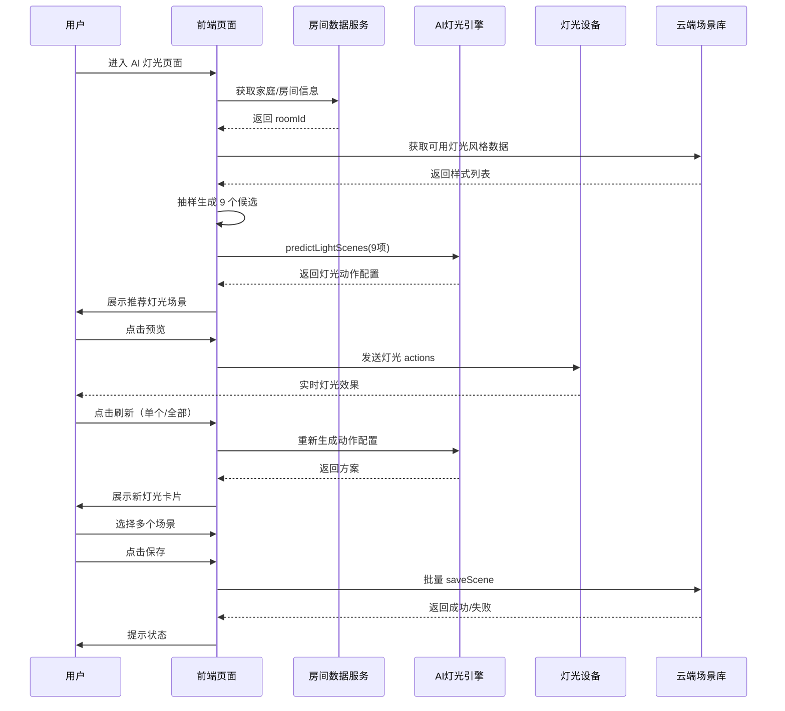
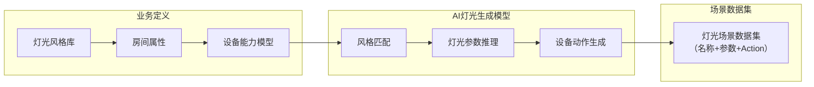

# 照明解决方案 (lamp-solution)

[AI-generated summary: 本文档介绍涂鸦端侧AI生成灯光方案，基于轻量级本地推理模型在手机端实现毫秒级专业灯光氛围生成，支持离线使用、隐私保护和低成本规模化部署。覆盖内容：predictLightScenes, getLightAppAiRuleNames, saveLightScene, previewLightScene, On-App AI, TensorFlow Lite, 房间元数据, 设备能力模型, 端侧推理, 灯光风格库, OTA动态更新, 模型部署, 参数推理, 动作生成, 场景预览]

## AI 生成式灯光场景方案

<h2 id="AI生成式灯光场景方案" class="nx-font-semibold nx-tracking-tight nx-text-slate-900 dark:nx-text-slate-100 nx-mt-10 nx-border-b nx-pb-1 nx-text-3xl nx-border-neutral-200/70 contrast-more:nx-border-neutral-400 dark:nx-border-primary-100/10 contrast-more:dark:nx-border-neutral-400">AI 生成式灯光场景方案<span className="tag_h2">On-App AI</span></h2>

##### 痛点分析

在智能灯光场景应用中，用户（包括普通消费者、设计师及销售施工方）希望快速创建专业、美观且适配空间的灯光氛围。然而当前灯光场景创建流程存在明显障碍：

- 操作繁琐：需依次完成房间选择、设备筛选、逐灯调参等多个步骤，流程冗长。
- 专业门槛高：用户需具备基础的色温、亮度、动态效果等灯光知识，否则难以调出理想效果。
- 效率低下：面对多设备批量配置时，手动调节耗时严重，难以满足快速交付或高频创作需求。
- 依赖经验：缺乏智能推荐，用户只能凭感觉尝试，试错成本高。

##### 解决方案

On-App AI 生成式灯光场景 —— 使用涂鸦自研轻量级空间灯光场景生成模型，在手机本地（端侧）完成专业级灯光方案的一键生成：

- 完全本地推理，无需联网，支持离线使用

- 毫秒级响应（平均 < 10ms），实现“指尖即所得”

- 零云端推理成本，大幅降低运营开销

- 批量生成多套专业灯光方案，覆盖会客、观影、睡眠、派对等多种场景风格

> 💡 **立即体验**：打开 **智能生活 App** / **涂鸦 App** （v7.1.0 及以上版本），扫描下方二维码预览：

##### 技术优势

✔ **高效推理**

- 适配 iOS/Android 主流机型：

-基于 TensorFlow Lite 部署，适配 iOS/Android 主流机型：

- 高端机：5~8ms

- 中端机：8~12ms

- 低端机：10~15ms（仍远快于人眼感知阈值）

✔ **成本低**

- 所有推理在端侧完成，无 Token 消耗、无 GPU 服务器负载

- 支持大规模用户并发使用，边际成本趋近于零

✔ **更安全**

- **全程本地处理**：灯光参数生成、核心数据本地处理、试算均在设备内闭环

- **仅保存时上传**：用户确认后才加密同步至云端，未选方案即时销毁

- **符合 GDPR 及国内隐私合规要求**

✔ **模型轻量化与动态化**

 - 自研 Lighting Scene Model 经剪枝+量化，**体积 < 3MB**

- 采用 **按需加载 + 在线热更** 机制：

  - 初始安装包不含完整模型，节省存储

  - 支持 OTA 动态升级，无需发版即可优化效果

✔ **场景智能适配**

- 模型可识别房间类型（客厅/卧室/餐厅）、设备组合（灯带/射灯/吸顶灯）等上下文

- 自动生成风格协调、层次分明的专业灯光方案，如：

  - 温馨居家模式

  - 聚焦工作模式

  - 浪漫晚餐模式

  - 节日氛围模式（春节红、圣诞金等）

##### 应用场景

| 应用场景     | 功能描述                       |
| ------------ | ------------------------------ |
| 家庭 DIY 灯光设计 | 用户选择“派对”“阅读”等意图标签，AI 自动生成整屋灯光方案 |
| 智能灯具销售演示 | 销售人员现场一键生成多种灯光效果，提升客户转化率 |
| 工装/酒店快速部署 | 批量为多个相同户型生成统一灯光模板，节省施工调试时间 |
| 离线场景应急配置 | 无网络环境下仍可创建/切换灯光场景，保障基础体验 |
| 老人/儿童友好交互	 | 无需复杂操作，点击风格即可应用，降低使用门槛 |

##### 专属模型申请

如有意向训练专属模型，欢迎前往 [On-App AI 客户专属模型申请平台](https://developer.tuya.com/model/apply) 提交申请。平台支持自定义数据集、训练与部署，为您的业务场景打造专属 AI 能力。
#### 产品 AI 功能开发

为了助力开发者高效实现 AI 应用的落地，涂鸦开发者平台提供了多样化的支持，包括适用于不同品类的标准化 AI 功能、丰富的智能体模板、以及便捷的面板投放工具，从多个维度全面保障产品的 AI 应用快速落地。了解更多详情，请参考 [产品 AI 功能开发](https://developer.tuya.com/cn/docs/iot/AI-feature?id=Keapy1et1fc63)。

> 如需了解更多关于 AI 能力的内容，请联系您的项目经理或 [提交工单](https://service.console.tuya.com/8/3/list?source=support_center) 咨询。

#### 开发依赖

##### 小程序开发

- **App 依赖**：**涂鸦** App、**智能生活** App 版本为 v7.1.0 及以上。
- **小程序模板依赖** AI 生成式灯光场景方案集成于 AI 生成式灯光场景模板。该模板相关开发细则，请参考 IDE 中的 **AI 生成式灯光场景模板**。

### 能力集

###### AI 生成式灯光场景 API

<h3 id="预测灯光场景">预测灯光场景 <span className="tag_h2">On-App AI</span></h3>

- **功能**： 通过端侧 AI 模型 推理返回预测灯光场景。

- **接口详情**：[predictLightScenes](/cn/miniapp/develop/ray/api/ai/aiKit/predictLightScenes)

<h3 id="获取方案名称列表">获取方案名称列表 <span className="tag_h2">On-App AI</span></h3>

- **功能**： 获取 App 端侧 AI 照明方案名称列表。

- **接口详情**：[getLightAppAiRuleNames](/cn/miniapp/develop/ray/api/light/light-scene/getLightAppAiRuleNames)

<h3 id="保存照明场景">保存照明场景</h3>

- **功能**： 保存灯光场景的规则配置。

- **接口详情**：[saveLightScene](/cn/miniapp/develop/ray/api/light/light-scene/saveLightScene)

<h3 id="预览照明场景">预览照明场景</h3>

- **功能**： 预览照明场景效果。

- **接口详情**：[previewLightScene](/cn/miniapp/develop/ray/api/light/light-scene/previewLightScene)
###### 关键依赖模块

- **区域**：全区可用

- **App 版本**：**涂鸦** App、**智能生活** App v7.1.0 及以上版本

- **Kit 依赖**
  - BaseKit：3.10.1
  - MiniKit：3.0.0
  - BizKit：3.5.0
  - HomeKit: 3.1.2
  - AIKit: 1.9.1
  - baseversion：2.29.16
- **组件依赖**
  - @ray-js/ray^1.7.58
  - @tuya-miniapp/cloud-api^1.2.0
  - @ray-js/smart-ui^2.8.0
  - @ray-js/ray-error-catch^0.0.26
###### 项目模板

基于 On-App AI 端侧灯光场景能力，涂鸦为智能照明产品提供高效、低成本、可实时响应的 AI 灯光方案。该方案通过在移动端本地部署轻量化灯光场景生成模型，实现毫秒级（ < 10ms）生成专业级整屋灯光效果，支持一键预览与保存，无需云端推理，显著降低使用门槛与运营成本，全面提升用户体验与规模化落地效率。

###### 核心功能

- **端侧 AI 生成灯光场景:** 基于房间与灯光能力，一键生成 9 组氛围灯光方案，实时呈现，无需繁琐配置。

- **AI 动作预测引擎:** 为每个灯光场景自动匹配设备控制指令（actions），确保效果可落地执行。

- **单个与批量智能刷新:** 支持替换单个灯光方案，或仅刷新未选中的灯光方案，已选内容自动保留。

- **实时灯光预览:** 点击即可执行灯光动作，设备即时反馈，所见即所得。

- **多选保存云端场景:** 支持一次保存多个 AI 生成场景，长期留存并可随时调用。

- **交互体验增强:** 内置加载动画、成功反馈、禁用态提示，避免误触与操作冲突

- **场景数量与权限校验:** 支持上限控制与管理员权限校验，确保场景管理安全合规。

- **灵感补给机制:** 当用户频繁刷新时提供温和提示，提升 AI 交互体验温度。

###### 模板

- [AI 生成式灯光场景模板源码](https://github.com/Tuya-Community/tuya-ray-materials?path=template/AILightingSceneTemplate)

> 注意: 

- 模板涉及的接口依赖云能力，需在 [小程序开发者平台](https://platform.tuya.com/miniapp/)`开发设置` - `云能力` 进行授权配置, 具体操作: 找到 `小程序照明场景能力` 卡片, 点击卡片右下角 `授权` 按钮, 完成该云能力授权。
- 如果路径中没有传入具体房间的 `roomId`, 模板默认以当前家庭下第一个房间为例, 开发者可以根据需求调整。
- 建议选择 SMB 相关家庭, 可体验灯光场景创建的完整流程和更多专业照明功能。

在 IDE 中新建智能小程序项目时，选择 **AI 生成式灯光场景模板** 即可快速创建项目, 如下图:

### 模块集

<h2 id="自动生成灯光场景" class="nx-font-semibold nx-tracking-tight nx-text-slate-900 dark:nx-text-slate-100 nx-mt-10 nx-border-b nx-pb-1 nx-text-3xl nx-border-neutral-200/70 contrast-more:nx-border-neutral-400 dark:nx-border-primary-100/10 contrast-more:dark:nx-border-neutral-400">自动生成灯光场景<span className="tag_h2">On-App AI</span></h2>

###### 功能介绍

AI 生成式灯光场景模块通过 On-App AI 端侧能力，结合房间空间及灯光设备能力，为用户自动生成可用、可执行的灯光氛围方案。系统会推荐 9 组灯光场景，并支持替换、预览与保存，无需专业配置即可快速打造灯光环境。

该模块适用于家庭照明、酒店公寓、商业空间等多种灯光场景需求，提升用户创建灯光氛围的效率与体验。

###### 功能说明

**1. 自动生成灯光场景**

- 系统基于房间信息与灯光能力，智能生成 9 个候选灯光场景，每个场景包含：

- 场景名称

- 颜色/亮度/色温方案

- 灯光控制动作（action list）

用户可直接点击预览或保存。

**2. 替换灯光方案**

- 支持替换单个场景

- 支持批量替换未被选中的场景

- AI 将重新生成灯光配置

用于获得更符合喜好的灯光效果。

**3. 灯光场景预览**

- 点击卡片即可实时预览：

- 灯光立即变化

- 不影响设备持久配置

- 退出可回退

提升体验确定性。

**4. 多选保存到云端场景**

- 用户可勾选喜爱的灯光方案

- 保存后可在 App 内长期调用执行。

> 非管理员账号会被拦截保存操作

###### 交互流程



###### 动态数据集



**灯光场景数据生成流程说明：**

- 灯光风格库：预设氛围风格（如阅读、影院、派对）

- 房间属性：区域 ID / 灯组信息

- 设备能力：亮度 / 色温 / RGB / 可控属性

- 风格匹配：筛选适用灯光策略

- 参数推理：生成目标灯光效果

- 动作生成：输出设备控制指令

###### 模块工作原理

模块核心基于以下逻辑：

###### 1. 进入页面时获取房间信息

```ts
const homeId = await getAppHomeId();
const { roomId } = await getRoomList();
```
###### 2. 获取灯光场景候选集

```ts
const list = await getSceneDataList(homeId, roomId);
```
###### 3. 进行 AI 灯光预测

```ts
predictLightScenes({
  roomId,
  generateSceneStyles: list,
  sceneType,
})

```
###### 4. 支持单卡刷新 / 批量刷新

```ts
refresh(item)
refreshAll()
```
###### 5. 预览灯效

```ts
previewScene({
  actions,
  parentRegionId: roomId
})
```

###### 6. 批量保存

```ts
await Promise.all(selectedList.map(saveScene));
```
<h2 id="端侧灯光场景模型" class="nx-font-semibold nx-tracking-tight nx-text-slate-900 dark:nx-text-slate-100 nx-mt-10 nx-border-b nx-pb-1 nx-text-3xl nx-border-neutral-200/70 contrast-more:nx-border-neutral-400 dark:nx-border-primary-100/10 contrast-more:dark:nx-border-neutral-400">端侧灯光场景模型<span className="tag_h2">On-App AI</span></h2>

###### 功能介绍

**“生成式灯光场景”** 功能，基于自研轻量级 AI 模型，在 **手机端本地（端侧）** 实现专业级灯光氛围的一键生成。用户无需具备灯光设计知识，只需选择风格偏好或使用场景（如“观影”“聚会”“睡眠”等），系统即可 **批量生成多套适配当前房间与设备组合的灯光方案**，并支持实时预览与一键应用。

该功能已集成于 **智能生活 App / 涂鸦 App（v7.1.0 及以上版本）**，适用于所有支持涂鸦生态的智能灯具、灯带、射灯等照明设备。

✅ **核心价值**：
- **零门槛创作**：告别手动逐灯调参，AI 自动生成协调、美观的整屋光效  
- **极速响应**：端侧推理 < 10ms，操作即生效  
- **离线可用**：不依赖网络，弱网/无网环境照常使用  
- **隐私安全**：生成过程全程本地，仅保存时加密上传  

> 💡 **立即体验**：打开 **智能生活 App / 涂鸦 App（v7.1.0 及以上版本）**，进入 SMB 家庭, 点击首页右上角 “+” → 选择“添加新灯光场景” → 选择房间 → 选择类型 → 点击“自动生成”，开启智能光效之旅！

###### 技术方案

###### 1. 整体架构：端云协同 + 端侧闭环

采用 **“云端重训练，端侧轻推理”** 的分布式 AI 架构：

- **云端**：基于行业级光配方数据 + 大语言模型（LLM）训练通用灯光策略，生成风格知识库。
- **端侧（App）**：部署轻量化 DNN 模型，结合用户房间信息、设备特征、家庭上下文，实时推理生成具体灯光参数（色温、亮度、动态效果等）。

> 📌 所有生成逻辑在手机本地完成，**未保存的数据不会上传云端**，保障用户隐私。

###### 2. 模型部署：TensorFlow Lite + 端侧优化

- **推理引擎**：TensorFlow Lite（TFLite），支持 Android NNAPI 与 iOS Core ML 加速
- **模型特性**：
  - 参数量 < 1M，内存占用 < 3MB
  - 支持 NPU/GPU/CPU 多硬件后端自动调度
  - 平均推理耗时 **< 10ms**（10 设备场景，中低端机型实测）

###### 3. 动态模型管理（Dynamic Lifecycle）

- **按需加载**：AI 模型首次使用时后台静默下载，不增加初始安装包体积
- **在线热更**：通过 OTA 机制动态更新模型，无需发版即可优化生成效果或新增风格
- **版本兼容**：支持多模型共存，确保旧设备平滑过渡

###### 4. 输入与输出

###### 输入

| 字段 | 说明 |
|-----|------|
| 房间元数据 | 房间类型、面积、用途标签 |
| 设备列表 | 设备类型、型号、可控属性（是否支持 RGB/CCT 等） |
| 用户偏好（可选） | 历史场景、风格倾向、时间上下文（白天/夜晚） |

###### 输出

| 字段 | 说明 |
|-----|------|
| 灯光场景方案 | 包含每盏灯的目标色温、亮度、色彩、动态模式等参数 |
| 风格标签 | 如“影院模式”“晨光唤醒”“节日派对”等可读标签 |
| 预览指令 | 即时下发至设备进行效果预览 |
