# 图片解决方案 (picture-solution)

[AI-generated summary: 本文档介绍了涂鸦 AI 宠物解决方案的开发指南，涵盖智能宠物设备面板的功能设计与实现。通过宠物档案管理、多宠识别等能力，帮助开发者快速构建宠物喂食器、宠物医疗等应用场景。覆盖内容：getPetList、getPetDetail、addPet、updatePet、deletePet、analyzePetFeature、getAnalyzePetFeatureResult、getPetBreedList、getPetUploadSign、getPetEatingList、宠物档案、多宠识别、IPC SDK、项目模板、交互流程]

## AI 宠物方案

#### AI 宠物

##### 概述

随着智能家居设备的普及，智能宠物产品正在迅速崛起，成为市场发展中不可或缺的重要力量，AI 技术 + IoT 双引擎驱动的智能宠物产品正在重新定义 “宠爱” 的边界。

涂鸦 AI 宠物方案提供了高细粒度的 AI 能力，如宠物档案管理、多宠识别等，这些功能可以应用于宠物喂食器、移动伴宠机器人等设备。开发者能够通过简单易用的 API 轻松开发出智能宠物设备面板，从而优化用户体验，提升产品竞争力。

##### 应用场景

- **家庭宠物喂食器**：在现代家庭中，越来越多的宠物主人选择养育多只宠物，不同宠物之间的生活习惯和需求各不相同，这对宠物主人的养育方式提出了更高的要求。多宠识别功能可以帮助宠物主人识别并记录每只宠物的进食习惯，提供动态信息帮助主人更好地掌握宠物生活规律、及时发现宠物异常行为，通过智能化方式为宠物健康保驾护航。

- **宠物医疗**：在兽医诊所和宠物医院中，宠物医疗监控是监测动物健康、提高治疗效果的重要组成部分。多宠识别功能通过自动化和智能化手段优化医疗监控流程，助力兽医提供有效的诊疗服务。
#### 产品 AI 功能开发

为了助力开发者高效实现 AI 应用的落地，涂鸦开发者平台提供了多样化的支持，包括适用于不同品类的标准化 AI 功能、丰富的智能体模板、以及便捷的面板投放工具，从多个维度全面保障产品的 AI 应用快速落地。了解更多详情，请参考 [产品 AI 功能开发](https://developer.tuya.com/cn/docs/iot/AI-feature?id=Keapy1et1fc63)。

> 如需了解更多关于 AI 能力的内容，请联系您的项目经理或 [提交工单](https://service.console.tuya.com/8/3/list?source=support_center) 咨询。

#### 前置依赖

##### 设备 SDK 开发

涂鸦 AI 宠物方案基于涂鸦 IPC 功能基础，增加了宠物方案管理、多宠识别功能。使用宠物 AI 方案，需要先对接 IPC SDK，设备端方案请参考 [IPC_SDK 开发](https://developer.tuya.com/cn/docs/iot-device-dev/IPC_SDK?id=Kaqe10hg0htn5#title-15-%E5%AE%9E%E6%97%B6%E9%A2%84%E8%A7%88%E5%BC%80%E5%8F%91)。

### 能力集

##### API

###### 宠物档案

###### 获取宠物列表

- **含义**：获取家庭下的宠物列表。
- **接口详情**：[getPetList](/cn/miniapp/develop/ray/api/ai/aiPet/getPetList)

###### 获取宠物详情

- **含义**：根据宠物 ID 查询宠物详细信息。
- **接口详情**：[getPetDetail](/cn/miniapp/develop/ray/api/ai/aiPet/getPetDetail)

###### 新增宠物

- **含义**：以家庭为维度，增加一条宠物记录。
- **接口详情**：[addPet](/cn/miniapp/develop/ray/api/ai/aiPet/addPet)

###### 更新宠物

- **含义**：根据宠物 ID 更新宠物信息。
- **接口详情**：[updatePet](/cn/miniapp/develop/ray/api/ai/aiPet/updatePet)

###### 删除宠物

- **含义**：删除宠物记录。
- **接口详情**：[deletePet](/cn/miniapp/develop/ray/api/ai/aiPet/deletePet)

###### 分析宠物特征

- **含义**：上传宠物图片分析宠物特征，返回任务 ID。
- **接口详情**：[analyzePetFeature](/cn/miniapp/develop/ray/api/ai/aiPet/analyzePetFeature)

###### 查询宠物特征分析结果

- **含义**：根据任务 ID 查询宠物分析结果，需要轮询。
- **接口详情**：[getAnalyzePetFeatureResult](/cn/miniapp/develop/ray/api/ai/aiPet/getAnalyzePetFeatureResult)

###### 获取宠物品种

- **含义**：根据宠物类型获取宠物品种。
- **接口详情**：[getPetBreedList](/cn/miniapp/develop/ray/api/ai/aiPet/getPetBreedList)

###### 获取宠物文件上传签名

- **含义**：获取宠物头像、正面照上传地址。
- **接口详情**：[getPetUploadSign](/cn/miniapp/develop/ray/api/ai/aiPet/getPetUploadSign)

###### 多宠识别

###### 获取宠物进食记录

- **含义**：获取宠物进食记录，包含具体进食的宠物
- **接口详情**：[getPetEatingList](/cn/miniapp/develop/ray/api/ai/aiPet/getPetEatingList)
###### 教程

###### 基础入门开发

关于如何入门小程序面板开发，如果您是第一次接触小程序，请参考本教程开始入手 [详情](https://developer.tuya.com/cn/miniapp-codelabs/codelabs/ray-guide/index.html#0)。

###### AI宠物面板

关于如何开发 AI 宠物面板小程序，请参考 [详情](https://developer.tuya.com/cn/miniapp-codelabs/codelabs/panel-ai-pet/index.html#0)。
##### 项目模板

###### 概述

项目模板是为了降低开发者搭建项目的难度，整理了常见品类和常见能力并对外提供的相应的项目源码。

###### 模板主要涵盖功能

宠物档案

- 查询宠物
- 新增宠物
- 更新宠物
- 删除宠物

宠物特征分析

- 上传宠物正面照分析宠物特征

多宠识别

- 显示宠物进食记录

###### 附录

- [模板文档](https://developer.tuya.com/cn/miniapp-codelabs/codelabs/panel-ai-pet/index.html#0)
- [物料仓库](https://developer.tuya.com/material/library_hKiOVClc/)

### 模块集

###### 宠物档案管理

###### 功能介绍

- 主要包含宠物信息的增、删、改、查功能。

###### 交互流程

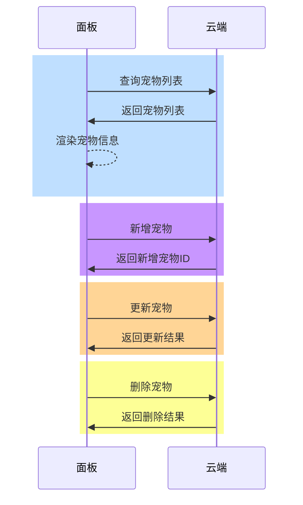
###### 上传图片进行宠物特征分析

###### 功能介绍

上传图片至服务器，将返回值传给云端，进行宠物特征分析。

###### 交互流程

1. 使用 [chooseImage](https://developer.tuya.com/cn/miniapp/develop/ray/api/media/image/chooseImage) 从手机选择图片；
2. 请求云端获取文件上传签名及对应的 objectKey；
3. 将图片上传至指定服务器；
4. 将步骤 `2` 返回的 objectKey 作为参数传递给特征分析接口，该接口会返回一个 taskId，之后通过轮询特征分析结果接口获取分析进度。
    - 若返回的 analysisResult 值为 2，则表示分析成功；
    - 若值为 1，则表示分析失败，根据返回的结果展示相应的分析信息。

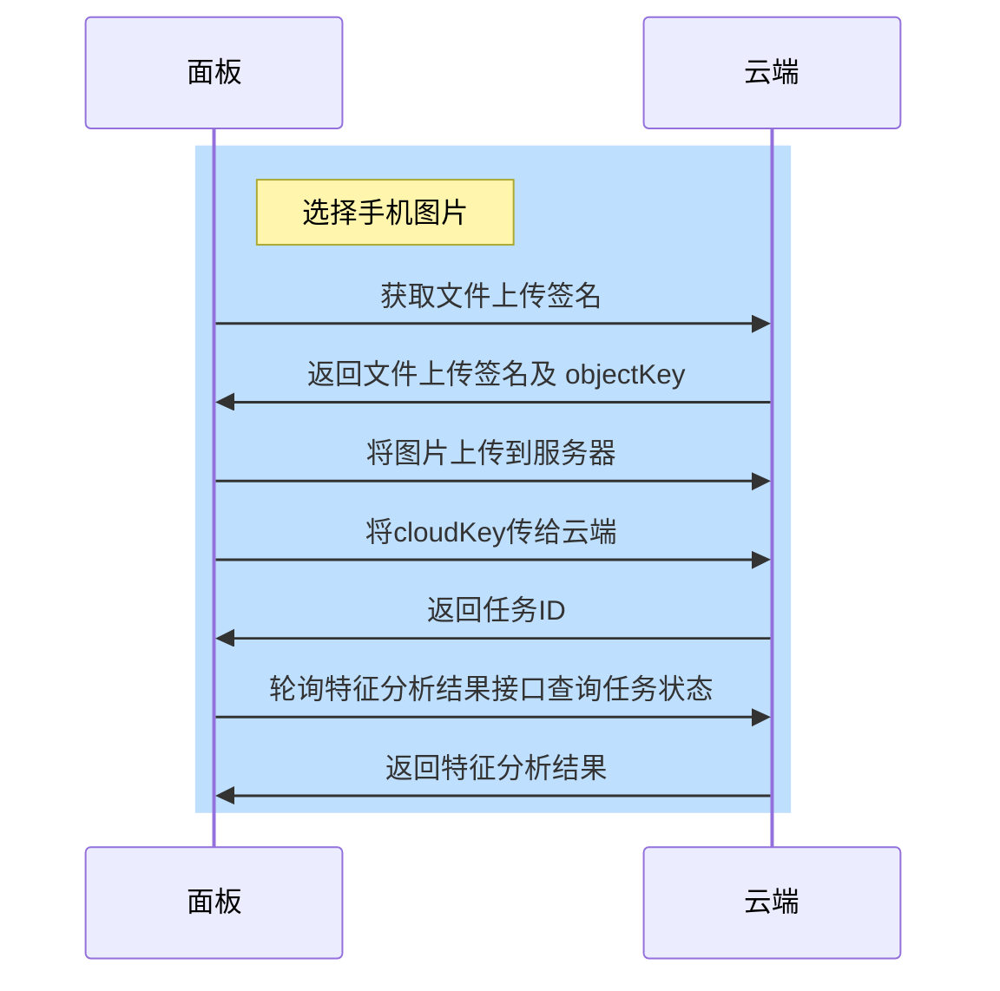
###### 多宠识别

###### 功能介绍

监测宠物的进食行为，并准确识别具体是哪种宠物，方便主人了解每只宠物的进食情况。

###### 交互流程

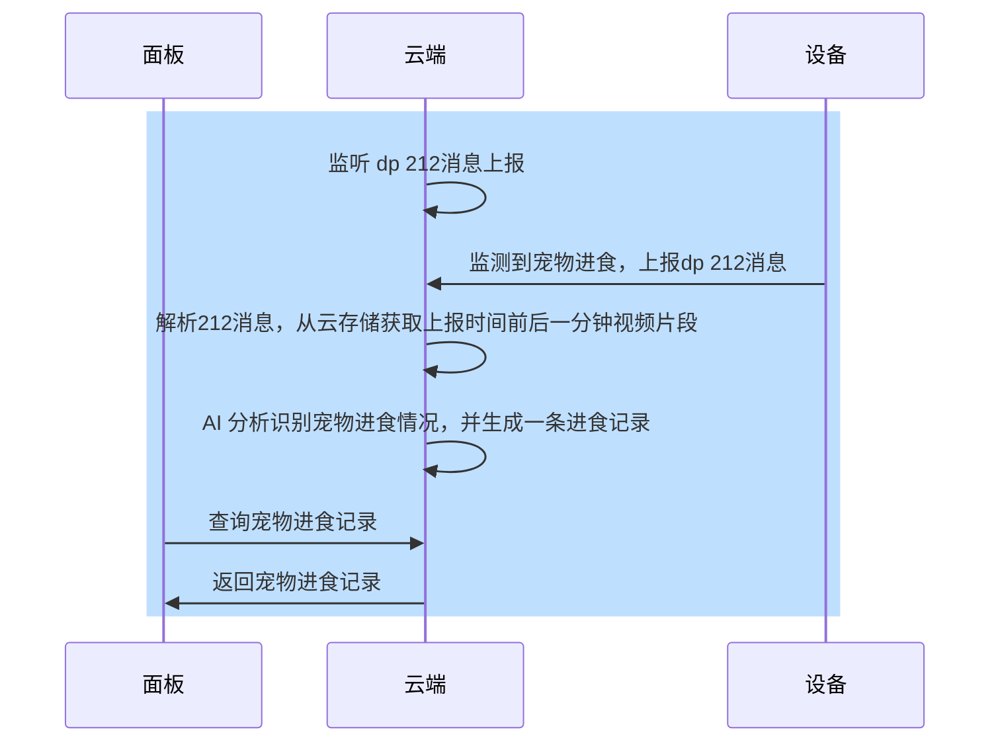

## 宠物图像质量检测方案

<h2 id="宠物图像质量检测方案">宠物图像质量检测方案 <span className="tag_h2">On-App AI</span></h2>

##### 痛点分析

为确保宠物智能设备（如喂食器）能提供精准服务，建立高质量的宠物档案至关重要。但在实际建档过程中，用户上传的宠物图片经常存在质量问题，这会导致：

- 云端 AI 模型识别准确率下降
- 云端 AI 模型检测响应延迟
- 网络传输资源浪费
- 无效token消耗

   
     
   
   
  </div>

##### 解决方案


**端侧实时检测**

- 移动端本地化处理
- 1秒内完成质量判断
- 即时拦截不合格图片

**三重质量保障**

| **检测类型** | **检测项目**    | **标准/要求**  |
| ------------ | --------------- | -------------- |
| **基础检测** | 图片清晰度/亮度 | 符合可识别标准 |
| **构图检测** | 单一宠物验证    | 仅包含一只宠物 |
|              | 主体占比        | ≥30%           |
| **姿态检测** | 正脸角度        | ≤45°           |
|              | 侧脸角度        | ≤40°           |

##### 技术优势

| **技术特性**     | **功能特点**     | **具体说明**               |
| ---------------- | ---------------- | -------------------------- |
| **轻量动态架构** | 10MB级轻量化模型 | 极小的资源占用             |
|                  | 支持热更新模型   | 无需重新部署即可更新模型   |
|                  | 按需加载机制     | 动态加载所需模块，节省资源 |
| **智能过滤系统** | 多宠物/异物过滤  | 自动排除干扰元素           |
|                  | 隐私人脸过滤     | 检测并模糊处理人脸         |
|                  | 设备自适应处理   | 适配不同硬件性能           |
| **隐私安全保障** | 数据本地处理     | 所有计算在设备端完成       |
|                  | 不上传用户照片   | 杜绝隐私数据外泄风险       |
|                  | 符合隐私保护法规 | GDPR等国际标准合规         |

##### 应用场景

| 应用场景     | 功能描述                                 |
| ------------ | ---------------------------------------- |
| 电子宠物档案 | 建立完整的宠物数字身份信息，记录成长历程 |
| 智能喂食系统 | 通过图像识别记录多宠进食情况             |
| 宠物保险服务 | 理赔时验证宠物身份真实性，确认伤病情况   |
#### 产品 AI 功能开发

为了助力开发者高效实现 AI 应用的落地，涂鸦开发者平台提供了多样化的支持，包括适用于不同品类的标准化 AI 功能、丰富的智能体模板、以及便捷的面板投放工具，从多个维度全面保障产品的 AI 应用快速落地。了解更多详情，请参考 [产品 AI 功能开发](https://developer.tuya.com/cn/docs/iot/AI-feature?id=Keapy1et1fc63)。

> 如需了解更多关于 AI 能力的内容，请联系您的项目经理或 [提交工单](https://service.console.tuya.com/8/3/list?source=support_center) 咨询。

#### 开发依赖

##### 小程序开发

1. **App依赖**：涂鸦、智能生活 App 版本为 6.7.0 及以上；
2. **小程序模板依赖**：宠物图像质量检测方案 API 集成于 AI 宠物面板模板：

- AI 宠物方案介绍，可查阅[AI 宠物方案介绍](https://developer.tuya.com/cn/miniapp/solution-ai/ability/picture-solution/aiPet)
- AI 宠物面板模板相关开发细则请参考[AI 宠物面板模板接入指南](https://developer.tuya.com/cn/miniapp-codelabs/codelabs/panel-ai-pet/index.html#0)

### 能力集

###### 宠物图像质量检测

<h3 id="创建宠物图像质量检测实例">创建宠物图像质量检测实例 <span className="tag_h2">On-App AI</span></h3>

- **功能**：初始化 AI 宠物图像质量检测实例

- **接口详情**：[petsDetectCreate](/cn/miniapp/develop/ray/api/ai/aiKit/petsDetectCreate)

<h3 id="销毁宠物图像质量检测实例">销毁宠物图像质量检测实例 <span className="tag_h2">On-App AI</span></h3>

- **功能**：销毁宠物图像质量检测实例，避免内存泄漏

- **接口详情**：[petsDetectDestory](/cn/miniapp/develop/ray/api/ai/aiKit/petsDetectDestory)

<h3 id="宠物图像质量检测">宠物图像质量检测方法 <span className="tag_h2">On-App AI</span></h3>

- **功能**：根据输入参数，对宠物图像进行质量检测，并返回检测结果。

- **接口详情**：[petsPictureQualityDetectForImage](/cn/miniapp/develop/ray/api/ai/aiKit/petsPictureQualityDetectForImage)
###### 关键依赖模块

- **区域：**

  - 全区可用

- **App 版本：**

  - 涂鸦 App、智能生活 App v6.7.0 及以上版本

- **Kit 依赖：**

  - BaseKit: v3.0.6
  - MiniKit: v3.0.1
  - DeviceKit: v4.0.8
  - BizKit: v4.2.0
  - AIKit: v1.3.0
  - baseversion: v2.26.7

- **组件依赖：**

  - @ray-js/panel-sdk: "^1.13.1"
  - @ray-js/ray: "^1.7.20"
  - @ray-js/ray-error-catch: "^0.0.25"
  - @ray-js/smart-ui: "^2.1.5"
  - @ray-js/cli: "^1.6.1"
###### 概述

基于 On-App AI，我们为开发者提供高效的宠物图像质量检测解决方案。通过 AI 技术，该方案能在1秒内完成宠物识别和异物过滤，实现精准的图像质量判断。该方案可显著节省网络传输资源，提升检测效率。

###### 方案主要涵盖功能

- **宠物图像质量检测：**

  - 图片清晰度/亮度检测
  - 单一宠物验证
  - 主体占比≥30%检测
  - 主体正脸角度≤45°、侧脸角度≤40°检测

### 模块集

###### 宠物图像资源导入

###### 功能介绍

宠物图像资源在初始化导入阶段依赖以下两个关键能力：

- 1.图像选择

  - [chooseImage](/cn/miniapp/develop/ray/api/media/image/chooseImage) :支持C端用户从本地相册选择图片或使用相机拍照。

- 2.图像压缩
  - [resizeImage](/cn/miniapp/develop/ray/api/media/image/resizeImage) :压缩图片， 在保持原图长宽比基础上先裁剪至目标尺寸， 然后根据文件大小限制去执行质量压缩。

###### 交互流程

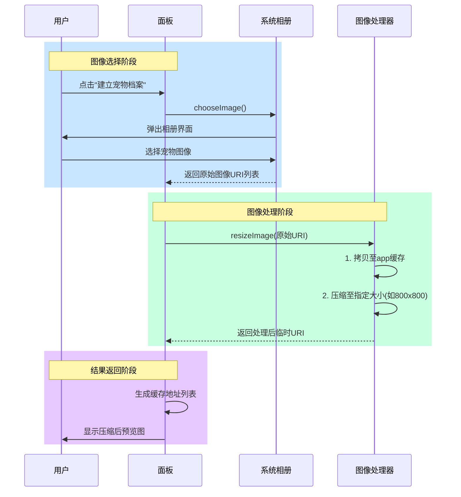

###### 注意事项

- 1.在使用 **resizeImage** API时，参数 **maxFileSize** 的单位为B，在限制图像最大尺寸时，请注意单位转换;
<h2 id="宠物图像质量检测">宠物图像质量检测 <span className="tag_h2">On-App AI</span></h2>

###### 功能介绍

本功能支持对用户上传的图片进行实时质量检测，自动拦截模糊、失真、低分辨率等低质量图像，避免无效传输。通过本地端实时过滤，减少云端检测的依赖，显著降低网络延迟，提升响应效率，为用户带来更流畅的上传体验。

###### 流程说明

1. **主体识别**

   - 通过目标检测模型自动识别画面中的主体（如宠物）
   - 输出主体类别、位置坐标和尺寸信息

2. **脸部检测**

   - 先定位宠物脸部区域
   - 再识别脸部关键特征点（如眼睛、鼻子等）

3. **质量校验**
   - **亮度检测**：计算主体区域平均亮度，过滤过曝/过暗图片
   - **姿态检测**：根据特征点计算脸部偏转角度
   - **遮挡检测**：判断脸部是否存在遮挡物

###### 交互流程

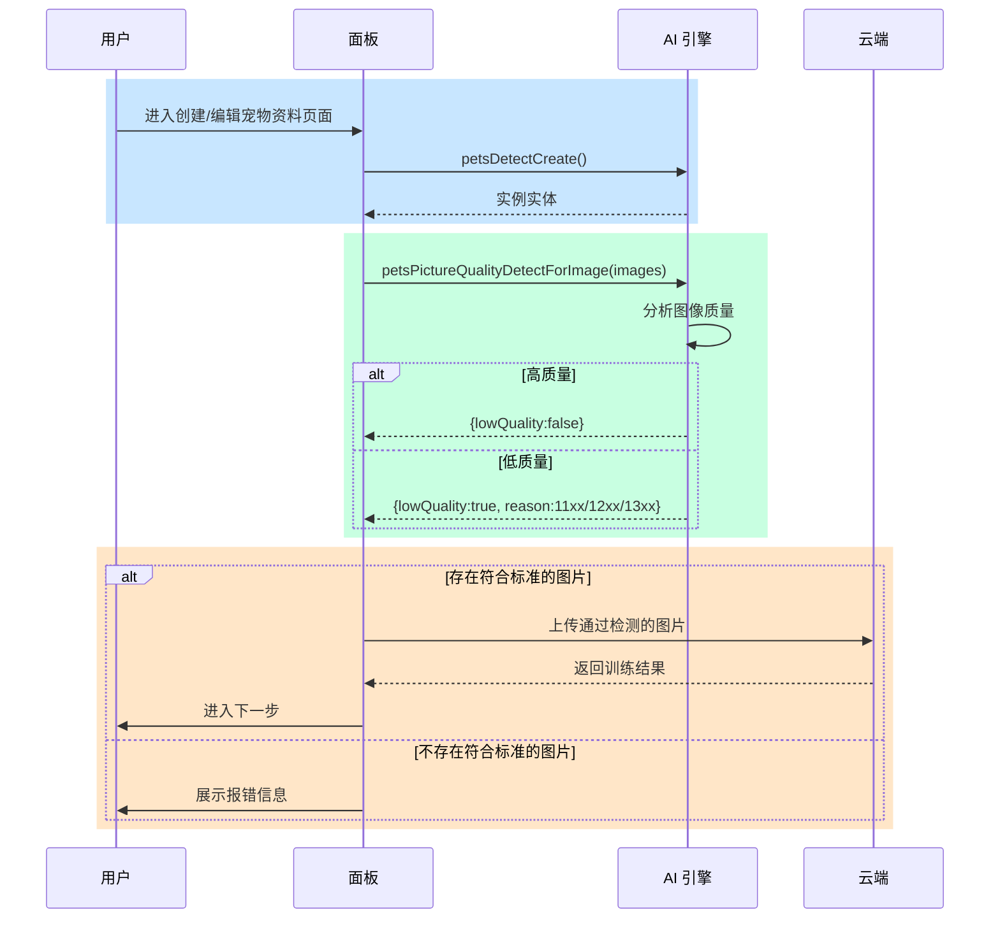

###### 注意事项

- 1.单个页面建议复用同一个宠物图像质量检测实例；

- 2.及时销毁不再使用的实例；

## 宠物写真

<h2 id="宠物写真">宠物写真方案 <span className="tag_h2">On-App AI</span></h2>

##### 爽点分析

   
  </div>

- 随手拍的普通照片，AI 一键生成艺术大片
- 无 token 消耗，随心拍、随心生成
- 特殊节日，AI推荐特效前景，烘托节日氛围，融入情景
- AI 一键快速合成，用户使用零门槛

##### 技术方案


1. **移动端处理**
   - 目标检测：轻量化模型实时识别主体
   - 中心计算：智能算法确定主体焦点

2. **云端协同**
   - 前景模板管理
   - 下发处理参数

3. **最终生成**
   - App端侧渲染合成
   - 输出图片/视频

##### 技术优势

| **技术特性**       | **功能特点**     | **具体说明**                                                                        |
| ------------------ | ---------------- | ----------------------------------------------------------------------------------- |
| **端云协同优化**   | 多区部署         | 支持多区部署，适配多种业务场景                                                      |
|                    | 模板灵活管理     | 前景模板支持灵活配置                                                                |
| **高效目标检测**   | 轻量化AI模型     | TensorFlow Lite/EfficientDet-D0等模型，算力消耗每万次减少25 TFLOPs，节省成本10%左右 |
|                    | 多主体识别       | 支持宠物、人物等类别检测                                                            |
| **智能中心计算**   | 动态权重调整     | 根据目标类型自动优化中心点计算策略                                                  |
| **隐私与性能平衡** | 关键数据本地处理 | 原始图像不离端                                                                      |

##### 应用场景

| 应用场景     | 功能描述                                 |
| ------------ | ---------------------------------------- |
| 宠物写真     | AI 一键快速合成，宠物照片秒变萌图        |
| 电子相册     | 相册照片二次编辑，AI 生成创意图像        |
| 带屏电子设备 | 图传能力 + AI 写真能力，自定义酷炫电子屏 |
#### 产品 AI 功能开发

为了助力开发者高效实现 AI 应用的落地，涂鸦开发者平台提供了多样化的支持，包括适用于不同品类的标准化 AI 功能、丰富的智能体模板、以及便捷的面板投放工具，从多个维度全面保障产品的 AI 应用快速落地。了解更多详情，请参考 [产品 AI 功能开发](https://developer.tuya.com/cn/docs/iot/AI-feature?id=Keapy1et1fc63)。

> 如需了解更多关于 AI 能力的内容，请联系您的项目经理或 [提交工单](https://service.console.tuya.com/8/3/list?source=support_center) 咨询。

#### 开发依赖

##### 小程序开发

1. **App依赖**：涂鸦智能、智能生活App版本为 6.9.0 及以上；
2. **小程序模板依赖**：宠物写真方案 API 集成于 AI 宠物面板模板：

- AI 宠物方案介绍，可查阅[AI 宠物方案介绍](https://developer.tuya.com/cn/miniapp/solution-ai/ability/picture-solution/aiPet)
- AI 宠物面板模板相关开发细则请参考[AI 宠物面板模板接入指南](https://developer.tuya.com/cn/miniapp-codelabs/codelabs/panel-ai-pet/index.html#0)

### 能力集

###### 宠物写真

<h3 id="创建宠物写真服务实例">创建宠物写真服务实例 <span className="tag_h2">On-App AI</span></h3>

- **功能**：初始化宠物写真服务实例

- **接口详情**：[createForegroundVideoService](/cn/miniapp/develop/ray/api/ai/aiKit/createForegroundVideoService)

<h3 id="销毁宠物写真服务实例">销毁宠物写真服务实例 <span className="tag_h2">On-App AI</span></h3>

- **功能**：销毁宠物写真服务实例，避免内存泄漏

- **接口详情**：[destroyForegroundVideoService](/cn/miniapp/develop/ray/api/ai/aiKit/destroyForegroundVideoService)

<h3 id="生成宠物写真">生成宠物写真 <span className="tag_h2">On-App AI</span></h3>

- **功能**：根据输入参数，自动化生成宠物写真。

- **接口详情**：[processPetForegroundMediaByTemplate](/cn/miniapp/develop/ray/api/ai/aiKit/processPetForegroundMediaByTemplate)

###### 宠物写真模板管理

###### 获取模板素材数据

- **接口详情**：[getAiFilterTemplates](/cn/miniapp/develop/ray/api/ai/aiPet/getAiFilterTemplates)
###### 关键依赖模块

- **区域：**

  - 全区可用

- **App 版本：**

  - 涂鸦 App、智能生活 App v6.9.0 及以上版本

- **Kit 依赖：**

  - BaseKit: v3.0.6
  - MiniKit: v3.0.1
  - DeviceKit: v4.0.8
  - BizKit: v4.2.0
  - AIKit: v1.4.4
  - baseversion: v2.29.1

- **组件依赖：**

  - @ray-js/panel-sdk: "^1.13.1"
  - @ray-js/ray: "^1.7.30"
  - @ray-js/ray-error-catch: "^0.0.25"
  - @ray-js/smart-ui: "^2.1.5"
  - @ray-js/cli: "^1.7.30"
###### 概述

基于 On-App AI，我们为开发者提供趣味性的 AI 宠物写真解决方案。该方案运用 AI 技术，将预设趣味主题模板与用户上传图片智能融合，实现一键式零门槛宠物趣味编辑。方案无需token消耗，支持用户随拍随生成，体验自由创作乐趣。

###### 方案主要涵盖功能

- **趣味模板管理功能：**
  - B端客户可自定义上传趣味模板
  - 模板面板通过指定 API 可获取所配置的趣味模板

- **宠物写真生成功能：**
  - 宠物写真生成
  - 宠物写真保存至手机相册

### 模块集

###### 获取 AI 素材资源

###### 功能介绍

AI 素材资源在初始化导入阶段依赖下述关键能力：

- [getAiFilterTemplates](/cn/miniapp/develop/ray/api/ai/aiPet/getAiFilterTemplates):通过该 API 面板侧可获取到 B 端客户配置好的 AI 素材资源。

###### 交互流程

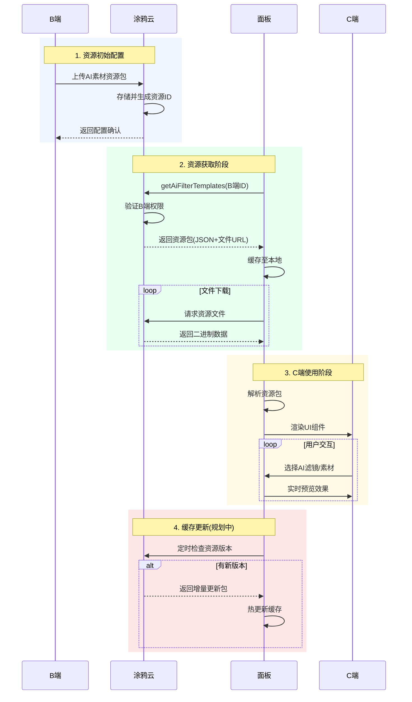

###### 注意事项

- 1. AI 素材资源配置教程相关信息，请联系您的项目经理或 [提交工单](https://service.console.tuya.com/8/3/list?source=support_center) 咨询。
<h2 id="宠物写真生成">宠物写真生成 <span className="tag_h2">On-App AI</span></h2>

###### 功能介绍

本功能运用 AI 技术，将预设趣味主题模板与用户上传图片智能融合，实现一键式零门槛宠物趣味编辑。方案无需 token 消耗，支持用户随拍随生成，体验自由创作乐趣。

###### 流程说明

###### 1. 资源准备阶段

###### 云端资源库

- **模型仓库**
  - 预训练AI模型存储（如主体检测、动态中心点适配等）
  - 支持 `模型下载` 到本地或云端推理环境
- **模板素材库**
  - 存储 `前景模板` 、背景素材等
  - 支持 `下载模板` 或 `获取模板配置`

###### 2. 输入处理阶段

- **图片文件**
  - 用户原始照片上传
  - 支持 `图像识别` （人物/宠物检测）
- **媒体文件**
  - 媒体输入（目前仅支持静态图片）
  - 支持 `媒体合成` 预处理

###### 3. AI 处理阶段

- **On-App AI 处理流程**
  - 结合下载的模型和模板进行实时处理
  - 典型操作：
    - 人像分割
    - 风格化渲染
    - 背景合成
- **策略优化**
  - 根据图像主体坐标自动调整主体居中展示

###### 4. 输出阶段

- 生成 AI 写真图片/视频
- 支持保存至手机本地相册

###### 交互流程

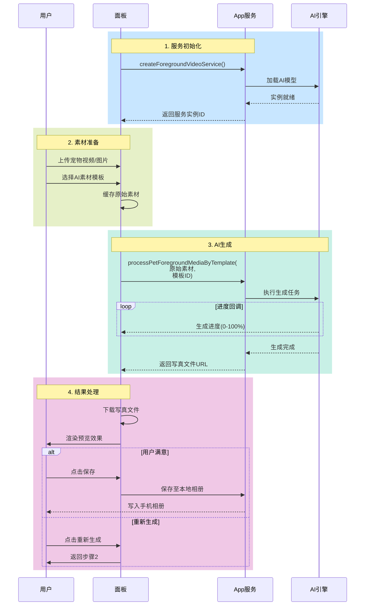

###### 注意事项

- 1.单个页面建议复用同一个宠物写真生成服务实例；

- 2.及时销毁不再使用的实例；

## 图像增强优化方案

<h2 id="图像增强优化方案">图像增强优化方案 <span className="tag_h2">On-App AI</span></h2>

##### 痛点分析

为了确保智能设备（如门锁、IPC）能够提供优质的服务，提供高保真、高清晰度的查图能力至关重要。但在实际的使用场景中，由于受环境中的光照条件的影响，设备摄像头抓取到的图像会出现以下问题：

- 采光条件差时（如傍晚），图像会偏暗。
  
   </div>
- 当摄像头遇到强光时，图像会有曝光问题，且被水或其他物质遮挡，图像会模糊。
  
   </div>

- 广角摄像头拍摄的画面，容易出现图像边缘变形。
   
  </div>

##### 解决方案

**图像增强优化**：

- 移动端本地化处理。
- 对图像进行清晰增强优化。
- 对图像进行畸变校正（针对广角摄像头）。

   
   
     
  </div>

##### 技术优势

- 高效计算：适配主流移动端计算能力。
- 智能处理：智能识别提升图像画质。

##### 应用场景

| 应用场景     | 功能描述                       |
| ------------ | ------------------------------ |
| 门锁相册消息 | 提供高清晰图，增强事件消息体验 |
#### 产品 AI 功能开发

为了助力开发者高效实现 AI 应用的落地，涂鸦开发者平台提供了多样化的支持，包括适用于不同品类的标准化 AI 功能、丰富的智能体模板、以及便捷的面板投放工具，从多个维度全面保障产品的 AI 应用快速落地。了解更多详情，请参考 [产品 AI 功能开发](https://developer.tuya.com/cn/docs/iot/AI-feature?id=Keapy1et1fc63)。

> 如需了解更多关于 AI 能力的内容，请联系您的项目经理或 [提交工单](https://service.console.tuya.com/8/3/list?source=support_center) 咨询。

#### 开发依赖

##### 小程序开发

- **App 依赖**：**涂鸦** App、**智能生活** App 版本为 v6.9.0 及以上。
- **小程序模板依赖**：图像增强优化方案 API 集成于 AI 图像优化面板模板。该模板相关开发细则，请参考 [AI 图像优化面板模板接入指南](https://developer.tuya.com/cn/miniapp-codelabs/codelabs/panel-ai-picture-enhance/index.html#0)。

### 能力集

###### AI 图像增强优化

<h3 id="初始化 AI 图像增强优化实例">初始化 AI 图像增强优化实例 <span className="tag_h2">On-App AI</span></h3>

- **功能**：初始化 AI 图像增强优化实例。

- **接口详情**：[imageEnhanceCreate](/cn/miniapp/develop/ray/api/ai/aiKit/imageEnhanceCreate)

<h3 id="销毁 AI 图像增强优化实例">销毁 AI 图像增强优化实例 <span className="tag_h2">On-App AI</span></h3>

- **功能**：销毁 AI 图像增强优化实例，避免内存泄漏。

- **接口详情**：[imageEnhanceDestroy](/cn/miniapp/develop/ray/api/ai/aiKit/imageEnhanceDestroy)

<h3 id="图像清晰度增强优化方法">图像清晰度增强优化方法 <span className="tag_h2">On-App AI</span></h3>

- **功能**：根据输入参数，对图像进行清晰度增强优化，并返回结果。

- **接口详情**：[enhanceClarityForImage](/cn/miniapp/develop/ray/api/ai/aiKit/enhanceClarityForImage)

<h3 id="取消图像清晰度增强优化方法">取消图像清晰度增强优化方法 <span className="tag_h2">On-App AI</span></h3>

- **功能**：在调用图像清晰度增强优化方法后，未返回结果前，可调用此方法取消图像清晰度增强优化。

- **接口详情**：[enhanceClarityCancel](/cn/miniapp/develop/ray/api/ai/aiKit/enhanceClarityCancel)

<h3 id="图像畸变校正处理方法">图像畸变校正处理方法 <span className="tag_h2">On-App AI</span></h3>

- **功能**：根据输入参数，对图像进行畸变校正，并返回结果。

- **接口详情**：[enhanceCalibrationForImage](/cn/miniapp/develop/ray/api/ai/aiKit/enhanceCalibrationForImage)

<h3 id="注册图像清晰度增强优化进度事件">注册图像清晰度增强优化进度事件方法 <span className="tag_h2">On-App AI</span></h3>

- **功能**：监听当前图像清晰度增强优化的进度。

- **接口详情**：[onEnhanceClarityProgress](/cn/miniapp/develop/ray/api/ai/aiKit/onEnhanceClarityProgress)

<h3 id="注销图像清晰度增强优化进度监听事件方法">注销图像清晰度增强优化进度监听事件方法 <span className="tag_h2">On-App AI</span></h3>

- **功能**：注销图像清晰度增强优化进度监听事件。

- **接口详情**：[offEnhanceClarityProgress](/cn/miniapp/develop/ray/api/ai/aiKit/offEnhanceClarityProgress)
###### 关键依赖模块

- **区域**：全区可用

- **App 版本**：**涂鸦** App、**智能生活** App v6.9.0 及以上版本

- **Kit 依赖**：
  - BaseKit：v3.0.6
  - MiniKit：v3.0.1
  - DeviceKit：v4.0.8
  - BizKit：v3.2.0
  - AIKit：v1.4.4
  - baseversion：v2.26.7

- **组件依赖**：
  - @ray-js/panel-sdk: "^1.13.1"
  - @ray-js/ray: "^1.7.37"
  - @ray-js/ray-error-catch: "^0.0.25"
  - @ray-js/smart-ui: "^2.1.5"
  - @ray-js/cli: "^1.6.1"
###### 概述

基于 On-App AI，涂鸦为开发者提供高效的图像增强优化解决方案。通过 AI 技术，该方案能在 1 秒内完成图像质量的优化提升。

###### 方案核心功能

- 图像清晰增强优化
- 图像畸变校正

### 模块集

<h2 id="图像清晰度增强优化">图像清晰度增强优化 <span className="tag_h2">On-App AI</span></h2>

###### 功能介绍

对网络图像或本地相册图像做清晰增强优化。

依赖以下关键能力：

- **图像选择**：
    - [chooseImage](/cn/miniapp/develop/ray/api/media/image/chooseImage)：支持 C 端用户从本地相册选择图片或使用相机拍照。
- **下载文件**：
    - [downloadFile](/cn/miniapp/develop/ray/api/network/download/downloadFile)：下载文件资源到本地。

###### 交互流程

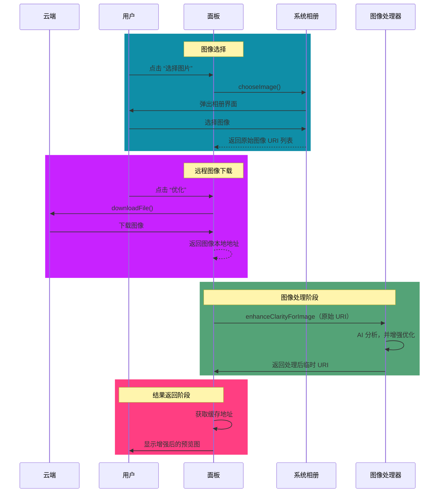
<h2 id="图像畸变校正">图像畸变校正 <span className="tag_h2">On-App AI</span></h2>

###### 功能介绍

对网络图像做清晰增强优化后，再进行畸变校正。

###### 流程说明

1. **下载图像**：下载图像数据到本地。

2. **增强优化**（操作必须按照以下顺序执行）：

   - 第一步：对图像进行清晰度增强优化。
   - 第二步：对图像进行畸变校正。

###### 交互流程

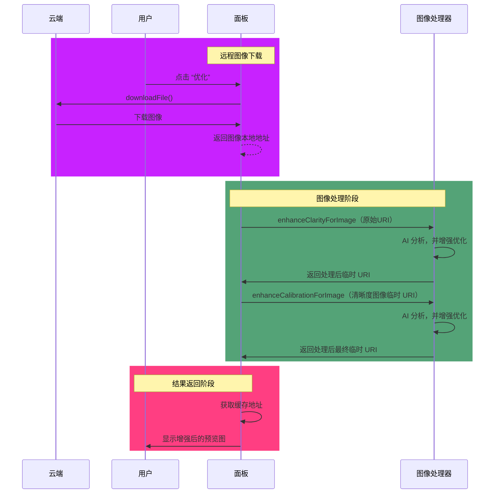

## AI 口腔镜方案

<h2 id="AI 口腔镜方案">AI 口腔镜方案 <span className="tag_h2">On-App AI</span></h2>

##### 痛点分析


###### 疾病特征与早期干预重要性

口腔常见疾病（包括牙结石、龋齿、牙龈炎等）具有患病率高、影响范围广的流行病学特征。这些疾病的早期发现和及时干预，对于阻断病情发展、维护口腔健康乃至全身健康都具有关键意义。

###### 传统检测方法概述

- **主要检测手段**：依赖临床医生的视觉检查结合探诊等物理检查方法。
- **技术优势**：在专业操作下能够获得较高的诊断准确率。
- **执行场景**：仅限于具备专业设备的医疗机构环境。

###### 现有体系局限性分析

- **专业技术门槛**：检测过程必须由专业医师操作，依赖昂贵的专用设备。
- **时空访问障碍**：患者需要专门安排时间前往医疗机构，存在地域和时间限制。
- **预防筛查缺口**：传统模式难以支持日常化的健康监测和早期风险预警。
- **医疗资源压力**：集中式诊疗模式导致优质医疗资源分配不均。

##### 解决方案

###### 技术方案

基于端侧 On-App AI 技术，通过分析用户自主拍摄的口腔镜图像数据，实现口腔健康的智能化筛查。

###### 核心检测能力

系统可准确识别六类常见口腔问题：

- 牙结石检测
- 龋齿识别
- 牙龈炎筛查
- 牙齿变色分析
- 牙齿发育不全评估

###### 应用价值体现

- **早期预警机制**：提前发现潜在口腔健康问题。
- **就医引导功能**：基于检测结果智能提示专业诊疗建议。
- **效率提升价值**：显著优化个人口腔健康管理流程。
- **便捷性优势**：打破传统诊疗时空限制，实现随时随地的健康监测。

##### 核心优势

###### 本地化创新

- 端侧 On-App AI 模型解决 Wi-Fi 连接时的网络隔离问题。
- 完全离线运行，确保实时检测与数据安全。

###### 核心优势

- 六大口腔疾病实时预测。
- 本地推理保障隐私合规。
- 降低云端依赖与运营成本。

###### 轻量架构

- 双阶段检测：快速筛选 + 精细分类。
- 智能滤镜突出病灶区域。
- 模型按需更新，安装包小巧。

###### 极速体验

- 全流程处理 ＜ 1 秒
- 实时响应无延迟
  | 设备性能 | 安卓平台（ms） | iOS平台（ms） |
  | :--- | :--- | :--- |
  | **高** | 小米 i5：45 - 55 | iPhone 14 Pro Max：80 - 90 |
  | **中** | iQOO Z8：80 - 90 | iPhone 12 Pro：100 - 120 |
  | **低** | 华为 P20：180 - 230 | iPhone 8：140 - 160 |

- **测试分辨率**：480 P 与 1280 P

##### 应用场景

| 场景             | 案例               | 功能概要                                                                           |
| ---------------- | ------------------ | ---------------------------------------------------------------------------------- |
| **家庭日常监测** | 用户早晚刷牙后自检 | 通过手机摄像头拍摄口腔影像，快速筛查牙菌斑、牙龈炎等常见问题，建立个人口腔健康档案 |
| **远程健康咨询** | 线上问诊前置评估   | 患者在咨询前先完成自主检测，为医生提供可视化参考，提高咨询效率                     |
| **儿童口腔护理** | 家长协助孩子检查   | 通过趣味性的检测界面，帮助家长及时发现儿童龋齿、牙齿发育异常等问题                 |
| **术后康复跟踪** | 牙科治疗后续观察   | 定期记录口腔状况，对比历史数据，监控恢复情况，及时发现异常                         |
#### 产品 AI 功能开发

为了助力开发者高效实现 AI 应用的落地，涂鸦开发者平台提供了多样化的支持，包括适用于不同品类的标准化 AI 功能、丰富的智能体模板、以及便捷的面板投放工具，从多个维度全面保障产品的 AI 应用快速落地。了解更多详情，请参考 [产品 AI 功能开发](https://developer.tuya.com/cn/docs/iot/AI-feature?id=Keapy1et1fc63)。

> 如需了解更多关于 AI 能力的内容，请联系您的项目经理或 [提交工单](https://service.console.tuya.com/8/3/list?source=support_center) 咨询。

#### 开发依赖

##### 小程序开发

1. **App 依赖**：**涂鸦** App、**智能生活** App 版本为 v6.11.5 及以上。
2. **小程序模板依赖**：AI 口腔镜方案 API 集成于 AI 口腔镜示例模板：

    - 关于 AI 口腔镜方案的介绍，请参考 [AI 口腔镜方案](https://developer.tuya.com/cn/miniapp/solution-ai/ability/picture-solution/aiDentalMirror/overview)。
    - 关于 AI 口腔镜示例模板相关开发细则，请参考 [AI 口腔镜示例模板接入指南](https://developer.tuya.com/cn/miniapp-codelabs/codelabs/panel-ai-dental-mirror/index.html#0)。

### 能力集

###### 口腔健康智能筛查

<h3 id="初始化口腔健康智能筛查实例">初始化口腔健康智能筛查实例 <span className="tag_h2">On-App AI</span></h3>

- **功能**：初始化口腔健康智能筛查模型实例，为后续口腔健康智能筛查做好预准备工作。

- **接口详情**：[oralDiseaseInit](/cn/miniapp/develop/ray/api/ai/aiKit/oralDiseaseInit)

<h3 id="监听口腔健康智能筛查实例初始化进度">监听口腔健康智能筛查实例初始化进度 <span className="tag_h2">On-App AI</span></h3>

- **功能**：监听口腔健康智能筛查实例初始化进度，当模型下载完成后才可进行口腔健康智能筛查操作。

- **接口详情**：[onOralModelDownProgress](/cn/miniapp/develop/ray/api/ai/aiKit/onOralModelDownProgress)

<h3 id="取消监听口腔健康智能筛查实例初始化进度">取消监听口腔健康智能筛查实例初始化进度 <span className="tag_h2">On-App AI</span></h3>

- **功能**：用于口腔模型下载完成后，或页面卸载时，取消口腔健康智能筛查实例初始化进度的监听。

- **接口详情**：[offOralModelDownProgress](/cn/miniapp/develop/ray/api/ai/aiKit/offOralModelDownProgress)

<h3 id="启动口腔健康智能筛查">启动口腔健康智能筛查 <span className="tag_h2">On-App AI</span></h3>

- **功能**：通过分析用户自主拍摄的口腔镜图像，实现口腔健康的智能化筛查。

- **接口详情**：[oralDiseasePredictionRun](/cn/miniapp/develop/ray/api/ai/aiKit/oralDiseasePredictionRun)
###### 关键依赖模块

- **区域：** 全区可用

- **App 版本：** **涂鸦** App、**智能生活** App v6.11.5 及以上版本

- **Kit 依赖：**
  - BaseKit：v3.26.7
  - MiniKit：v3.24.0
  - DeviceKit：v3.9.3
  - BizKit：v3.9.12
  - AIKit：v1.6.0
  - baseversion：v2.29.16

- **组件依赖：**
  - @ray-js/panel-sdk: "^1.13.1"
  - @ray-js/ray: "^1.7.43"
  - @ray-js/ray-error-catch: "^0.0.25"
  - @ray-js/smart-ui: "^2.6.3"
  - @ray-js/cli: "^1.7.43"
###### 概述

为了降低开发者接入 App AI 的难度，示例模板中整理了通用的口腔健康智能化筛查能力，并对外提供相应的示例源码。

###### 模板主要涵盖功能

- **口腔素材、报告基本交互功能：**
  - 口腔图片素材导入
  - 口腔健康筛查情况展示
- **口腔健康智能化筛查：**
  - 牙结石情况筛查分析
  - 龋齿情况筛查分析
  - 牙龈发炎情况筛查分析
  - 牙齿发育不全情况筛查分析
  - 牙齿变色情况筛查分析
  - 溃疡情况筛查分析

###### 附录

- [模板文档](https://developer.tuya.com/cn/miniapp-codelabs/codelabs/panel-ai-dental-mirror/index.html#0)
- [物料仓库](https://developer.tuya.com/material/library_hKiOVClc/component?code=AIDentalMirrorTemplate)

### 模块集

<h2 id="口腔健康智能筛查">口腔健康智能筛查 <span className="tag_h2">On-App AI</span></h2>

###### 功能介绍

基于端侧 On-App AI 技术，通过分析用户自主拍摄的口腔镜图像数据，实现口腔健康的智能化筛查。

###### 流程说明

1. **导入图像**：支持用户拍照或导入本地相册口腔素材。

2. **智能筛查**（操作必须按照以下顺序执行）：
   - 第一步：初始化口腔健康智能筛查实例。
   - 第二步：监听口腔健康智能筛查实例初始化进度（页面卸载时需注销监听）。
   - 第三步：启动口腔健康智能筛查。

###### 交互流程

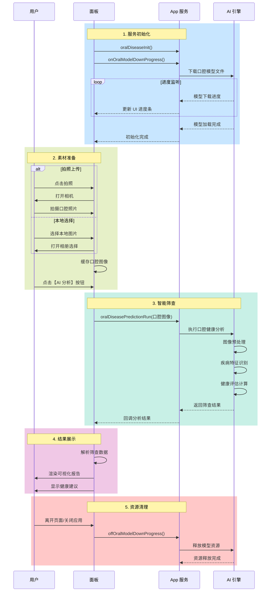

## AI 像素屏文生图方案

<h2 id="AI像素屏文生图方案" class="nx-font-semibold nx-tracking-tight nx-text-slate-900 dark:nx-text-slate-100 nx-mt-10 nx-border-b nx-pb-1 nx-text-3xl nx-border-neutral-200/70 contrast-more:nx-border-neutral-400 dark:nx-border-primary-100/10 contrast-more:dark:nx-border-neutral-400">AI 像素屏文生图方案<span className="tag_h2">On-App AI</span></h2>

##### 痛点分析

在像素屏应用中，用户希望快速生成图案内容，如表情、图标、动植物等。然而当前云端文生图方案存在明显不足:

- 生成延迟高：云端大模型平均 8~12 秒 才能生成一张图片，难以满足实时交互场景。
- 成本高：每次云端推理都需付费，随着用户使用量增加，运营成本显著上升。
- 依赖网络：弱网或离线场景下无法生成图像，影响使用体验。

##### 解决方案

On-App AI 像素图生成 —— 使用涂鸦自研轻量级图像生成模型，在手机本地（端侧）完成像素图生成：

- 完全本地推理，无需联网
- 秒级生成（1~2 秒）
- 零云端推理成本
- 高质量、可控风格的像素风格输出

> 💡 **立即体验**：打开 **智能生活 App** / **涂鸦 App** （v7.0.5 及以上版本），扫描下方二维码预览：

##### 技术优势

✔ **高效推理**

- 适配 iOS/Android 主流机型：

- 高端机：0.5s~1.5s

- 中端机：1.5s~2.0s

- 低端机：2~8s

✔ **成本低**

- 无云端推理费用

- 大幅降低人群规模扩大后的运营成本

✔ **更安全**

- 数据不上传云端，全程在本地处理

- 符合隐私安全要求

✔ **模型轻量化与动态化**

 - 按需加载的动态模型管理机制

 - 减少初始安装包体积，降低存储占用

 - 在线下载、更新并部署模型

✔ **动态扩展数据集**

- 可根据市场热点快速生成新标签，如：

- 季节主题（圣诞树、烟花）

- 宠物主题（猫、狗、鹦鹉）

- 情绪/表情包

- IP 联名形象

##### 应用场景

| 应用场景     | 功能描述                       |
| ------------ | ------------------------------ |
| 像素屏 DIY 创作 | 用户自定义选择标签生成像素图案 |
| 车载屏内容创作 | 生成图像即时发送到像素屏显示 |
| 儿童像素创作 | 离线生成、不依赖网络、安全可靠 |
| 设备屏保/表盘 | 快速生成主题式像素图标 |

##### 专属模型申请

如有意向训练专属模型，欢迎前往 [On-App AI 客户专属模型申请平台](https://developer.tuya.com/model/apply) 提交申请。平台支持自定义数据集、训练与部署，为您的业务场景打造专属 AI 能力。
#### 产品 AI 功能开发

为了助力开发者高效实现 AI 应用的落地，涂鸦开发者平台提供了多样化的支持，包括适用于不同品类的标准化 AI 功能、丰富的智能体模板、以及便捷的面板投放工具，从多个维度全面保障产品的 AI 应用快速落地。了解更多详情，请参考 [产品 AI 功能开发](https://developer.tuya.com/cn/docs/iot/AI-feature?id=Keapy1et1fc63)。

> 如需了解更多关于 AI 能力的内容，请联系您的项目经理或 [提交工单](https://service.console.tuya.com/8/3/list?source=support_center) 咨询。

#### 开发依赖

##### 小程序开发

- **App 依赖**：**涂鸦** App、**智能生活** App 版本为 v7.0.5 及以上。
- **小程序模板依赖** AI 像素屏文生图方案集成于 AI 像素屏文生图模板。该模板相关开发细则，请参考 [AI 像素屏文生图模板接入指南](https://developer.tuya.com/cn/miniapp-codelabs/codelabs/on-app-ai-text-to-image/index.html#0)。

### 能力集

###### AI 像素屏文生图 API

<h3 id="图像生成初始化">图像生成初始化 <span className="tag_h2">On-App AI</span></h3>

- **功能**：移动端本地图像生成模型初始化。

- **接口详情**：[pixelImageInit](/cn/miniapp/develop/ray/api/ai/aiKit/pixelImageInit)

<h3 id="图像生成标签列表">图像生成标签列表 <span className="tag_h2">On-App AI</span></h3>

- **功能**：移动端本地配置的图像生成标签列表。

- **接口详情**：[fetchPixelImageCategoryInfo](/cn/miniapp/develop/ray/api/ai/aiKit/fetchPixelImageCategoryInfo)

<h3 id="图像生成">图像生成 <span className="tag_h2">On-App AI</span></h3>

- **功能**：调用移动端本地图像生成模型, 返回生成的图像。

- **接口详情**：[generationPixelImage](/cn/miniapp/develop/ray/api/ai/aiKit/generationPixelImage)

<!-- <h3 id="图像GIF生成">图像 GIF 生成 <span className="tag_h2">On-App AI</span></h3>

- **功能**：调用移动端本地图像生成模型, 返回生成的 GIF 图像。

- **接口详情**：[generationPixeGiflImage](/cn/miniapp/develop/ray/api/ai/aiKit/generationPixeGiflImage) -->

<h3 id="初始化进度">初始化进度 <span className="tag_h2">On-App AI</span></h3>

- **功能**：监听移动端本地图像生成模型初始化进度。

- **接口详情**：[onPixelImageInitProgressEvent](/cn/miniapp/develop/ray/api/ai/aiKit/onPixelImageInitProgressEvent)

<h3 id="移除监听初始化进度">移除监听：初始化进度 <span className="tag_h2">On-App AI</span></h3>

- **功能**：移除监听移动端本地图像生成模型初始化进度。

- **接口详情**：[offPixelImageInitProgressEvent](/cn/miniapp/develop/ray/api/ai/aiKit/offPixelImageInitProgressEvent)

<h3 id="蓝牙数据透传">蓝牙数据透传</h3>

- **功能**：BLE(thing)下发透传数据。

- **接口详情**：[publishBLETransparentData](/cn/miniapp/develop/ray/api/bluetooth/single/publishBLETransparentData)

<h3 id="图片剪裁">图片剪裁</h3>

- **功能**：图片剪裁。

- **接口详情**：[cropImages](/cn/miniapp/develop/ray/api/media/image/cropImages)
###### 关键依赖模块

- **区域**：全区可用

- **App 版本**：**涂鸦** App、**智能生活** App v7.0.5 及以上版本

- **Kit 依赖**
  - BaseKit：v3.29.1
  - MiniKit：v3.12.0
  - DeviceKit：v4.6.1
  - BizKit：v4.10.0
  - HomeKit: 3.4.0
  - AIKit: 1.8.1
  - baseversion：v2.29.18
- **组件依赖**
  - @ray-js/ray^1.7.34
  - @ray-js/panel-sdk^1.14.1
  - @ray-js/smart-ui^2.7.3
  - @ray-js/lamp-color-slider^1.1.7
  - @ray-js/lamp-saturation-slider^1.1.7
  - @ray-js/ray-error-catch^0.0.26
  - omggif^1.0.10
  - md5^1.0.10
###### 项目模板

基于 On-App AI 端侧文生图能力，涂鸦为像素屏类产品提供高效、低成本、可实时响应的 AI 像素图生成方案。该方案通过在移动端本地部署轻量化像素图生成模型，实现 1～2 秒生成像素图，并支持通过蓝牙下发至设备进行显示，无需云端推理，极大提升用户体验与业务可扩展性。

###### 核心功能

- 端侧 AI 文生图：基于标签一键生成像素图，1～2 秒出图，无需网络。

- 模型动态更新：本地模型按需加载，标签与数据集可动态扩展。

- 像素涂鸦创作：支持涂鸦模式、橡皮擦、油漆桶、实时像素画传输。

- 图片上传与剪裁：相册/拍照 → 像素化 → 生成单帧 GIF → 下发设备。

- 蓝牙大数据传输：支持图片和 GIF 分片透传至像素屏 MCU，实现实时预览与显示。

- 蓝牙像素屏调试: 介绍了蓝牙像素屏整体调试链路, 方便开发同学快速进入开发调试。

###### 模板

- [AI 像素屏文生图教程](https://developer.tuya.com/cn/miniapp-codelabs/codelabs/on-app-ai-text-to-image/index.html#0)

- [AI 像素屏文生图模板源码](https://github.com/Tuya-Community/tuya-ray-materials?path=template/AIPixelScreenTemplate)

IDE 中新建面板项目时，选择 **AI 像素屏文生图模板** 即可快速创建项目, 如下图:

###### 物料

- [蓝牙数据传输工具](https://developer.tuya.com/material/library_oHEKLjj0/component?code=BLETransparentUtils)

- [像素涂鸦组件](https://developer.tuya.com/material/library_oHEKLjj0/component?code=Graffiti)
 
- [图片框选组件](https://developer.tuya.com/material/library_oHEKLjj0/component?code=ImageAreaPicker)

### 模块集

<h2 id="AI文生图" class="nx-font-semibold nx-tracking-tight nx-text-slate-900 dark:nx-text-slate-100 nx-mt-10 nx-border-b nx-pb-1 nx-text-3xl nx-border-neutral-200/70 contrast-more:nx-border-neutral-400 dark:nx-border-primary-100/10 contrast-more:dark:nx-border-neutral-400">AI 文生图<span className="tag_h2">On-App AI</span></h2>

###### 功能介绍

AI 像素屏文生图模块通过 **On-App AI 端侧模型** 实现像素图的本地生成，无需依赖云端推理能力。用户仅需选择标签，即可在 1~2 秒内实时生成像素风格图像，并支持收藏与蓝牙下发到设备端展示。

该模块适用于各种像素屏设备（车载屏、时钟屏、门铃屏、自定义像素屏等），满足用户对个性化像素图案的创作需求。

###### 功能说明

1. **标签生成图像**

用户点击标签（如“枫树”“小鸟”“表情”等）后，客户端会调用 **本地 AI 模型**，生成对应尺寸的像素图片。

2. **收藏图片**

在生成的图片上点击收藏按钮，可将图像保存进本地图库，便于再次使用。

3. **图片发送到设备（蓝牙透传）**

点击图片上的“发送预览”按钮，会将生成的像素图通过 **蓝牙大数据传输** 发送给设备侧进行实时展示。

###### 交互流程

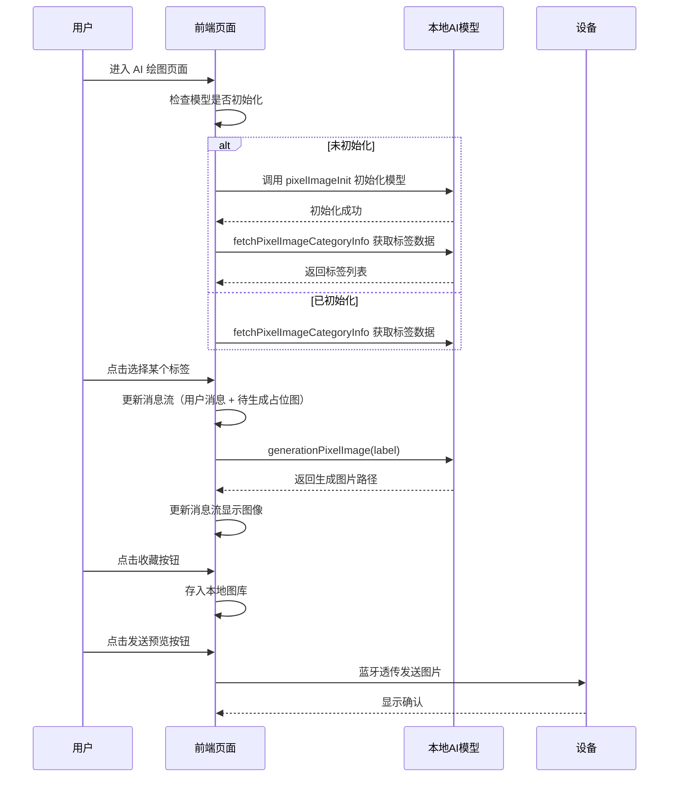

###### 动态数据集

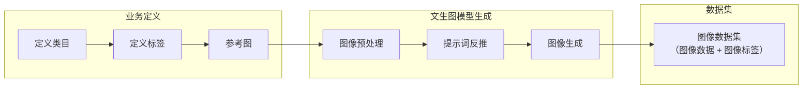

**自定义像素图数据集流程说明：**

- 定义类目：例如水果类目，表情类目。
- 定义标签：例如牛油果。
- 参考图：选择像素风格的图像作为参考图。
- 图像预处理：抠图处理，保留主体部分画面。
- 提示词反推：将图像反推提示词，得到文生图的提示词。
- 图像生成：利用提示词批量生成图像。
- 图像数据集：包括图像数据和图像标签。

###### 模块工作原理

模块核心基于以下逻辑：

###### 1. 本地 AI 模型初始化

进入页面时：
```ts
if (!hasModelInit) {
  pixelImageInit(); // 初始化本地 AI 模型
  fetchPixelImageCategoryInfo(); // 拉取标签
}
```
###### 2. 拉取标签列表

本地模型初始化完成后，会返回可用标签：
```ts
const labelInfo = await fetchPixelImageCategoryInfo();
dispatch(updateLabelAsync(labelInfo));
```
###### 3. 生成像素图

点击标签后，通过客户端本地模型生成图片：
```ts
generationPixelImage({
  deviceId: devInfo.devId,
  label,
  imageWidth: 462,
  imageHeight: 462,
  outImagePath: localPath,
});
```
###### 4. 更新对话消息流

模块以聊天形式展示生成过程：

- 添加用户消息

- 添加“生成中”占位消息

- 替换为真实图像内容

```ts
updateMessages([...messages, newMsg]);
```
###### 5. 收藏与发送

**收藏：** 将图片路径加入本地图库存储。

**发送到设备：** 通过蓝牙透传：

```ts
sendImageToDevice(path);
```
###### 蓝牙大数据传输

###### 功能介绍

蓝牙大数据传输模块用于实现 **将面板端的图像、像素图、动画素材等大体积数据，通过蓝牙分包方式稳定下发到设备**。模块支持上千字节的数据发送，并实现：

- 分包发送

- ACK 包确认机制

- 超时重传

- 发送进度回调

适用于带有像素屏、灯效屏、动画显示功能的 BLE 设备。

###### 功能说明

- 支持将面板侧的 base64 图像 转为 十六进制数据，再进行 BLE 分包传输。

- 按照协议将数据切片为固定大小（默认 1006 字节）。

- 通过 device.publishBLETransparentData 将每个分包透传给设备端。

- 支持设备返回确认包（ACK），客户端依次确认已接收分包。

- 支持失败分包重试（最高 5 次）。

- 支持透传过程进度实时上报。

###### 交互流程

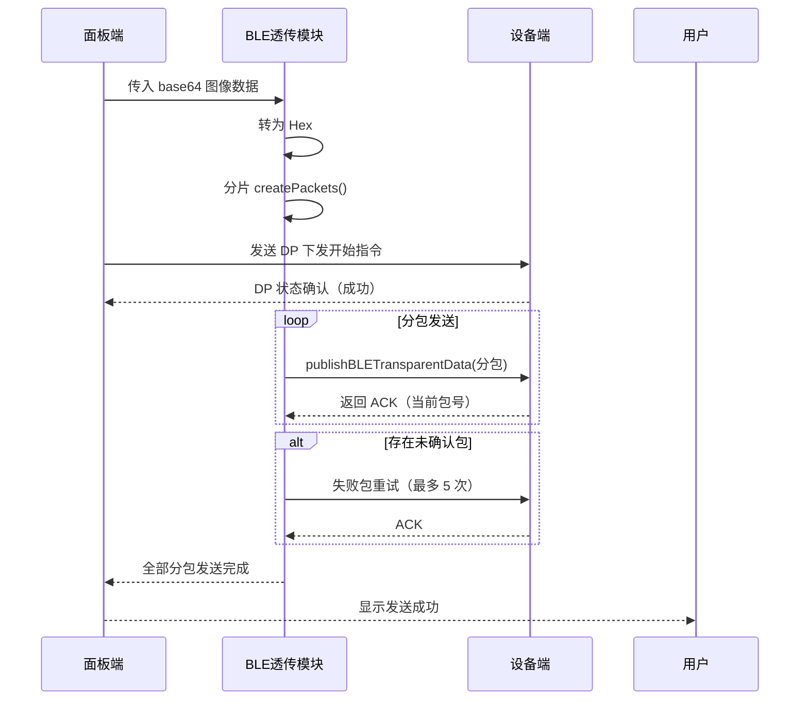

###### 数据发送流程

完整发送由 `sendPackets()` 完成：

###### （1）检查设备在线状态

``` ts
const isBleOnline = [...] // 判断 BLE 是否可用
```

###### （2）发送启动 DP
例如启动播放、提示设备进入接收状态：

```ts
sendDp(); // 发送 DP 指令
```

监听 dp 状态返回：

```ts
onDpDataChange(callback);
```
###### （3）监听设备 BLE 上报的 ACK
```ts
onBLETransparentDataReport(bleCallback);
```

解析 ACK：

```ts
parseConfirmation(res) {
  const index = parseInt(res.data.slice(12, 16), 16);
  return index;
}
```

###### （4）发送前 4 包（快速发送）

不等待确认，直接连发：
```ts
for (index < 4) publishFn(packets[index]);
```

###### （5）从第 5 包开始顺序发送并等待设备 ACK

```ts
await waitForConfirmation(index);
publishFn(packets[index]);
```

###### （6）补发失败包（最多 5 轮）
```ts
while (retries < 5) retryFailedPackets();
```
###### （7）发送完成

如果所有包都收到确认 → 返回成功

如果部分包仍未确认 → 返回失败
###### 蓝牙像素屏调试

###### 一、功能介绍

蓝牙像素屏调试模块旨在帮助开发者快速理解 **蓝牙像素屏（BLE Pixel Display）设备的工作原理、通信方式以及调试方法**。通过了解 MCU、蓝牙模组、串口通信方式与日志查看流程，开发者可以更高效地排查蓝牙透传数据问题，提升开发效率。

###### 二、设备介绍

以下为典型的蓝牙像素屏设备结构示意图：

蓝牙像素屏主要由两部分组成：

* **MCU（主控芯片）**：负责像素屏的绘图逻辑、内部渲染、屏幕驱动、指令解析等。
* **蓝牙模组（Tuya BLE Module）**：负责手机 App 与设备之间的 BLE 通信，是 MCU 和 App 之间的数据桥梁。

设备内部通信方式：

* **MCU** &lt;--&gt; **蓝牙模组**：通过 UART 串口通信（TX/RX）
* **蓝牙模组** &lt;--&gt; **手机 App**：通过无线 BLE 协议通信

整体架构图：

###### 三、设备调试方法

###### MCU 与电脑串口连接

若 MCU 支持日志输出，可通过 USB 转 TTL 工具将 MCU 的串口日志输出到电脑上，方便调试。

连接方式如下：

说明：

* **RX（接收）连接 MCU 的 TX（发送）**
* **TX（发送）连接 MCU 的 RX（接收）**

###### 四、日志查看工具

###### 1. SecureCRT 简介

SecureCRT 是一款适用于多协议的终端调试软件，支持 SSH / Telnet / 串口 Serial，多用于连接嵌入式设备、路由器、MCU 调试等。

在像素屏调试中，SecureCRT 用于：

* 查看 MCU 输出日志
* 查看蓝牙透传数据解析结果
* 观察 MCU 是否正确接收到面板下发的数据

###### 2. 串口调试步骤

###### ① 新建 Session

File → New Session 或 File → Quick Connect

###### ② 选择协议：Serial

###### ③ 填写串口参数（推荐值）

| 参数           | 推荐值                  | 说明          |
| ------------ | -------------------- | ----------- |
| Port         | 根据系统（COM7 / ttyUSB0） | USB 转串口自动分配 |
| Baud rate    | **115200**           | MCU 调试常用波特率 |
| Data bits    | 8                    | 标准值         |
| Parity       | None                 | 无校验         |
| Stop bits    | 1                    | 标准值         |
| Flow control | None                 | 不推荐开启       |

###### ④ 点击 Connect 查看日志

连接成功后即可看到 MCU 输出日志：

###### 五、蓝牙像素屏图像数据下发调试

在蓝牙像素屏开发中，面板通过 BLE 大数据透传的方式下发图像数据。调试重点在于：

###### 1. 确认面板是否正确发送了透传数据

* 观察 App 侧日志（控制台或上传日志）
* 检查分包是否符合协议格式
* 确认是否收到设备 ACK 回包

###### 2. MCU 是否收到正确的透传数据

* 观察 MCU 串口显示的透传包内容
* 校验接收到的包头、包序号、数据长度是否一致

###### 3. MCU 是否正确解析并渲染像素图

* 查看 MCU 侧是否输出渲染成功/失败日志
* 确认显示效果是否与面板预览一致

通过串口日志可快速排查以下问题：

* BLE 是否丢包
* 分包顺序是否错误
* MCU 是否正确解析图像协议
* 屏幕绘图是否出现异常

###### 六、调试建议

* 若设备未响应 ACK，检查蓝牙模组是否进入接收模式
* 若 MCU 收到的数据长度不正确，需检查 App 分包逻辑
* 若 MCU 显示乱码，多为 base64 → hex → bytes 转换问题
* 若像素图显示偏色/错位，确认 MCU 的像素渲染格式（RGB / GRB / 行列顺序）

###### 七、总结

蓝牙像素屏调试包含三个关键步骤：

1. **保证串口正常输出，方便查看 MCU 日志**
2. **使用 SecureCRT 分析 MCU 与蓝牙模组之间的通信情况**
3. **结合蓝牙透传模块的分包/回包机制排查数据下发流程**

通过掌握上述流程开发者能够更高效地调试 BLE 像素屏设备，这有助于面板开发过程中问题的排查, 开发同学可以通过查看输出日志快速定位并解决问题, 以提高开发效率。
