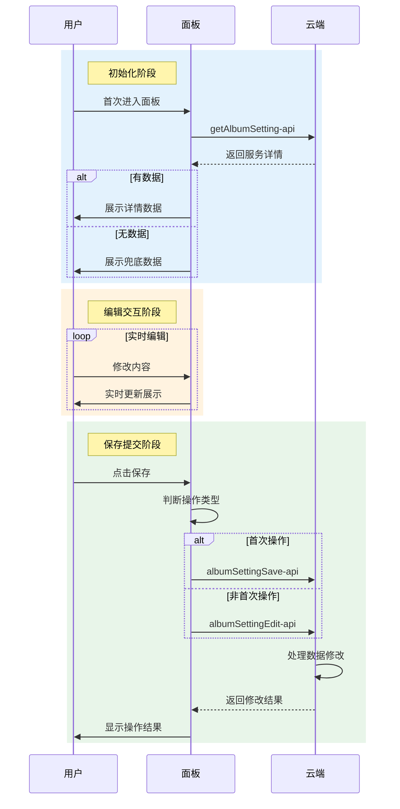
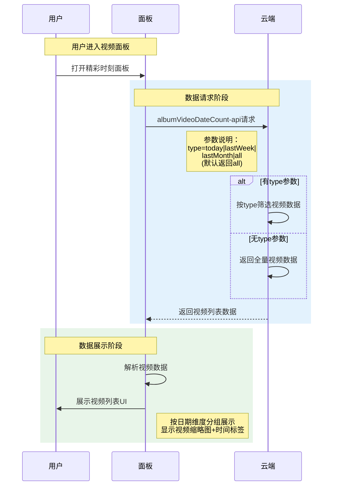
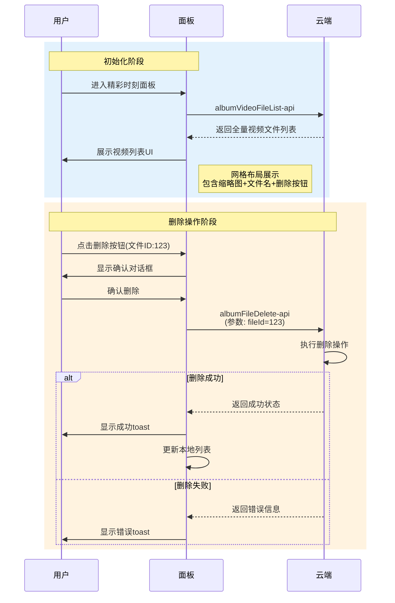
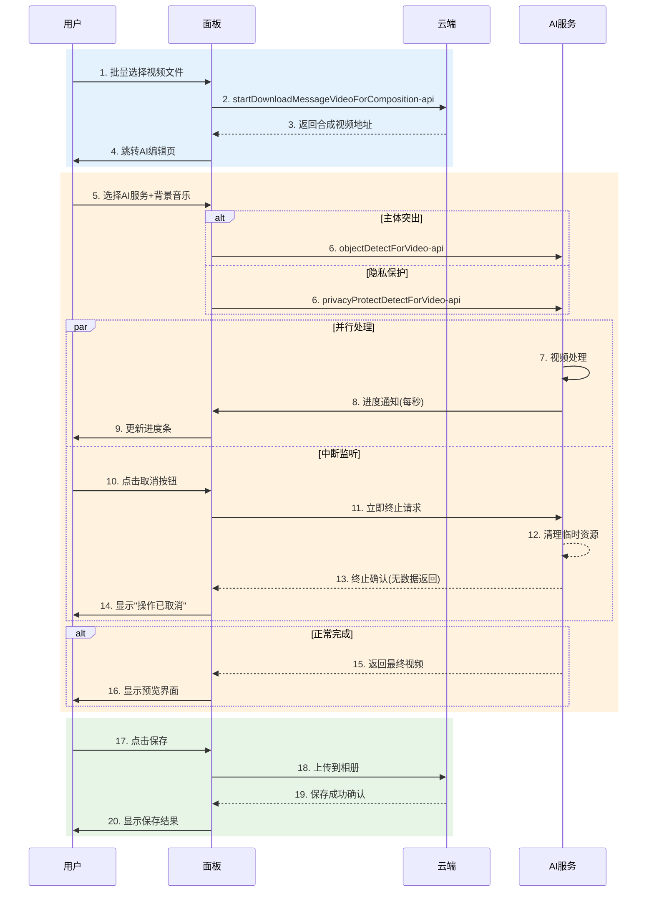
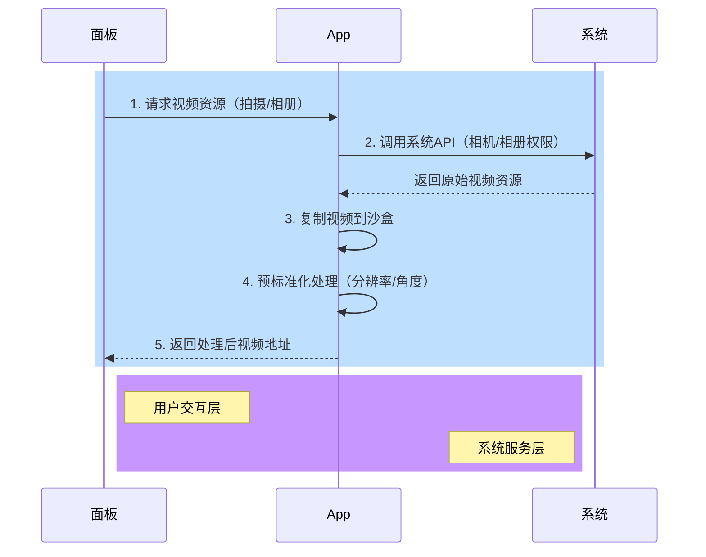
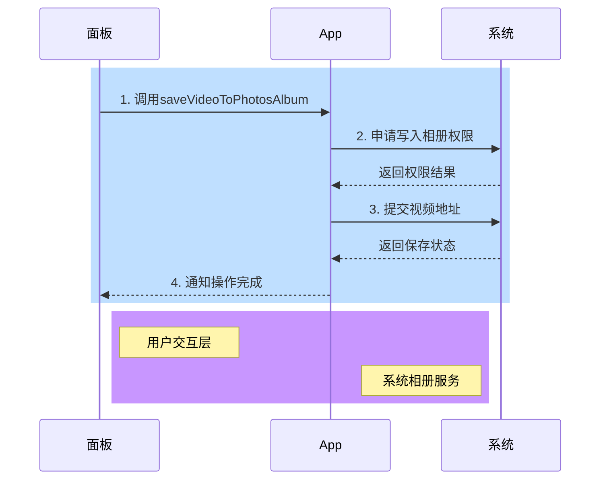
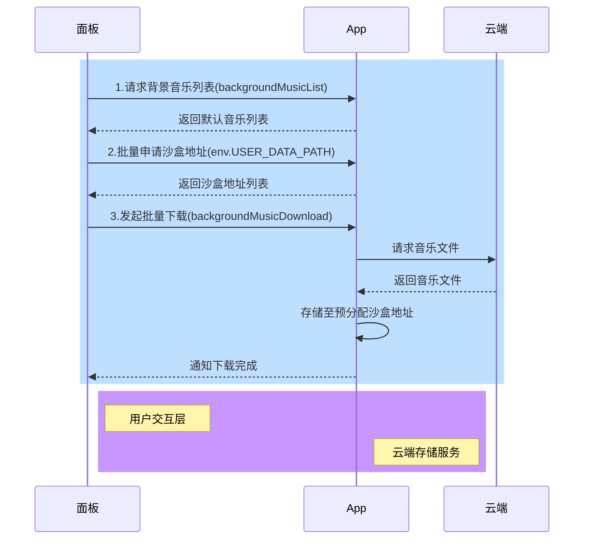
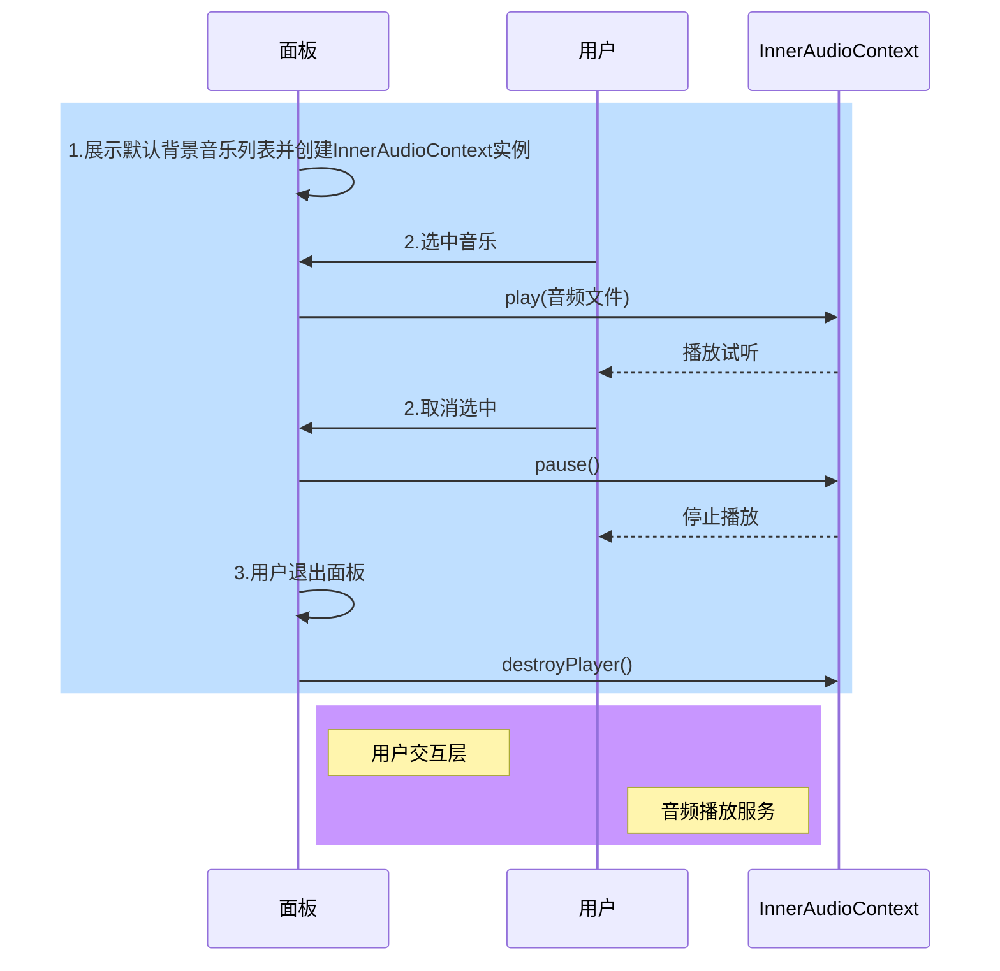
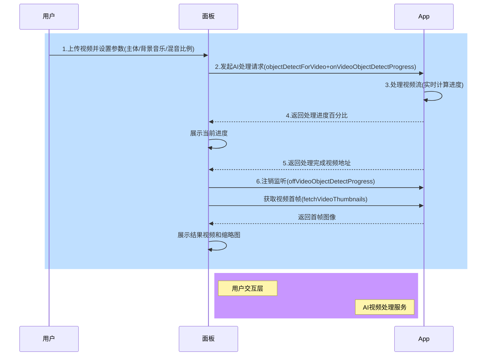

# 视频解决方案 (video-solution)

[AI-generated summary: 涂鸦AI视频解决方案文档，介绍基于IPC设备的精彩时刻功能和On-App AI赋能能力，包括视频主体突出、隐私保护等AI增值服务。覆盖内容：getStorageSecret、bindDevice、getCameraList、getDeviceDetailsById、getServiceDetail、albumFileDelete、albumSettingSave、albumVideoDateCount、albumVideoFileDetail、albumVideoFileList、getAlbumSetting、visualBoxEventCheck、getPresetEvent、getVisualBoxList、BaseKit、MiniKit、DeviceKit、BizKit、AIKit]

## IPC 精彩时刻通用方案

<h2 id="IPC 精彩时刻通用方案">IPC 精彩时刻通用方案</h2>

##### 方案介绍

IPC 精彩时刻功能，是涂鸦云开发者平台为所有带摄像头的智能硬件，专门打造的“AI 视频增值服务”，具体运转机制为：通过 AI 大模型自动识别预设的目标或自定义事件后，就能抓取摄像头中的精彩片段（如宠物卖萌互动、宝宝第一次走路、日出日落等），并一键生成带特效的专属 Vlog。能够满足婴儿/宠物看护、生活娱乐、风景旅行等全场景需求，帮助用户轻松记录生活中的高光时刻！

##### On-App AI 赋能

为了帮助用户提高视频剪辑效率，涂鸦在 IPC 精彩时刻功能中，专门提供了丰富的 AI 能力模块，支持用户对视频进行二次处理。目前主要包括：对视频流主体进行 AI 突出、对视频隐私部分进行 AI 一键保护。

1. **视频流主体突出**：通过移动端AI实时识别画面主体，采用图像算法对目标区域进行自适应放大，完成编码封装后输出优化视频；

2. **视频流隐私保护**：精准识别画面中的特定对象，按需保留/处理不同区域，生成符合隐私要求的视频流；

##### 核心亮点

- **精准捕捉**：涂鸦支持用户预设 IPC 所需捕捉的目标，如婴儿、猫、狗、鸟等；也可以自定义事件，如让智能 IPC 设备观察“门口人流量变化”、抓取“花盆开花的瞬间”等等。搭载强大的 AI 大模型，不仅能全天候抓捕关键画面，还支持定时抓拍设置（即在每天指定的时间点，实现自动抓拍）；
- **一键生成**：涂鸦支持自动合成当天或 7 天内的精彩视频集锦，用户也可以快速预览该时间段内的历史视频集锦；
- **硬件零成本**：用户无需升级摄像头硬件，就能即时享受该功能：付费后，用户将涂鸦公版 App 升级到 V6.4.0+ 版本即可自动开通，老设备也能秒变“智能神器”；

##### 应用场景

| 场景化案例 | 方案简述                                                                                                                   |
| ---------- | -------------------------------------------------------------------------------------------------------------------------- |
| 母婴品牌商 | 帮助无法时刻陪伴在身边、或抽不出空闲时间整理宝宝成长片段的家长，自动生成“宝宝每日精彩集锦”                                 |
| 宠物医院   | 针对铲屎官需要了解宠物日常行为记录的需求，该功能可以基于 AI 行为分析，以“周”为时间节点，自动剪辑合成"爱宠健康监管周报"视频 |
| 物业公司   | 可实时展示小区环境变化，并自动剪辑生成“园区四季景观延时视频”，打造更具吸引力的居住环境效果展示                             |
#### 商务依赖

产品商务合作依照涂鸦增值服务商务流程执行。

> 如需了解更多关于 AI 能力的内容，请联系您的项目经理或 [提交工单](https://service.console.tuya.com/8/3/list?source=support_center) 咨询。

#### 开发依赖

##### 小程序开发

1. **App 依赖**：涂鸦、智能生活 App 版本为 6.5.0 及以上；
2. **On-App AI依赖**：视频主体突出方案、视频隐私保护方案：

- 视频主体突出方案介绍，可查阅[视频主体突出方案详情](https://developer.tuya.com/cn/miniapp/solution-ai/ability/video-solution/aiVideoHighlight/overview)
- 视频隐私保护方案介绍，可查阅[视频隐私保护方案详情](https://developer.tuya.com/cn/miniapp/solution-ai/ability/video-solution/aiVideoPrivacyProtection/overview)

##### 设备 SDK 开发

涂鸦 AI 视频流方案基于涂鸦 IPC 功能基础。使用视频流 AI 方案，需要先对接 IPC SDK，设备端方案请参考 [IPC_SDK 开发](https://developer.tuya.com/cn/docs/iot-device-dev/IPC_SDK?id=Kaqe10hg0htn5#title-15-%E5%AE%9E%E6%97%B6%E9%A2%84%E8%A7%88%E5%BC%80%E5%8F%91)。

### 能力集

###### 视频流通用接口

###### 获取解密密钥

- **功能**：以家庭维度获取文件解密密钥

- **接口详情**：[getStorageSecret](/cn/miniapp/develop/ray/api/highlight/common/getStorageSecret)

###### 关联设备

- **功能**：主要用于将精彩时刻服务与设备进行绑定或解绑。

- **接口详情**：[bindDevice](/cn/miniapp/develop/ray/api/highlight/device/bindDevice)

###### 获取家庭摄像头设备列表

- **接口详情**：[getCameraList](/cn/miniapp/develop/ray/api/highlight/device/getCameraList)

###### 查看单个设备设备详情

- **接口详情**：[getDeviceDetailsById](/cn/miniapp/develop/ray/api/highlight/device/getDeviceDetailsById)

###### 获取服务详情信息

- **接口详情**：[getServiceDetail](/cn/miniapp/develop/ray/api/highlight/service/getServiceDetail)

###### 精彩时刻相关接口

###### 删除精彩时刻录像文件

- **接口详情**：[albumFileDelete](/cn/miniapp/develop/ray/api/highlight/timeAlbum/albumFileDelete)

###### 保存精彩时刻配置

- **接口详情**：[albumSettingSave](/cn/miniapp/develop/ray/api/highlight/timeAlbum/albumSettingSave)

###### 获取精彩时刻智能视频日期统计数据

- **接口详情**：[albumVideoDateCount](/cn/miniapp/develop/ray/api/highlight/timeAlbum/albumVideoDateCount)

###### 获取精彩时刻录像文件详情

- **接口详情**：[albumVideoFileDetail](/cn/miniapp/develop/ray/api/highlight/timeAlbum/albumVideoFileDetail)

###### 获取精彩时刻录像文件列表

- **接口详情**：[albumVideoFileList](/cn/miniapp/develop/ray/api/highlight/timeAlbum/albumVideoFileList)

###### 获取精彩时刻配置详情

- **接口详情**：[getAlbumSetting](/cn/miniapp/develop/ray/api/highlight/timeAlbum/getAlbumSetting)

###### 综合服务接口

###### 视觉魔方自定义语义校验

- **接口详情**：[visualBoxEventCheck](/cn/miniapp/develop/ray/api/highlight/visionBox/visualBoxEventCheck)

###### 查询智能视觉魔方列表预置事件

- **接口详情**：[getPresetEvent](/cn/miniapp/develop/ray/api/highlight/visionBox/getPresetEvent)

###### 查询智能视觉魔方列表（关联服务）

- **接口详情**：[getVisualBoxList](/cn/miniapp/develop/ray/api/highlight/visionBox/getVisualBoxList)
###### 教程内容

###### 基础入门开发

关于如何入门小程序面板开发，如果您是第一次接触小程序，请参考本教程开始入手 [详情](https://developer.tuya.com/cn/miniapp-codelabs/codelabs/ray-guide/index.html#0)。

###### IPC 精彩时刻通用方案模板

关于如何开发IPC 精彩时刻通用方案模板，请参考 [详情](https://developer.tuya.com/cn/miniapp-codelabs/codelabs/panel-ipc-highlights/index.html#0)。
###### 关键依赖模块

- **App 版本：**

  - 涂鸦 App、智能生活 App v6.6.0 及以上版本

- **Kit 依赖：**

  - BaseKit: v3.0.6
  - MiniKit: v3.0.1
  - DeviceKit: v4.0.8
  - BizKit: v4.2.0
  - AIKit: v1.2.0
  - baseversion: v2.26.7

- **组件依赖：**

  - @ray-js/panel-sdk: "^1.13.5"
  - @ray-js/ray: "1.7.9"
  - @ray-js/smart-ui: "^2.1.4"
  - @ray-js/cli: "^1.6.14"
###### 概述

IPC 精彩时刻模板是为了降低开发者接入 IPC 精彩时刻通用方案的难度，整理了通用的视频处理能力并对外提供相应的示例源码。

###### 模板主要涵盖功能

- **精彩时刻服务设置：**
  - 服务名称修改
  - 设备关联
  - 服务开关
  - 定时拍摄
  - 智能拍摄

- **精彩时刻主功能：**
  - 精彩时刻智能相册（近一周、近一个月、近一年视频集合，支持视频下载）
  - 精彩时刻全量相册（精彩时刻全量视频片段，支持视频下载、AI编辑、删除）
  - AI 二次编辑（视频主体突出、视频隐私保护）

###### 附录

- [模板文档](https://developer.tuya.com/cn/miniapp-codelabs/codelabs/panel-ipc-highlights/index.html#0)
- [物料仓库](https://developer.tuya.com/material/library_oHEKLjj0/)

### 模块集

###### 服务详情设置

###### 功能介绍

1. 精彩时刻服务详情主要包含以下信息：服务名称、服务开启状态、服务关联设备（最多可关联5个设备）、定时拍摄、智能拍摄

2. 精彩时刻服务详情设置，主要依赖以下3个关键能力：

- **获取精彩时刻服务配置信息**  
   开发者可通过 [getAlbumSetting](/cn/miniapp/develop/ray/api/highlight/timeAlbum/getAlbumSetting) API 获取精彩时刻服务的详细配置信息。

- **保存精彩时刻服务配置信息**  
   首次配置精彩时刻服务信息时，开发者可通过 [albumSettingSave](/cn/miniapp/develop/ray/api/highlight/timeAlbum/albumSettingSave) API 保存精彩时刻服务的详细配置信息。

- **编辑精彩时刻服务配置信息**  
   首次配置完成后，开发者可通过 [albumSettingEdit](/cn/miniapp/develop/ray/api/highlight/timeAlbum/albumSettingSave) API 二次编辑精彩时刻服务的详细配置信息。

###### 交互流程



###### 注意事项

- 1.**数据兜底处理**
- 必须处理初始化时无数据的场景，返回合理的默认值

  - 建议采用如下兜底策略：

```javascript
    const defaultSettings = {
      // 默认参数配置
    };
```

- 2. **保存策略区分**
     | 操作阶段 | 使用接口 |
     |----------------|--------------------------|
     | 首次初始化 | albumSettingSave-api |
     | 后续更新 | albumSettingEdit-api |
###### 精彩时刻智能相册

###### 功能介绍

1. 精彩时刻智能相册主要包含以下内容：当日 AI 智能剪辑视频、近一周 AI 智能剪辑视频、近一个月 AI 智能剪辑视频、全量 AI 智能剪辑视频；

2. 精彩时刻服务详情设置，主要依赖下述关键能力：

- **获取精彩时刻服务配置信息**  
   开发者可通过 [albumVideoDateCount](/cn/miniapp/develop/ray/api/highlight/timeAlbum/albumVideoDateCount) API 以日期统计维度获取精彩时刻智能视频。

###### 交互流程


###### 精彩时刻全量相册

###### 功能介绍

1. 精彩时刻全量相册主要包含以下内容：精彩时刻全量视频片段，支持视频下载、AI编辑、删除；

2. 精彩时刻服务详情设置，主要依赖以下2个关键能力：

- **获取精彩时刻文件列表**  
   开发者可通过 [albumVideoFileList](/cn/miniapp/develop/ray/api/highlight/timeAlbum/albumVideoFileList) API 获取精彩时刻全量视频文件列表。

- **删除精彩时刻视频文件**  
   首次配置精彩时刻服务信息时，开发者可通过 [albumFileDelete](/cn/miniapp/develop/ray/api/highlight/timeAlbum/albumFileDelete) API 保存精彩时刻视频文件。

###### 交互流程


<h2 id="精彩时刻视频 AI 编辑">精彩时刻视频 AI 编辑 <span className="tag_h2">On-App AI</span></h2>

###### 功能介绍

1. 精彩时刻视频 AI 编辑主要包含以下内容：

- 视频云端下载至本地；
- 视频主体突出 AI 编辑；
- 视频隐私保护 AI 编辑；
- 视频背景音乐自定义；

2. 精彩时刻视频 AI 编辑，主要依赖下述关键能力：

- **下载云端视频**  
   开发者可通过 [startDownloadMessageVideoForComposition](/cn/miniapp/develop/ray/api/ai/aiKit/startDownloadMessageVideoForComposition) API 将需要编辑的云端视频下载到本地。

- **获取精彩时刻服务配置信息**  
   开发者可通过 [objectDetectForVideo](/cn/miniapp/develop/ray/api/ai/aiKit/objectDetectForVideo) API 将待编辑视频进行主体突出 AI 编辑。

- **获取精彩时刻服务配置信息**  
   开发者可通过 [privacyProtectDetectForVideo](/cn/miniapp/develop/ray/api/ai/aiKit/privacyProtectDetectForVideo) API 将待编辑视频进行隐私保护 AI 编辑。

###### 交互流程



## 视频主体突出方案

<h2 id="视频主体突出方案">视频主体突出方案 <span className="tag_h2">On-App AI</span></h2>

##### 痛点分析

当前监控系统存在显著问题：

- **主体占比过低**：广角镜头配合高位安装，导致拍摄主体在画面中占比不足；
- **细节辨识困难**：关键主体因尺寸过小而无法清晰识别；


##### 解决方案

1. **目标检测**：通过移动端AI实时识别画面主体；
2. **智能放大**：采用图像算法对目标区域进行自适应放大；
3. **视频处理**：完成编码封装后输出优化视频；


##### 核心优势

- **精准聚焦**：自动识别并突出画面主体；
- **智能处理**：全流程自动化无需人工干预；
- **高效运算**：适配主流移动端计算能力；

##### 应用场景

| 场景类型 | 典型应用          |
| -------- | ----------------- |
| 家庭监护 | 婴儿看护/宠物监控 |
| 户外记录 | 喂鸟器/狩猎摄像机 |
| 自然观测 | 日出日落记录      |
#### 商务依赖

产品商务合作依照涂鸦增值服务商务流程执行。

> 如需了解更多关于 AI 能力的内容，请联系您的项目经理或 [提交工单](https://service.console.tuya.com/8/3/list?source=support_center) 咨询。

#### 开发依赖

##### 小程序开发

1. **App 依赖**：涂鸦智能、智能生活App版本为 6.5.0 及以上；
2. **小程序模板依赖**：视频流隐私保护 API 集成于 IPC 精彩时刻小程序模板

- IPC 精彩时刻通用方案介绍，可查阅[IPC 精彩时刻通用方案介绍](https://developer.tuya.com/cn/miniapp/solution-ai/ability/video-solution/ipcHighlights/overview)
- IPC 精彩时刻小程序模板相关开发细则请参考[IPC 精彩时刻小程序模板接入指南](https://developer.tuya.com/cn/miniapp-codelabs/codelabs/panel-ai-video-highlight/index.html#0)

##### 设备 SDK 开发

涂鸦 AI 视频流方案基于涂鸦智能 IPC 功能基础。使用视频流 AI 方案，需要先对接 IPC SDK，设备端方案请参考 [IPC_SDK 开发](https://developer.tuya.com/cn/docs/iot-device-dev/IPC_SDK?id=Kaqe10hg0htn5#title-15-%E5%AE%9E%E6%97%B6%E9%A2%84%E8%A7%88%E5%BC%80%E5%8F%91)。

### 能力集

###### 视频文件导入导出能力

###### 导入本地视频资源

- **功能**：主要支持 C 端用户通过以下两种途径进行视频素材的导入：

- 1.直接唤醒手机相机录制视频素材。
- 2.导入手机相册内已有视频素材。

- **接口详情**：[chooseMedia](https://developer.tuya.com/cn/miniapp/develop/ray/api/media/image/chooseMedia#choosemedia)

###### 视频预标准化处理

- **功能**：主要用于格式化源视频资源分辨率与角度，避免不同分辨率与角度造成后续AI处理流程中出现异常情况。

- **接口详情**：[clipVideo](/cn/miniapp/develop/ray/api/media/video/clipVideo)

###### 视频 AI 生成后导出

- **功能**：主要用于支持 C 端用户完成视频素材编辑后将视频转存至手机相册。

- **接口详情**：[saveVideoToPhotosAlbum](https://developer.tuya.com/cn/miniapp/develop/ray/api/media/video/saveVideoToPhotosAlbum#savevideotophotosalbum)

###### 音频交互相关能力

###### 获取涂鸦默认背景音乐

- **功能**：目前模板提供部分默认背景音乐供开发者获取、使用，后续音乐内容将进行扩充。

- **接口详情**：[backgroundMusicList](/cn/miniapp/develop/ray/api/ai/aiKit/backgroundMusicList)

###### 下载涂鸦默认背景音乐

- **功能**：下载涂鸦在线背景音乐至app本地沙盒。

- **接口详情**：[backgroundMusicDownload](/cn/miniapp/develop/ray/api/ai/aiKit/backgroundMusicDownload)

###### 音乐资源控制实例

- **功能**：主要用于播放、暂停背景音乐，用于用户试听体验。

- **接口详情**：[createInnerAudioContext](https://developer.tuya.com/cn/miniapp/develop/ray/api/media/audio/createInnerAudioContext)

###### AI 视频流处理功能

<h3 id="创建 AI 视频流处理实例">创建 AI 视频流处理实例 <span className="tag_h2">On-App AI</span></h3>

- **功能**：初始化AI 视频流处理实例

- **接口详情**：[objectDetectCreate](/cn/miniapp/develop/ray/api/ai/aiKit/objectDetectCreate)

<h3 id="销毁 AI 视频流处理实例">销毁 AI 视频流处理实例 <span className="tag_h2">On-App AI</span></h3>

- **功能**：销毁AI 视频流处理实例，避免内存泄漏

- **接口详情**：[objectDetectDestroy](/cn/miniapp/develop/ray/api/ai/aiKit/objectDetectDestroy)

<h3 id="宠物\人像主体突出、视频流背景音乐编辑">宠物\人像主体突出、视频流背景音乐编辑 <span className="tag_h2">On-App AI</span></h3>

- **功能**：
  - 1.根据入参，对视频流中相应主体进行突出处理。
  - 2.根据背景音乐素材以及混音比例，为视频新增自定义背景音乐。

- **接口详情**：[objectDetectForVideo](/cn/miniapp/develop/ray/api/ai/aiKit/objectDetectForVideo)

<h3 id="取消视频流编辑操作">取消视频流编辑操作 <span className="tag_h2">On-App AI</span></h3>

- **功能**：中断正在进行中的AI 视频流处理操作

- **接口详情**：[objectDetectForVideoCancel](/cn/miniapp/develop/ray/api/ai/aiKit/objectDetectForVideoCancel)

<h3 id="AI 处理进度监听函数">AI 处理进度监听函数 <span className="tag_h2">On-App AI</span></h3>

- **功能**：监听目前AI 视频流的生成进度

- **接口详情**：[onVideoObjectDetectProgress](/cn/miniapp/develop/ray/api/ai/aiKit/onVideoObjectDetectProgress)

<h3 id="取消 AI 处理进度监听函数">取消 AI 处理进度监听函数 <span className="tag_h2">On-App AI</span></h3>

- **功能**：取消AI 视频流生成进度监听函数

- **接口详情**：[offVideoObjectDetectProgress](/cn/miniapp/develop/ray/api/ai/aiKit/offVideoObjectDetectProgress)
###### 教程内容

###### 基础入门开发

关于如何入门小程序面板开发，如果您是第一次接触小程序，请参考本教程开始入手 [详情](https://developer.tuya.com/cn/miniapp-codelabs/codelabs/ray-guide/index.html#0)。

###### AI 视频流主体突出

关于如何开发 AI 视频流主体突出功能示例模板，请参考 [详情](https://developer.tuya.com/cn/miniapp-codelabs/codelabs/panel-ai-video-highlight/index.html#0)。
###### 关键依赖模块

- **区域：**

  - 全区可用

- **App 版本：**

  - 涂鸦 App、智能生活 App v6.5.0 及以上版本

- **Kit 依赖：**

  - BaseKit: v3.0.6
  - MiniKit: v3.0.1
  - DeviceKit: v4.0.8
  - BizKit: v4.2.0
  - AIKit: v1.1.0
  - baseversion: v2.26.7

- **组件依赖：**

  - @ray-js/panel-sdk: "^1.13.1"
  - @ray-js/ray: "^1.6.29"
  - @ray-js/ray-error-catch: "^0.0.25"
  - @ray-js/smart-ui: "^2.1.5"
  - @ray-js/cli: "^1.6.1"
###### 概述

示例模板是为了降低开发者接入 App AI 的难度，整理了通用的视频处理能力并对外提供相应的示例源码。

###### 模板主要涵盖功能

- **视频基本交互功能：**
  - 视频导入
  - 视频导出
  - 视频首帧渲染
  - 视频播放暂停
  - 视频进度条

- **音频基础交互功能：**
  - 获取默认背景音乐
  - 展示默认背景音乐列表
  - 试听默认背景音乐

- **AI 视频流处理功能：**
  - 宠物主体突出（支持猫、狗、鸟等 80 余种动物）
  - 人像主体突出
  - 视频流添加背景音乐
  - 调节混音（视频原声、背景音乐）权重

###### 附录

- [模板文档](https://developer.tuya.com/cn/miniapp-codelabs/codelabs/panel-ai-video-highlight/index.html#0)
- [物料仓库](https://developer.tuya.com/material/library_oHEKLjj0/component?code=AIVideoHighlight)

### 模块集

###### 视频资源导入

###### 功能介绍

视频资源在初始化导入阶段依赖以下两个关键能力：

- 1.用户素材采集

  - [chooseMedia](https://developer.tuya.com/cn/miniapp/develop/ray/api/media/image/chooseMedia#choosemedia) :支持C端用户通过实时录制视频或从手机相册导入的方式，提交原始视频素材。

- 2.视频预标准化处理
  - [clipVideo](/cn/miniapp/develop/ray/api/media/video/clipVideo) :自动统一源视频的分辨率与角度，避免因格式差异导致后续AI视频生成流程出现异常。

###### 交互流程



###### 注意事项

- 1.在使用 **chooseMedia** API时，为更好的兼容IOS、安卓双端系统，请默认将参数 **isFetchVideoFile** 传入true;

- 2.在使用 **clipVideo** API时

  - （1）参数 **endTime** 的时间单位为毫秒，而 **chooseMedia** API返回的视频时长为妙，请注意单位转换;
  - （2）参数 **level** 表示目标视频的压缩分辨率等级：
    - 1 代表480*854 码率：1572*1000
    - 2 代表540*960 码率：2128*1000
    - 3 代表720*1280 码率：3145*1000
    - 4 代表1080*1920 码率：3500*1000
    - 为确保输出视频的清晰度，此入参建议选用4。
###### 导出视频资源

###### 功能介绍

生成的 AI 视频可通过 saveVideoToPhotosAlbum 方法一键导出，并自动保存至系统相册，方便用户后续查看或分享。

###### 交互流程


###### 获取本地音乐列表

###### 功能介绍

当前涂鸦为开发者提供了部分默认背景音乐资源，可直接获取并使用。我们将持续扩充音乐库内容，以满足更多场景需求。
默认背景音乐的获取与使用主要分为以下两个步骤：

1. **获取在线音乐地址**  
   开发者可通过 [backgroundMusicList](/cn/miniapp/develop/ray/api/ai/aiKit/backgroundMusicList) API 获取默认背景音乐的在线访问地址。

2. **下载至本地存储**  
   获取地址后，可组合使用系统环境变量[env](https://developer.tuya.com/cn/miniapp/develop/miniapp/api/base/env#tyenv)、[backgroundMusicDownload](/cn/miniapp/develop/ray/api/ai/aiKit/backgroundMusicDownload)API 将音乐文件下载至手机本地，供后续使用。

> 提示：我们建议开发者在下载完成后对音乐文件进行本地缓存管理，以优化用户体验。

###### 交互流程


###### 试听背景音乐

###### 功能介绍

方案样例提供 `LocalMusicList` 组件，用于：

- 背景音乐列表展示
- 背景音乐试听功能

音乐试听功能基于 `InnerAudioContext` 实例实现，支持完整的音频控制能力,请参考 [详情](https://developer.tuya.com/cn/miniapp/develop/ray/api/media/audio/InnerAudioContext);

###### `InnerAudioContext` 实例核心功能

**基础控制**

- 【InnerAudioContext.paly】：播放音频
- 【InnerAudioContext.pause】：暂停音频
- 【InnerAudioContext.stop】：停止音频
- 【InnerAudioContext.resume】：恢复播放
- 【InnerAudioContext.seek】：跳转到指定时间点（单位：秒）

**事件监听**

- 【InnerAudioContext.onTimeUpdate】：实时获取播放进度更新（注：进度数据由系统返回，iOS/Android可能存在差异）

**资源管理**

- 【InnerAudioContext.destroyPlayer】：支持手动销毁音频实例（建议在组件卸载时主动销毁）

###### 交互流程



###### 注意事项

- 1.单个页面建议复用同一个 `InnerAudioContext` 实例；

- 2.进度监听需考虑平台差异性；

- 3.及时销毁不再使用的实例；
<h2 id="AI 视频流处理能力">AI 视频流处理能力 <span className="tag_h2">On-App AI</span></h2>

###### 功能介绍

AI视频流处理能力主要提供两个核心功能模块：智能主体增强与智能音频处理。

###### 智能主体增强

- **功能描述**：支持对宠物、人像等特定主体的智能识别与视觉增强
- **交互方式**：
  - 用户可自主选择需要突出的主体类别
  - 系统自动完成目标跟踪与视觉优化处理

###### 智能音频处理

- **混音控制**：
  - 可视化音量调节界面
  - 原声/背景音乐比例可调（0-100%线性调节）
- **输出选项**：
  - 保留原声
  - 仅背景音乐
  - 混合音频输出

###### 交互流程



###### 注意事项

- 1.目前主体选择仅支持：宠物/人像两类；
- 2.混音比例范围：0%-100%（默认原视频声音与背景音乐各50%）；
- 3. **代码实践** 请参考 [视频流主体突出模板详情](https://developer.tuya.com/cn/miniapp-codelabs/codelabs/panel-ai-video-highlight/index.html#0)。

## 视频隐私保护方案

<h2 id="视频隐私保护方案">视频隐私保护方案 <span className="tag_h2">On-App AI</span></h2>

##### 痛点分析

当前家用监控场景面临的关键矛盾：

- 用户对隐私安全的高度需求 vs 视频记录功能的必要性
- 典型使用场景：
  - 仅需记录宠物活动，需屏蔽人物影像
  - 只需捕捉人员行为，需模糊家居环境


##### 解决方案

基于移动端 AI 的智能视觉处理方案：

1. **实时目标检测**：精准识别画面中的特定对象
2. **智能图像处理**：按需保留/处理不同区域
3. **视频合成输出**：生成符合隐私要求的视频流

##### 核心优势

- **逐帧智能分析**：基于深度学习的目标检测算法，逐帧检测视频主体；
- **智能处理**：区域智能分割技术，全流程自动化无需人工干预；
- **高效运算**：适配主流移动端计算能力；

##### 应用场景

| 场景     | 案例       | 功能概要                 |
| -------- | ---------- | ------------------------ |
| **家庭** | 宠物监护   | 追踪宠物，模糊人像       |
|          | 老人看护   | 监测活动，模糊护理场景   |
|          | 婴儿监控   | 记录行为，模糊背景       |
| **商业** | 智能会议室 | 跟踪讲者，模糊屏幕内容   |
|          | 零售分析   | 统计客流，模糊收银台     |
|          | 设备巡检   | 监控机器，模糊敏感区域   |
| **公共** | 社区安防   | 识别陌生人，模糊住户窗户 |
|          | 共享空间   | 统计使用，模糊个人物品   |
|          | 智能门禁   | 人脸识别，模糊过路人     |
#### 商务依赖

产品商务合作依照涂鸦增值服务商务流程执行。

> 如需了解更多关于 AI 能力的内容，请联系您的项目经理或 [提交工单](https://service.console.tuya.com/8/3/list?source=support_center) 咨询。

#### 开发依赖

##### 小程序开发

1. **App 依赖**：涂鸦、智能生活 App 版本为 6.5.0 及以上；
2. **小程序模板依赖**：视频流隐私保护 API 集成于 IPC 精彩时刻小程序模板

- IPC 精彩时刻通用方案介绍，可查阅[IPC 精彩时刻通用方案介绍](https://developer.tuya.com/cn/miniapp/solution-ai/ability/video-solution/ipcHighlights/overview)
- IPC 精彩时刻小程序模板相关开发细则请参考[IPC 精彩时刻小程序模板接入指南](https://developer.tuya.com/cn/miniapp-codelabs/codelabs/panel-ai-video-highlight/index.html#0)

##### 设备 SDK 开发

涂鸦 AI 视频流方案基于涂鸦 IPC 功能基础。使用视频流 AI 方案，需要先对接 IPC SDK，设备端方案请参考 [IPC_SDK 开发](https://developer.tuya.com/cn/docs/iot-device-dev/IPC_SDK?id=Kaqe10hg0htn5#title-15-%E5%AE%9E%E6%97%B6%E9%A2%84%E8%A7%88%E5%BC%80%E5%8F%91)。

### 能力集

###### AI 隐私保护功能

<h3 id="创建 AI 视频流处理实例">创建 AI 视频流处理实例 <span className="tag_h2">On-App AI</span></h3>

- **功能**：初始化AI 视频流处理实例

- **接口详情**：[objectDetectCreate](/cn/miniapp/develop/ray/api/ai/aiKit/objectDetectCreate)

<h3 id="销毁 AI 视频流处理实例">销毁 AI 视频流处理实例 <span className="tag_h2">On-App AI</span></h3>

- **功能**：销毁AI 视频流处理实例，避免内存泄漏

- **接口详情**：[objectDetectDestroy](/cn/miniapp/develop/ray/api/ai/aiKit/objectDetectDestroy)

<h3 id="宠物\人像主体突出、视频流背景音乐编辑">视频隐私保护识别处理 <span className="tag_h2">On-App AI</span></h3>

- **功能**：根据输入参数，对视频流中的指定主体进行展示，并对非主体区域做马赛克/遮罩处理。

- **接口详情**：[privacyProtectDetectForVideo](/cn/miniapp/develop/ray/api/ai/aiKit/privacyProtectDetectForVideo)

<h3 id="取消视频流编辑操作">取消视频流编辑操作 <span className="tag_h2">On-App AI</span></h3>

- **功能**：中断正在进行中的AI 视频流处理操作

- **接口详情**：[objectDetectForVideoCancel](/cn/miniapp/develop/ray/api/ai/aiKit/objectDetectForVideoCancel)

<h3 id="AI 处理进度监听函数">AI 处理进度监听函数 <span className="tag_h2">On-App AI</span></h3>

- **功能**：监听目前AI 视频流的生成进度

- **接口详情**：[onVideoObjectDetectProgress](/cn/miniapp/develop/ray/api/ai/aiKit/onVideoObjectDetectProgress)

<h3 id="取消 AI 处理进度监听函数">取消 AI 处理进度监听函数 <span className="tag_h2">On-App AI</span></h3>

- **功能**：取消AI 视频流生成进度监听函数

- **接口详情**：[offVideoObjectDetectProgress](/cn/miniapp/develop/ray/api/ai/aiKit/offVideoObjectDetectProgress)
###### 关键依赖模块

- **区域：**

  - 全区可用

- **App 版本：**

  - 涂鸦 App、智能生活 App v6.6.0 及以上版本

- **Kit 依赖：**

  - BaseKit: v3.0.6
  - MiniKit: v3.0.1
  - DeviceKit: v4.0.8
  - BizKit: v4.2.0
  - AIKit: v1.2.0
  - baseversion: v2.26.7

- **组件依赖：**

  - @ray-js/panel-sdk: "^1.13.5"
  - @ray-js/ray: "^1.7.5"
  - @ray-js/smart-ui: "^2.1.5"
  - @ray-js/cli: "^1.6.14"
###### 概述

基于 On-App AI，我们为开发者提供高性价比的视频隐私保护方案，通过AI技术精准显示目标主体并自动模糊敏感区域，兼顾视频信息获取与隐私安全需求。

###### 模板主要涵盖功能

- **AI 视频流处理功能：**
  - 视频主体突出、环境遮罩
  - 视频流添加背景音乐
  - 调节混音（视频原声、背景音乐）权重
