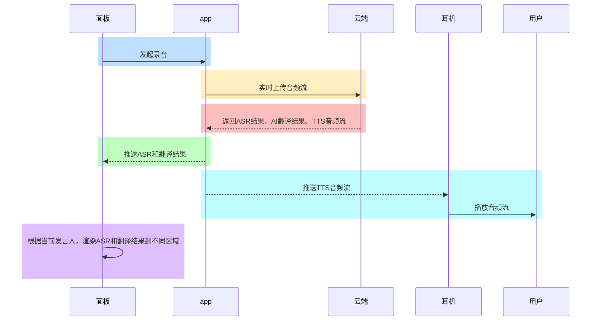
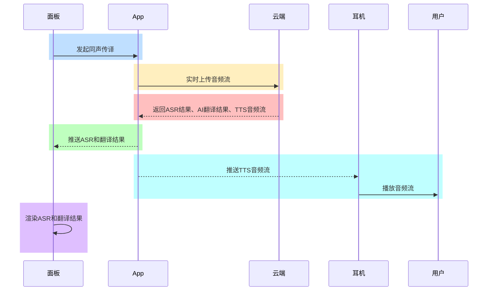
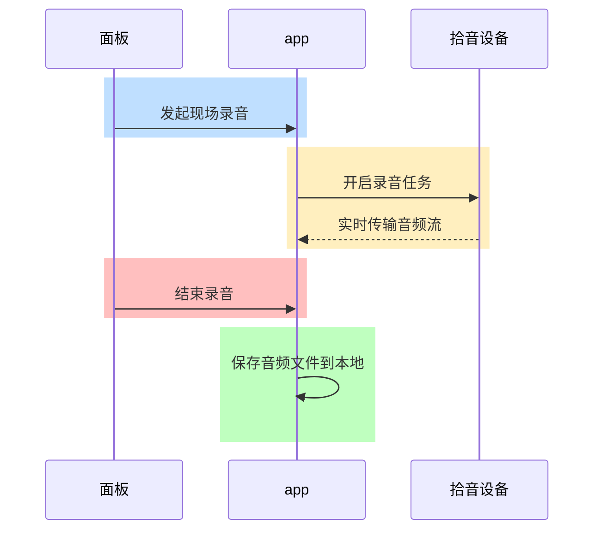
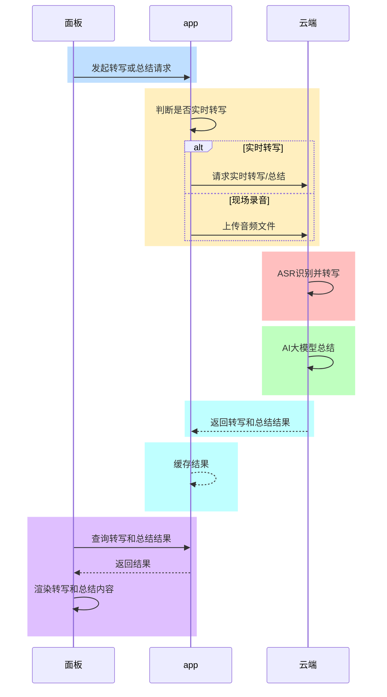
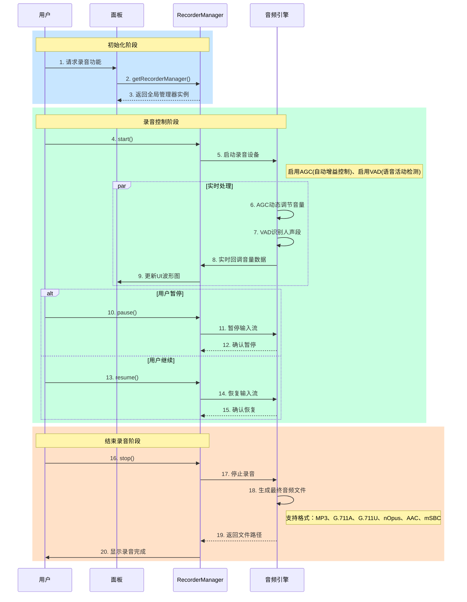
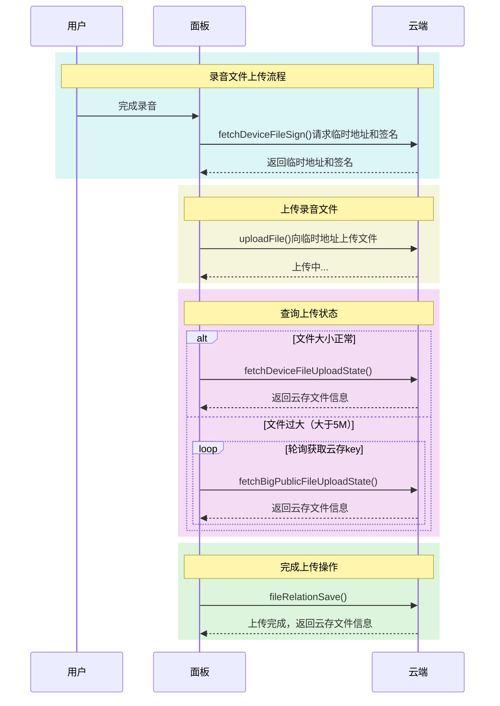
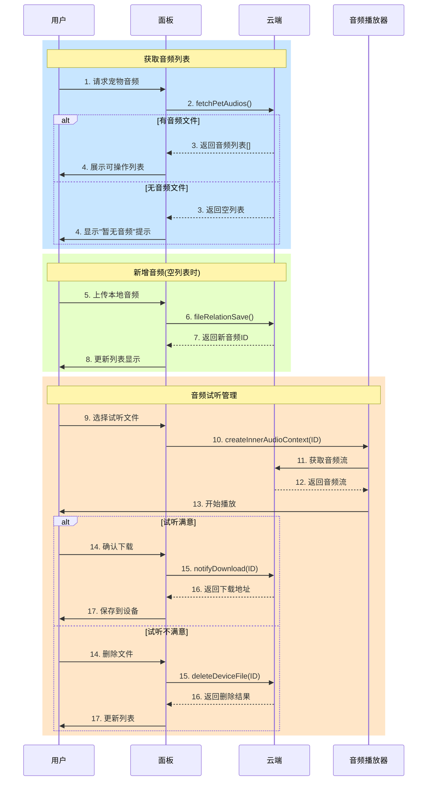

# 音频解决方案 (voice-solution)

[AI-generated summary: 本文档详细介绍了Tuya Miniapp Ray平台的音频AI解决方案，涵盖音频录制、实时转写、翻译和AI总结等功能。该方案支持面对面翻译、同声传译和现场录音等多种应用场景，为开发者提供完整的API和事件监听能力。覆盖内容：startRecordTransfer,pauseRecordTransfer,resumeRecordTransfer,stopRecordTransfer,getRecordTransferResultList,updateRecordTransferResult,removeFileList,getRecordTransferRealTimeResult,saveRecordTransferRecognizeResult,saveRecordTransferSummaryResult,processRecordTransferResult,getRecordTransferSummaryResult,recordTransferTask,onRecordTransferStatusUpdateEvent]

## 耳机解决方案

#### 耳机解决方案

##### 概述

该方案结合多种AI模型，支持同声传译、面对面翻译、现场会议等多样化应用场景。通过蓝牙等方式将音频数据实时传输至App端，App可实现语音转文字、实时翻译、AI智能总结等功能。开发者可通过简单易用的API，快速集成音频转写、翻译与总结能力，满足跨语言交流、会议记录、内容归纳等智能化需求，大幅提升产品的交互体验与智能水平。

##### 应用场景

- **面对面翻译**：智能耳机或卡片等音频设备将双方对话的音频数据实时传输到App端，利用ASR技术进行语音转文字，并结合AI模型实现多语言互译。识别和翻译结果可通过文字、语音的方式即时反馈给用户，帮助用户在跨语言交流场景下实现高效、自然的沟通体验，广泛适用于商务洽谈、出国旅行等场景。

- **同声传译**：通过智能耳机等录音设备，实时采集讲话者的音频数据并传输至App端，利用ASR技术将语音内容转写为文字，并结合AI模型实现同步翻译。app可将识别和翻译结果以文字及语音的形式实时反馈给用户，实现边说边译的同声传译体验。该能力适用于国际会议、学术交流、外语培训等需要多语言实时沟通的场景，大幅提升跨语言交流的效率和便捷性。

- **现场录音**：支持在会议现场通过耳机、卡片等录音设备实时采集多方发言音频，并将音频数据传输至App端。App可对会议内容进行语音转文字、AI智能总结，帮助用户高效记录会议纪要、归纳重点内容，提升会议管理与信息整理的智能化水平，适用于企业会议、学术研讨、培训讲座等多种场景。
#### 产品 AI 功能开发

为了助力开发者高效实现 AI 应用的落地，涂鸦开发者平台提供了多样化的支持，包括适用于不同品类的标准化 AI 功能、丰富的智能体模板、以及便捷的面板投放工具，从多个维度全面保障产品的 AI 应用快速落地。了解更多详情，请参考 [产品 AI 功能开发](https://developer.tuya.com/cn/docs/iot/AI-feature?id=Keapy1et1fc63)。

> 如需了解更多关于 AI 能力的内容，请联系您的项目经理或 [提交工单](https://service.console.tuya.com/8/3/list?source=support_center) 咨询。

#### 前置依赖

##### 小程序开发

1. **App 依赖**：涂鸦智能、智能生活App版本为 6.5.0 及以上；
2. **小程序模板依赖**：相关 API 集成于[AI 耳机模板](https://developer.tuya.com/material/library_hKiOVClc/component?code=AiEarphoneTemplate)

### 能力集

##### API

###### 音频操作

######  开始录音

- **含义**：开始录音
- **接口详情**：[startRecordTransfer](/cn/miniapp/develop/ray/api/ai/wear/recordOpt/startRecordTransfer)

###### 暂停录音

- **含义**：暂停录音
- **接口详情**：[pauseRecordTransfer](/cn/miniapp/develop/ray/api/ai/wear/recordOpt/pauseRecordTransfer)

###### 恢复录音

- **含义**：恢复录音
- **接口详情**：[resumeRecordTransfer](/cn/miniapp/develop/ray/api/ai/wear/recordOpt/resumeRecordTransfer)

###### 停止录音

- **含义**：停止录音
- **接口详情**：[stopRecordTransfer](/cn/miniapp/develop/ray/api/ai/wear/recordOpt/stopRecordTransfer)

###### 音频文件相关操作

###### 获取录音转写列表

- **含义**：获取录音转写列表
- **接口详情**：[getRecordTransferResultList](/cn/miniapp/develop/ray/api/ai/wear/recordFileOpt/getRecordTransferResultList)

###### 更新录音文件信息

- **含义**：更新录音文件信息，比如文件名称等
- **接口详情**：[updateRecordTransferResult](/cn/miniapp/develop/ray/api/ai/wear/recordFileOpt/updateRecordTransferResult)

###### 批量删除录音文件

- **含义**：批量或者单个删除录音文件
- **接口详情**：[removeFileList](/cn/miniapp/develop/ray/api/ai/wear/recordFileOpt/removeFileList)

###### 转写和总结

###### 获取实时转写数据

- **含义**：获取实时转写数据
- **接口详情**：[getRecordTransferRealTimeResult](/cn/miniapp/develop/ray/api/ai/wear/aboutTransfer/getRecordTransferRealTimeResult)

###### 保存转写结果

- **含义**：保存转写结果
- **接口详情**：[saveRecordTransferRecognizeResult](/cn/miniapp/develop/ray/api/ai/wear/aboutTransfer/saveRecordTransferRecognizeResult)

###### 保存总结结果

- **含义**：保存总结结果
- **接口详情**：[saveRecordTransferSummaryResult](/cn/miniapp/develop/ray/api/ai/wear/aboutTransfer/saveRecordTransferSummaryResult)

###### 更新实时转写结果

- **含义**：更新实时转写结果
- **接口详情**：[saveRecordTransferRealTimeRecognizeResult](/cn/miniapp/develop/ray/api/ai/wear/aboutTransfer/saveRecordTransferRealTimeRecognizeResult)

###### 查询转写状态

- **含义**：查询转写状态
- **接口详情**：[getRecordTransferProcessStatus](/cn/miniapp/develop/ray/api/ai/wear/aboutTransfer/getRecordTransferProcessStatus)

###### 查询转写结果

- **含义**：查询转写结果
- **接口详情**：[getRecordTransferRecognizeResult](/cn/miniapp/develop/ray/api/ai/wear/aboutTransfer/getRecordTransferRecognizeResult)

###### 对录音记录进行转写总结

- **含义**：对录音记录进行转写总结
- **接口详情**：[processRecordTransferResult](/cn/miniapp/develop/ray/api/ai/wear/aboutTransfer/processRecordTransferResult)

###### 查询录音转写详情

- **含义**：查询录音转写详情
- **接口详情**：[getRecordTransferResultDetail](/cn/miniapp/develop/ray/api/ai/wear/aboutTransfer/getRecordTransferResultDetail)

###### 查询录音转写总结

- **含义**：查询录音转写总结
- **接口详情**：[getRecordTransferSummaryResult](/cn/miniapp/develop/ray/api/ai/wear/aboutTransfer/getRecordTransferSummaryResult)

###### 查询录音任务状态

- **含义**：查询录音任务状态
- **接口详情**：[recordTransferTask](/cn/miniapp/develop/ray/api/ai/wear/aboutTransfer/recordTransferTask)

###### 音频相关事件监听

###### 实时翻译录音事件通知

- **含义**：实时翻译录音事件通知
- **接口详情**：[onRecordTransferRealTimeRecognizeStatusUpdateEvent](/cn/miniapp/develop/ray/api/ai/wear/recordEventListener/onRecordTransferRealTimeRecognizeStatusUpdateEvent)

###### 录音状态变更事件监听

- **含义**：录音状态变更事件监听
- **接口详情**：[onRecordTransferStatusUpdateEvent](/cn/miniapp/develop/ray/api/ai/wear/recordEventListener/onRecordTransferStatusUpdateEvent)

###### 录音结束的通知事件监听

- **含义**：录音结束的通知事件监听
- **接口详情**：[onRecordTransferFinishEvent](/cn/miniapp/develop/ray/api/ai/wear/recordEventListener/onRecordTransferFinishEvent)

###### 移除实时翻译录音事件通知监听

- **含义**：移除实时翻译录音事件通知监听
- **接口详情**：[offRecordTransferRealTimeRecognizeStatusUpdateEvent](/cn/miniapp/develop/ray/api/ai/wear/recordEventListener/offRecordTransferRealTimeRecognizeStatusUpdateEvent)

###### 移除录音状态变更事件监听

- **含义**：移除录音状态变更事件监听
- **接口详情**：[offRecordTransferStatusUpdateEvent](/cn/miniapp/develop/ray/api/ai/wear/recordEventListener/offRecordTransferStatusUpdateEvent)

###### 移除录音结束的通知事件监听

- **含义**：移除录音结束的通知事件监听
- **接口详情**：[offRecordTransferFinishEvent](/cn/miniapp/develop/ray/api/ai/wear/recordEventListener/offRecordTransferFinishEvent)
###### 教程

###### 基础入门开发

关于如何入门小程序面板开发，如果您是第一次接触小程序，请参考本教程开始入手 [详情](https://developer.tuya.com/cn/miniapp-codelabs/codelabs/ray-guide/index.html#0)。

###### AI 耳机面板

关于如何开发 AI 耳机面板小程序，请参考 [详情](https://developer.tuya.com/cn/miniapp-codelabs/codelabs/panel-ai-audio-transcription-and-summary/index.html#0)。
##### 项目模板

###### 概述

项目模板是为了降低开发者搭建项目的难度，整理了常见品类和常见能力并对外提供的相应的项目源码。

###### 模板主要涵盖功能

- 录音文件列表
- 面对面翻译
- 同声传译
- 现场录音
- 转录和 AI 总结分享

###### 附录

- [模板文档](https://developer.tuya.com/cn/miniapp-codelabs/codelabs/panel-ai-audio-transcription-and-summary/index.html#0)
- [物料仓库](https://developer.tuya.com/material/library_hKiOVClc/)

### 模块集

###### 面对面翻译

###### 功能介绍
面对面翻译功能支持通过智能耳机、卡片等录音设备实时采集双方对话音频，并将音频数据传输至App端。系统利用语音识别和AI 翻译技术，将语音内容转写为文字并实现多语言互译，识别和翻译结果可通过文字、语音形式即时反馈，帮助用户在跨语言交流场景下实现高效、自然的沟通体验。

 

###### 交互流程

###### 同声传译

###### 功能介绍
同声传译功能支持通过智能耳机等录音设备实时采集讲话者音频，并将音频数据传输至App端。系统利用语音识别和 AI 翻译技术，将语音内容转写为文字并实现多语言同步翻译，识别和翻译结果可通过文字、语音形式实时反馈，帮助用户在国际会议、学术交流等多语言沟通场景下实现高效、便捷的交流体验。

###### 交互流程

###### 现场录音

###### 功能介绍
现场录音功能支持通过耳机、卡片等录音设备实时采集会议、讲座等多方发言音频，并将音频数据上传至云端进行语音转写和 AI 智能总结。系统可帮助用户高效记录会议内容、自动归纳重点信息，提升会议管理与信息整理的智能化水平。

 
###### 交互流程

###### 转录和 AI 总结

###### 功能介绍
转录和 AI 总结功能支持将录音内容自动转写为文字，并利用 AI 技术对文本进行智能归纳和总结。用户可快速获取会议、讲座等音频的核心内容和重点信息，提升信息整理和内容归纳的效率。

###### 交互流程

## 萌宠音频互动方案

<h2 id="萌宠音频互动方案">萌宠音频互动方案 On-App AI</h2>

#### 痛点分析

现代宠物常常面临关注不足、互动缺乏的问题，长期处于这种状态可能导致：

- 情绪焦虑或抑郁
- 行为问题（如破坏性行为）
- 与主人情感联结减弱

#### 解决方案

设计智能语音交互系统，支持用户录制并播放特定场景音频或直接进行音视频双向对讲的形式，安抚宠物、寻找宠物或进行趣味互动：

**核心技术栈**：

- 基础音频处理：
  - ANC（主动降噪）消除环境噪声
  - AEC（回声消除）确保清晰通话
  - AGC（自动增益控制）优化音量平衡
  - VAD（语音活动检测）智能识别有效语音

  **AI 增强处理**：

- 深度神经网络降噪
- 智能语音分离技术
- 复杂声学场景建模
- 上下文感知的语音交互

#### 核心优势

##### 录音核心优势

**1.1 智能增益控制**

- 采用AGC技术动态调节录音增益（0.3-1.5米适配）
- 输出音量稳定性提升300%
- 彻底解决距离变化导致的音量波动问题

**1.2 精准语音检测**

- VAD模块实时识别有效语音段
- 减少40%无效音频数据处理
- 支持5级灵敏度调节
- 结合AI模型，复杂环境检测准确率提升35%

**1.3 全格式兼容**

- 支持MP3/G.711/Opus/AAC等6种编码格式
- 输出兼容WAV/MP3等通用音频格式
- 采样率最高支持48kHz

##### 对讲核心优势

**2.1 AI降噪黑科技**

- 深度神经网络环境建模
- 复杂环境信噪比提升5-15dB
- PESQ语音质量提升0.5-1.2分
- 100ms超低处理延迟
- 支持200ms回声路径补偿

**2.2 零延迟对讲**

- Opus编码自适应传输
- 端到端延迟<50ms
- 动态码率调节（6-510kbps）
- 20ms帧长优化设计

#### 应用场景

| 场景大类     | 具体场景     | 技术实现                           |
| ------------ | ------------ | ---------------------------------- |
| **情感陪伴** |              |                                    |
|              | 智能情绪安抚 | - 自定义音效库                     |
|              | 声控互动游戏 | - 低延迟声控协议 - 智能设备联动 |
| **行为训练** |              |                                    |
|              | 不良行为矫正 | - 实时环境监测 - 智能声音干预   |
| **远程互动** |              |                                    |
|              | 高清语音对讲 | - 低延迟音频编码                |
|              | 智能喂食联动 | - 语音指令控制 - 进食行为分析   |
#### 产品 AI 功能开发

为了助力开发者高效实现 AI 应用的落地，涂鸦开发者平台提供了多样化的支持，包括适用于不同品类的标准化 AI 功能、丰富的智能体模板、以及便捷的面板投放工具，从多个维度全面保障产品的 AI 应用快速落地。了解更多详情，请参考 [产品 AI 功能开发](https://developer.tuya.com/cn/docs/iot/AI-feature?id=Keapy1et1fc63)。

> 如需了解更多关于 AI 能力的内容，请联系您的项目经理或 [提交工单](https://service.console.tuya.com/8/3/list?source=support_center) 咨询。

#### 前置依赖

##### 小程序开发

1. **App 依赖**：涂鸦智能、智能生活App版本为 6.8.0 及以上；
2. **小程序模板依赖**：萌宠音频互动相关 API 集成于[AI 宠物面板模板](https://developer.tuya.com/cn/miniapp-codelabs/codelabs/panel-ai-pet/index.html#0)

##### 设备 SDK 开发

萌宠音频互动方案基于涂鸦智能 IPC 功能基础，增加了用户音频录制互动功能。使用萌宠音频互动，需要先对接 IPC SDK，设备端方案请参考 [IPC_SDK 开发](https://developer.tuya.com/cn/docs/iot-device-dev/IPC_SDK?id=Kaqe10hg0htn5#title-15-%E5%AE%9E%E6%97%B6%E9%A2%84%E8%A7%88%E5%BC%80%E5%8F%91)。

### 能力集

###### 文件上传通用方法

###### 获取云存文件详情

- **接口详情**：[fetchDeviceFileDetail](/cn/miniapp/develop/ray/api/device-file/upload-file/fetchDeviceFileDetail)

###### 获取临时地址上传签名

- **接口详情**：[fetchDeviceFileSign](/cn/miniapp/develop/ray/api/device-file/upload-file/fetchDeviceFileSign)

###### 获取上传状态

- **接口详情**：[fetchDeviceFileUploadState](/cn/miniapp/develop/ray/api/device-file/upload-file/fetchDeviceFileUploadState)

###### 轮询大文件上传状态

- **接口详情**：[fetchBigPublicFileUploadState](/cn/miniapp/develop/ray/api/device-file/upload-file/fetchBigPublicFileUploadState)

###### 宠物媒体文件编辑

###### 获取宠物媒体文件

- **接口详情**：[fetchPetAudios](/cn/miniapp/develop/ray/api/ai/aiPet/pet_media-device/fetchPetAudios)

###### 保存宠物媒体文件

- **接口详情**：[fileRelationSave](/cn/miniapp/develop/ray/api/ai/aiPet/pet_media-device/fileRelationSave)

###### 宠物媒体文件下载

- **接口详情**：[notifyDownload](/cn/miniapp/develop/ray/api/ai/aiPet/pet_media-device/notifyDownload)

###### 删除宠物媒体文件

- **接口详情**：[deleteDeviceFile](/cn/miniapp/develop/ray/api/ai/aiPet/pet_media-device/deleteDeviceFile)
###### 关键依赖模块

- **区域：**

  - 全区可用

- **App 版本：**

  - 涂鸦 App、智能生活 App v6.8.0 及以上版本

- **Kit 依赖：**

  - BaseKit: v3.0.6
  - MiniKit: v3.0.1
  - DeviceKit: v4.0.8
  - BizKit: v4.2.0
  - AIKit: v1.2.0
  - baseversion: v2.26.7

- **组件依赖：**

  - @ray-js/panel-sdk: "^1.13.5"
  - @ray-js/ray: "^1.7.12"
  - @ray-js/smart-ui: "^2.1.5"
  - @ray-js/cli: "^1.7.12"
###### 概述

基于 On-App AI，我们为开发者提供高性能萌宠音频互动方案，通过AI技术设计智能语音交互系统，支持用户使用该方案与宠物进行远程趣味互动。

###### 方案主要涵盖功能

- **自定义录制播放高质量音频功能：**
  - 音频录制
  - 音频链路 AI 优化
  - 音频云存
  - 音频编辑
  - 音频播放互动

###### 附录

- [模板文档](https://developer.tuya.com/cn/miniapp-codelabs/codelabs/panel-ai-pet/index.html#0)
- [物料仓库](https://developer.tuya.com/material/library_hKiOVClc/)

### 模块集

<h2 id="AI 音频录制">AI 音频录制 On-App AI</h2>

###### 功能介绍

1. AI 音频录制以下流程：音频采集、音频 AI 处理、音频封装；

2. AI 音频录制，主要依赖以下5个关键能力：

- **获取全局唯一的录音管理器**  
   开发者可通过 [getRecorderManager](/cn/miniapp/develop/miniapp/api/media/record/getRecorderManager) API 获取全局唯一的录音管理器。

- **开始录音**  
   开发者可通过 [RecorderManager.start](/cn/miniapp/develop/miniapp/api/media/record/RecorderManager/RecorderManager-start) API 开启录音。

- **暂停录音**  
   开发者可通过 [RecorderManager.pause](/cn/miniapp/develop/miniapp/api/media/record/RecorderManager/RecorderManager-pause) API 暂停录音。

- **继续录音**  
   开发者可通过 [RecorderManager.resume](/cn/miniapp/develop/miniapp/api/media/record/RecorderManager/RecorderManager-resume) API 继续录音。

- **停止录音**  
   开发者可通过 [RecorderManager.stop](/cn/miniapp/develop/miniapp/api/media/record/RecorderManager/RecorderManager-stop) API 停止录音。

###### 交互流程

###### 音频上传云存

###### 功能介绍

1. 音频上传云存主要包含以下步骤：获取临时地址上传签名、上传音频文件、获取上传状态、轮询大文件上传状态、保存宠物媒体文件

2. 音频上传云存，主要依赖以下5个关键能力：

- **获取临时地址上传签名**  
   开发者可通过 [fetchDeviceFileSign](/cn/miniapp/develop/ray/api/device-file/upload-file/fetchDeviceFileSign) API 获取精彩时刻服务的详细配置信息。

- **上传音频文件**  
   开发者可通过 [uploadFile](/cn/miniapp/develop/miniapp/api/network/upload/uploadFile) API 上传音频文件。

- **获取上传状态**  
   开发者可通过 [fetchDeviceFileUploadState](/cn/miniapp/develop/ray/api/device-file/upload-file/fetchDeviceFileUploadState) API 获取上传状态。

- **轮询大文件上传状态**  
   开发者可通过 [fetchBigPublicFileUploadState](/cn/miniapp/develop/ray/api/device-file/upload-file/fetchBigPublicFileUploadState) 轮询大文件上传状态。

- **保存宠物媒体文件**  
   开发者可通过 [fileRelationSave](/cn/miniapp/develop/ray/api/ai/aiPet/pet_media-device/fileRelationSave) 保存宠物媒体文件。

###### 交互流程

###### 编辑宠物云存音频文件

###### 功能介绍

1. 编辑宠物云存音频文件以下内容：获取全量云存音频、试听云存音频、新增云存音频、下载云存音频至设备、删除云存音频

2. 编辑宠物云存音频文件，主要依赖以下4个关键能力：

- **获取宠物媒体文件**  
   开发者可通过 [fetchPetAudios](/cn/miniapp/develop/ray/api/ai/aiPet/pet_media-device/fetchPetAudios) API 获取宠物媒体文件。

- **宠物媒体文件下载**  
   开发者可通过 [notifyDownload](/cn/miniapp/develop/ray/api/ai/aiPet/pet_media-device/notifyDownload) API 下载宠物媒体文件至设备。

- **删除宠物媒体文件**  
   开发者可通过 [deleteDeviceFile](/cn/miniapp/develop/ray/api/ai/aiPet/pet_media-device/deleteDeviceFile) API 删除宠物媒体文件。

- **音乐资源控制实例**  
   开发者可通过 [createInnerAudioContext](https://developer.tuya.com/cn/miniapp/develop/ray/api/media/audio/createInnerAudioContext)试听云存音频文件。

###### 交互流程

