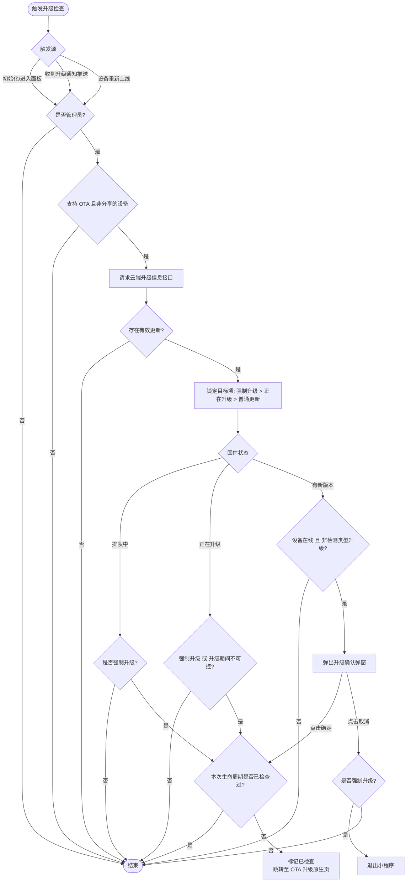

# 面板环境初始化 (init-panel-environment)

[AI-generated summary: 涂鸦面板标准环境初始化API文档，提供一键式集成方案用于快速启用离线、蓝牙、OTA升级、故障提醒等核心能力。详细说明了环境初始化的配置参数、工作原理和底层实现。覆盖内容：initPanelEnvironment, InitPanelEnvironmentOptions, useDefaultOffline, bleCover, customTop, bleConnectType, showBLEToast, showFault, shouldConnectBleAuto, autoCheckActivation, disableOtaDialog, 离线遮罩, 蓝牙自动重连, OTA升级检测, 设备状态监听, 故障列表, 权限授权检查, 连接恢复流程]

## 面板环境初始化

`initPanelEnvironment` 是涂鸦面板小程序的**标准环境初始化工具**。它不仅是一个 API，更是涂鸦面板标准交互规范的集成实现。通过一键调用，开发者可以快速为面板接入离线、蓝牙、OTA、故障提醒等一系列标准化能力。

需引入 `DeviceKit`，且 `@ray-js/ray` 版本需高于 `0.10.3`。

### 快速上手

在应用入口或面板主页面尽早调用即可开启标准环境（当前面板小程序模板均已内置调用此 API）：

```typescript
import { initPanelEnvironment } from '@ray-js/ray';

// 开启标准环境初始化
initPanelEnvironment({ 
  useDefaultOffline: true, // 开启默认离线提醒
});
```

---

### 核心能力

初始化面板环境 API 深度集成了以下标准交互能力：

#### 1. 连接与离线保障
实时监测设备在线状态。针对 Wi-Fi 设备提供离线遮罩引导；针对蓝牙设备提供自动重连、权限检测及状态悬浮窗展示。

> **详情查阅**：[连接与离线逻辑说明](./connectivity)

#### 2. OTA 升级检查
实时检测设备固件更新情况，并根据优先级（强制/提醒）引导用户进行升级。

> **详情查阅**：[OTA 升级机制说明](./ota)

#### 3. 连云激活与设备监听
- **连云激活**：对于需要激活的设备，进入面板后自动弹出提示。
- **基础监听**：自动注册设备移除、状态变更等基础监听，简化业务复杂度。

#### 4. 故障列表组件
当设备支持并上报 `fault` 类型的功能点时，自动弹出标准故障列表说明。目前仅支持 `dpCode` 为 `fault` 的功能点。

---

### 技术参考

#### 类型定义

```typescript
/**
 * 面板环境初始化参数
 */
export interface InitPanelEnvironmentOptions {
  /**
   * @description 是否需要使用默认离线弹窗
   * @default true
   */
  useDefaultOffline?: boolean;
  /**
   * @description 蓝牙提示是否需要阻止交互
   * @default false
   */
  bleCover?: boolean;
  /**
   * @description 蓝牙及 toast 提示自定义顶部高度（自定义导航时使用）
   * @default 0
   */
  customTop?: string;
  /**
   * @description 蓝牙连接方式，默认0
   * 0： 网关和app都需要，本地和网关两个途径任何一个可用均可生效
   * 1： 仅 app， 只会判定本地是否在线， 以及本地连接是否成功
   * 2： 仅网关连接， 只会判定网关是否在线，以及网关连接是否成功
   * @default 0
   */
  bleConnectType?: number;
  /**
   * @description 是否显示蓝牙连接状态提示
   * @default true
   * @version 2.10.4
   */
  showBLEToast?: boolean;
  /**
   * @description 当前设备 id，默认为 undefined，表示自动从小程序的 query参数中获取
   * @default undefined
   */
  deviceId?: string;
  /**
   * @description 当前群组 id，默认为 undefined，表示自动从小程序的 query参数中获取
   * @default undefined
   */
  groupId?: string;
  /**
   * @description 微信详细页面路由
   * @default undefined
   */
  deviceDetailPage?: string;
  /**
   * @description 是否显示故障提示
   * @default false
   */
  showFault?: boolean;
  /**
   * @description 配置是否自动连接蓝牙，基础库 2.27.0 开始支持
   * @default true
   */
  shouldConnectBleAuto?: boolean;
  /**
   * @description 自动检查激活，基础库 2.27.0 开始支持
   * @default true
   */
  autoCheckActivation?: boolean;
  /**
   * @description 禁用自动检查固件升级，基础库 2.27.0 开始支持
   * @default false
   */
  disableOtaDialog?: boolean;
}

export declare function initPanelEnvironment(
  options?: InitPanelEnvironmentOptions,
): void;
```

---

#### 参数详解

##### bleCover
当显示蓝牙状态悬浮窗时，是否要添加覆盖层以阻止界面交互。通常情况下，如果有些功能可以在设备离线时使用（如：数据图表查看），则不需要覆盖住界面。

```typescript | pure
initPanelEnvironment({ useDefaultOffline: true, bleCover: true });
```

##### customTop
当使用自定义状态栏时，可通过该属性自定义蓝牙状态悬浮窗与顶部的距离。该参数接受 CSS 标准长度值（如: '100px', '10%'等）。

```typescript | pure
initPanelEnvironment({ useDefaultOffline: true, customTop: '120px' });
```

##### bleConnectType

在标准逻辑下，蓝牙设备的联网方式选择：
- **0**：同时尝试手机直连和连接网关（默认）。
- **1**：仅使用手机直连。
- **2**：仅使用网关连接。

##### showBLEToast
在蓝牙设备连接成功或失败时，是否显示 Toast 提示。

```typescript | pure
initPanelEnvironment({ useDefaultOffline: true, showBLEToast: true });
```

##### showFault
若设置为 `true`，则使用内置能力展示设备故障。目前仅支持 `dpCode` 为 `fault` 的故障展示。

```typescript | pure
initPanelEnvironment({ useDefaultOffline: true, showFault: true });
```

#### 底层原子实现
`initPanelEnvironment` 基于以下底层 API 深度封装后实现：

- [ty.panel.initPanelKit](/cn/miniapp/develop/ray/api/other/initPanelKit)
- [registerDeviceListListener](/cn/miniapp/develop/ray/api/device-info/info/registerDeviceListListener)
- [getDeviceInfo](/cn/miniapp/develop/ray/api/device-info/info/getDeviceInfo)
- [getSystemInfoSync](/cn/miniapp/develop/ray/api/base/system/getSystemInfoSync)
- [authorizeStatus](/cn/miniapp/develop/ray/api/authorize/authorizeStatus)
- [openMiniWidget](/cn/miniapp/develop/ray/api/base/container/MiniWidgetDialog#miniwidgetdialog-openminiwidget)
- [onWidgetDismiss](/cn/miniapp/develop/ray/api/base/container/MiniWidgetDialog#miniwidgetdialogonwidgetdismiss)
- [offWidgetDismiss](/cn/miniapp/develop/ray/api/base/container/MiniWidgetDialog#miniwidgetdialogoffwidgetdismiss)
- [dismissMiniWidget](/cn/miniapp/develop/ray/api/base/container/MiniWidgetDialog#miniwidgetdialogdismissminiwidget)
- [authorize](/cn/miniapp/develop/ray/api/authorize/authorizeStatus)
- [getDeviceOnlineType](/cn/miniapp/develop/ray/api/device-info/info/getDeviceOnlineType)
- [connectBluetoothDevice](/cn/miniapp/develop/ray/api/bluetooth/single/connectBluetoothDevice)
- [subscribeBLEConnectStatus](/cn/miniapp/develop/ray/api/bluetooth/single/subscribeBLEConnectStatus)
- [onBLEConnectStatusChange](/cn/miniapp/develop/ray/api/bluetooth/single/onBLEConnectStatusChange)
- [onBluetoothAdapterStateChange](/cn/miniapp/solution-panel/ability/common/sdm/api/onBluetoothAdapterStateChange)

---

### 注意事项

1. **标准化逻辑建议**：`initPanelEnvironment` 提供的逻辑均为涂鸦面板的标准规范，我们建议开发者优先使用本接口，仅在特殊场景下才参考原子接口进行自定义。
2. **OTA 逻辑封闭性**：OTA 升级机制（检测、弹窗及跳转）目前暂不支持开发者自定义实现，请务必通过内置能力完成。
## 连接与离线逻辑

### 1. 概述
连接与离线逻辑旨在为用户提供设备连接状态的实时反馈。在涂鸦面板体系中，“离线”是设备无法被控制的状态，而“蓝牙连接/重连”是蓝牙及双模设备在判定离线后，框架自动尝试修复连接的交互过程。

> **提示**：该能力已高度集成。在面板小程序初始化时会自动启动下述逻辑，无需开发者进行任何代码实现。

---

### 2. 逻辑流程图

基础库内置了复杂的离线判断决策树，适配了 Wi-Fi、蓝牙、双模、网关等多种连接方式，如下图所示：

---

### 3. 框架自动化行为

#### 3.1 离线遮罩管理
框架会实时监听设备的在线状态。一旦设备判定为离线，面板上方会自动覆盖一层“离线遮罩”，拦截所有业务操作。
*   **排查引导**：根据设备类型展示相应的排查建议。
*   **网络状态感知**：实时监测手机端网络环境。针对需要联网类的设备，当手机断网时，框架会自动显示离线遮罩。

#### 3.2 蓝牙自动重连行为
针对蓝牙（BLE）及双模设备，框架在检测到设备离线后，会自动启动“本地连接恢复”流程。该流程旨在通过手机蓝牙直接与设备建立通信，以实现离线状态下的近端控制。

##### 1. 前置检查与权限引导
在尝试连接前，框架会首先检查必要的通信环境。若环境不满足，将主动弹出引导提示：
*   **蓝牙授权检查**：检测 App 是否拥有手机蓝牙使用权限。若未授权，将引导用户前往系统设置开启。
*   **蓝牙开关状态**：检测手机系统蓝牙是否已打开。若处于关闭状态，将提醒用户开启蓝牙。

**蓝牙未授权提示**：

**蓝牙未开启提示**：

##### 2. 自动化连接流程
当通信环境就绪后，框架会启动后台静默重连：
*   **连接状态反馈**：界面会显示蓝牙连接悬浮窗，告知用户当前的连接进度。
*   **自动交互闭环**：若重连成功，离线遮罩与连接悬浮窗将自动消失，恢复面板控制权限。

**蓝牙连接中**：

**连接失败状态**：

##### 3. 失败排查与引导
若在规定时间内重连失败，框架会提供详细的失败原因及排查建议，引导用户通过其他方式（如检查设备供电或重启蓝牙）解决问题。

---

### 4. 常见配置说明

开发者可以通过 `initPanelEnvironment` 的参数微调上述行为：

*   **`useDefaultOffline`**: 设置为 `false` 可完全禁用内置离线遮罩，由开发者自行通过状态监听实现 UI。
*   **`bleCover`**: 当显示蓝牙连接悬浮窗时，是否要添加覆盖层以阻止界面交互。
*   **`customTop`**: 适配自定义导航栏，调整蓝牙悬浮窗的顶部距离。

---

### 5. 注意事项
1.  **功能标准化**：该离线机制属于基础库内置的统一标准能力，旨在确保所有面板应用在处理设备离线与异常交互上保持高度一致。**非必要场景建议开发者不要自行调整实现**。
2.  **自定义支持**：若在特殊业务场景下需要完全自定义离线交互，开发者可通过配置 `useDefaultOffline: false` 来禁用内置离线逻辑，随后自行监听设备状态并实现交互视图。
3.  **交互闭环**：在内置模式下，离线页面的所有跳转链路（如配网引导、重连页）均由框架内部闭环处理，开发者无需关注跳转协议与页面实现。
## 设备 OTA 升级机制

### 1. 概述
OTA（Over-the-Air）升级检测机制用于在用户进入面板小程序或在面板运行过程中，实时检测设备固件更新情况，并根据固件优先级（强制/提醒）引导用户进行升级，确保设备运行在最佳版本。

> **提示**：该能力已高度集成至 [面板环境初始化](./) 文档中。在面板小程序初始化时调用该接口，即可自动触发下述 OTA 升级流程，无需开发者自行实现。

---

### 2. 逻辑流程图



---

### 3. 升级类型

*   **提醒升级**：用户进入设备面板主动提醒 App 用户，用户可以选择是否升级。
*   **强制升级**：升级提醒主动推送给 App 用户，用户无选择权利，必须升级。
*   **检测升级**：升级提醒不会主动推送给 App 用户，需要用户主动发起版本检测，才能看到升级提醒。

---

### 4. 场景说明

#### 场景 A：管理员进入面板发现新固件
*   **表现**：用户进入面板后，屏幕弹出升级提示框，显示更新日志。
*   **逻辑**：
    1. 接口返回固件状态为“有新版本”。
    2. 检查设备当前处于“在线”状态。
    3. 弹出升级交互弹窗。
    4. 用户点击“立即升级”后跳转，点击“取消”则关闭弹窗（非强制情况下）。

#### 场景 B：固件强制升级
*   **表现**：用户进入面板，不会出现提醒弹窗，设备面板会自动直接跳转到设备升级页面。
*   **逻辑**：
    1. 识别到该固件属于“强制升级”类型。
    2. 直接跳转至 OTA 升级原生页。

#### 场景 C：面板运行中设备开始升级（推送触发）
*   **表现**：用户正在操作设备时，突然收到“设备正在升级”的提示。
*   **逻辑**：
    1. 框架接收到云端下发的升级通知推送。
    2. 触发升级检查流程。
    3. 若判断固件正在升级且不可控，将弹出升级通知弹窗，引导用户查看进度，防止在升级期间进行冲突操作。

#### 场景 D：分享设备或普通家庭成员
*   **表现**：完全不触发任何 OTA 相关的弹窗或逻辑。
*   **逻辑**：
    1. 框架校验当前用户权限，若非“管理员”则终止流程。
    2. 校验设备属性，若是“被分享设备”则终止流程。

---

### 5. 注意事项
1.  **防抖机制**：升级检查函数设有一定的防抖时间，确保在短时间内多次触发（如同时初始化并收到推送）时，只执行一次一次有效请求。
2.  **生命周期标记**：内部维护了“已检查”状态，确保在小程序的一次运行生命周期内，不会因为多次检测到强制更新而反复干扰用户。
3.  **退出逻辑**：处理强制升级时，框架会严格执行退出机制。开发者在微调逻辑时需确保不破坏该闭环，以避免固件版本不一致导致的业务异常。
4.  **功能标准化与封闭性**：该 OTA 机制属于基础库内置的统一标准能力，旨在确保所有面板应用在设备固件安全与用户升级体验上保持高度一致。为了保障核心链路的严谨性，目前**不向开发者开放自定义实现的接口或配置项**，请基于框架提供的标准化行为进行业务评估。
