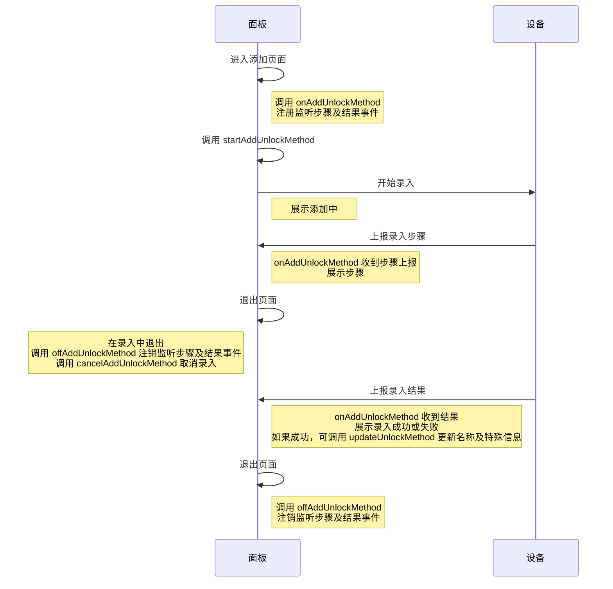
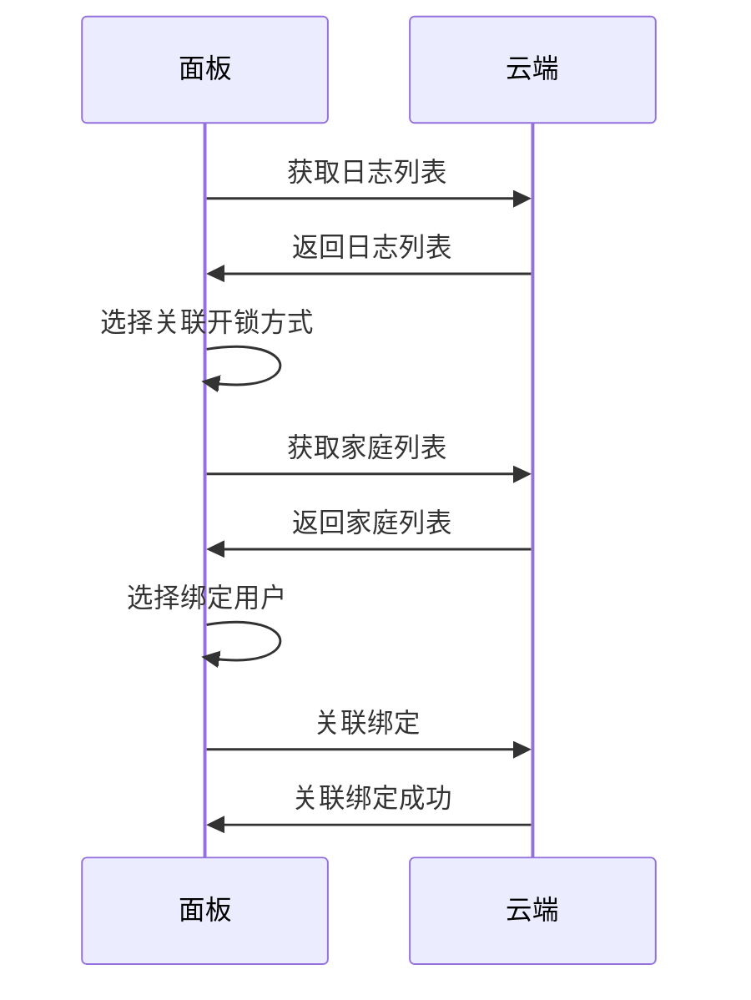
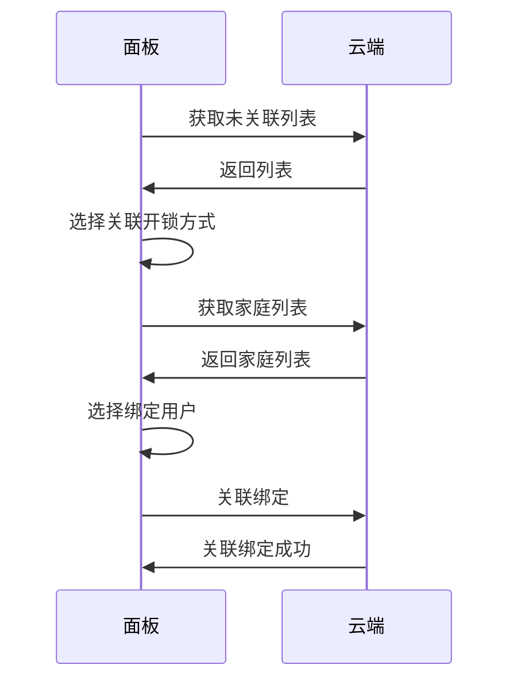
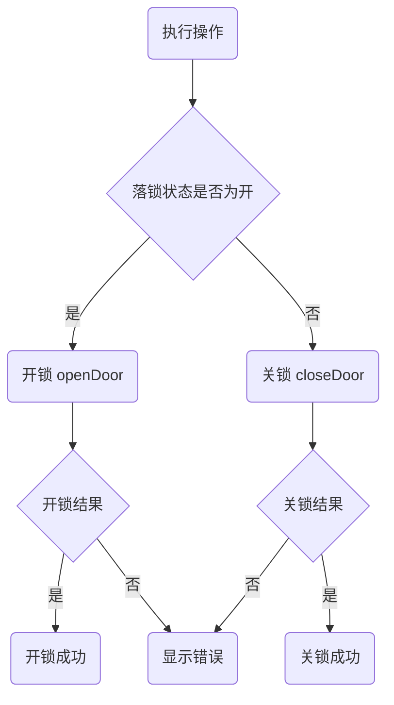

# 门锁方案 (doorlock)

[AI-generated summary: 本文档介绍基于Ray框架构建门锁面板小程序的完整解决方案。覆盖内容：init, getUsers, getUserInfo, addUser, removeUser, updateUserLimitTime, addPassword, startAddUnlockMethod, cancelAddUnlockMethod, onAddUnlockMethod, offAddUnlockMethod, updateUnlockMethod, deleteUnlockMethod, getUnlockMethodDetail, checkUnBindUnlockMethods, getUnbindUnlockMethods, syncUnlockMethod, bindUnlockMethod, unbindUnlockMethod, createTempCustom, getTempEffectiveList, getTempInvalidList, openDoor, closeDoor, remoteEnabled, getRemotePermission, updateRemotePermission]

## 快速上手

#### 前置知识

> 本文主要介绍基于模板快速构建门锁面板小程序的相关知识

##### 工具库

[@ray-js/lock-sdk](/cn/miniapp/solution-panel/ability/special/doorlock/sdk-guide/base)： 提供了可视对讲门锁面板 的一系列的 API 和事件，您使用此库可以更快速的开发出面板

##### 开发模板
您可以通过[项目模板](/cn/miniapp/solution-panel/ability/special/doorlock/quick/template)快速开始可视对讲门锁面板的开发。
#### 项目模板

##### 可视频对讲门锁模板

###### 涵盖功能
- 远程开/关锁，且支持开/关锁功能开关配置，支持远程开/关锁权限配置；
- 实时视频，支持对讲、截图、录像、远程开锁
- 用户管理
- 日志查看，包括：相册、告警、日志
- 临时密码生成及查看
- 设置

##### 资料
- [模板文档](https://developer.tuya.com/cn/miniapp-codelabs/codelabs/panel-video-intercom/index.html)
- [物料仓库](https://developer.tuya.com/material/library_hKiOVClc/component?code=VideoDoorLockTemplate)

## SDK 使用指南

#### 基础能力

##### 引入云能力

SDK 依赖云能力，需在[小程序开发者平台](https://platform.tuya.com/miniapp/)开发设置-云能力，选择授权云能力 `门锁设备小程序控制能力`。

##### 安装

在项目中引入

```shell
yarn add @ray-js/lock-sdk
```

##### 使用

在进入面板时，需要调用 [init](/en/miniapp/develop/ray/api/doorlock/basic/init) API 对进行初始化，初始化完成后，即可正常使用 SDK API

```tsx

import { init as initLock } from '@ray-js/lock-sdk';

async onLaunch(object: any) {
    devices.common.init();
    // 初始化门锁 sdk
    initLock({
        passwordDigitalBase: 10,
        passwordSupportZero: true,
        strictMode: false,
    });
    devices.common.onInitialized(device => dpKit.init(device));
    const systemInfo = getSystemInfoSync();
    const { theme } = systemInfo;

    dispatch(initializeSystemInfo(systemInfo));
    dispatch(updateThemeType(theme));
}

```
#### 成员管理

门锁的成员管理依托于 App 的家庭成员管理功能，在此基本上可对成员进行开锁方式管理。支持的能力有：
- 获取成员列表，支持返回成员的名称、账号、角色、开锁方式列表；
- 邀请成员加入家庭
- 获取家庭成员详细信息
- 添加普通成员
- 删除普通成员

##### 支持的角色
- 管理员： 家庭管理员，对锁有最高的管理权限，可以进行所有的操作。
- 成员：可以查看与自己相关的信息，如：开门记录、某些设置项等
- 普通成员：无账号，不可进入面板

> 其中管理员、成员角色需要邀请进入家庭，普通成员则需要通过【添加普通成员 API】添加

##### API

###### 获取成员列表

- 含义：获取当前锁下的成员列表，包括家庭管理员和家庭成员。锁支持大容量开锁方式时，同时会返回普通成员。
- 详细：[查看文档](/cn/miniapp/develop/ray/api/doorlock/user/getUsers)

###### 获取家庭成员详细信息

- 含义：获取家庭成员详细信息，包含名称、账号、角色、开锁方式列表等信息
- 详细：[查看文档](/cn/miniapp/develop/ray/api/doorlock/user/getUserInfo)

###### 添加普通成员

- 含义：当锁支持大容量开锁方式时，可以添加无账号的普通成员，用于管理此成员的开锁方式。
- 详细：[查看文档](/cn/miniapp/develop/ray/api/doorlock/user/addUser)

###### 删除普通成员

- 含义：当锁支持大容量开锁方式时，可通过此方法删除普通成员。
- 详细：[查看文档](/cn/miniapp/develop/ray/api/doorlock/user/removeUser)

###### 修改非管理员角色时效

- 含义：可使用此 API 修复非管理员角色的成员的时效性，成员的时效性会影响成员的开锁方式的时效。
- 详细：[查看文档](/cn/miniapp/develop/ray/api/doorlock/user/updateUserLimitTime)

#### 常见问题

##### Q1: 如何区分管理员和普通成员？

**A:** 通过 `userType` 字段判断：
```typescript
import { UserType } from '@ray-js/lock-sdk';

const adminList = members.filter(
  item => item.userType === UserType.ADMIN || item.userType === UserType.OWNER
);
const memberList = members.filter(
  item => item.userType !== UserType.ADMIN && item.userType !== UserType.OWNER
);
```

##### Q2: 添加成员失败怎么办？

**A:** 检查：
1. 成员名称不能为空
2. 如果锁使用了小容量方案，不建议使用 `addUser` API

##### Q3: 如何设置成员的时效性？

**A:** 使用 `updateUserLimitTime` API：
- `permanent: true` 表示永久有效
- `permanent: false` 需要提供 `effective` 配置对象

##### Q4: 什么是未绑定的开锁方式？

**A:** 未绑定的开锁方式是指设备上已录入但未关联到用户的开锁方式（如指纹、人脸等）。可以通过 `checkUnBindUnlockMethods` 检查，并通过绑定功能关联到用户。

##### Q5: 如何同步开锁方式？

**A:** 调用 `syncUnlockMethod()` 方法，该方法会同步设备端和云端的数据。

##### Q6: 成员列表支持分页吗？

**A:** 支持，通过 `page` 和 `pageSize` 参数控制：
```typescript
const result = await getUsers({ page: 1, pageSize: 50 });
if (result.hasMore) {
  // 加载下一页
}
```

##### Q7: 如何搜索成员？

**A:** 使用 `keyword` 参数：
```typescript
const result = await getUsers({ keyword: '搜索关键字' });
```

##### Q8: 删除成员会同时删除其开锁方式吗？

**A:** 会同时删除成员及其关联的开锁方式。
#### 开锁方式管理

支持的开锁方式有：指纹、卡片、人脸、指静脉、掌静脉、虹膜。

> 注意：人脸是否支持多个由设备决定，当为支持单个人脸时，在添加人脸时，应该在设备侧做覆盖操作。

##### 添加密码

可直接使用 api [addPassword](/cn/miniapp/develop/ray/api/doorlock/unlock-method/addPassword) 进行添加。

##### 添加其他开锁方式

其他的开锁方式添加需要使用以下流程



说明

> - `onAddUnlockMethod` 和 `startAddUnlockMethod` API 的可以不同步调用，但如果在多个页面中分开调用这两个 API时，请确保用户在锁上操作录入步骤时，面板已经调用 `onAddUnlockMethod` 监听录入状态。
> - 在录入中途，需要注意用户操作退出录入的情况，此时需要调用 `cancelAddUnlockMethod`。
> - 当录入有结果（成功或失败）时，退出添加页面，请调用 `offAddUnlockMethod`，确保不重复监听，确保程序正常执行。
> - 如果录入失败的原因为超时时（错误码 1002），请在退出页面时，调用 `cancelAddUnlockMethod`, 确保面板超时但锁仍在添加状态的情况。

##### 绑定未关联在开锁方式

未关联的开锁方式有两个种情况：

- 在日志列表中返回的开锁记录中，可能会出现未关联的开锁方式，需要调用 `bindUnlockMethodFromLog` 进行关联绑定；
- 通过 `getUnbindUnlockMethods` 获取的列表数据，需要调用 `bindUnlockMethod` 进行关联绑定。

日志中关联绑定流程



通过未关联列表进行关联



##### 向设备发起同步开锁方式指令

- SDK 在初始化时，会尝试向设备发起同步开锁方式指令；
- 开发者可能通过调用 `syncUnlockMethod` 手动向设备发起同步开锁方式指令。

##### API

###### 添加密码

- 含义：为家庭成员添加密码开锁方式
- 详细：[查看文档](/cn/miniapp/develop/ray/api/doorlock/unlock-method/addPassword)

###### 开始添加开锁方式

- 含义：向设备发起开始添加指令，并等待设备上报状态。
- 详细：[查看文档](/cn/miniapp/develop/ray/api/doorlock/unlock-method/startAddUnlockMethod)

###### 取消添加开锁方式

- 含义：在录入开锁方式过程中，可以调用 API 取消开锁方式
- 详细：[查看文档](/cn/miniapp/develop/ray/api/doorlock/unlock-method/cancelAddUnlockMethod)

###### 注册开锁方式步骤监听器

- 含义：当用户在锁侧录入开锁方式过程中，产生的步骤数据会通过监听器的回调函数推送消息。
- 详细：[查看文档](/cn/miniapp/develop/ray/api/doorlock/unlock-method/onAddUnlockMethod)

###### 注销开锁方式步骤监听器

- 含义：取消监听开锁方式的过程
- 详细：[查看文档](/cn/miniapp/develop/ray/api/doorlock/unlock-method/offAddUnlockMethod)

###### 发送手机验证码

- 含义：当在更新开锁方式为特殊开锁方式时，如需要添加手机短信通知的，则需要获取验证码
- 详细：[查看文档](/cn/miniapp/develop/ray/api/doorlock/unlock-method/sendVerifyCode)

###### 检查是否支持短信通知

- 含义：在特殊开锁方式时，检测是否支持短信通知服务
- 详细：[查看文档](/cn/miniapp/develop/ray/api/doorlock/unlock-method/checkSpecialSupportPhone)

###### 更新开锁方式

- 含义：更新已有的开锁方式信息，仅支持更新开锁方式名称和特殊开锁方式的通知信息
- 详细：[查看文档](/cn/miniapp/develop/ray/api/doorlock/unlock-method/updateUnlockMethod)

###### 删除开锁方式

- 含义：删除通用面板添加的用户所拥有的开锁方式
- 详细：[查看文档](/cn/miniapp/develop/ray/api/doorlock/unlock-method/deleteUnlockMethod)

###### 获取开锁方式详细信息

- 含义：获取某个开锁方式的详细信息，可用于编辑开锁方式时展示信息
- 详细：[查看文档](/cn/miniapp/develop/ray/api/doorlock/unlock-method/getUnlockMethodDetail)

###### 检测是否有未绑定的开锁方式

- 含义：检测当前锁侧所有的开锁方式是否有未关联到用户的情况
- 详细：[查看文档](/cn/miniapp/develop/ray/api/doorlock/unlock-method/checkUnBindUnlockMethods)

###### 获取未关联开锁方式列表

- 含义：获取锁本地未关联到用户的开锁方式
- 详细：[查看文档](/cn/miniapp/develop/ray/api/doorlock/unlock-method/getUnbindUnlockMethods)

###### 同步开锁方式

- 含义：向设备发起同步开锁方式数据到云端
- 详细：[查看文档](/cn/miniapp/develop/ray/api/doorlock/unlock-method/syncUnlockMethod)

###### 解绑开锁方式

- 含义：将通过关联操作绑定到用户的开锁方式解绑，解绑后，开锁方式在锁端仍有效
- 详细：[查看文档](/cn/miniapp/develop/ray/api/doorlock/unlock-method/unbindUnlockMethod)

###### 绑定开锁方式

- 含义：绑定未关联开锁方式到用户
- 详细：[查看文档](/cn/miniapp/develop/ray/api/doorlock/unlock-method/bindUnlockMethod)

###### 绑定开锁方式

- 含义：绑定未关联开锁方式到用户
- 详细：[查看文档](/cn/miniapp/develop/ray/api/doorlock/unlock-method/bindUnlockMethod)

#### 常见问题

##### Q1: 添加开锁方式时如何显示进度？

**A:** 通过监听 `onAddUnlockMethod` 事件，当 `stage` 为 `'step'` 时，可以获取当前步骤和总步骤：

```typescript
onAddUnlockMethod((event) => {
  if (event.stage === 'step') {
    console.log(`步骤 ${event.step}/${event.total}`);
  }
});
```

##### Q2: 如何取消正在添加的开锁方式？

**A:** 调用 `cancelAddUnlockMethod` API：

```typescript
await cancelAddUnlockMethod({ type: 'finger', userId: 'userId' });
```

##### Q3: 什么是特殊开锁方式？

**A:** 特殊开锁方式是指配置了通知功能的开锁方式，当使用该开锁方式开锁时，会发送App通知或短信通知。仅指纹、密码等部分开锁方式支持特殊配置。

##### Q4: 如何开启短信通知？

**A:** 需要：

1. 检查设备是否支持：`checkSpecialSupportPhone()`
2. 发送验证码：`sendVerifyCode({ account: '86-1********' })`
3. 添加时传入验证码和手机号

##### Q5: 添加失败的错误码含义？

**A:** 常见错误码：

- `1015-1025`: 各种添加失败原因（如指纹已满、录入超时等）
- `1026`: 添加被取消
- `1014`: 设备不支持该开锁方式

##### Q6: 用户拥有的开锁方式都能删除吗？

**A:** 不能，通过关联绑定到用户的开锁方式不能删除，但可以调用 `unbindUnlockMethod` 取消绑定。

##### Q7: 如何判断开锁方式是通过关联绑定的？

**A:** 通过 `getUnlockMethodDetail` 获取详情，`isBound` 字段表示是否已绑定。

##### Q8: 未绑定的开锁方式如何处理？

**A:** 可以通过 `getUnbindUnlockMethods` 获取列表，然后使用 `bindUnlockMethod` 绑定到用户。
#### 临时密码管理

临时密码支持： 自定义密码、限时密码、动态密码、单次密码、清空密码。其中自定义密码为在线密码，需要与设备进行交互才能将密码数据同步到设备；其他的密码类型则为离线密码。

##### 自定义密码

- 需要设置密码、生效时间、名称（可选），密码在生效时间期间可使用；
- 如超过生效时间，密码将失效；
- 自定义密码可删除，删除后，将失效；
- 自定义密码可冻结或解冻，如进行了冻结操作，则将无法密码开锁。

##### 限时密码

- 限时密码在生成后，必须在 24 小时内使用一次；
- 生成后 24 小时内未使用，即使密码未过期，也会变为无效；
- 生成后 24 小时内使用过，当密码时效性过期时，密码状态变为无效；
- 在生效时间中，限时密码可多次被使用。

##### 单次密码

- 单次密码在获取后，有效期为6小时，并且在失效前，最多只能使用一次。

##### 动态密码

- 动态密码在生成后，有效期为5分钟，失效前可使用多次

##### 清空密码

- 用于清空限时密码，在生成密码时，可指定清空所有限时密码或单个密码；
- 清空密码有效期为 24 小时，需要有失效前使用。

##### API

###### 创建自定义密码

- 含义：创建自定义的临时密码
- 详细：[查看文档](/cn/miniapp/develop/ray/api/doorlock/temporary/createTempCustom)

###### 生成清除密码

- 含义：生成可用于清除限时密码的密码
- 详细：[查看文档](/cn/miniapp/develop/ray/api/doorlock/temporary/createTempClear)

###### 生成动态密码

- 含义：用于生成动态密码
- 详细：[查看文档](/cn/miniapp/develop/ray/api/doorlock/temporary/createTempDynamic)

###### 生成限时密码

- 含义：用于生成限时密码
- 详细：[查看文档](/cn/miniapp/develop/ray/api/doorlock/temporary/createTempLimit)

###### 生成单次密码

- 含义：用于生成单次密码
- 详细：[查看文档](/cn/miniapp/develop/ray/api/doorlock/temporary/createTempOnce)

###### 获取有效的临时密码

- 含义：获取有效的自定义、限时、单次、清空等类型密码
- 详细：[查看文档](/cn/miniapp/develop/ray/api/doorlock/temporary/getTempEffectiveList)

###### 获取无效的临时密码

- 含义：获取无效的自定义、限时、单次、清空等类型密码
- 详细：[查看文档](/cn/miniapp/develop/ray/api/doorlock/temporary/getTempInvalidList)

###### 删除自定义密码

- 含义：删除生效状态的自定义密码
- 详细：[查看文档](/cn/miniapp/develop/ray/api/doorlock/temporary/removeTempCustom)

###### 重命名名称

- 含义：重命名自定义、限时、单次、清空等密码
- 详细：[查看文档](/cn/miniapp/develop/ray/api/doorlock/temporary/renameTemp)

###### 冻结自定义密码

- 含义：冻结生效状态的自定义密码
- 详细：[查看文档](/cn/miniapp/develop/ray/api/doorlock/temporary/freezeTemp)

###### 解冻自定义密码

- 含义：解冻冻结状态的自定义密码
- 详细：[查看文档](/cn/miniapp/develop/ray/api/doorlock/temporary/unfreezeTemp)

###### 更新自义定密码

- 含义：更新自定义密码的名称和时效配置
- 详细：[查看文档](/cn/miniapp/develop/ray/api/doorlock/temporary/updateTempCustom)

###### 清空所有无效密码

- 含义：清空所有无效密码
- 详细：[查看文档](/cn/miniapp/develop/ray/api/doorlock/temporary/clearTempInvalidList)
#### 远程开关锁

##### 执行开/关锁

流程图



说明

> - 是否落锁判断需要获取落锁状态 dp47(lock_motor_state) 的值进行判断，如果值为 true,则表示开门状态，否则为关门状态
> - 如果操作开/关锁失败时，需要根据错误码展示提示信息
> - 开/关锁 API 全校验当前 `远程开/关锁功能开关` 是否开启、当前设备是否在线、当前用户是否有远程开/关锁权限等。

##### 远程开/关锁功能开关

- 默认为开启，即支持远程开/关锁功能
- 用户可对开关进行配置

##### 远程开关锁权限

- 支持的权限有：`仅管理员可开/关锁`、`所有人可开/关锁`、`所有人都不能开/关锁`
- 远程开关锁权限默认为： `所有人可开/关锁`

##### API

###### 查看远程开/关锁功能开关状态

- 含义：确认当前的远程开/关锁功能是否可用
- 详细：[查看文档](/cn/miniapp/develop/ray/api/doorlock/open/checkRemoteEnabled)

###### 开锁

- 含义：进行远程开锁指令下发
- 详细：[查看文档](/cn/miniapp/develop/ray/api/doorlock/open/openDoor)

###### 关锁

- 含义：进行远程关锁指令下发
- 详细：[查看文档](/cn/miniapp/develop/ray/api/doorlock/open/closeDoor)

###### 设置功能开启或关闭

- 含义：开启或关闭远程开/关锁功能
- 详细：[查看文档](/cn/miniapp/develop/ray/api/doorlock/open/remoteEnabled)

###### 获取当前远程开/关锁权限

- 含义：获取当前用户的远程开/关锁权限
- 详细：[查看文档](/cn/miniapp/develop/ray/api/doorlock/open/getRemotePermission)

###### 获取权限列表

- 含义：获取远程开/关锁的权限列表
- 详细：[查看文档](/cn/miniapp/develop/ray/api/doorlock/open/getRemotePermissionList)

###### 配置权限

- 含义：设置远程开/关锁权限
- 详细：[查看文档](/cn/miniapp/develop/ray/api/doorlock/open/updateRemotePermission)
#### 日志管理

门锁的记录有三类：相册记录、告警记录、日志记录。

##### 相册记录

- 支持视频和图片抓拍的锁会有此类记录，因此记录中会包含有图片和视频，一般会在有人按门铃、有人逗留等情况产生；
- 出于安全风险考虑，涂鸦会对图片和视频进行加密处理，开发者需要使用特定的能力及方案才能正常展示。

图片处理方案请参数： [多媒体图片处理](/cn/miniapp/solution-panel/ability/special/doorlock/media/photo)

视频处理方案请参数： [多媒体图片处理](/cn/miniapp/solution-panel/ability/special/doorlock/media/video)

###### 告警记录

门锁告警时产生的记录，包含如：防撬、密码试错、指纹试错、逗留、劫持、低电量等告警

##### 日志记录

记录类型有

- close_record 表示关锁日志
- unlock_record 表示开锁日志
- operation 操作类日志
- local_operation 设备本地操作日志
- dev_bind 设备绑定日志

##### 日志文案处理

告警处理

```jsx

export const codeOnlyShowDpCodeText = [
  'doorbell',
  'unlock_offline_clear',
  'unlock_offline_clear_single',
];
const getText = (log) => {
    const text = codeOnlyShowDpCodeText.includes(log.dpCode)
        ? Strings.getDpLang(log.dpCode)
        : Strings.getDpLang(log.dpCode, log.data as string);
    if (log.isHijack) {
        // 是否劫持
        return `${Strings.getDpLang('hijack')}【${text}】`;
    }
    return text;
}
```

关锁日志

```
const text = Strings.getLang(`locked_${log.closeValue}`);

```

本地操作记录

```tsx

import {
  LocalOperateCategory,
  LocalSettingData,
  LocalUnlockMethodData,
  LogData,
} from '@ray-js/lock-sdk';

const getLocalOperationText = (log: LogData) => {
  if (!log.localRecord) {
    return Strings.getLang('unkownLocalOperation');
  }

  const { category, userId, userType, toUserType, toUserId } = log.localRecord;
  switch (category) {
    case LocalOperateCategory.DELETE_UNLOCK_METHOD: {
      const { unlockMethod, unlockId, isRemoveAll } = log.localRecord as LocalUnlockMethodData;
      if (isRemoveAll) {
        return Strings.formatValue(
          'localDeleteAllUnlockMethod',
          Strings.getLang(`localUser${userType}`),
          userId,
          Strings.getLang(`localUser${toUserType}`),
          toUserId,
          Strings.getLang(unlockMethod)
        );
      }
      return Strings.formatValue(
        'deleteUnlockMethod',
        Strings.getLang(`localUser${userType}`),
        userId,
        Strings.getLang(`localUser${toUserType}`),
        toUserId,
        Strings.getLang(unlockMethod),
        unlockId
      );
    }
    case LocalOperateCategory.ADD_UNLOCK_METHOD: {
      const { unlockMethod, unlockId } = log.localRecord as LocalUnlockMethodData;
      return Strings.formatValue(
        'localAddUnlockMethod',
        Strings.getLang(`localUser${userType}`),
        userId,
        Strings.getLang(`localUser${toUserType}`),
        toUserId,
        Strings.getLang(unlockMethod),
        unlockId
      );
    }
    case LocalOperateCategory.MODIFY_UNLOCK_METHOD: {
      const { unlockMethod, unlockId } = log.localRecord as LocalUnlockMethodData;
      return Strings.formatValue(
        'localModifyUnlockMethod',
        Strings.getLang(`localUser${userType}`),
        userId,
        Strings.getLang(`localUser${toUserType}`),
        toUserId,
        Strings.getLang(unlockMethod),
        unlockId
      );
    }
    case LocalOperateCategory.ADD_USER:
      return Strings.formatValue(
        'localAddUser',
        Strings.getLang(`localUser${userType}`),
        userId,
        Strings.getLang(`localUser${toUserType}`),
        toUserId
      );
    case LocalOperateCategory.DELETE_USER:
      return Strings.formatValue(
        'localDeleteUser',
        Strings.getLang(`localUser${userType}`),
        userId,
        Strings.getLang(`localUser${toUserType}`),
        toUserId
      );
    case LocalOperateCategory.SETTING: {
      const { type, data } = log.localRecord as LocalSettingData;
      /**
       * 配置性数据多语言 key 规则：
       * 名称 key： localSetting_{type};
       * 值 key： localSetting_{type}_{data};
       */
      if (typeof data === 'number') {
        return Strings.formatValue(
          'localSetting',
          Strings.getLang(`localUser${userType}`),
          userId,
          // @ts-expect-error
          Strings.getLang(`localSetting_${type}`),
          // @ts-expect-error
          Strings.getLang(`localSetting_${type}_${data}`)
        );
      }
      return Strings.formatValue(
        'localSetting1',
        Strings.getLang(`localUser${userType}`),
        userId,
        // @ts-expect-error
        Strings.getLang(`localSetting_${type}`)
      );
    }
    default:
      return Strings.getLang('unkownLocalOperation');
  }
};
```

操作类日志

```tsx
const {
    property: { type, scale, unit },
} = dpSchema[log.dpCode] || {};
switch (type) {
case 'value':
    return Strings.formatValue(
    'settingRecord',
    Strings.getDpLang(log.dpCode),
    `${utils.scaleNumber(scale, log.data as number)}${Strings.getDpLang(
        log.dpCode,
        'unit'
    )}`
    );
case 'enum':
    return Strings.formatValue(
    'settingRecord',
    Strings.getDpLang(log.dpCode),
    Strings.getDpLang(log.dpCode, log.data as string)
    );
case 'bool':
    return Strings.formatValue(
    'settingRecord',
    Strings.getDpLang(log.dpCode),
    Strings.getDpLang(log.dpCode, log.data as boolean)
    );
default:
    return Strings.getDpLang(log.dpCode);
}
```

开锁日志

```tsx

import {
  getCurrentUserSync,
  LocalOperateCategory,
  LocalSettingData,
  LocalUnlockMethodData,
  LogData,
  unlockDp2Type,
} from '@ray-js/lock-sdk';

const getUnlockText = (log: LogData) => {
  const user = getCurrentUserSync();
  // 是否为组合开锁
  if (log.unionUnlockInfo?.length) {
    const logText = log.unionUnlockInfo
      .map(item => {
        let { userName } = item;
        if (item.userId === user?.userId) {
          userName = Strings.getLang('you');
        }
        return Strings.formatValue(
          'unlockFormat',
          userName,
          item.unlockName ? item.unlockName : Strings.getLang(item.type)
        );
      })
      .join('、');
    return Strings.formatValue('unionUnlock', logText);
  }
  if (log.userName && log.unlockName) {
    // 如果存在用户和解锁名称，表示是用户操作
    return Strings.formatValue(
      'unlockFormat',
      log.userId === user?.userId ? Strings.getLang('you') : log.userName,
      log.unlockName
    );
  }
  // 有名称时
  if (log.unlockName) {
    return Strings.formatValue('unlockFormat1', log.unlockName);
  }

  // 以下为无名称情况处理
  // 临时或离线密码处理
  if ([69, 89].indexOf(log.dpId) !== -1) {
    // 临时或离线密码处理
    return Strings.getDpLang(log.dpCode);
  }
  // 一些特殊的解锁
  if (codeOnlyShowDpCodeText.includes(log.dpCode)) {
    return Strings.getDpLang(log.dpCode);
  }

  // 解锁方式处理
  if (unlockDp2Type[log.dpCode]) {
    return Strings.formatValue(
      'unlockFormat2',
      Strings.getLang(unlockDp2Type[log.dpCode]),
      log.data
    );
  }

  return Strings.getDpLang(log.dpCode);
};
```

##### API

###### 获取最近 2 条记录

- 含义：获取最近 2条记录，包括告警、开锁、关锁、操作日志等
- 详细：[查看文档](/cn/miniapp/develop/ray/api/doorlock/log/getLatestLogs)

###### 获取日志记录

- 含义：获取日志记录，包括开锁、关锁、操作、本地操作等日志
- 详细：[查看文档](/cn/miniapp/develop/ray/api/doorlock/log/getLogs)

###### 获取告警列表

- 含义：获取告警记录列表
- 详细：[查看文档](/cn/miniapp/develop/ray/api/doorlock/log/getAlarms)

###### 获取相册日志

- 含义：获取相册日志
- 详细：[查看文档](/cn/miniapp/develop/ray/api/doorlock/log/getAlbums)

###### 注册通知可刷新日志事件

- 含义：当收到相关的记录 DP 上报时，会触发此事件
- 详细：[查看文档](/cn/miniapp/develop/ray/api/doorlock/log/onLogsRefresh)

###### 注销通知可刷新日志事件

- 含义：注销通过 `onLogsRefresh` 注册的事件
- 详细：[查看文档](/cn/miniapp/develop/ray/api/doorlock/log/offLogsRefresh)

#### 常见问题

##### Q1: 如何区分不同类型的日志？

**A:** 通过 `type` 字段区分：

- `unlock_record`: 开门记录
- `close_record`: 关锁记录
- `alarm_record`: 告警记录
- `dev_bind`: 设备绑定记录
- `local_operation`: 本地操作记录

##### Q2: 如何判断日志是否可绑定到成员？

**A:** 通过 `bindable` 字段判断，如果为 `true`，表示该日志中的开锁方式可以绑定到成员。

##### Q3: 如何获取日志中的媒体文件？

**A:** 日志对象中的 `mediaInfo` 字段包含媒体信息，使用 `getMediaUrl` API 获取实际播放地址：

```typescript
const mediaUrl = await getMediaUrl({
  mediaPath: log.mediaInfo[0].mediaPath,
  mediaBucket: log.mediaInfo[0].mediaBucket
});
```

##### Q4: 联合开锁信息是什么？

**A:** `unionUnlockInfo` 表示多人联合开锁的信息，包含参与开锁的用户和开锁方式信息。

##### Q5: 如何实现日志的实时更新？

**A:** 使用 `onLogsRefresh` 监听日志更新事件：

```typescript
onLogsRefresh(() => {
  // 重新获取日志列表
  fetchLogs();
});
```

##### Q6: 相册记录支持哪些设备？

**A:** 相册记录仅支持视对讲设备（带摄像头的门锁设备）。

##### Q7: 如何获取未读日志数量？

**A:** 使用 `getLatestLogs` API，返回结果中的 `unreadCount` 字段表示未读数量。

## 多媒体

#### 图片

门锁的相册列表、告警列表、日志列表中会有需要展示图片的能力，由于安全考虑，涂鸦提供的数据是经过加密处理的，在展示图片时，需要进行解密处理。

##### 安装依赖

请在开发者开发工具（IDE）中加入 IPCKit，且版本要求： `6.4.5以上`

##### 解密并下载图片

需要使用 API `downloadEncryptionImage` 对图片进行解密，并下载到 App 缓存中

ray 中实现

```jsx
import { ipc } from '@ray-js/ray';
import { md5 } from 'js-md5';

const filename = md5(fileUrl); // 建议使用 md5 加密生成图片名称
ipc.downloadEncryptionImage({
    url: fileUrl,  // 相册、告警、日志数据中的图片地址
    encryptKey: fileKey, //  相册、告警、日志数据中的图片 key
    deviceId: devId, // 设备 id
    fileName: `${filename}.png`,
    success: res => {
        console.log('图片地址', res.path);
    },
    fail:(err) => {
        console.log('解密并下载图片失败', err)
    }
})
```

##### 旋转图片

由于锁的摄像头会存在旋转的情况，此时就需要对图片做旋转处理。

获取旋转角度

```jsx

import { getMediaRotate } from '@ray-js/lock-sdk';

// 获取图片旋转角度
const { imageAngle } = getMediaRotate();

```

处理图片尺寸，需要先通过 `getImageInfo` 获取到图片的实际尺寸，然后结合图片展示最大尺寸和旋转角度计算出图片实际的展示尺寸。

```jsx
import { getImageInfo } from '@ray-js/ray';

// 图片支持的最大展示尺寸
const { width: originWidth, height: originHeight } = originSize;
// 缩放类型：width 表示宽度填满优先 height 表示高度填满优先，auto 表示自动填充，根据宽度或高度自动填充
const fillType = 'width';

getImageInfo({
    src: res.path, // 解密并下载的图片地址
    success: ({ width, height }) => {
        // 处理图片缩放
        let imageWidth = width;
        let imageHeight = height;
        const ratio = imageWidth / imageHeight;
        let baseSideWidth = originWidth;
        let isWidthPriority = true;
        if (fillType === 'width') {
            if (rotate === 90 || rotate === 270) {
            isWidthPriority = false;
            }
        } else if (fillType === 'height') {
            baseSideWidth = originHeight;
            if (rotate === 0 || rotate === 180) {
            isWidthPriority = false;
            }
        } else if (rotate === 0 || rotate === 180) {
            if (originWidth / originHeight > ratio) {
            baseSideWidth = originHeight;
            isWidthPriority = false;
            }
        } else if (rotate === 90 || rotate === 270) {
            if (originHeight / originWidth > ratio) {
            isWidthPriority = false;
            } else {
            baseSideWidth = originHeight;
            }
        }

        if (isWidthPriority) {
            imageWidth = baseSideWidth;
            imageHeight = imageWidth / ratio;
        } else {
            imageHeight = baseSideWidth;
            imageWidth = imageHeight * ratio;
        }


        return {
            width: `${imageWidth}px`,
            height: `${imageHeight}px`,
            backgroundImage: `url(${res.path})`,
            backgroundSize: '100% 100%',
            backgroundPosition: 'center',
            backgroundRepeat: 'no-repeat',
        };
    },
    fail: err => {
        console.error(err);
    },
});

```
#### 消息视频

门锁的相册列表、告警列表、日志列表中会有需要预览视频的功能，由于安全考虑，涂鸦提供的数据是经过加密处理的，需要使用 `ipc-player` 组件才能正常播放视频。

##### 视频封面图

视频的封面图，即为记录中对应的返回的图片，展示此图片请根据 [消息图片处理方案](/cn/miniapp/solution-panel/ability/special/doorlock/media/photo) 进入处理。

##### 获取视频地址

记录中返回的视频地址是不能直接用于播放的，需要先获取实际的地址

```jsx
import { getMediaUrl } from '@ray-js/lock-sdk';

const mediaUrl = await getMediaUrl({
    mediaPath: data.mediaPath,
    mediaBucket: data.mediaBucket,
})
```

##### 播放视频

使用 `ipc-player` 异层组件播放

```jsx
import React, { useRef } from 'react';
import { IpcPlayer } from '@ray-js/ray';
import { getMediaRotate } from '@ray-js/lock-sdk';


const { videoAngle } = getMediaRotate();
const isInit = useRef(false);
const ctx = useRef(null);

if (!ctx.current) {
    ctx.current = createIpcPlayerContext(devId);
}

// 初始化
const initPlayer = useCallback(() => {
    if (isInit.current) {
        return;
    }
    isInit.current = true;

    // 创建播放器的消息实例，用于播放
    ctx.current?.createMessageDevice({
        devId,
        success: () => {
            // 开启声音
            if (ctx.current) {
                ctx.current.setMessageVideoMute({
                mute: 0,
                });
                ctx.current.setRotateZ(rotateInfo.videoAngle);
                // 在创建实例后进行监听
                ipc.onPlayMessageVideoFinish(handlePlayMessageVideoFinish);
            }
        },
        fail: err => {
            ToastInstance.fail(Strings.getLang('initPlayerFailed'));
            console.warn('err createMessageDevice', err);
        },
    });

    // 创建媒体实例，用于下载
    ipc.createMediaDevice({
        deviceId: devId,
    });
}, []);

// 播放
const handlePlay = useCallback(async () => {
    ctx.current.startMessageVideoPlay({
        encryptKey: data.mediaKey,
        path: url,
        startTime: 0,
        success: res => {

        },
        fail: err => {
            console.warn('start fail:', err);
            ToastInstance.fail(Strings.getLang('playMediaFailed'));
        },
    });
}, [])
// 下载
const handleDownload = useCallback(() => {
if (ctx.current) {
    ipc.startDownloadMessageVideo({
    deviceId: devId,
    path: mediaUrl,
    encryptKey: data.mediaKey,
    savePath: 2,
    rotateMode: rotateInfo.videoAngle || 0,
    });
}
}, [mediaUrl]);


<IpcPlayer
    type={2}
    deviceId={devId}
    autoplay={false}
    objectFit="contain"
    orientation="vertical"
    rotateZ={videoAngle}
    onCreateViewSuccess={initPlayer}
    className={styles.player}
/>
<View className={styles.tools}>
    <View className={styles.playButton} onClick={handlePlay}>
    <Icon name={Play} size="48rpx" />
    </View>
    <View className={styles.downloadButton} onClick={handleDownload}>
    <Icon name={Download} size="48rpx" />
    </View>
</View>
```

##### 注意事项

- 由于 ipc-player 是异层组件，所以消息视频需要在单独的一个页面实现。
#### 实时视频
门锁的实时视频可直接使用 IPC 的组件，请参考：[轻量播放器](/cn/miniapp/solution-panel/ability/special/player/ipc/lite-player/base)
