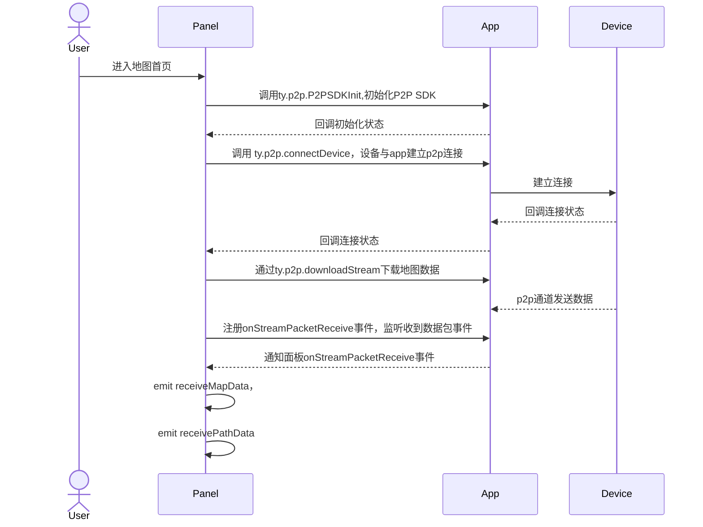
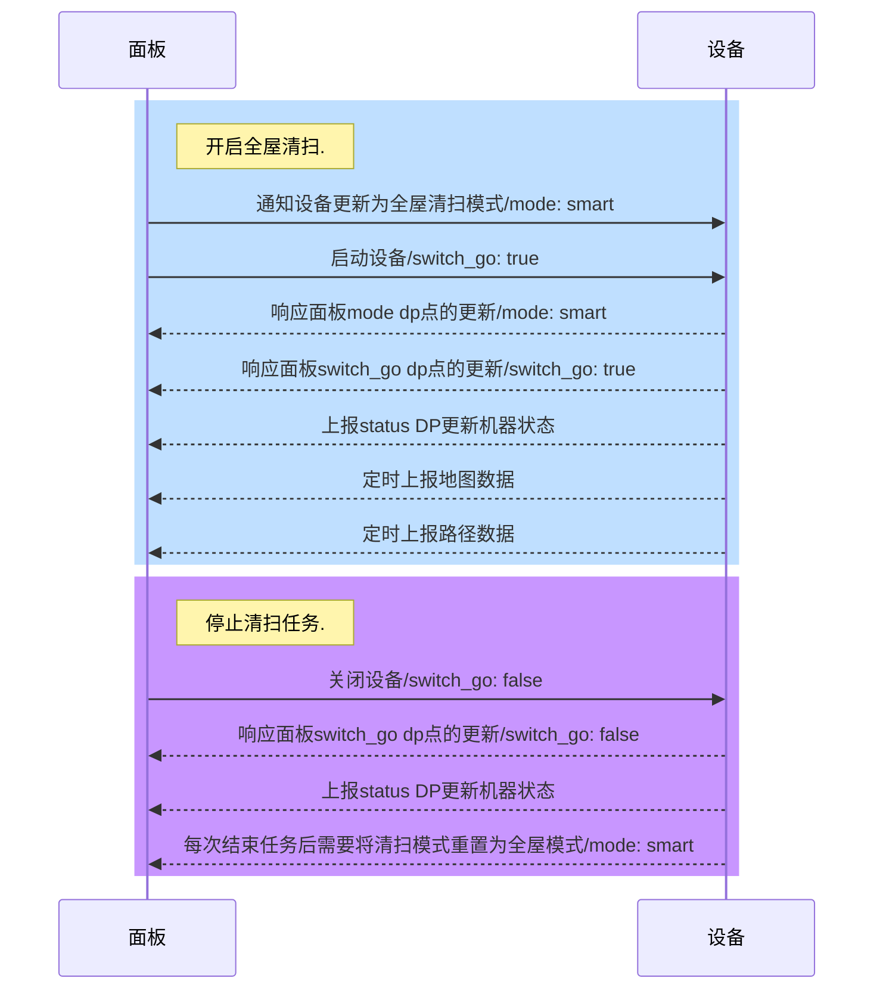
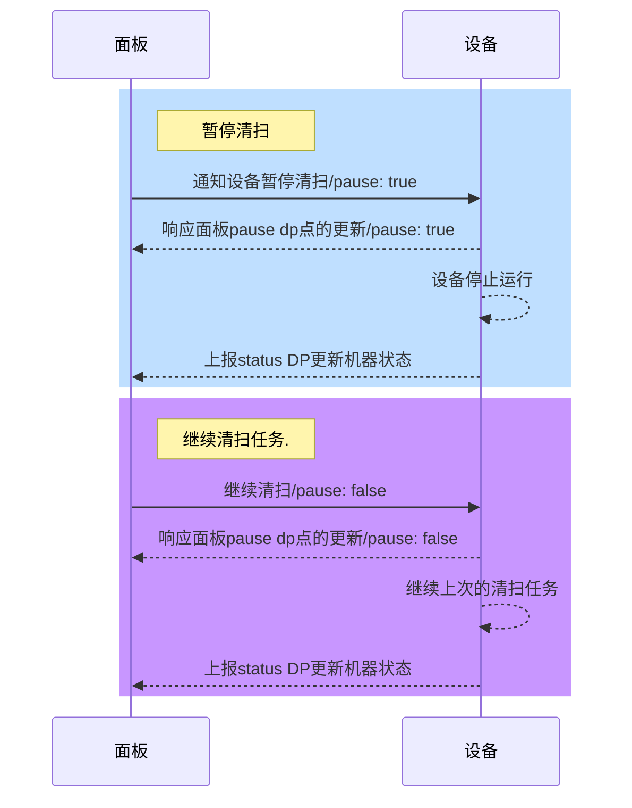
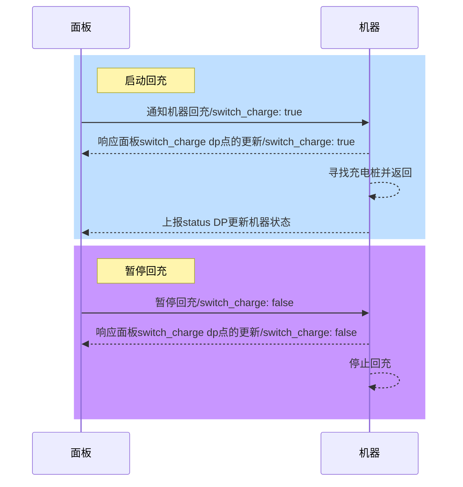
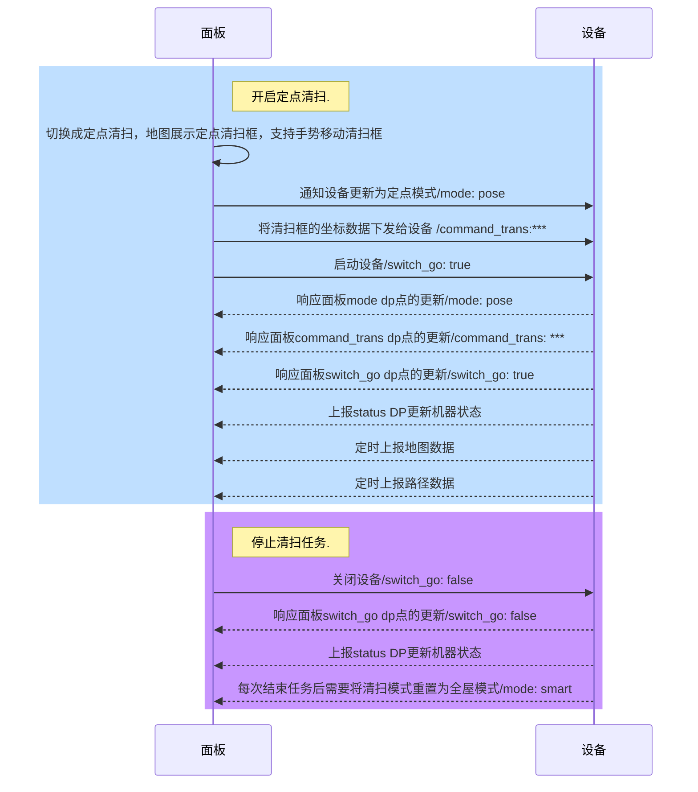
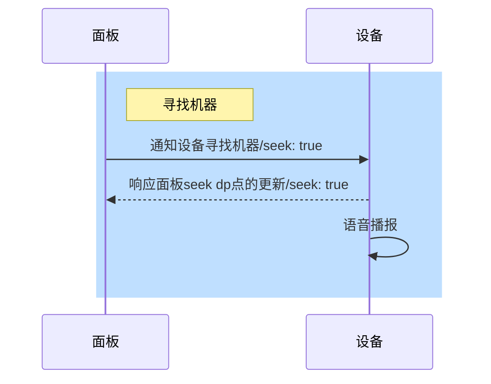

# 扫地机方案 (sweeper)

[AI-generated summary: 涂鸦扫地机解决方案提供完整的激光SLAM和陀螺仪双导航技术路线支持，集成实时地图呈现、智能清扫控制和交互管理能力。方案覆盖从硬件接入到UI开发的全栈支持，适配不同市场定位的产品需求。覆盖内容：激光SLAM导航、陀螺仪惯导、地图展示、禁区编辑、虚拟墙、地板材质、清扫模式、房间管理、路径规划、P2P数据流、MQTT协议、远程控制、地图编辑、定时功能、清扫记录]

### 涂鸦扫地机方案

> 涂鸦扫地机器人智能化方案，提供多种数据传输及管理服务，可以实现惯导、激光等导航技术的环境地图实时呈现和交互控制。在功能上我们实现了智能远程控制、智能清洁管理，同时结合IPC能力，可以通过手机端实时监控家中状况，及时知晓风险、意外等情况。在硬件接入方式上，提供了多种接入方式，MCU+云模组的方式及SDK+云模组的形式，智能控制面板也提供了多种风格的公版面板。如需了解更多关于扫地机的业务介绍，请联系负责您的项目经理或工单提问。

### 方案概述

涂鸦扫地机方案是一套完整的智能扫地机器人解决方案，为开发者提供从硬件接入到软件开发的完整技术栈支持。方案支持多种导航技术路线，满足不同市场定位和价格区间的产品需求。

#### 核心能力

- **多导航技术支持**：支持激光SLAM、惯导等多种导航方案
- **实时地图呈现**：提供环境地图的实时展示和交互控制能力
- **智能清洁管理**：支持多种清扫模式、区域管理、定时任务等智能功能
- **远程控制**：通过手机端实现设备的远程控制和状态监控
- **IPC融合能力**：结合智能摄像机能力，实现实时监控和风险预警
- **灵活接入方式**：支持MCU+云模组、SDK+云模组等多种硬件接入方案
- **丰富面板选择**：提供多种风格的公版面板，满足不同产品定位需求

#### 技术架构

涂鸦扫地机方案采用分层架构设计，将底层通信、数据处理、业务逻辑和UI展示进行解耦：

- **通信层**：支持DP数据、P2P数据、MQTT流服务、OSS云存储等多种通信方式
- **数据层**：提供地图数据解析、协议转换、状态管理等数据处理能力
- **业务层**：封装清扫控制、地图管理、房间管理等核心业务逻辑
- **展示层**：提供丰富的UI组件和交互能力，支持快速定制开发

### 导航技术方案

涂鸦扫地机方案支持两种主要的导航技术路线，满足不同市场定位和价格区间的产品需求。

#### 激光扫地机器人

激光扫地机器人采用激光雷达（LIDAR）结合SLAM（Simultaneous Localization and Mapping，即时定位与地图构建）技术，是目前市场上技术最成熟、定位精度最高的导航方案。

**核心特点**：

- **导航技术**：激光头 + SLAM算法
- **定位精度**：厘米级定位精度，能够精确识别房间边界和障碍物
- **市场定位**：高端市场，价格通常在2000元以上
- **适用场景**：大户型、多楼层住宅，对清扫精度和效率要求较高的场景

#### 惯导扫地机器人

惯导扫地机器人采用陀螺仪和加速度计等惯性传感器，结合碰撞检测技术实现导航定位，是一种成本较低、技术门槛相对较低的导航方案。

**核心特点**：

- **导航技术**：陀螺仪 + 碰撞检测
- **定位方式**：基于惯性传感器和碰撞信息进行相对定位
- **市场定位**：入门级市场，价格通常在1000-2000元区间
- **适用场景**：小户型、单层住宅，对成本控制要求较高的产品

### 方案选择建议

#### 技术路线对比

| 对比维度 | 激光导航（SLAM） | 惯导导航 |
| -------- | ---------------- | -------- |
| 定位精度 | ⭐⭐⭐⭐⭐       | ⭐⭐     |
| 建图能力 | ⭐⭐⭐⭐⭐       | ⭐⭐     |
| 避障能力 | ⭐⭐⭐⭐⭐       | ⭐⭐     |
| 成本     | 高               | 低       |
| 技术门槛 | 高               | 低       |
| 市场定位 | 高端             | 入门     |

#### 选择建议

- **追求高精度和完整功能**：选择激光导航方案（支持SLAM算法），适合高端产品定位
- **成本控制优先**：选择惯导导航方案，适合入门级产品

### 了解更多细节

根据您的技术路线选择，可以查看对应的详细文档：

#### **激光扫地机方案**

激光扫地机方案提供完整的新手入门、能力集、模块集等开发文档，包括：

- **新手入门**：快速开始、核心概念、方案概述
- **能力集**：组件使用、协议解析、数据流、自定义日志等
- **模块集**：清扫控制、地图管理、房间管理等完整功能模块

[了解更多细节 →](/cn/miniapp/solution-panel/ability/special/sweeper/robot-vacuum-laser/getting-started/overview)

#### **惯导扫地机方案**

惯导扫地机方案提供模板使用、API参考、地图组件等开发文档，包括：

- **新手入门**：快速开始、核心概念、方案概述
- **API 参考**：完整的 API 接口文档
- **地图组件**：地图组件的使用方法

[了解更多细节 →](/cn/miniapp/solution-panel/ability/special/sweeper/robot-vacuum-gyro/getting-started/overview)

### 开发资源

#### 开发工具

- **项目模板**：提供开箱即用的项目模板，快速启动开发
- **协议解析库**：提供地图协议解析、数据转换等工具库
- **调试工具**：提供自定义日志、调试工具等开发辅助功能

#### 技术支持

如需了解更多关于扫地机的业务介绍和技术支持，请联系负责您的项目经理或通过工单系统提问。

## 激光扫地机


### 新手入门

###### 方案概述

激光扫地机解决方案为开发者提供了一套完整的扫地机面板开发能力，帮助开发者快速构建功能丰富的扫地机应用。

###### 核心优势

- **模块化设计**：将底层实现与业务调用独立，开发者只需关注 UI 层面的处理
- **完整能力覆盖**：提供地图展示、清扫控制、多地图管理、地图编辑等完整功能
- **多种通信方式**：支持 dp 数据、P2P 数据等多种通信方案
- **丰富的开发工具**：提供项目模板、协议解析库、自定义日志等工具，降低开发成本

###### 主要功能

- **地图功能**：实时地图展示、多地图管理、地图编辑（禁区、虚拟墙、地板材质）
- **清扫控制**：开始清扫、暂停继续、回充、多种清扫模式（全屋、选区、定点、划区）
- **房间管理**：房间编辑（合并、分割、命名、清扫顺序）
- **其他功能**：定时功能、勿扰模式、清扫记录、语音包、手动控制
###### 快速开始

本指南将帮助你在 5 分钟内创建一个可以控制激光扫地机的基础项目。

###### 环境搭建

确保你已经完成了涂鸦小程序的基础环境搭建，包括：

- 安装 Node.js（推荐 v14+）
- 安装 Ray 开发工具
- 完成涂鸦开发者账号注册

###### 项目创建

使用项目模板快速创建项目：

###### 项目模板

项目模板是为了降低开发者搭建项目的难度，将常见的品类和常见能力进行了整理并对外提供了相应的项目源码。

**获取模板：**

- [模板文档](https://developer.tuya.com/cn/miniapp-codelabs/codelabs/panel-robot-sweeper-guide/index.html#0)
- [物料仓库](https://developer.tuya.com/material/library_hKiOVClc/component?code=SweepRobotTemplate)

###### 简单编码示例

以下是一个最基础的地图展示示例：

```typescript
import React, { useState } from 'react';
import { RobotMap, RoomProperty } from '@ray-js/robot-map';
import { useP2PDataStream } from '@ray-js/robot-data-stream';
import { useDevice } from '@ray-js/ray';

const RobotVacuumPanel = () => {
  const { devId } = useDevice(device => device.devInfo);

  // 地图和路径数据状态（通常来自 P2P 通道）
  const [mapData, setMapData] = useState<string>('');
  const [pathData, setPathData] = useState<string>('');

  // 房间属性数据（通常来自 MQTT 通道，结构化协议）
  const [roomProperties, setRoomProperties] = useState<RoomProperty[]>([]);

  // P2P 数据流处理
  const onMapData = (mapDataStr: string) => {
    // 处理地图数据
    setMapData(mapDataStr);
  };

  const onPathData = (pathDataStr: string) => {
    // 处理路径数据
    setPathData(pathDataStr);
  };

  // 使用 P2P 数据流获取地图和路径数据
  useP2PDataStream(devId, onMapData, onPathData);

  // 示例：房间属性数据结构（实际使用时从 MQTT 通道获取）
  // const roomProperties: RoomProperty[] = [
  //   {
  //     id: 1,
  //     name: '客厅',
  //     cleanTimes: 2,
  //     order: 1,
  //     floorType: 0,
  //     yMop: 1,
  //     suction: 0,
  //     cistern: 0,
  //     cleanMode: 0,
  //   },
  // ];

  // 地图准备就绪回调
  const handleMapReady = (mapApi) => {
    console.log('地图已准备就绪', mapApi);
  };

  return (
    <RobotMap
      map={mapData}
      path={pathData}
      roomProperties={roomProperties}
      onMapReady={handleMapReady}
    />
  );
};
```

###### 运行效果

完成上述步骤后，你将能够：

- 看到设备的地图数据
- 控制设备开始/暂停清扫
- 查看设备的实时路径

###### 下一步

- 了解 [核心概念](/cn/miniapp/solution-panel/ability/special/sweeper/robot-vacuum-laser/getting-started/core-concepts)，深入理解平台的关键术语和设计理念
- 查看 [能力集](/cn/miniapp/solution-panel/ability/special/sweeper/robot-vacuum-laser/ability-set)，了解完整的 API 和功能模块
###### 核心概念

本文档介绍激光扫地机开发中的关键术语和设计理念，帮助你更好地理解平台架构。

###### 数据流方案

激光扫地机由于品类的特殊性，在数据流上会集合多种通信类型：dp 数据、p2p 数据、oss 数据。

###### dp 数据

针对一些机器控制、状态等功能，是通过 dpCode 的方式完成设备与面板的通信。

**方案特点：** 涂鸦通用的通信方式，开发者接入和理解成本较低，但是会收到数据长度的限制，比如地图、路径等大数据传输无法使用此方案。

###### p2p 数据

使用涂鸦地图协议，App 使用 P2P 和扫地机进行连接，属于点对点连接，数据不经过云端。在实时地图和实时路径推送上会使用此方案。

**方案特点：** 不占用服务器和服务器网络带宽，成本较低。受网络波动影响较大。受外界因素影响较小，可用性较高。

###### oss 数据

使用涂鸦地图协议，地图使用 api 接口上传 OSS 云存储，面板向云端轮询请求 oss 文件，并下载解析进行渲染。在清扫记录和多地图管理中会使用此方案。

**方案特点：** 占用大量云存储资源和网络流量资源，成本高，受网络波动较小。

###### 地图坐标系

机器人进行一次新清扫任务时，以机器人从初始位置出发，边清扫边建图，形成清扫地图和清扫路径，地图逐渐扩大，路径不断累积，过程中涉及世界坐标系、机器坐标系以及 APP 显示的屏幕坐标系统。


###### 世界坐标系

实际的物理坐标系，即房间的平面坐标系，机器人每次清扫时，以世界坐标系的某一个点作为起始点，而且在本次清扫中，这个起始点在世界坐标系中的位置是不变的。世界坐标系，用于参照和理解机器坐标系。

###### 机器坐标系

机器人以初始点为原点，参照世界坐标系，建立机器坐标系。清扫过程中，路径点均参照以该原点，得到坐标值。

###### 屏幕坐标系

APP 绘图时使用，以屏幕左上角 **R(0,0)** 为坐标系原点。

###### 地图坐标的转换

**地图数据**

机器清扫后形成的地图是一个不规则的多边形，为方便处理，取多边形的外接矩形，作为机器的地图。地图数据，是以 UINT8_T 形式的数组，压缩前，地图总像素点为 Map_width \* Map_height，地图数组第一个数据点 UINT8_T0，即为左上角 R(0,0)。

机器原点 O(x,y)，x/y 为相对于 R 的像素个数。随着清扫的进行，地图宽高会改变，原点 O 在地图数组的位置也会变化（x/y 值改变）。

说明：APP 绘图时，以原点 O 作为固定，等同于世界坐标系下，机器人初始位置不变。

**路径数据**

路径数据是走过的位置点的集合，其坐标为 INT16 的值，当前位置点为 P(x,y)，x/y 为 P 点相对于 O 点的值。

说明：路径坐标传输值 = 路径坐标原值 \* 10，以兼顾精度与效率。

**区域框等数据**

区域清扫框、禁区框、虚拟墙线、指哪扫哪点等坐标数据，其坐标为 INT16 的值，坐标点 M(x,y)，x/y 为 M 点相对于 O 点的值，基于绘制坐标系。

说明：区域框坐标传输值 = 区域框坐标原值 \* 10，以兼顾精度与效率。

###### P2P 通信

###### 简介

P2P 通俗讲实际上就是点对点的通信，在机器人业务中使用 P2P 主要是建立手机和机器人的通信连接，这种通信连接不经过云端服务器来作为媒介传递数据（但需要云端服务器做打洞建联），从而可以在局域网环境或者广域网环境下，节省使用云端服务器的网络及存储开销成本。[查看更多](https://zh.wikipedia.org/wiki/%E5%B0%8D%E7%AD%89%E7%B6%B2%E8%B7%AF)

###### 交互指令说明

机器运行后，本地存储全量地图数据和路径数据，用户在 APP 上打开设备面板后，会发起 P2P 建连，当建立连接成功后，机器上报本地缓存的地图和路径数据。

**地图数据**

地图数据为全量形式，当机器周围环境发生变化时，此数据会更新，机器需先缓存在本地，首次建立连接后必须上报，之后可定时或有更新时主动上报。

【注意】上报频率建议无变化不上报、有变化大于 5S 的频率上报。

**路径数据**

当机器路径数据变化时，为提高传输效率，采用全量和增量结合方式上报：

APP 首次建立连接后，机器响应，通过全量接口，上报全量路径，之后可定时或有更新时主动上报。

【注意】上报频率建议无变化不上报、有变化大于 2S 的频率上报。

###### 流程图

面板与设备之间建立 P2P 是一个很复杂的过程，APP 提供了多个方法来完成整个建立连接的流程，具体如下：



###### 如何开发

为了能够让面板开发者能够更关注数据的处理，我们将建立 P2P 建立连接的过程封装到了 `@ray-js/robot-data-stream` 库中。

```typescript
// 引入@ray-js/robot-data-stream模块
import { StreamDataNotificationCenter, useP2PDataStream } from '@ray-js/robot-data-stream';

const onMapData = (mapDataStr: string) => {
    // 这里收到的mapDataStr为设备上报的地图数据
    // 你的业务逻辑
};

const onPathData = (pathDataStr: string) => {
    // 这里收到的pathDataStr为设备上报的路径数据
    // 你的业务逻辑
};

const { appendDownloadStreamDuringTask } = useP2PDataStream(
  // 设备id
    getDevInfo().devId,
    onMapData,
    onPathData,
    {
      // 小程序使用的App日志的tag，有需要可以自行更改，用于后期遇到线上问题，通过上传App日志检索该tag进行问题定位
      logTag: APP_LOG_TAG,
      // 可选参数, 机器人使用视觉识别的缩略概况数据从这里抛出，如果机器没有此功能可以忽略此方法
      onReceiveAIPicData,
      // 可选参数, 机器人使用视觉识别的高清原图从这里抛出，如果机器没有此功能可忽略
      onReceiveAIPicHDData,
    }
  );
```

### 能力集

###### 品类 API

###### 清扫记录

- **接口： 获取清扫记录**
  - 含义：获取扫地机设备指定时间段内的清扫记录数据,设备端需要在每次清扫结束之后，按照约定协议将清扫数据上报给云端。
  - 接口详情：[getCleaningRecords](/cn/miniapp/develop/ray/api/sweeper-vacuum/laser/record)
- **接口： 删除清扫记录**
  - 含义：面板端支持对清扫记录进行删除，删除后该条数据会从清扫记录列表中移除。
  - 接口详情：[deleteCleaningRecord](/cn/miniapp/develop/ray/api/sweeper-vacuum/laser/record)

###### 设备语音

- **接口： 获取设备支持的语音列表**
  - 含义：获取设备支持的语音列表，该功能适用于激光扫地机等支持设备语音播报功能的设备，需要先将支持的个性语音包上传到云端，用户点击使用对应的语音包，下载到本地使用。
  - 接口详情：[getVoiceList](/cn/miniapp/develop/ray/api/sweeper-vacuum/laser/voice)

###### 多地图管理

- **接口：获取多地图列表**
  - 含义：获取多地图列表，设备端需要在某些特定时机（如面板触发某些功能或地图更新较大等情况），按照约定的协议将地图数据上报给云端。
  - 接口详情：[getMultipleMapFiles](/cn/miniapp/develop/ray/api/sweeper-vacuum/laser/map)
- **接口：获取云存储配置**
  - 含义：获取云存储配置，在获取多地图时会使用到此接口的返回数据。
  - 接口详情：[getSweeperStorageConfig](/cn/miniapp/develop/ray/api/sweeper-vacuum/laser/map)
###### 关键依赖模块

为了能够让开发者更关注在 UI 层面的处理，而不需要过多关心一些其他的流程逻辑处理，我们将扫地机进行模块拆分，将底层实现与业务调用独立。目前扫地机面板主要依赖的包有以下几个

**@ray-js/robot-map** 业务层直接调用， 提供了WebView地图组件和Rjs地图组件，并且暴露了地图操作的常用方法。

**@ray-js/robot-data-stream** 业务层直接调用，封装了面板与设备的 P2P 传输方法，开发者可以忽略 P2P 通信过程中的复杂过程，只需要关注业务本身逻辑

**@ray-js/robot-protocol** 业务层直接调用，提供完整协议解析标准能力，将扫地机协议中比较复杂的 raw 类型 dp 点的解析、编码过程进行了封装

**@ray-js/webview-invoke** 底层依赖，提供了小程序与底层 SDK 的通信能力，一般情况下不需要修改

对于常规的扫地机需求，基本上只关注应用业务逻辑和 UI 展示，不需要关心内部依赖包中的实现，依赖包的升级会做到向下兼容，可以在项目中针对依赖包进行单独升级。
###### @ray-js/robot-protocol
@ray-js/robot-protocol中提供扫地机中常用的复杂协议的解码和编码的方法，方法命名大部分都是依据协议中的cmd命令号来命名的，可以以此为依据快速索引。

在该文档中不会涉及具体的协议格式，如需了解，请联系您的客户经理或提工单咨询。

###### 虚拟墙
###### encodeVirtualWall0x12 
将虚拟墙数据编码为特定格式的字符串,适用于0x12/0x13，V1.0.0版本

**参数**

- `params` (对象): 包含以下属性的对象
  - `walls` (Point[][]): 虚拟墙的端点坐标数组，每个虚拟墙由一组点组成。
  - `origin` (Point): 地图的原点坐标。
  - `mapScale` (number, 可选): 地图的缩放比例，默认为 1。
  - `version` ('0' | '1', 可选): 协议版本版本号，默认为 '1'。

**返回值**

- `string`: 编码后的虚拟墙数据字符串。

**示例**

```typescript
const walls = [
  [{ x: 1, y: 2 }, { x: 3, y: 4 }],
  [{ x: 5, y: 6 }, { x: 7, y: 8 }]
];
const origin = { x: 0, y: 0 };
const mapScale = 1;
const version = '1';

const encodedString = encodeVirtualWall0x12({ walls, origin, mapScale, version });
console.log(encodedString);
```

###### decodeVirtualWall0x13
从指令中解析获取虚拟墙数据 (0x13) | Robot ➜ App

**参数**

- `params` (对象): 包含以下属性的对象
  - `command` (string): 包含虚拟墙数据的指令字符串。
  - `mapScale` (number, 可选): 地图的缩放比例，默认为 1。
  - `version` ('0' | '1', 可选): 版本号，默认为 '1'。

**返回值**

- `Point[][] | null`: 解析后的虚拟墙数据，若指令无效则返回 `null`。

**示例**

```typescript
const command = "your_command_string_here";
const mapScale = 1;
const version = '1';

const walls = decodeVirtualWall0x13({ command, mapScale, version });
console.log(walls);
```
###### 选区清扫
###### requestRoomClean0x15
向设备请求选区清扫数据 (0x15) | App ➜ Robot

**参数**

- `params` (对象, 可选): 包含以下属性的对象
  - `version` ('0' | '1', 可选): 版本号，默认为 '1'。

**返回值**

- `string`: 请求选区清扫数据的指令字符串。

**示例**

```typescript
const command = requestRoomClean0x15({ version: '1' });
console.log(command);
```
###### encodeRoomClean0x14
设置选区清扫的指令 (0x14) | App ➜ Robot

**参数**
- `params` (对象): 包含以下属性的对象
  - `cleanTimes` (number): 清扫次数。
  - `roomHexIds` (string[], 可选): 房间的十六进制 ID 数组。
  - `roomIds` (number[], 可选): 房间的 ID 数组。
  - `mapVersion` (0 | 1 | 2, 可选): 地图版本，默认为 2。
  - `version` ('0' | '1', 可选): 版本号，默认为 '1'。

**返回值**

- `string`: 设置选区清扫的指令字符串。

**示例**

```typescript
const command = encodeRoomClean0x14({
  cleanTimes: 2,
  roomHexIds: ['1A', '2B'],
  mapVersion: 2,
  version: '1'
});
console.log(command);
```

###### decodeRoomClean0x15
从指令中解析获取选区清扫信息 (0x15) | Robot ➜ App

**参数**

- `params` (对象): 包含以下属性的对象
  - `command` (string): 包含选区清扫信息的指令字符串。
  - `mapVersion` (0 | 1 | 2, 可选): 地图版本，默认为 2。
  - `version` ('0' | '1', 可选): 协议版本号，默认为 '1'。

**返回值**

- `object | null`: 解析后的选区清扫信息对象，若指令无效则返回 `null`。
包含以下属性：
  - `cleanTimes` (number): 清扫次数。
  - `roomIds` (number[]): 房间的 ID 数组。
  - `roomHexIds` (string[]): 房间的十六进制 ID 数组。 若指令无效则返回 null。

**示例**

```typescript
const command = "your_command_string_here";
const result = decodeRoomClean0x15({ command, mapVersion: 2, version: '1' });
console.log(result);
```

###### `requestRoomClean0x57`

向设备请求选区清扫数据 (0x57) | App ➜ Robot

**参数**

- `params` (对象, 可选): 包含以下属性的对象
  - `version` ('0' | '1', 可选): 版本号，默认为 '1'。

**返回值**

- `string`: 请求选区清扫数据的指令字符串。

**示例**

```typescript
const command = requestRoomClean0x57({ version: '1' });
console.log(command);
```

###### `encodeRoomClean0x56`

设置选区清扫的指令 (0x56) | App ➜ Robot

**参数**

- `params` (对象): 包含以下属性的对象
  - `rooms` (Room[]): 房间信息数组，每个房间包含以下属性：
    - `roomHexId` (string, 可选): 房间的十六进制 ID。
    - `roomId` (number, 可选): 房间的 ID。
    - `cleanTimes` (number): 清扫次数。
    - `yMop` (number): 拖地次数。
    - `suction` (number): 吸力等级。
    - `cistern` (number): 水箱等级。
  - `mapVersion` (0 | 1 | 2, 可选): 地图版本，默认为 2。
  - `version` ('0' | '1', 可选): 版本号，默认为 '1'。

**返回值**

- `string`: 设置选区清扫的指令字符串。

**示例**

```typescript
const command = encodeRoomClean0x56({
  rooms: [
    { roomHexId: '1A', cleanTimes: 2, yMop: 1, suction: 3, cistern: 2 },
    { roomId: 2, cleanTimes: 1, yMop: 1, suction: 2, cistern: 1 }
  ],
  mapVersion: 2,
  version: '1'
});
console.log(command);
```
###### `decodeRoomClean0x57`

从指令中解析获取选区清扫信息 (0x57) | Robot ➜ App

**参数**

- `params` (对象): 包含以下属性的对象
  - `command` (string): 包含选区清扫信息的指令字符串。
  - `mapVersion` (0 | 1 | 2, 可选): 地图版本，默认为 2。
  - `version` ('0' | '1', 可选): 版本号，默认为 '1'。

**返回值**

- `Room[] | null`: 解析后的选区清扫信息数组，每个房间包含以下属性：
  - `roomHexId` (string): 房间的十六进制 ID。
  - `roomId` (number): 房间的 ID。
  - `suction` (number): 吸力等级。
  - `cistern` (number): 水箱等级。
  - `yMop` (number): 拖地次数。
  - `cleanTimes` (number): 清扫次数。
  若指令无效则返回 `null`。

**示例**

```typescript
const command = "your_command_string_here";
const rooms = decodeRoomClean0x57({ command, mapVersion: 2, version: '1' });
console.log(rooms);
```

###### 划区清扫
###### `requestZoneClean0x3b`

向设备请求划区清扫数据 (0x3b) | App ➜ Robot

**参数**

- `params` (对象, 可选): 包含以下属性的对象
  - `version` ('0' | '1', 可选): 版本号，默认为 '1'。

**返回值**

- `string`: 请求划区清扫数据的指令字符串。

**示例**

```typescript
const command = requestZoneClean0x3b({ version: '1' });
console.log(command);
```
###### `encodeZoneClean0x3a`

划区清扫的指令 (0x3a) | App ➜ Robot

**参数**

- `params` (对象): 包含以下属性的对象
  - `protocolVersion` (1 | 2 | 3): 协议版本。
  - `zones` (Zone[]): 划区清扫的区域信息数组，每个区域包含以下属性：
    - `points` (Point[]): 区域的顶点坐标数组。
    - `name` (string, 可选): 区域名称。
    - `advanced` (对象, 可选): 高级设置，包含以下属性：
      - `id` (number): 区域 ID。
      - `localSave` (number): 本地保存标志。
      - `order` (number): 清扫顺序。
      - `cleanMode` (number): 清扫模式。
      - `cleanTimes` (number): 清扫次数。
      - `suction` (number): 吸力等级。
      - `cistern` (number): 水箱等级。
  - `origin` (Point): 地图的原点坐标。
  - `cleanMode` (CleanMode, 可选): 清扫模式，默认为 0。
  - `suction` (Suction, 可选): 吸力等级，默认为 0。
  - `cistern` (Cistern, 可选): 水箱等级，默认为 0。
  - `cleanTimes` (number, 可选): 清扫次数，默认为 1。
  - `mapScale` (number, 可选): 地图的缩放比例，默认为 1。
  - `version` ('0' | '1', 可选): 版本号，默认为 '1'。

**返回值**

- `string`: 划区清扫的指令字符串。

**示例**

```typescript
const command = encodeZoneClean0x3a({
  protocolVersion: 3,
  zones: [
    {
      points: [{ x: 10, y: 20 }, { x: 30, y: 40 }, { x: 50, y: 60 }, { x: 70, y: 80 }],
      name: '区域1',
      advanced: {
        id: 1,
        localSave: 1,
        order: 1,
        cleanMode: 1,
        cleanTimes: 2,
        suction: 3,
        cistern: 2
      }
    }
  ],
  origin: { x: 0, y: 0 },
  mapScale: 1,
  version: '1'
});
console.log(command);
```
###### `decodeZoneClean0x3b`

从指令中解析获取划区清扫数据 (0x3b) | Robot ➜ App

**参数**

- `params` (对象): 包含以下属性的对象
  - `command` (string): 包含划区清扫数据的指令字符串。
  - `mapScale` (number, 可选): 地图的缩放比例，默认为 1。
  - `version` ('0' | '1', 可选): 版本号，默认为 '1'。

**返回值**

- `object | null`: 解析后的划区清扫数据对象，包含以下属性：
  - `protocolVersion` (1 | 2 | 3): 协议版本。
  - `zones` (Zone[]): 划区清扫的区域信息数组，每个区域包含以下属性：
    - `points` (Point[]): 区域的顶点坐标数组。
    - `name` (string): 区域名称。
    - `advanced` (对象, 可选): 高级设置，包含以下属性（仅在协议版本 3 时返回）：
      - `id` (number): 区域 ID。
      - `localSave` (number): 本地保存标志。
      - `order` (number): 清扫顺序。
      - `cleanMode` (number): 清扫模式。
      - `cleanTimes` (number): 清扫次数。
      - `suction` (number): 吸力等级。
      - `cistern` (number): 水箱等级。
  - `cleanMode` (CleanMode, 可选): 清扫模式（仅在协议版本 2 时返回）。
  - `suction` (Suction, 可选): 吸力等级（仅在协议版本 2 时返回）。
  - `cistern` (Cistern, 可选): 水箱等级（仅在协议版本 2 时返回）。
  - `cleanTimes` (number, 可选): 清扫次数（仅在协议版本 2 时返回）。
  若指令无效则返回 `null`。

**示例**

```typescript
const command = "your_command_string_here";
const result = decodeZoneClean0x3b({ command, mapScale: 1, version: '1' });
console.log(result);
```

###### 定点清扫

###### `requestSpotClean0x17`

向设备请求定点清扫数据 (0x17) | App ➜ Robot

**参数**

- `params` (对象, 可选): 包含以下属性的对象
  - `version` ('0' | '1', 可选): 版本号，默认为 '1'。

**返回值**

- `string`: 请求定点清扫数据的指令字符串。

**示例**

```typescript
const command = requestSpotClean0x17({ version: '1' });
console.log(command);
```

###### `encodeSpotClean0x16`

设置定点清扫的指令 (0x16) | App ➜ Robot

**参数**

- `params` (对象): 包含以下属性的对象
  - `point` (Point): 定点清扫的目标点坐标。
  - `origin` (Point): 地图的原点坐标。
  - `mapScale` (number, 可选): 地图的缩放比例，默认为 1。
  - `version` ('0' | '1', 可选): 版本号，默认为 '1'。

**返回值**

- `string`: 设置定点清扫的指令字符串。

**示例**

```typescript
const command = encodeSpotClean0x16({
  point: { x: 10, y: 20 },
  origin: { x: 0, y: 0 },
  mapScale: 1,
  version: '1'
});
console.log(command);
```
###### `decodeSpotClean0x17`

从指令中解析获取定点清扫数据 (0x17) | Robot ➜ App

**参数**

- `params` (对象): 包含以下属性的对象
  - `command` (string): 包含定点清扫数据的指令字符串。
  - `mapScale` (number, 可选): 地图的缩放比例，默认为 1。
  - `version` ('0' | '1', 可选): 版本号，默认为 '1'。

**返回值**

- `object | null`: 解析后的定点清扫信息对象，包含以下属性：
  - `point` (Point): 定点清扫的目标点坐标。
  若指令无效则返回 `null`。

**示例**

```typescript
const command = "your_command_string_here";
const result = decodeSpotClean0x17({ command, mapScale: 1, version: '1' });
console.log(result)
```

###### `requestSpotClean0x3f`

向设备请求定点清扫数据 (0x3f) | App ➜ Robot

**参数**

- `params` (对象, 可选): 包含以下属性的对象
  - `version` ('0' | '1', 可选): 版本号，默认为 '1'。

**返回值**

- `string`: 请求定点清扫数据的指令字符串。

**示例**

```typescript
const command = requestSpotClean0x3f({ version: '1' });
console.log(command);
```

###### `encodeSpotClean0x3e`

设置定点清扫的指令 (0x3e) | App ➜ Robot

**参数**

- `params` (对象): 包含以下属性的对象
  - `protocolVersion` (1 | 2): 协议版本。
  - `points` (Point[]): 定点清扫的目标点坐标数组。
  - `origin` (Point): 地图的原点坐标。
  - `cleanMode` (CleanMode, 可选): 清扫模式。
  - `suction` (Suction, 可选): 吸力等级。
  - `cistern` (Cistern, 可选): 水箱等级。
  - `cleanTimes` (number, 可选): 清扫次数。
  - `mapScale` (number, 可选): 地图的缩放比例，默认为 1。
  - `version` ('0' | '1', 可选): 版本号，默认为 '1'。

**返回值**

- `string`: 设置定点清扫的指令字符串。

**示例**

```typescript
const command = encodeSpotClean0x3e({
  protocolVersion: 2,
  points: [{ x: 10, y: 20 }, { x: 30, y: 40 }],
  origin: { x: 0, y: 0 },
  mapScale: 1,
  version: '1'
});
console.log(command);
```
###### `decodeSpotClean0x3f`

从指令中解析获取定点清扫数据 (0x3f) | Robot ➜ App

**参数**

- `params` (对象): 包含以下属性的对象
  - `command` (string): 包含定点清扫数据的指令字符串。
  - `mapScale` (number, 可选): 地图的缩放比例，默认为 1。
  - `version` ('0' | '1', 可选): 版本号，默认为 '1'。

**返回值**

- `object | null`: 解析后的定点清扫信息对象，包含以下属性：
  - `protocolVersion` (1 | 2): 协议版本。
  - `points` (Point[]): 定点清扫的目标点坐标数组。
  - `cleanMode` (CleanMode, 可选): 清扫模式（仅在协议版本 1 时返回）。
  - `suction` (Suction, 可选): 吸力等级（仅在协议版本 1 时返回）。
  - `cistern` (Cistern, 可选): 水箱等级（仅在协议版本 1 时返回）。
  - `cleanTimes` (number, 可选): 清扫次数（仅在协议版本 1 时返回）。
  若指令无效则返回 `null`。

**示例**

```typescript
const command = "your_command_string_here";
const result = decodeSpotClean0x3f({ command, mapScale: 1, version: '1' });
console.log(result);
```

###### 禁区设置
###### `requestVirtualArea0x39`

向设备请求禁区数据 (0x39) | App ➜ Robot

**参数**

- `params` (对象, 可选): 包含以下属性的对象
  - `version` ('0' | '1', 可选): 版本号，默认为 '1'。

**返回值**

- `string`: 请求禁区数据的指令字符串。

**示例**

```typescript
const command = requestVirtualArea0x39({ version: '1' });
console.log(command);
```

###### `encodeVirtualArea0x38`

设置禁区的指令 (0x38) | App ➜ Robot

**参数**

- `params` (对象): 包含以下属性的对象
  - `protocolVersion` (1 | 2): 协议版本。
  - `virtualAreas` (VirtualArea[]): 禁区信息数组，每个禁区包含以下属性：
    - `points` (Point[]): 禁区的顶点坐标数组。
    - `mode` (number): 禁区模式。
    - `name` (string, 可选): 禁区名称。
  - `origin` (Point): 地图的原点坐标。
  - `mapScale` (number, 可选): 地图的缩放比例，默认为 1。
  - `version` ('0' | '1', 可选): 版本号，默认为 '1'。

**返回值**

- `string`: 设置禁区的指令字符串。

**示例**

```typescript
const command = encodeVirtualArea0x38({
  protocolVersion: 2,
  virtualAreas: [
    {
      points: [{ x: 10, y: 20 }, { x: 30, y: 40 }, { x: 50, y: 60 }, { x: 70, y: 80 }],
      mode: 1,
      name: '禁区1'
    }
  ],
  origin: { x: 0, y: 0 },
  mapScale: 1,
  version: '1'
});
console.log(command);
```

###### `decodeVirtualArea0x39`

从指令中解析获取禁区数据 (0x39) | Robot ➜ App

**参数**

- `params` (对象): 包含以下属性的对象
  - `command` (string): 包含禁区数据的指令字符串。
  - `mapScale` (number, 可选): 地图的缩放比例，默认为 1。
  - `version` ('0' | '1', 可选): 版本号，默认为 '1'。

**返回值**

- `object | null`: 解析后的禁区数据对象，包含以下属性：
  - `protocolVersion` (1 | 2): 协议版本。
  - `virtualAreas` (VirtualArea[]): 禁区信息数组，每个禁区包含以下属性：
    - `mode` (number): 禁区模式。
    - `points` (Point[]): 禁区的顶点坐标数组。
    - `name` (string): 禁区名称。
  若指令无效则返回 `null`。

**示例**

```typescript
const command = "your_command_string_here";
const result = decodeVirtualArea0x39({ command, mapScale: 1, version: '1' });
console.log(result);
```

###### 分区分隔
###### `decodeVirtualArea0x39`

从指令中解析获取禁区数据 (0x39) | Robot ➜ App

**参数**

- `params` (对象): 包含以下属性的对象
  - `command` (string): 包含禁区数据的指令字符串。
  - `mapScale` (number, 可选): 地图的缩放比例，默认为 1。
  - `version` ('0' | '1', 可选): 版本号，默认为 '1'。

**返回值**

- `object | null`: 解析后的禁区数据对象，包含以下属性：
  - `protocolVersion` (1 | 2): 协议版本。
  - `virtualAreas` (VirtualArea[]): 禁区信息数组，每个禁区包含以下属性：
    - `mode` (number): 禁区模式。
    - `points` (Point[]): 禁区的顶点坐标数组。
    - `name` (string): 禁区名称。
  若指令无效则返回 `null`。

**示例**

```typescript
const command = "your_command_string_here";
const result = decodeVirtualArea0x39({ command, mapScale: 1, version: '1' });
console.log(result);
```

###### `decodePartitionDivision0x1d`

解析设备响应的分区分割结果 (0x1d) | Robot ➜ App

**参数**

- `params` (对象): 包含以下属性的对象
  - `command` (string): 包含分区分割结果的指令字符串。
  - `mapScale` (number, 可选): 地图的缩放比例，默认为 1。
  - `version` ('0' | '1', 可选): 版本号，默认为 '1'。

**返回值**

- `object | null`: 解析后的分区分割结果对象，包含以下属性：
  - `ret` (number): 返回码。
  - `success` (boolean): 是否成功。
  - `roomId` (number): 房间的 ID。
  - `points` (Point[]): 分区分割的顶点坐标数组。
  若指令无效则返回 `null`。

**示例**

```typescript
const command = "your_command_string_here";
const result = decodePartitionDivision0x1d({ command, mapScale: 1, version: '1' });
console.log(result);
```

###### 设置清扫顺序
###### `requestRoomOrder0x26`

向设备请求房间清扫顺序数据 (0x26) | App ➜ Robot

**参数**

- `params` (对象, 可选): 包含以下属性的对象
  - `version` ('0' | '1', 可选): 版本号，默认为 '1'。

**返回值**

- `string`: 请求房间清扫顺序数据的指令字符串。

**示例**

```typescript
const command = requestRoomOrder0x26({ version: '1' });
console.log(command);
```
###### encodeRoomOrder0x26
编码房间顺序信息 (0x26 / 0x27) | App ➜ Robot

**参数**

- params (对象): 包含以下属性的对象
  - roomIdHexs (string[]): 房间ID的数组，每个房间ID是一个字符串。
  - mapVersion (0 | 1 | 2): 地图版本。
  - version ('0' | '1', 可选): 编码版本号，默认为 '1'。

**返回值**

string: 编码后的房间顺序信息字符串。

**示例**
```typescript
const command = encodeRoomOrder0x26({
  roomIdHexs: ['1A', '2B', '3C'],
  mapVersion: 1,
  version: '1'
});
console.log(command);
```
###### decodeRoomOrder0x27
解码房间清扫顺序信息 (0x27) | Robot ➜ App

**参数**

- params (对象): 包含以下属性的对象
  - command (string): 待解码的命令字符串。
  - version ('0' | '1', 可选): 命令字符串的版本信息，默认为 '1'。

**返回值**

- number[] | null: 解码后的房间订单信息数组，如果解码失败则返回 null。

**示例**
```typescript
const command = "your_command_string_here";
const result = decodeRoomOrder0x27({ command, version: '1' });
console.log(result);
```

###### 分区分隔
###### `encodePartitionDivision0x1c`

向设备下发的分区分割指令 (0x1c) | App ➜ Robot

**参数**

- `params` (对象): 包含以下属性的对象
  - `roomId` (number): 房间的 ID。
  - `points` (Point[]): 分区划分的顶点坐标数组。
  - `origin` (Point): 地图的原点坐标。
  - `mapScale` (number, 可选): 地图的缩放比例，默认为 1。
  - `version` ('0' | '1', 可选): 版本号，默认为 '1'。

**返回值**

- `string`: 设置分区划分的指令字符串。

**示例**

```typescript
const command = encodePartitionDivision0x1c({
  roomId: 1,
  points: [{ x: 10, y: 20 }, { x: 30, y: 40 }],
  origin: { x: 0, y: 0 },
  mapScale: 1,
  version: '1'
});
console.log(command);
```

###### decodePartitionDivision0x1d
解析设备响应的分区分割结果 (0x1d) | Robot ➜ App

**参数**

- params (对象): 包含以下属性的对象
  - command (string): 包含分区分割结果的指令字符串。
  - mapScale (number, 可选): 地图的缩放比例，默认为 1。
  - version ('0' | '1', 可选): 版本号，默认为 '1'。

**返回值**

- object | null: 解析后的分区分割结果对象，包含以下属性：
  - ret (number): 返回码。
  - success (boolean): 是否成功。
  - roomId (number): 房间的 ID。
  - points (Point[]): 分区分割的顶点坐标数组。 若指令无效则返回 null。

**示例**
```typescript
const command = "your_command_string_here";
const result = decodePartitionDivision0x1d({ command, mapScale: 1, version: '1' });
console.log(result);
```

###### 分区合并

###### `encodePartitionMerge0x1e`

向设备下发的分区合并指令 (0x1e) | App ➜ Robot

**参数**

- `params` (对象): 包含以下属性的对象
  - `roomIds` (number[]): 要合并的房间 ID 数组。
  - `version` ('0' | '1', 可选): 版本号，默认为 '1'。

**返回值**

- `string`: 设置分区合并的指令字符串。

**示例**

```typescript
const command = encodePartitionMerge0x1e({
  roomIds: [1, 2, 3],
  version: '1'
});
console.log(command);
```
###### `decodePartitionMerge1f`

解析设备响应的分区合并结果 (0x1f) | Robot ➜ App

**参数**

- `params` (对象): 包含以下属性的对象
  - `command` (string): 包含分区合并结果的指令字符串。
  - `version` ('0' | '1', 可选): 版本号，默认为 '1'。

**返回值**

- `object | null`: 解析后的分区合并结果对象，包含以下属性：
  - `ret` (number): 返回码。
  - `success` (boolean): 是否成功。
  若指令无效则返回 `null`。

**示例**

```typescript
const command = "your_command_string_here";
const result = decodePartitionMerge1f({ command, version: '1' });
console.log(result);
```

###### 设置房间名称
###### `encodeSetRoomName0x24`

向设备下发的设置房间名称指令 (0x24) | App ➜ Robot

**参数**

- `params` (对象): 包含以下属性的对象
  - `rooms` (Room[]): 房间信息数组，每个房间包含以下属性：
    - `roomHexId` (string, 可选): 房间的十六进制 ID。
    - `roomId` (number, 可选): 房间的 ID。
    - `name` (string, 可选): 房间名称。
  - `mapVersion` (0 | 1 | 2, 可选): 地图版本，默认为 2。
  - `version` ('0' | '1', 可选): 版本号，默认为 '1'。

**返回值**

- `string`: 设置房间名称的指令字符串。

**示例**

```typescript
const command = encodeSetRoomName0x24({
  rooms: [
    { roomHexId: '1A', name: '客厅' },
    { roomId: 2, name: '卧室' }
  ],
  mapVersion: 2,
  version: '1'
});
console.log(command);
```
###### `decodeSetRoomName0x25`

解析设备响应的设置房间名称结果 (0x25) | Robot ➜ App

**参数**

- `params` (对象): 包含以下属性的对象
  - `command` (string): 包含设置房间名称结果的指令字符串。
  - `mapVersion` (0 | 1 | 2, 可选): 地图版本，默认为 2。
  - `version` ('0' | '1', 可选): 版本号，默认为 '1'。

**返回值**

- `Room[] | null`: 解析后的房间信息数组，每个房间包含以下属性：
  - `roomHexId` (string): 房间的十六进制 ID。
  - `roomId` (number): 房间的 ID。
  - `name` (string): 房间名称。
  若指令无效则返回 `null`。

**示例**

```typescript
const command = "your_command_string_here";
const rooms = decodeSetRoomName0x25({ command, mapVersion: 2, version: '1' });
console.log(rooms);
```
###### 设置房间属性
###### `encodeSetRoomProperty0x22`

向设备下发的设置房间属性指令 (0x22) | App ➜ Robot

**参数**

- `params` (对象): 包含以下属性的对象
  - `rooms` (Room[]): 房间信息数组，每个房间包含以下属性：
    - `roomHexId` (string, 可选): 房间的十六进制 ID。
    - `roomId` (number, 可选): 房间的 ID。
    - `cleanTimes` (number): 清扫次数。
    - `yMop` (number): 拖地次数。
    - `suction` (number): 吸力等级。
    - `cistern` (number): 水箱等级。
  - `mapVersion` (0 | 1 | 2, 可选): 地图版本，默认为 2。
  - `version` ('0' | '1', 可选): 版本号，默认为 '1'。

**返回值**

- `string`: 设置房间属性的指令字符串。

**示例**

```typescript
const command = encodeSetRoomProperty0x22({
  rooms: [
    { roomHexId: '1A', cleanTimes: 2, yMop: 1, suction: 3, cistern: 2 },
    { roomId: 2, cleanTimes: 1, yMop: 1, suction: 2, cistern: 1 }
  ],
  mapVersion: 2,
  version: '1'
});
console.log(command);
```

###### `decodeSetRoomProperty0x23`

解析设备响应的设置房间属性结果 (0x23) | Robot ➜ App

**参数**

- `params` (对象): 包含以下属性的对象
  - `command` (string): 包含设置房间属性结果的指令字符串。
  - `mapVersion` (0 | 1 | 2, 可选): 地图版本，默认为 2。
  - `version` ('0' | '1', 可选): 版本号，默认为 '1'。

**返回值**

- `Room[] | null`: 解析后的房间信息数组，每个房间包含以下属性：
  - `roomHexId` (string): 房间的十六进制 ID。
  - `roomId` (number): 房间的 ID。
  - `suction` (number): 吸力等级。
  - `cistern` (number): 水箱等级。
  - `yMop` (number): 拖地次数。
  - `cleanTimes` (number): 清扫次数。
  若指令无效则返回 `null`。

**示例**

```typescript
const command = "your_command_string_here";
const rooms = decodeSetRoomProperty0x23({ command, mapVersion: 2, version: '1' });
console.log(rooms);
```

###### 勿扰模式

###### `encodeDoNotDisturb0x40`

设置勿扰时间的指令 (0x40) | App ➜ Robot

**参数**

- `params` (对象): 包含以下属性的对象
  - `enable` (boolean): 是否启用勿扰模式。
  - `startHour` (number): 勿扰模式开始的小时。
  - `startMinute` (number): 勿扰模式开始的分钟。
  - `endHour` (number): 勿扰模式结束的小时。
  - `endMinute` (number): 勿扰模式结束的分钟。
  - `timeZone` (number, 可选): 时区，默认为当前时区。
  - `version` ('0' | '1', 可选): 版本号，默认为 '1'。

**返回值**

- `string`: 设置勿扰时间的指令字符串。

**示例**

```typescript
const command = encodeDoNotDisturb0x40({
  enable: true,
  startHour: 22,
  startMinute: 0,
  endHour: 6,
  endMinute: 0,
  timeZone: 8,
  version: '1'
});
console.log(command);
```

###### `decodeDoNotDisturb0x41`

从指令中解析获取勿扰时间数据 (0x41) | Robot ➜ App

**参数**

- `params` (对象): 包含以下属性的对象
  - `command` (string): 包含勿扰时间数据的指令字符串。
  - `version` ('0' | '1', 可选): 版本号，默认为 '1'。

**返回值**

- `object | null`: 解析后的勿扰时间数据对象，包含以下属性：
  - `enable` (boolean): 是否启用勿扰模式。
  - `timeZone` (number): 时区。
  - `startHour` (number): 勿扰模式开始的小时。
  - `startMinute` (number): 勿扰模式开始的分钟。
  - `endHour` (number): 勿扰模式结束的小时。
  - `endMinute` (number): 勿扰模式结束的分钟。
  若指令无效则返回 `null`。

**示例**

```typescript
const command = "your_command_string_here";
const result = decodeDoNotDisturb0x41({ command, version: '1' });
console.log(result);
```

###### 重置地图
###### `encodeResetMap0x42`

向设备下发的快速建图指令 (0x42) | App ➜ Robot

**参数**

- `params` (对象, 可选): 包含以下属性的对象
  - `version` ('0' | '1', 可选): 版本号，默认为 '1'。

**返回值**

- `string`: 快速建图的指令字符串。

**示例**

```typescript
const command = encodeResetMap0x42({ version: '1' });
console.log(command);
```

###### 快速建图
###### `encodeQuickMap0x3c`

向设备下发的快速建图指令 (0x3c) | App ➜ Robot

**参数**

- `params` (对象, 可选): 包含以下属性的对象
  - `version` ('0' | '1', 可选): 版本号，默认为 '1'。

**返回值**

- `string`: 快速建图的指令字符串。

**示例**

```typescript
const command = encodeQuickMap0x3c({ version: '1' });
console.log(command);
##### 复杂协议结构化

> 背景： 在目前扫地机的对外方案中，一些特有的高级功能是通过DP15：command_trans进行面板与设备端通信的。在通信时，需要按照涂鸦扫地机对外协议文档约定的格式进行组装、解析，理解成本及开发成本都比较高。为了帮助开发者快速的构建一款扫地机应用，我们将此DP中的功能拆解成结构化数据进行两端通信。

###### 如何接入
###### 设备端
设备端SDK版本要求：[tuyaos_robot_rvc_sdk>=1.0.0 版本才可使用](https://developer.tuya.com/cn/docs/iot-device-dev/robot_version_release?id=Kdsoylvhv0oqg)

###### 面板端
在 @ray-js/robot-data-stream 依赖包中，针对特定的高级功能提供了相应的请求及设置方法，同时此依赖包也注册了一个事件监听器 **StreamDataNotificationCenter** ，当设备端回复了相应的指令时，面板开发者可以通过事件监听的方式收到上报的数据。

###### 功能列表

###### 虚拟墙
```typescript
const { requestVirtualWall, setVirtualWall } = useVirtualWall(devId);
```
虚拟墙功能提供了两个方法，分别是设置虚拟墙 **setVirtualWall** 和查询虚拟墙 **requestVirtualWall** 。

###### 设置置虚拟墙
**参数**
- `params` (对象): 包含以下属性的对象
  - points (string[]): 虚拟墙的端点坐标，参考格式['x0,y0,x1,y1','x2,y2,x3,y3']，x0 | y0：虚拟墙其中一个点的坐标，x1 | y1：虚拟墙另一个点的坐标
  - num (humber，可选): 虚拟墙个数
  - mode: (number[]，可选),虚拟墙的清扫模式，0: 全禁，1: 禁扫， 2:禁拖， 如果此功能未使用，可以忽略此参数

**返回值**

Promise<Response>: 一个 Promise 对象，表示异步操作的响应结果。

```typescript
// Response 对象结构

type Response = {
  modes: number[]; // 虚拟墙的模式
  success: boolean; // 请求是否成功
  errCode: number; // 错误代码，0 表示无错误
  num: number; // 虚拟墙的数量
  reqType: "virtualWallQry"; // 请求类型，固定为 "virtualWallQry"
  mapId: number; // 地图ID
  version: string; // 版本号
  taskId: string; // 任务ID
  points: string[]; // 虚拟墙的点数组
}
```

**例子**
```typescript
// 导入useVirtualWall
import { useVirtualWall } from '@ray-js/robot-data-stream';

const { devId } = useDevice(device => device.devInfo);
// 初始化setVirtualWall
const { setVirtualWall } = useVirtualWall(devId);

setVirtualWall({
  points:['10,10,50,40']
}).then(data=>{
  // 表示设置成功
  console.log(data)
  //   {
  //     "reqType": "virtualWallQry",
  //     "version": "1.0.0",
  //     "num": 1,
  //     "modes": [
  //         0
  //     ],
  //     "points": [
  //         "-113, -11, -30, -26"
  //     ],
  //     "mapId": 2,
  //     "success": true,
  //     "errCode": 0,
  //     "taskId": "1738980882764"
  // }
}).catch(error=>{
  // 表示操作失败，设备返回失败或设备超时未响应导致失败，超时时间5s
  console.log(error)
})
```

**注意**

- 下发给设备的坐标点信息需要机器坐标系下的数据，通过扫地机 SDK 获取的虚拟墙坐标信息需要根据原点坐标进行转换。
- 收到设备虚拟墙信息的回复后，会抛出 `virtualWallQry` 的事件，可以通过 StreamDataNotificationCenter 进行监听。

###### 查询虚拟墙
**参数**

--

**返回值**

Promise<Response>: 一个 Promise 对象，表示异步操作的响应结果。

```typescript
// Response 对象结构

type Response = {
  modes: number[]; // 虚拟墙的模式
  success: boolean; // 请求是否成功
  errCode: number; // 错误代码，0 表示无错误
  num: number; // 虚拟墙的数量
  reqType: "virtualWallQry"; // 请求类型，固定为 "virtualWallQry"
  mapId: number; // 地图ID
  version: string; // 版本号
  taskId: string; // 任务ID
  points: string[]; // 虚拟墙的点数组
}
```
**例子**

```typescript
// 导入useVirtualWall
import { useVirtualWall,StreamDataNotificationCenter,VirtualWallEnum } from '@ray-js/robot-data-stream';

const { devId } = useDevice(device => device.devInfo);
// 初始化setVirtualWall
const { requestVirtualWall } = useVirtualWall(devId);

requestVirtualWall();

// 监听虚拟墙设备上报信息
 StreamDataNotificationCenter.on(VirtualWallEnum.query, handleVirtualWall);

// 在这个方法中可以获取到设备上报的虚拟墙信息，可以更新项目中的redux数据
const handleVirtualWall = (data)=>{
  console.log(data)
}
```

**注意**

- 设备上报的坐标点数据是机器坐标系下的数据，传入扫地机SDK时需要将数据转换成屏幕坐标系下的数据。
- 收到设备虚拟墙信息的回复后，会抛出 `virtualWallQry` 的事件，可以通过 StreamDataNotificationCenter 进行监听。

###### 禁区
```typescript
const { requestVirtualArea, setVirtualArea } = useVirtualArea(devId);
```
禁区功能提供了两个方法，分别是设置禁区**setVirtualArea**和查询禁区**requestVirtualArea**
###### 设置禁区
**参数**
- `params` (对象): 包含虚拟区域设置参数的对象，具有以下属性：
  - polygons (string[]): 多边形数组，每个元素为一个多边形的坐标字符串。
  - names (string[], 可选): 名称数组，每个元素为一个区域的名称。
  - modes (number[]): 模式数组，每个元素为一个区域的模式，0:全禁，1:禁扫，2:禁拖。
  - num (number, 可选): 虚拟区域的数量。

**返回值**

Promise<VirtualAreaResponse>: 一个 Promise 对象，表示异步操作的响应结果。

```typescript
// VirtualAreaResponse对象结构
interface VirtualAreaResponse {
  reqType: string; // 请求类型
  version: string; // 版本号
  num: number; // 虚拟区域的数量
  modes: number[]; // 模式数组，每个元素为一个区域的模式
  polygons: string[]; // 多边形数组，每个元素为一个多边形的坐标字符串
  names: string[]; // 名称数组，每个元素为一个区域的名称
  mapId: number; // 地图ID
  success: boolean; // 请求是否成功
  errCode: number; // 错误代码，0 表示无错误
  taskId: string; // 任务ID
}
```
**例子**

```typescript
// 导入useVirtualArea
import { useVirtualArea } from '@ray-js/robot-data-stream';

const { devId } = useDevice(device => device.devInfo);
const { setVirtualArea } = useVirtualArea(devId);

 setVirtualArea({
    "polygons": [
        "-165,64,-81,64,-81,19,-165,19",
        "-175,53,-92,53,-92,9,-175,9"
    ],
    "modes": [
        0,
        2
    ],
})
  .then(data => {
    console.log(data);
//    {
//     "reqType": "restrictedAreaQry",
//     "version": "1.0.0",
//     "num": 2,
//     "modes": [
//         0,
//         2
//     ],
//     "polygons": [
//         "-165, 64,-81, 64,-81, 19,-165, 19",
//         "-175, 53,-92, 53,-92, 9,-175, 9"
//     ],
//     "names": [
//         "",
//         ""
//     ],
//     "mapId": 2,
//     "success": true,
//     "errCode": 0,
//     "taskId": "1738994024502"
// }
  })
  .catch((error) => {
    console.log(error)
  });

```

**注意**

- 下发给设备的坐标点信息需要机器坐标系下的数据，通过扫地机SDK获取的虚拟区域信息需要根据原点坐标进行转换。
- 收到设备禁区信息的回复后，会抛出 `restrictedAreaQry` 的事件，可以通过 StreamDataNotificationCenter 进行监听。

###### 查询禁区
**参数**

--

**返回值**

Promise<VirtualAreaResponse>: 一个 Promise 对象，表示异步操作的响应结果。
```typescript
// VirtualAreaResponse对象结构
interface VirtualAreaResponse {
  reqType: string; // 请求类型
  version: string; // 版本号
  num: number; // 虚拟区域的数量
  modes: number[]; // 模式数组，每个元素为一个区域的模式
  polygons: string[]; // 多边形数组，每个元素为一个多边形的坐标字符串
  names: string[]; // 名称数组，每个元素为一个区域的名称
  mapId: number; // 地图ID
  success: boolean; // 请求是否成功
  errCode: number; // 错误代码，0 表示无错误
  taskId: string; // 任务ID
}
```
**例子**

```typescript
// 导入useVirtualArea
import { useVirtualArea,StreamDataNotificationCenter,VirtualAreaEnum } from '@ray-js/robot-data-stream';

const { devId } = useDevice(device => device.devInfo);
// 初始化requestVirtualArea
const { requestVirtualArea } = useVirtualArea(devId);

requestVirtualArea();

// 监听虚拟墙设备上报信息
 StreamDataNotificationCenter.on(VirtualAreaEnum.query, handleVirtualArea);

// 在这个方法中可以获取到设备上报的虚拟墙信息，可以更新项目中的redux数据
const handleVirtualArea = (data)=>{
  console.log(data)
}
```

**注意**

- 设备上报的坐标点数据是机器坐标系下的数据，传入扫地机SDK时需要将数据转换成屏幕坐标系下的数据。
- 收到设备禁区信息的回复后，会抛出`restrictedAreaQry`的事件，可以通过StreamDataNotificationCenter进行监听。

###### 机器语音
```typescript
const { requestAllVoices, requestVoiceInUse,setVoice } = useVoice(devId);
```
机器语音功能提供了三个方法，分别是查询所支持的所有设备语音 **requestAllVoices** , 查询当前使用的机器语音 **requestVoiceInUse** 和设置语音 **setVoice** 。

###### 查询语音列表
**参数**

--

**返回值**

Promise<GetVoiceListResponse>: 一个 Promise 对象，表示异步操作的响应结果。

```typescript
// GetVoiceListResponse对象结构
  type GetVoiceListResponse = {
    datas: {
      auditionUrl: string // 试听链接
      desc?: string // 描述
      extendData: {
        extendId: number // 扩展ID，通过这个id与设备上报的语言包id进行对比，判断语音包是否使用中
        version: string // 版本
      }
      id: number // ID
      imgUrl: string // 图片链接
      name: string // 名称
      officialUrl: string // 官方链接
      productId: string // 产品ID
      region: string[] // 区域代码
    }[] // 语音数据数组
    pageNo: number // 页码
    totalCount: number // 数据总数
  }

```
**例子**
```typescript
import { useVoice } from '@ray-js/robot-data-stream';
const { requestAllVoices } = useVoice(devId);

requestAllVoices()
  .then(res => {
    console.log(res.data)
  })
  .finally(() => {
    setLoading(false);
  });

```
**注意**
- 此功能是需要在涂鸦IoT平台上上传语音文件后才可使用，操作方法请联系您的客户经理或提工单进行咨询。

###### 查询使用中的语音文件
**参数**

--

**返回值**

Promise<VoiceLanguageResponse>: 一个 Promise 对象，表示异步操作的响应结果。

```typescript
// VoiceLanguageResponse对象结构
interface VoiceLanguageResponse {
  reqType: string; // 请求类型
  version: string; // 版本号
  id: number; // 语音语言ID
  schedule: number; // 进度百分比
  status: number; // 状态码
  success: boolean; // 请求是否成功
  errCode: number; // 错误代码，0 表示无错误
  taskId: string; // 任务ID
}
```
**例子**
```typescript
requestVoiceInUse().then(data => {
  console.log(data);
// {
//     "reqType": "voiceLanguageQry",
//     "version": "1.0.0",
//     "id": 0,
//     "schedule": 100,
//     "status": 3,
//     "success": true,
//     "errCode": 0,
//     "taskId": "1738996454610"
// }
});
```
**注意**
- 在收到设备当前使用的语音文件的回复后，会抛出 `voiceLanguageQry` 的事件，可以通过 StreamDataNotificationCenter 进行监听。

###### 设置语音
**参数**
- message (对象): 包含语音语言设置参数的对象，具有以下属性：
  - id (number): 语音语言ID。
  - url (string): 语音语言文件的URL。
  - md5 (string): 语音语言文件的MD5值。

**返回值**

Promise<VoiceLanguageResponse>: 一个 Promise 对象，表示异步操作的响应结果。

```typescript
// VoiceLanguageResponse对象结构
interface VoiceLanguageResponse {
  reqType: string; // 请求类型
  version: string; // 版本号
  id: number; // 语音语言ID
  schedule: number; // 进度百分比
  status: number; // 状态码
  success: boolean; // 请求是否成功
  errCode: number; // 错误代码，0 表示无错误
  taskId: string; // 任务ID
}
```
**例子**
```typescript
import { useVoice,StreamDataNotificationCenter ,VoiceLanguageEnum} from '@ray-js/robot-data-stream';

const { setVoice } = useVoice(devId);

// 这里的数据来源是requestAllVoices方法中返回的数据
setVoice({
  id: extendData.extendId,
  url: officialUrl,
  md5: desc,
});

// 监听设备上报
StreamDataNotificationCenter.on(VoiceLanguageEnum.query, (data) => {
  console.log('收到了voiceLanguageQry====>', data);
});
```

**注意**
- 下发设备语音后，设备端会定时上报语音文件的下载进度直至下载完成，因此代码实现时建议使用事件监听的方式
- 在每次收到设备下载语音文件的回复后，会抛出 `voiceLanguageQry` 的事件，可以通过 StreamDataNotificationCenter 进行监听。

###### 机器信息
```typescript
const { requestDevInfo } = useDevInfo(devId);
```
机器信息功能提供了1个方法,请求机器信息 **requestDevInfo** 。

###### 请求机器信息
**参数**

--

**返回值**

Promise<DevInfoResponse>: 一个 Promise 对象，表示异步操作的响应结果。

```typescript
// DevInfoResponse 对象结构

interface DevInfoResponse {
  reqType: string; // 请求类型
  version: string; // 版本号
  info: string; // 设备信息的 JSON 字符串
  success: boolean; // 请求是否成功
  errCode: number; // 错误代码，0 表示无错误
  taskId: string; // 任务ID
}
```
**例子**
```typescript
import { useDevInfo } from '@ray-js/robot-data-stream';

const { requestDevInfo } = useDevInfo(devId);

   requestDevInfo()
      .then(data => {
        const { info } = data;
        const robotInfo = JsonUtil.parseJSON(info);
        console.log(robotInfo)
//      {
//     "WiFi_Name": "robot",
//     "RSSI": 58,
//     "IP": "**",
//     "Mac": "**",
//     "Firmware_Version": "**",
//     "Device_SN": "**",
//     "Module_UUID": "**"
// }
      })
      .catch(error => {
        console.log(error);
      });

```
**注意**
- 在收到设备机器信息回复后，会抛出 `devInfoQry` 的事件，可以通过StreamDataNotificationCenter进行监听。

###### 历史地图
```typescript
const { deleteHistoryMap, changeCurrentMap,saveMap } = useHistoryMap(devId);
```
历史地图功能提供了3个方法，分别是保存地图 **saveMap**、删除历史地图 **deleteHistoryMap**、修改首页地图 **changeCurrentMap**

###### 保存地图
**参数**

--

**返回值**

Promise<Response>: 一个 Promise 对象，表示异步操作的响应结果。

```typescript
// Response 对象结构

type Response = {
  success: boolean; // 请求是否成功
  errCode: number; // 错误代码，0 表示无错误
  reqType: string; // 请求类型
  version: string; // 版本号
  taskId: string; // 任务ID
}
```
**例子**

```typescript
import { useHistoryMap,StreamDataNotificationCenter ,SaveCurrentMapEnum} from '@ray-js/robot-data-stream';

const { devId } = useDevice(device => device.devInfo);
const { saveMap } = useHistoryMap(devId);

saveMap().then(()=>{
  console.log('保存成功')
}).catch(()=>{
  console.log('保存失败')
});

// 监听保存地图的设备上报
 StreamDataNotificationCenter.on(SaveCurrentMapEnum.query, (data)=>{
  console.log(data)
 });

```

- 在收到设备保存地图的回复后，会抛出 `SaveCurrMapRst` 的事件，可以通过 StreamDataNotificationCenter 进行监听。

###### 删除地图
**参数**

mapId (number): 地图云端ID。

**返回值**

Promise<Response>: 一个 Promise 对象，表示异步操作的响应结果。

```typescript
// Response 对象结构

type Response = {
  success: boolean; // 请求是否成功
  errCode: number; // 错误代码，0 表示无错误
  reqType: string; // 请求类型
  version: string; // 版本号
  taskId: string; // 任务ID
}
```

**例子**
```typescript
import { useHistoryMap,StreamDataNotificationCenter ,DeleteMapEnum} from '@ray-js/robot-data-stream';

const { devId } = useDevice(device => device.devInfo);
const { deleteHistoryMap } = useHistoryMap(devId);

 deleteHistoryMap(id)
  .then((data) => {
    console.log('删除成功')
  }).catch(error=>{
    console.log(error)
  })

// 监听删除历史地图的上报
 StreamDataNotificationCenter.on(DeleteMapEnum.rst, ()=>{
  console.log('收到设备上报')
 });
```
**注意**

在收到设备保存地图的回复后，会抛出 `deleteMapRst` 的事件，可以通过 StreamDataNotificationCenter 进行监听。

###### 修改首页地图
**参数**

- mapId (number): 地图ID。
- url (string): 地图URL。

**返回值**

Promise<Response>: 一个 Promise 对象，表示异步操作的响应结果。

```typescript
// Response 对象结构

type Response = {
  success: boolean; // 请求是否成功
  errCode: number; // 错误代码，0 表示无错误
  reqType: string; // 请求类型
  mapId: number; // 地图ID
  version: string; // 版本号
  taskId: string; // 任务ID
}
```
**例子**
```typescript
import { useHistoryMap,UseMapEnum,StreamDataNotificationCenter } from '@ray-js/robot-data-stream';

const { devId } = useDevice(device => device.devInfo);
const { changeCurrentMap } = useHistoryMap(devId);

const mapId = 123;
const url = 'https://example.com/map.png';

changeCurrentMap(mapId, url).then(response => {
  console.log('更改成功:', response);
}).catch(error => {
  console.error('更改失败:', error);
});

 StreamDataNotificationCenter.on(UseMapEnum.query, ()=>{
  console.log('收到设备上报')
 });

```
**注意**

在收到设备保存地图的回复后，会抛出 `useMapRst` 的事件，可以通过 StreamDataNotificationCenter 进行监听。

###### 房间分隔
```typescript
const {setPartDivision} = usePartDivision(devId);
```
房间分隔为一个用户操作行为，此 hooks 中仅提供了一个房间分隔操作 **setPartDivision** 的函数。
###### 房间分隔
**参数**

- points (Point[]): 分隔点数组，SDK方法抛出来的坐标直接传入即可。
- roomId (number): 房间ID，当前要分隔的房间。
- origin (Point): 地图原点坐标。

**返回值**

Promise<Response>: 一个 Promise 对象，表示异步操作的响应结果。

```typescript
// Response 对象结构

type Response = {
  success: boolean; // 请求是否成功
  errCode: number; // 错误代码，0 表示无错误
  reqType: string; // 请求类型
  version: string; // 版本号
  taskId: string; // 任务ID
}
```

**例子**

```typescript
import { usePartDivision } from '@ray-js/robot-data-stream';

const { devId } = useDevice(device => device.devInfo);
const { setPartDivision } = usePartDivision(devId);

const points = [
  { x: 100, y: 100 },
  { x: 200, y: 200 },
];
const roomId = 1;
const origin = { x: 0, y: 0 };


setPartDivision(points, roomId, origin).then(()=>{
  console.log('保存成功')
}).catch(()=>{
  console.log('保存失败')
});

```

**注意**

- 在收到设备房间分隔的回复后，会抛出 `partDivisionRst` 的事件，可以通过 StreamDataNotificationCenter 进行监听。
- `setPartDivision` 方法传入的分割线坐标为屏幕坐标系下的数据，即扫地机SDK方法中抛出来的数据

###### 分区合并
```typescript
const {setPartMerge} = usePartMerge(devId);
```
分区合并为一个用户操作行为，此 hooks 中仅提供了一个房间分隔操作 **setPartMerge** 的函数。
###### 分区合并
**参数**

- ids (number[]): 要合并的房间ID数组。

**返回值**

Promise<Response>: 一个 Promise 对象，表示异步操作的响应结果。

```typescript
// Response 对象结构

type Response = {
  success: boolean; // 请求是否成功
  errCode: number; // 错误代码，0 表示无错误
  reqType: string; // 请求类型
  version: string; // 版本号
  taskId: string; // 任务ID
}
```
**例子**
```typescript
import { usePartMerge } from '@ray-js/robot-data-stream';

const { devId } = useDevice(device => device.devInfo);
const { setPartMerge } = usePartMerge(devId);

const ids = [1, 2, 3];

setPartMerge(ids).then(response => {
  console.log('设置成功:', response);
}).catch(error => {
  console.error('设置失败:', error);
});

```
**注意**

- 在收到设备房间合并的回复后，会抛出`partMergeRst`的事件，可以通过StreamDataNotificationCenter进行监听。

###### 勿扰模式

```typescript
import { useQuiteHours } from '@ray-js/robot-data-stream';

const { setQuiteHours ,requestQuiteHours} = useQuiteHours(devId);
```
 勿扰模式功能提供了两个方法，分别是设置勿扰模式 **setQuiteHours** 和查询勿扰模式 **requestQuiteHours** 。

###### 请求勿扰模式
**参数**

--

**返回值**

Promise<Response>: 一个 Promise 对象，表示异步操作的响应结果。

```typescript
// Response 对象结构

type Response = {
  time: string[]; // 时间段数组，每个元素为 "开始时间, 结束时间" 的字符串
  day: number; // 是否有跨天，1 表示有，0 表示无。
  active: number; // 是否激活，0 表示未激活，1 表示激活
  success: boolean; // 请求是否成功
  errCode: number; // 错误代码，0 表示无错误
  reqType: string; // 请求类型
  mapId: number; // 地图ID
  version: string; // 版本号
  taskId: string; // 任务ID
}
```

**例子**

```typescript
// 导入useVirtualWall
import { useQuiteHours } from '@ray-js/robot-data-stream';

const { devId } = useDevice(device => device.devInfo);
// requestQuiteHours
const { requestQuiteHours } = useVirtualWall(devId);

requestQuiteHours().then(data => {
  console.log('勿扰模式数据:', data);
  //  {
  //   "reqType": "quietHoursQry",
  //   "time": ["9,15", "0,18"],
  //   "version": "1.0.0",
  //   "day": 1,
  //   "taskId": "1733126622485"，
  //   "mapId":111
  // }
}).catch(error => {
  console.error('请求失败:', error);
});
```

###### 设置勿扰模式

**参数**

- `params` (对象): 包含勿扰模式设置参数的对象，具有以下属性：
  - `startTime` (对象): 开始时间，包含以下属性：
    - `hour` (number): 小时，范围为 0-23。
    - `minute` (number): 分钟，范围为 0-59。
  - `endTime` (对象): 结束时间，包含以下属性：
    - `hour` (number): 小时，范围为 0-23。
    - `minute` (number): 分钟，范围为 0-59。
  - `active` (number): 勿扰模式开关，1 表示开启，0 表示关闭。
  - `day` (number): 是否有跨天，1 表示有，0 表示无。
  - `version` (string, 可选): 协议版本。

**返回值**

返回值`Promise`: Promise 对象，用于处理异步操作的结果。

```typescript
{ 
  reqType: string;  // 请求类型
  version: string;// 版本号
  active: number;// 是否激活，0 表示未激活，1 表示激活
  time: string[];// 时间段数组，每个元素为 "开始时间, 结束时间" 的字符
  day: number;// 是否有跨天，1 表示有，0 表示无。
  success: boolean; // 请求是否成功
  errCode: number;// 错误代码，0 表示无错误
  taskId: string; // 任务ID
}
```

**例子**

```typescript
import { Switch } from '@ray-js/smart-ui';
import { useQuiteHours } from '@ray-js/robot-data-stream';

// 设备ID
const { devId } = useDevice(device => device.devInfo);
const { setQuiteHours } = useQuiteHours(devId);


  setQuiteHours({
    startTime:{
      hour:22,
      minute:0
    },
    endTime:{
      hour:8,
      minute:0
    },
    active: value,
    day: 1,
  })
    .then(data => {
     console.log('修改成功')
    })
    .catch(() => {
     console.log('修改失败')
    });


```

###### 重置地图

```typescript
const {setResetMap} = useResetMap(devId);
```

###### 重置地图
**参数**

--

**返回值**

Promise<Response>: 一个 Promise 对象，表示异步操作的响应结果。

```typescript
// Response 对象结构

type Response = {
  success: boolean; // 请求是否成功
  errCode: number; // 错误代码，0 表示无错误
  reqType: string; // 请求类型
  version: string; // 版本号
  taskId: string; // 任务ID
}
```
**例子**
```typescript
import { useResetMap } from '@ray-js/robot-data-stream';

const { devId } = useDevice(device => device.devInfo);
const { setResetMap } = useResetMap(devId);


setResetMap().then(response => {
  console.log('重置地图成功', response);
}).catch(error => {
  console.error('重置地图失败:', error);
});

```

###### 房间属性
```
const { requestRoomProperty, setRoomProperty } = useRoomProperty(devId);
```
房间属性功能提供了两个方法，分别是设置房间属性 **setRoomProperty** 和查询房间属性 **requestRoomProperty** 。

###### 设置房间属性
**参数**

- message (对象): 包含房间属性设置参数的对象，具有以下属性：
  - suctions (string[], 可选): 吸力数组。
  - cisterns (string[], 可选): 水箱数组。
  - cleanCounts (number[], 可选): 清扫次数数组。
  - yMops (number[], 可选): 拖布数组。
  - sweepMopModes (string[], 可选): 扫拖模式数组。
  - names (string[], 可选): 名称数组。
  - ids (number[]): 房间ID数组。

**返回值**

Promise<Response>: 一个 Promise 对象，表示异步操作的响应结果。
```typescript
// Response 对象结构
type Response = {
  success: boolean; // 请求是否成功
  errCode: number; // 错误代码，0 表示无错误
  reqType: string; // 请求类型
  version: string; // 版本号
  taskId: string; // 任务ID
  num:number; //房间数量
  mapId：number;//地图id
    // 吸力， closed - 关闭 gentle - 安静 normal - 正常 strong - 强劲 max - 超强 ，默认值为''
  suctions?: string[];
  // 拖地水量 "closed"- 关闭,"low"-低,"middle"-中,"high"-高,默认值为''
  cisterns?: string[];
  // 清扫次数 默认值1
  cleanCounts?: number[];
  // 拖地模式 1:开启Y型拖地 0:关闭Y型拖地  -1 未设置 默认值-1
  yMops?: number[];
  // 扫拖模式 "only_sweep":仅扫,"only_mop"：仅拖,"both_work"：扫拖同时,"clean_before_mop"：先扫后拖，默认值为'only_sweep'
  sweepMopModes?: string[];
  // 房间地板类型，默认值-1
  floorTypes?: number[];
  // 房间名称，默认是空字符串
  names?: string[];
  // 房间id集合
  ids?: number[];
  // 房间顺序
  orders?: number[];
}
```
**例子**
```typescript
import { useRoomProperty } from '@ray-js/robot-data-stream';
const { devId } = useDevice(device => device.devInfo);
const { setRoomProperty } = usePartMerge(devId);

const roomPropertyData = {
  suctions: ['low', 'gentle', 'max'],
  cisterns: ['closed', 'middle', 'high'],
  cleanCounts: [1, 2, 1],
  yMops: [0, 1, -1],
  sweepMopModes: ['only_sweep', 'sweep_and_mop', 'only_mop'],
  names: ['Living Room', 'Bedroom', 'Kitchen'],
  ids: [1, 2, 3],
  floorTypes:[-1,-1,-1]
  orders:[1,2,3]
};

setRoomProperty(roomPropertyData).then(response => {
  console.log('设置成功:', response);
}).catch(error => {
  console.error('设置失败:', error);
});

```
**注意**

- 设置房间属性时需要注意要将所有的房间属性都需要传入，比如现在在修改房间地板，在下发时也需要将房间名称等数据同时下发给设备。
- suctions，cisterns 等字段的顺序需要保持与ids的顺序一致，比如ids第1个数据是卧室，那 suctions 第1个元素也需要是卧室的吸力。
###### 请求房间属性
**方法名**

requestRoomProperty

**参数**

--

**返回值**

参考 `setRoomProperty` 。

**例子**

```typescript
import { useRoomProperty } from '@ray-js/robot-data-stream';
const { devId } = useDevice(device => device.devInfo);
const { requestRoomProperty } = usePartMerge(devId);

requestRoomProperty().then(response => {
  console.log('房间属性数据:', response);
}).catch(error => {
  console.error('请求失败:', error);
});

```

###### 定时任务
```
const { requestSchedule, setSchedule } = useSchedule(devId);
```
定时任务功能提供了两个方法，分别是设置定时 **setSchedule** 和查询定时 **requestSchedule** 。

###### 设置定时
**参数**
- message (对象): 包含定时任务设置参数的对象，具有以下属性：
  - list (Array<ScheduleItem>): 定时任务列表。
  - num (number): 定时任务数量。

```typescript
type ScheduleItem = {
   // 吸力， closed - 关闭 gentle - 安静 normal - 正常 strong - 强劲 max - 超强 ，默认值为''
  suctions?: string[];
   // 拖地水量 "closed"- 关闭,"low"-低,"middle"-中,"high"-高,默认值为''
  cisterns?: string[];
  // 拖地模式 1:开启Y型拖地 0:关闭Y型拖地  -1 未设置 默认值-1
  yMops?: number[];
 // 扫拖模式 "only_sweep":仅扫,"only_mop"：仅拖,"both_work"：扫拖同时,"clean_before_mop"：先扫后拖，默认值为'only_sweep'
  sweepMopModes?: string[];
    // 房间id集合，如果ids 为空数组，则表示全屋执行
  ids?: number[];
  // 定时是否有效，0：定时关闭 1:定时开启
  active: number; 
  // 周循环，周一到周日
  cycle: number[]; 
   // 执行时间, [小时, 分钟]
  time: number[];
};
```

**返回值**

Promise<Response>: 一个 Promise 对象，表示异步操作的响应结果。
```typescript
// Response 对象结构,ScheduleItem 结构与入参结构一致
type Response ={
  reqType: string; // 请求类型
  version: string; // 版本号
  success: boolean; // 请求是否成功
  errCode: number; // 错误代码，0 表示无错误
  taskId: string; // 任务ID
  list: Array<ScheduleItem>;
  num: number;
};

```

**例子**
```typescript
import { useSchedule } from '@ray-js/robot-data-stream';
const { devId } = useDevice(device => device.devInfo);
const {  setSchedule } = useSchedule(devId);


const scheduleData = {
  list: [
    {
      // 定时开启
      active: 1,
      // 仅执行一次
      cycle:[0,0,0,0,0,0,0],
      // 清扫时间8:00
      time: [8, 0],
      // 吸力正常
      suctions: ['normal'],
      // 水量关闭
      cisterns: ['closed'],
      // 仅清扫一次
      cleanCounts: [1],
      // y字型拖地关闭
      yMops: [0],
      // 禁扫模式
      sweepMopModes: ['only_sweep'],
      // 全屋清扫
      ids: [],
    },
  ],
  num: 1,
};

setSchedule(scheduleData).then(response => {
  console.log('设置成功:', response);
}).catch(error => {
  console.error('设置失败:', error);
});
```

**注意**

-  定时数据需要全量下发，比如现在已经添加了1条定时，在第二条定时添加时，下发的列表数据中需要包含第一条定时的数据

###### 查询定时
**参数**

--

**返回值**

参考 setSchedule 方法的返回参数。

**例子**

```typescript
import { useSchedule } from '@ray-js/robot-data-stream';
const { devId } = useDevice(device => device.devInfo);
const { requestRoomProperty } = useSchedule(devId);

requestSchedule().then(response => {
  console.log('定时数据:', response);
}).catch(error => {
  console.error('请求失败:', error);
});

```

###### 选区清扫
```
const { requestSelectRoomClean, setRoomClean } = useSelectRoomClean(devId);
```
选区清扫功能提供了两个方法，分别是设置选区清扫 **setSpotClean** 和查询选区清扫 **requestSpotClean** 。

###### 设置选区清扫
**参数**
- message (对象): 包含选区清扫设置参数的对象，具有以下属性：
  - ids (number[]): 房间ID数组。
  - suctions (string[], 可选): 吸力数组。
  - cisterns (string[], 可选): 水箱数组。
  - cleanCounts (number[], 可选): 清扫次数数组。
  - yMops (number[], 可选): 拖布数组。
  - sweepMopModes (string[], 可选): 扫拖模式数组。

**返回值**

Promise<Response>: 一个 Promise 对象，表示异步操作的响应结果

```typescript
// Response 对象结构,ScheduleItem 结构与入参结构一致
type Response ={
   reqType: string; // 请求类型
    version: string; // 版本号
    success: boolean; // 请求是否成功
    errCode: number; // 错误代码，0 表示无错误
    taskId: string; // 任务ID
    ids:string[];  // 房间id
    suctions: string[];//吸力
    cisterns:string[]; // 拖地水量
    cleanCounts:number[];//清扫次数
    yMops: number[];//拖地模式 
    sweepMopModes: string[];  //扫拖模式 
};

```

**例子**

```typescript
const roomCleanData = {
  ids: [1, 2, 3],
  suctions: ['strong', 'strong', 'high'],
  cisterns: ['low', 'middle', 'high'],
  cleanCounts: [1, 2, 1],
  yMops: [0, 1, 0],
  sweepMopModes: ['only_sweep', 'clean_before_mop', 'both_work'],
};

setRoomClean(roomCleanData).then(() => {
  console.log('设置成功');
}).catch(error => {
  console.error('设置失败:', error);
});
```

**注意**

- 在收到设备选区清扫的回复后，会抛出 `roomCleanQry` 的事件，可以通过 StreamDataNotificationCenter 进行监听。

###### 查询选区清扫
**参数**

--

**返回值**

参考 `setRoomClean` 。

**例子**

```typescript
import { useSelectRoomClean } from '@ray-js/robot-data-stream';
const { devId } = useDevice(device => device.devInfo);
const { requestSelectRoomClean } = useSelectRoomClean(devId);

requestSelectRoomClean().then(response => {
  console.log('清扫数据:', response);
}).catch(error => {
  console.error('请求失败:', error);
});

```

**注意**

- 在收到设备选区清扫的回复后，会抛出 `roomCleanQry` 的事件，可以通过 StreamDataNotificationCenter 进行监听。

###### 划区清扫

```
const { requestZoneClean, setZoneClean } = useZoneClean(devId);
```
划区清扫功能提供了两个方法，分别是设置划区清扫 **setZoneClean** 和查询划区清扫 **requestZoneClean** 。

###### 设置划区清扫
**参数**
- message (对象): 包含定点清扫设置参数的对象，具有以下属性：
  - polygons (string[]): 多边形数组，每个元素为一个多边形的坐标字符串。
  - suctions (string[], 可选): 吸力数组。
  - cisterns (string[], 可选): 水箱数组。
  - cleanCounts (number[], 可选): 清扫次数数组。
  - yMops (number[], 可选): 拖布数组。
  - sweepMopModes (string[], 可选): 扫拖模式数组。
  - names (string[], 可选): 名称数组。

**返回值**

Promise<Response>: 一个 Promise 对象，表示异步操作的响应结果。

```typescript
// Response 对象结构
type Response ={
   reqType: string; // 请求类型
    version: string; // 版本号
    success: boolean; // 请求是否成功
    errCode: number; // 错误代码，0 表示无错误
    taskId: string; // 任务ID
    polygons:string[];  // 多边形数组，每个元素为一个多边形的坐标字符串。
    suctions: string[];//吸力
    cisterns:string[]; // 拖地水量
    cleanCounts:number[];//清扫次数
    yMops: number[];//拖地模式 
    sweepMopModes: string[];  //扫拖模式 
    names?:string[]; //名称数组。
};

```

**例子**

```typescript
const zoneCleanData = {
  polygons: ['-165,64,-81,64,-81,19,-165,19', '-175,53,-92,53,-92,9,-175,9'],
  suctions: ['gentle', 'normal'],
  cisterns: ['closed', 'middle'],
  cleanCounts: [1, 2],
  yMops: [0, 1],
  sweepMopModes: ['only_sweep', 'both_work'],
  names: ['区域1', '区域2'],
};

setZoneClean(spotCleanData).then(response => {
  console.log('设置成功:', response);
}).catch(error => {
  console.error('设置失败:', error);
});
```
**注意**

- 在收到设备划区清扫的回复后，会抛出 `zoneCleanQry` 的事件，可以通过 StreamDataNotificationCenter 进行监听。
###### 查询划区清扫
**参数**

--

**返回值**

参考 `setZoneClean` 返回值。

**注意**

- 在收到设备划区清扫的回复后，会抛出 `zoneCleanQry` 的事件，可以通过 StreamDataNotificationCenter 进行监听。

###### 定点清扫
```typescript
const { requestSpotClean, setSpotClean } = useSpotClean(devId);
```
定点清扫功能提供了两个方法，分别是设置定点清扫 **setSpotClean** 和查询定点清扫 **requestSpotClean** .

###### 设置定点清扫
**参数**

- message (对象): 包含定点清扫设置参数的对象，具有以下属性：
  - polygons (string[]): 多边形数组，每个元素为一个多边形的坐标字符串。
  - suctions (string[], 可选): 吸力数组。
  - cisterns (string[], 可选): 水箱数组。
  - cleanCounts (number[], 可选): 清扫次数数组。
  - yMops (number[], 可选): 拖布数组。
  - sweepMopModes (string[], 可选): 扫拖模式数组。
  - names (string[], 可选): 名称数组。

**返回值**

Promise<Response>: 一个 Promise 对象，表示异步操作的响应结果。

```typescript
// Response 对象结构
type Response ={
   reqType: string; // 请求类型
    version: string; // 版本号
    success: boolean; // 请求是否成功
    errCode: number; // 错误代码，0 表示无错误
    taskId: string; // 任务ID
    polygons:string[];  // 多边形数组，每个元素为一个多边形的坐标字符串。
    suctions: string[];//吸力
    cisterns:string[]; // 拖地水量
    cleanCounts:number[];//清扫次数
    yMops: number[];//拖地模式 
    sweepMopModes: string[];  //扫拖模式 
    names?:string[]; //名称数组。
};

```

**例子**

```typescript
import { useSpotClean } from '@ray-js/robot-data-stream';

const { devId } = useDevice(device => device.devInfo);
const { setSpotClean } = useSpotClean(devId);

const params ={
  "yMops":[-1],
  "names":[""],
  "polygons":["13,30"],
  "num":1,
  "suctions":["max"],
  "cisterns":["max"],
  "sweepMopModes":["both_work"]
}

setSpotClean(params).then((data)=>{
  console.log('设置定点清扫',data)
}).catch(err=>{
  console.log(err)
})

```
**注意**

- 在收到设备定点清扫的回复后，会抛出 `spotCleanQry` 的事件，可以通过 StreamDataNotificationCenter 进行监听。

###### 查询定点清扫
**参数**

--

**返回值**

参考 `setSpotClean` 返回值.

**例子**

```typescript
import { useSpotClean } from '@ray-js/robot-data-stream';
const { devId } = useDevice(device => device.devInfo);
const { requestSpotClean } = useSpotClean(devId);

requestSpotClean().then(response => {
  console.log('定点清扫数据:', response);
}).catch(error => {
  console.error('请求失败:', error);
});

```

**注意**

- 在收到设备定点清扫的回复后，会抛出 `spotCleanQry` 的事件，可以通过 StreamDataNotificationCenter 进行监听。
##### @ray-js/robot-custom-log 自定义日志工具库
###### 概述
`@ray-js/robot-custom-log`是为扫地机业务场景设计的一个自定义工具库，支持开发者便记录并导出设备上报的地图、路径等原始数据，便于排查问题。同时提供了配套的在线解析工具平台，大幅提升问题定位效率。
###### 特性
- **多类型日志记录：** 支持地图数据、路径数据及自定义日志的独立记录

- **安全存储：** 日志内容加密后写入本地文件系统

- **实时监听：** 提供日志文件变更回调，支持动态更新日志列表

- **便捷分享：** 内置日志文件分享功能，便于数据导出

- **在线解析：** 支持将日志文件上传至涂鸦官方平台进行可视化解析与动态绘制

###### 安装
```
yarn add @ray-js/robot-custom-log
```
###### 快速开始
1. 记录日志
```typescript
import { logMapData, logPathData, logCustomData } from '@ray-js/robot-custom-log';

// 记录地图数据
logMapData(devId, mapData);

// 记录路径数据
logPathData(devId, pathData);

// 记录自定义日志
logCustomData(devId, customLog);
```
2. 监听与展示日志文件
```typescript
import React, { useState } from 'react';
import {
  registerLogFileChangeCallBack,
  shareLogFile,
  cleanAllLogFiles,
  authorizeFileWrite,
} from '@ray-js/robot-custom-log';
import type { LogFileInfo } from '@ray-js/robot-custom-log';

const LogManagement = ({ devId }) => {
  const [allLogList, setAllLogList] = useState<LogFileInfo[]>([]);

  // 注册日志文件变更监听
  React.useEffect(() => {
    registerLogFileChangeCallBack(devId, (fileList) => {
      setAllLogList([...fileList]);
    });
  }, [devId]);

  // 分享单个日志文件
  const handleShareLog = (fileId: string) => {
    shareLogFile(fileId);
  };

  return (
    <div>
      {allLogList.map((item) => (
        <div key={item.id} className="log-item">
          <div className="log-header">
            <span>文件编号: {item.fileIndex}</span>
            <span>
              更新时间: {new Date(item.lastModifiedTime).toLocaleString()}
            </span>
          </div>
          <div className="log-footer">
            <span>大小: {formatFileSize(item.fileSize)}</span>
            <button onClick={() => handleShareLog(item.id)}>
              分享日志
            </button>
          </div>
        </div>
      ))}
    </div>
  );
};
```

3. 文件管理

```typescript
// 申请文件写入权限（首次使用前调用）
authorizeFileWrite();

// 清理所有日志文件
cleanAllLogFiles();
```

###### 日志解析平台
导出的日志文件可上传至涂鸦官方解析平台进行可视化分析：

- 平台地址：https://developer.tuya.com/tools/vacuum/

- 支持功能：

  - 日志内容解析与展示

  - 地图数据可视化渲染  

  - 路径数据动态绘制

  - 多类型数据关联分析

###### 注意事项

1. 首次使用前需调用 `authorizeFileWrite()` 获取文件写入权限
2. 日志文件大小与数量受本地存储限制，建议定期清理
3. 生产环境建议默认关闭此功能，由业务侧自行控制，SDK不做处理

###### API 参考

| 方法名 | 说明 | 参数 |
|--------|------|------|
| `logMapData` | 记录地图数据 | `devId: string, data: any` |
| `logPathData` | 记录路径数据 | `devId: string, data: any` |
| `logCustomData` | 记录自定义日志 | `devId: string, data: any` |
| `registerLogFileChangeCallBack` | 注册文件变更回调 | `devId: string, callback: (files: LogFileInfo[]) => void` |
| `shareLogFile` | 分享日志文件 | `fileId: string` |
| `cleanAllLogFiles` | 清理所有日志文件 | - |
| `authorizeFileWrite` | 申请文件写入权限 | - |

###### 类型定义

```typescript
interface LogFileInfo {
  id: string;
  fileIndex: number;
  lastModifiedTime: number;
  fileSize: number;
}
```

---

通过本工具库，开发者可快速集成扫地机业务的数据记录与调试能力，有效提升问题排查效率。如有问题或建议，请参考官方文档或联系技术支持。

### 模块集

###### 通用-清扫开关
###### 功能介绍
控制设备是否开始清扫工作或停止工作，
控制扫地机开始清扫工作，需要与工作模式(mode)DP点配合使用。
###### DP协议
 **DP Code** | **是否必选** | **功能点名称** | **数据类型**  | **数据传输类型**   | **备注**               
-------------|----------|-----------|-----------|--------------|----------------------
 switch\_go  | 必选       | 清扫开关      | 布尔型（Bool） | 可下发可上报\(rw\) | --

###### 设备交互流程

###### 注意事项
当选择非全屋清扫模式时，需要在下发模式dp点前，通过command_trans dp点将选择的地图数据下发给设备,选区清扫/定点清扫/划区清扫协议不同，具体协议格式请联系您的项目经理或工单确认。
###### 通用-暂停/继续 
###### 功能介绍
设备在清扫过程中时，可以通过下发此dp点暂停清扫任务。
###### DP协议
 **DP Code** | **是否必选** | **功能点名称** | **数据类型**  | **数据传输类型**   | **备注**               
-------------|----------|-----------|-----------|--------------|----------------------
 pause  | 必选       | 暂停/继续      | 布尔型（Bool） | 可下发可上报\(rw\) | --

###### 设备交互流程

###### 注意事项
面板上是否能设置暂停功能，建议与机器状态配合使用。当机器工作中或回充中时可以使用暂停功能。
###### 通用-回充开关 
###### 功能介绍
设备没有在充电桩时，通过此DP点控制设备返回充电桩。
###### DP协议
 **DP Code** | **是否必选** | **功能点名称** | **数据类型**  | **数据传输类型**   | **备注**               
-------------|----------|-----------|-----------|--------------|----------------------
 switch_charge  | 必选       | 回充开关     | 布尔型（Bool） | 可下发可上报\(rw\) | --

###### 设备交互流程

###### 注意事项
- 暂无
###### 通用-工作模式
###### 功能介绍
用于控制扫地机不同的清扫模式。
###### DP协议
 **DP Code** | **是否必选** | **功能点名称** | **数据类型**  | **数据传输类型**   | **备注**               
-------------|----------|-----------|-----------|--------------|----------------------
 mode  | 必选       | 工作模式      | 枚举型（Enum) | 可下发可上报\(rw\) | --

**枚举值**

- smart: 自动清扫模式/全屋清扫模式
- zone: 划区清扫模式/矩形清扫模式 
- pose: 指哪扫哪模式/定点清扫模式 
- part: 局部清扫模式 
- select_room: 选区清扫模式 

###### 设备交互流程
流程图以一次正常的定点模式的交互流程为例，流程图中不包含一些特殊情况，比如设备故障、设备重定位等等。整体流程与【通用-清扫开关】全屋智能清扫类似，可对比查看

###### 注意事项
除全屋清扫外，其他几种清扫模式都是需要与地图产生一定的交互，同时在下发清扫任务时，需要将地图相关清扫框的数据通过command_trans raw类型DP下发给设备，具体协议格式请联系您的项目经理或工单确认。
###### 通用-机器状态
###### 功能介绍
通过机器状态dp点，向面板同步机器当前状态，此DP点为只读dp，不允许面板修改。
###### DP协议
 **DP Code** | **是否必选** | **功能点名称** | **数据类型**  | **数据传输类型**   | **备注**               
-------------|----------|-----------|-----------|--------------|----------------------
 status  | 必选       | 机器状态   | 枚举型（Enum) | 只上报（ro) | --

###### 设备交互流程
--
    

###### 注意事项
机器状态的DP为只读dp，面板不能进行修改，当面板修改其他功能后，设备会通过此DP上报设备状态，比如面板下发switch_charge：true时，会触发扫地机返回充电桩，同时设备状态status会上报goto_charge。
###### 通用-清扫时间
###### 功能介绍
该DP为设备端的总清扫时间，设备端需要对历史清扫时间进行汇总记录。
###### DP协议
 **DP Code** | **是否必选** | **功能点名称** | **数据类型**  | **数据传输类型**   | **备注**               
-------------|----------|-----------|-----------|--------------|----------------------
 clean_time  | 可选       | 清扫时间   | 数值型（Value） | 只上报（ro) | --

###### 设备交互流程
- 暂无

###### 注意事项
清扫时间的DP为只读dp，面板不能进行修改，设备有清扫任务时，需要对清扫时间进行汇总计算，上报给面板。
###### 通用-清扫面积 
###### 功能介绍
该DP为设备端的总清扫面板，设备端需要对历史清扫面积进行汇总记录。
###### DP协议
 **DP Code** | **是否必选** | **功能点名称** | **数据类型**  | **数据传输类型**   | **备注**               
-------------|----------|-----------|-----------|--------------|----------------------
 clean_area  | 可选       | 清扫面积   | 数值型（Value） | 只上报（ro) | --

###### 设备交互流程
--
    

###### 注意事项
清扫面积的DP为只读dp，设备面板不能进行修改，设备有清扫任务时，需要对清扫面积进行汇总计算，上报给面板。
###### 通用-剩余电量
###### 功能介绍
该DP为扫地机的实时电量数据，做面板显示用。
###### DP协议
 **DP Code** | **是否必选** | **功能点名称** | **数据类型**  | **数据传输类型**   | **备注**               
-------------|----------|-----------|-----------|--------------|----------------------
 battery_percentage  | 可选       | 剩余电量   | 数值型（Value） | 只上报（ro) | --

###### 设备交互流程
- 暂无
    

###### 注意事项
剩余电量的DP为只读dp，需要设备定时将剩余电量进行上报。
###### 通用-吸力选择
###### 功能介绍
扫地机清扫时的吸力大小。
###### DP协议
 **DP Code** | **是否必选** | **功能点名称** | **数据类型**  | **数据传输类型**   | **备注**               
-------------|----------|-----------|-----------|--------------|----------------------
 suction  | 可选       | 吸力选择   |枚举(enum) | 只上报（ro) | --

**枚举值**

-  closed - 关闭 
- gentle - 安静 
- normal - 正常 
- strong - 强劲 
- max - 超强 

###### 设备交互流程
--
    

###### 注意事项
扫地机的清扫属性主要包含吸力选择、水量选择、工作次数、工作模式这四种配置。 
扫地机的清扫属性会有多个数据来源：默认清扫属性、全屋清扫属性、自定义清扫属性，其中全屋清扫属性和自定义清扫属性是通过自定义模式【DP-39-customize_mode_switch】来控制。

当自定义模式为false时，设备端使用全屋清扫属性进行清扫，当自定义默认为true时，设备端使用自定义清扫属性进行清扫
- **默认清扫属性**： 设备SDK内部兜底的属性值，比如未设置过扫地机的清扫属性，启动清扫时，设备会按照设备SDK内部兜底的清扫属性开始清扫
- **全屋清扫属性**：设置全屋清扫属性，通过suction等dp下发给设备
- **自定义清扫属性**：针对地图中的每个房间可以设置自定义的清扫属性，自定义的清扫属性通过【DP-15-command_trans】下给设备。
###### 通用-水量选择
###### 功能介绍
扫地机清扫时的水量大小。
###### DP协议
 **DP Code** | **是否必选** | **功能点名称** | **数据类型**  | **数据传输类型**   | **备注**               
-------------|----------|-----------|-----------|--------------|----------------------
 cistern  | 可选       | 水量选择   |枚举(enum) | 只上报（ro) | --

**枚举值**

-  closed - 关闭 
- low - 低
- middle - 中 
- high - 高

###### 设备交互流程
- 暂无
    

###### 注意事项
可以参考【通用-吸力】
###### 通用-寻找机器
###### 功能介绍
下发寻找机器的DP后，设备端进行语音播报提醒。
###### DP协议
 **DP Code** | **是否必选** | **功能点名称** | **数据类型**  | **数据传输类型**   | **备注**               
-------------|----------|-----------|-----------|--------------|----------------------
 seek  | 可选       | 寻找机器   | 布尔型（Bool） | 可下发可上报\(rw\) | --

###### 设备交互流程

###### 注意事项
- [设备语音相关api](/cn/miniapp/solution-panel/ability/special/sweeper/robot-vacuum-laser/ability-set/cloud)

## 惯导扫地机


### 新手入门

###### 方案概述

惯导扫地机解决方案为开发者提供了一套完整的扫地机面板开发能力，帮助开发者快速构建功能丰富的惯导扫地机应用。

###### 核心优势

- **模块化设计**：将底层实现与业务调用独立，开发者只需关注 UI 层面的处理
- **完整能力覆盖**：提供地图展示、清扫控制、清扫记录等完整功能
- **MQTT 数据流**：通过 MQTT 流服务传输地图数据，支持增量传输
- **丰富的开发工具**：提供项目模板、地图组件等工具，降低开发成本

###### 主要功能

- **地图功能**：栅格型地图、涂抹型地图、清扫轨迹展示
- **清扫控制**：清扫开关、回充开关、模式选择
- **清扫信息**：清扫时间、清扫面积等实时信息
- **其他功能**：手动控制、清扫记录、常用功能
###### 快速开始

本指南将帮助你在 5 分钟内创建一个可以控制惯导扫地机的基础项目。

###### 环境搭建

确保你已经完成了涂鸦小程序的基础环境搭建，包括：

- 安装 Node.js（推荐 v14+）
- 安装 Ray 开发工具
- 完成涂鸦开发者账号注册

###### 项目创建

使用项目模板快速创建项目：

###### 项目模板

项目模板是为了降低开发者搭建项目的难度，将常见的品类和常见能力进行了整理并对外提供了相应的项目源码。

**模板主要涵盖功能：**

- **首页**
  - 清扫开关 / 回充开关
  - 模式选择
  - 清扫信息
  - 地图
  - 手动控制
- **更多**
  - 常用功能
  - 清扫记录

**获取模板：**

- [模版教程](https://developer.tuya.com/cn/miniapp-codelabs/codelabs/panel-gyro-sweeper-guide/index.html#0)
- [开源仓库](https://developer.tuya.com/material/library_hKiOVClc/component?code=GyroSweeperTemplate)

###### 下一步

- 了解 [核心概念](/cn/miniapp/solution-panel/ability/special/sweeper/robot-vacuum-gyro/getting-started/core-concepts)，深入理解平台的关键术语和设计理念
- 查看 [API](/cn/miniapp/solution-panel/ability/special/sweeper/robot-vacuum-gyro/api)，了解完整的 API 接口
- 参考 [地图组件](/cn/miniapp/solution-panel/ability/special/sweeper/robot-vacuum-gyro/map-component)，了解地图组件的使用方法
###### 核心概念

本文档介绍惯导扫地机开发中的关键术语和设计理念，帮助你更好地理解平台架构。

###### 地图数据方案

除了一般的设备控制功能之外，惯导扫地机在面板上通常还需要具备地图绘制的能力。由于数据量大、增量传输等特性，地图数据并不通过 dp 点传输，而是通过 [MQTT 流服务](https://developer.tuya.com/cn/docs/mcu-standard-protocol/mcusdk-wifi-robot?id=Kd2fvtzq3wifp) 传输。

###### MQTT 地图数据协议

从 MQTT 流服务获取的消息中可能包含一个或多个地图数据包，每个数据包的格式为：

```
[Header][MapDataChunk]
```

其中：

- **Header**：26 字节的头部信息
  - 字节 0-3：地图 ID (十六进制)
  - 字节 4-21：预留/其他信息
  - 字节 22-25：数据长度 (十六进制，表示后续数据的字节数/2)
- **MapDataChunk**：实际的地图数据片段
  - 长度为 Header 中指定的字节数 \* 2

###### 地图数据点格式

地图数据字符串由一系列点信息组成，每个点可能使用 6 字节或 10 字节格式（取决于地图参数 dp 上报的地图分辨率）：

###### 6 字节格式（适用于分辨率 \<= 255）

```
XXYYZZ
```

- `XX`：X 坐标 (十六进制，0-255)
- `YY`：Y 坐标 (十六进制，0-255)
- `ZZ`：点类型 (01=清扫点, 02=障碍物, 03=当前位置, 04=充电桩, 00=未知)

###### 10 字节格式（适用于分辨率 > 255）

```
XXXXYYYYZZ
```

- `XXXX`：X 坐标 (十六进制，更大范围)
- `YYYY`：Y 坐标 (十六进制，更大范围)
- `ZZ`：点类型 (同 6 字节格式)
### 地图组件

可使用惯导扫地机地图组件在面板上绘制地图，相关配置项和API可以参考[文档](https://developer.tuya.com/material/library_oHEKLjj0/component?code=GryoMapComponent)。

内置了两种不同风格的地图样式：

- 栅格型地图

根据地图数据点绘制栅格化的地图，直观展示设备展示上报的数据。支持展示扫地机的清扫轨迹

- 涂抹型地图

根据地图数据点绘制涂抹效果的地图，有一定美化，风格会更加柔和。
### API

#### [getLatestCleaningMap](/cn/miniapp/develop/ray/api/sweeper-vacuum/gyro/latest)

获取惯导扫地机设备最近一次清扫生成的地图数据。

#### [getGyroCleanRecords](/cn/miniapp/develop/ray/api/sweeper-vacuum/gyro/recordList)

设备运行过程中从清扫记录dp点上报过的数据形成的列表，包含一些清扫记录的基本信息，如清扫时间、清扫时长、清扫面积等。

#### [getGyroCleanRecordDetail](/cn/miniapp/develop/ray/api/sweeper-vacuum/gyro/recordDetail)

具体某一次清扫记录的地图数据。

#### [deleteGyroCleanRecord](/cn/miniapp/develop/ray/api/sweeper-vacuum/gyro/deleteRecord)

删除惯导扫地机的清扫记录。
