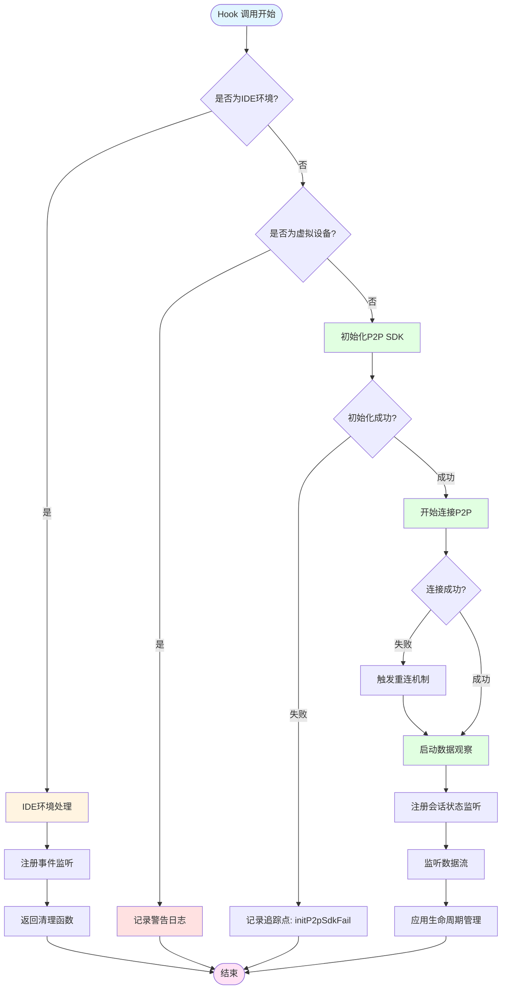
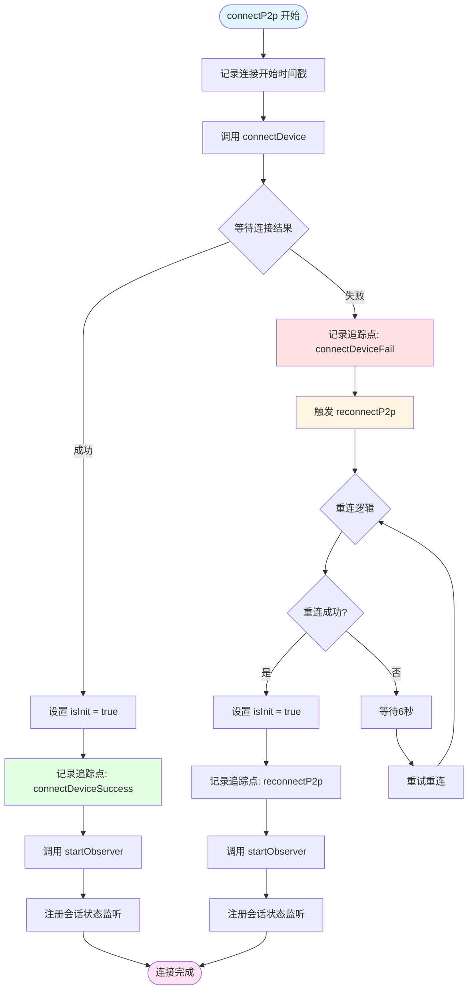
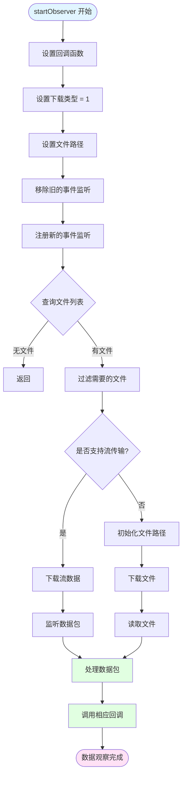
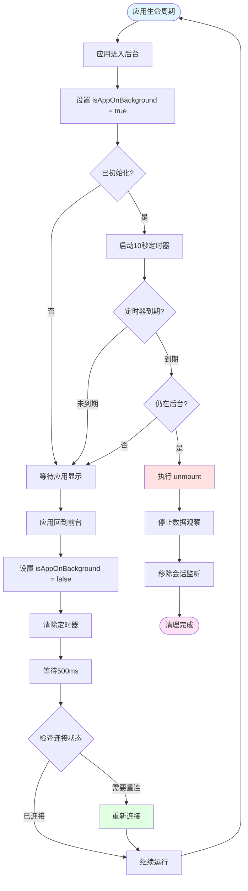
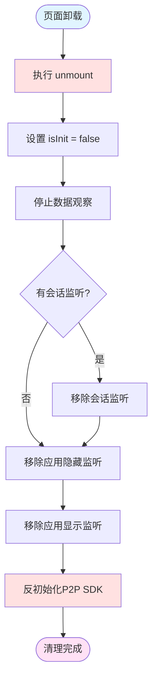
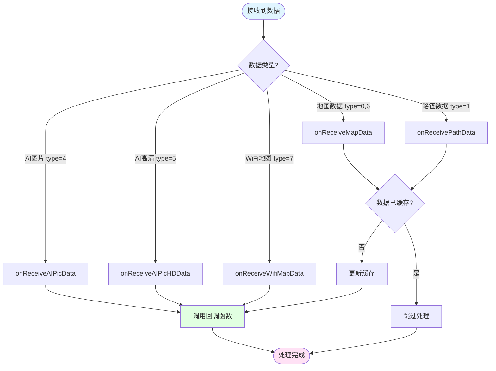
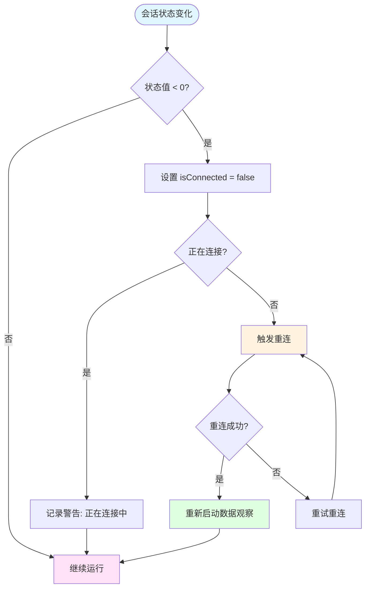
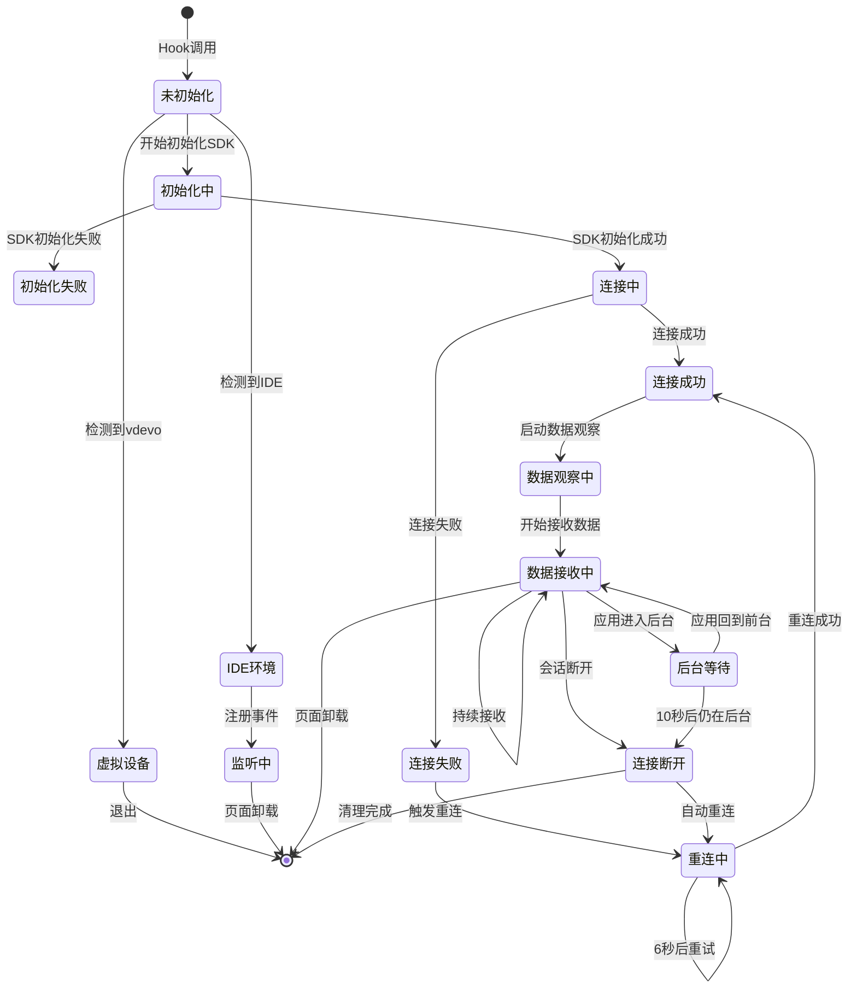

# useP2PDataStream 流程图

## 主流程图

```mermaid
flowchart TD
    Start([Hook 调用开始]) --> CheckIDE{是否为IDE环境?}

    CheckIDE -->|是| IDEEnv[IDE环境处理]
    IDEEnv --> RegisterIDE[注册事件监听]
    RegisterIDE --> ReturnIDE[返回清理函数]
    ReturnIDE --> End([结束])

    CheckIDE -->|否| CheckVDev{是否为虚拟设备?}
    CheckVDev -->|是| WarnVDev[记录警告日志]
    WarnVDev --> End

    CheckVDev -->|否| InitSDK[初始化P2P SDK]
    InitSDK --> InitSuccess{初始化成功?}

    InitSuccess -->|失败| TraceFail[记录追踪点: initP2pSdkFail]
    TraceFail --> End

    InitSuccess -->|成功| ConnectP2P[开始连接P2P]
    ConnectP2P --> ConnectSuccess{连接成功?}

    ConnectSuccess -->|失败| Reconnect[触发重连机制]
    Reconnect --> StartObserver[启动数据观察]

    ConnectSuccess -->|成功| StartObserver
    StartObserver --> RegisterSession[注册会话状态监听]
    RegisterSession --> ListenData[监听数据流]

    ListenData --> AppLifecycle[应用生命周期管理]
    AppLifecycle --> End

    style Start fill:#e1f5ff
    style End fill:#ffe1f5
    style IDEEnv fill:#fff4e1
    style WarnVDev fill:#ffe1e1
    style InitSDK fill:#e1ffe1
    style ConnectP2P fill:#e1ffe1
    style StartObserver fill:#e1ffe1
```

## 连接流程详细图

```mermaid
flowchart TD
    ConnectStart([connectP2p 开始]) --> RecordTime[记录连接开始时间戳]
    RecordTime --> CallConnect[调用 connectDevice]
    CallConnect --> WaitResult{等待连接结果}

    WaitResult -->|成功| SetInit[设置 isInit = true]
    SetInit --> TraceSuccess[记录追踪点: connectDeviceSuccess]
    TraceSuccess --> StartObs[调用 startObserver]
    StartObs --> RegSession[注册会话状态监听]
    RegSession --> ConnectEnd([连接完成])

    WaitResult -->|失败| TraceFail[记录追踪点: connectDeviceFail]
    TraceFail --> TriggerReconnect[触发 reconnectP2p]
    TriggerReconnect --> ReconnectLogic{重连逻辑}

    ReconnectLogic --> ReconnectSuccess{重连成功?}
    ReconnectSuccess -->|是| SetInit2[设置 isInit = true]
    SetInit2 --> TraceReconnect[记录追踪点: reconnectP2p]
    TraceReconnect --> StartObs2[调用 startObserver]
    StartObs2 --> RegSession2[注册会话状态监听]
    RegSession2 --> ConnectEnd

    ReconnectSuccess -->|否| Wait6s[等待6秒]
    Wait6s --> RetryReconnect[重试重连]
    RetryReconnect --> ReconnectLogic

    style ConnectStart fill:#e1f5ff
    style ConnectEnd fill:#ffe1f5
    style TraceSuccess fill:#e1ffe1
    style TraceFail fill:#ffe1e1
    style TriggerReconnect fill:#fff4e1
```

## 数据观察流程

```mermaid
flowchart TD
    StartObs([startObserver 开始]) --> SetCallbacks[设置回调函数]
    SetCallbacks --> SetDownloadType[设置下载类型 = 1]
    SetDownloadType --> SetPaths[设置文件路径]
    SetPaths --> RemoveEvents[移除旧的事件监听]
    RemoveEvents --> RegisterEvents[注册新的事件监听]
    RegisterEvents --> QueryFiles{查询文件列表}

    QueryFiles -->|无文件| ReturnEmpty[返回]
    QueryFiles -->|有文件| FilterFiles[过滤需要的文件]
    FilterFiles --> CheckStream{是否支持流传输?}

    CheckStream -->|是| DownloadStream[下载流数据]
    CheckStream -->|否| InitPath[初始化文件路径]
    InitPath --> DownloadFile[下载文件]

    DownloadStream --> ListenPackets[监听数据包]
    DownloadFile --> ReadFile[读取文件]

    ListenPackets --> ProcessData[处理数据包]
    ReadFile --> ProcessData

    ProcessData --> CallCallbacks[调用相应回调]
    CallCallbacks --> EndObs([数据观察完成])

    style StartObs fill:#e1f5ff
    style EndObs fill:#ffe1f5
    style ProcessData fill:#e1ffe1
    style CallCallbacks fill:#e1ffe1
```

## 应用生命周期管理流程

```mermaid
flowchart TD
    AppLifecycle([应用生命周期]) --> AppHide[应用进入后台]
    AppHide --> SetBackground[设置 isAppOnBackground = true]
    SetBackground --> CheckInit{已初始化?}

    CheckInit -->|否| WaitShow[等待应用显示]
    CheckInit -->|是| StartTimer[启动10秒定时器]
    StartTimer --> TimerExpire{定时器到期?}

    TimerExpire -->|未到期| WaitShow
    TimerExpire -->|到期| CheckStillBackground{仍在后台?}

    CheckStillBackground -->|否| WaitShow
    CheckStillBackground -->|是| Unmount[执行 unmount]

    WaitShow --> AppShow[应用回到前台]
    AppShow --> ClearBackground[设置 isAppOnBackground = false]
    ClearBackground --> ClearTimer[清除定时器]
    ClearTimer --> Wait500ms[等待500ms]
    Wait500ms --> CheckStatus{检查连接状态}

    CheckStatus -->|需要重连| Reconnect[重新连接]
    CheckStatus -->|已连接| Continue[继续运行]

    Unmount --> StopObserver[停止数据观察]
    StopObserver --> RemoveSession[移除会话监听]
    RemoveSession --> Cleanup([清理完成])

    Reconnect --> Continue
    Continue --> AppLifecycle

    style AppLifecycle fill:#e1f5ff
    style Cleanup fill:#ffe1f5
    style Unmount fill:#ffe1e1
    style Reconnect fill:#e1ffe1
```

## 清理流程

```mermaid
flowchart TD
    Unload([页面卸载]) --> Unmount[执行 unmount]
    Unmount --> SetInitFalse[设置 isInit = false]
    SetInitFalse --> StopObserver[停止数据观察]
    StopObserver --> CheckSession{有会话监听?}

    CheckSession -->|是| RemoveSession[移除会话监听]
    CheckSession -->|否| OffAppHide[移除应用隐藏监听]

    RemoveSession --> OffAppHide
    OffAppHide --> OffAppShow[移除应用显示监听]
    OffAppShow --> DeInitSDK[反初始化P2P SDK]
    DeInitSDK --> CleanupComplete([清理完成])

    style Unload fill:#e1f5ff
    style CleanupComplete fill:#ffe1f5
    style Unmount fill:#ffe1e1
    style DeInitSDK fill:#ffe1e1
```

## 数据流处理流程

```mermaid
flowchart TD
    DataReceive([接收到数据]) --> CheckType{数据类型?}

    CheckType -->|地图数据 type=0,6| MapData[onReceiveMapData]
    CheckType -->|路径数据 type=1| PathData[onReceivePathData]
    CheckType -->|AI图片 type=4| AIPicData[onReceiveAIPicData]
    CheckType -->|AI高清 type=5| AIHDData[onReceiveAIPicHDData]
    CheckType -->|WiFi地图 type=7| WifiMapData[onReceiveWifiMapData]

    MapData --> CheckCache{数据已缓存?}
    PathData --> CheckCache
    AIPicData --> CallCallback[调用回调函数]
    AIHDData --> CallCallback
    WifiMapData --> CallCallback

    CheckCache -->|是| Skip[跳过处理]
    CheckCache -->|否| UpdateCache[更新缓存]
    UpdateCache --> CallCallback

    CallCallback --> ProcessComplete([处理完成])
    Skip --> ProcessComplete

    style DataReceive fill:#e1f5ff
    style ProcessComplete fill:#ffe1f5
    style CallCallback fill:#e1ffe1
```

## 会话状态变化处理

```mermaid
flowchart TD
    SessionChange([会话状态变化]) --> CheckStatus{状态值 < 0?}

    CheckStatus -->|否| Continue[继续运行]
    CheckStatus -->|是| SetDisconnected[设置 isConnected = false]
    SetDisconnected --> CheckConnecting{正在连接?}

    CheckConnecting -->|是| WarnConnecting[记录警告: 正在连接中]
    WarnConnecting --> Continue

    CheckConnecting -->|否| TriggerReconnect[触发重连]
    TriggerReconnect --> ReconnectSuccess{重连成功?}

    ReconnectSuccess -->|是| RestartObserver[重新启动数据观察]
    ReconnectSuccess -->|否| Retry[重试重连]

    RestartObserver --> Continue
    Retry --> TriggerReconnect

    style SessionChange fill:#e1f5ff
    style Continue fill:#ffe1f5
    style TriggerReconnect fill:#fff4e1
    style RestartObserver fill:#e1ffe1
```

## 完整状态机图

```mermaid
stateDiagram-v2
    [*] --> 未初始化: Hook调用

    未初始化 --> IDE环境: 检测到IDE
    未初始化 --> 虚拟设备: 检测到vdevo
    未初始化 --> 初始化中: 开始初始化SDK

    IDE环境 --> 监听中: 注册事件
    虚拟设备 --> [*]: 退出

    初始化中 --> 初始化失败: SDK初始化失败
    初始化中 --> 连接中: SDK初始化成功

    连接中 --> 连接成功: 连接成功
    连接中 --> 连接失败: 连接失败

    连接失败 --> 重连中: 触发重连
    重连中 --> 连接成功: 重连成功
    重连中 --> 重连中: 6秒后重试

    连接成功 --> 数据观察中: 启动数据观察
    数据观察中 --> 数据接收中: 开始接收数据

    数据接收中 --> 数据接收中: 持续接收
    数据接收中 --> 连接断开: 会话断开

    连接断开 --> 重连中: 自动重连

    监听中 --> [*]: 页面卸载
    数据接收中 --> 后台等待: 应用进入后台
    后台等待 --> 连接断开: 10秒后仍在后台
    后台等待 --> 数据接收中: 应用回到前台

    数据接收中 --> [*]: 页面卸载
    连接断开 --> [*]: 清理完成
```
