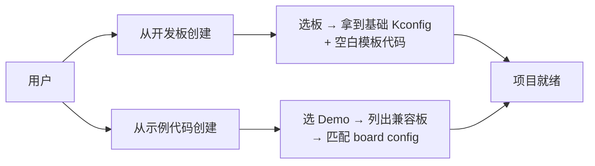
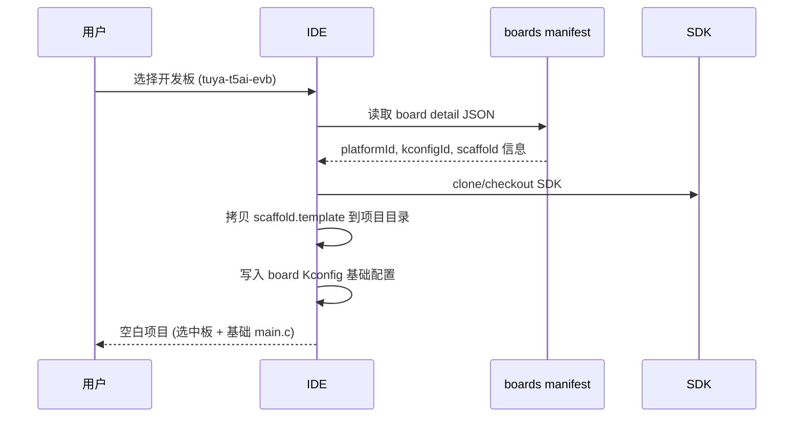
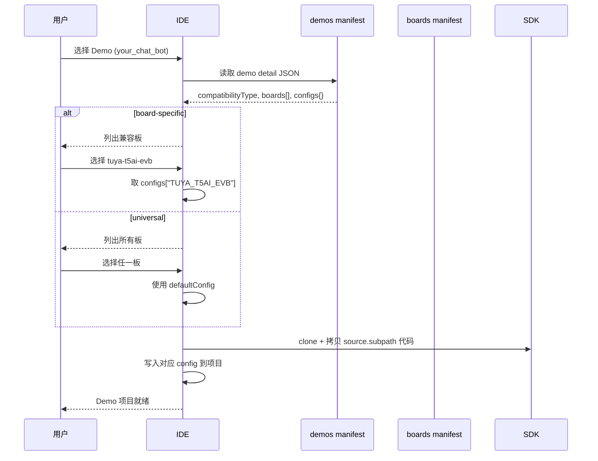
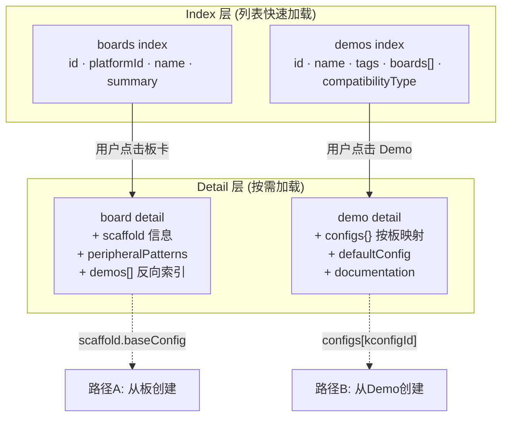
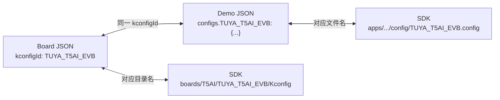

# Manifest 架构设计：项目创建双路径

## 两种创建方式



---

## 路径 A：从开发板创建



## 路径 B：从示例代码创建



---

## 新 JSON 结构设计

### Board Detail（增强版）

```jsonc
// boards-and-chips/{platform}/{board-id}.json
{
  "id": "tuya-t5ai-evb",
  "platformId": "t5ai",
  "kconfigId": "TUYA_T5AI_EVB",        // SDK Kconfig 标识符
  "name": { "en": "...", "zh-CN": "..." },
  "summary": { "en": "...", "zh-CN": "..." },

  // 从板创建时的脚手架信息
  "scaffold": {
    "template": "tools/app_template/embedded",   // SDK 内模板路径
    "baseConfig": {                               // 写入项目的基础 Kconfig
      "CONFIG_PLATFORM_CHOICE": "T5AI",
      "CONFIG_BOARD_CHOICE_TUYA_T5AI_EVB": "y"
    }
  },

  // 该板可跑的 demo 列表 (反向索引，构建时自动生成)
  "demos": ["tuya-ai-your-chat-bot", "peripherals-button", "..."],

  // 硬件外设 (现有结构保持)
  "peripheralPatterns": { ... }
}
```

### Demo Detail（增强版）

```jsonc
// demos/{demo-id}.json
{
  "id": "tuya-ai-your-chat-bot",
  "name": { "en": "...", "zh-CN": "..." },
  "summary": { "en": "...", "zh-CN": "..." },
  "tags": ["app", "ai", "chat"],

  "compatibilityType": "board-specific",  // "universal" | "board-specific"

  // 代码来源 — IDE 直接据此 clone + copy
  "source": {
    "repo": "https://github.com/tuya/TuyaOpen",
    "ref": "master",
    "subpath": "apps/tuya.ai/your_chat_bot"
  },

  // 板级配置映射 — key = kconfigId, value = 配置内容
  "configs": {
    "TUYA_T5AI_EVB": {
      "file": "config/TUYA_T5AI_EVB.config",      // SDK source 内相对路径
      "overrides": {                                // 关键 Kconfig 覆盖项
        "CONFIG_BOARD_CHOICE_TUYA_T5AI_EVB": "y",
        "CONFIG_ENABLE_GUI_CHATBOT": "y"
      }
    },
    "DNESP32S3": {
      "file": "config/DNESP32S3.config",
      "overrides": {
        "CONFIG_BOARD_CHOICE_DNESP32S3": "y"
      }
    }
  },

  // 通用默认配置 (所有板共享的基础项)
  "defaultConfig": {
    "CONFIG_PROJECT_VERSION": "1.0.0",
    "CONFIG_TUYA_PRODUCT_ID": ""
  },

  // 兼容板清单 (= configs 的 keys，冗余以便 index 快速过滤)
  "boards": ["tuya-t5ai-evb", "tuya-t5ai-board", "dnesp32s3"],

  "documentation": {
    "readme": { "en": "...", "zh-CN": "..." }
  }
}
```

### Demo Index（轻量查询用）

```jsonc
// demos/index.json
{
  "version": "1.0",
  "items": [
    {
      "id": "tuya-ai-your-chat-bot",
      "name": { "en": "AI Chat Bot", "zh-CN": "AI 聊天机器人" },
      "summary": { "en": "...", "zh-CN": "..." },
      "tags": ["app", "ai"],
      "compatibilityType": "board-specific",
      "boards": ["tuya-t5ai-evb", "tuya-t5ai-board", "dnesp32s3"],
      "source": { "repo": "...", "subpath": "apps/tuya.ai/your_chat_bot", "ref": "master" }
    }
    // ... 不含 configs/defaultConfig，需要时读 detail
  ]
}
```

---

## 关键设计决策



### 查询场景

| 场景 | 读取 | 字段 |
|------|------|------|
| 列出所有 Demo | `demos/index.json` | items[] 轻量 |
| 按板过滤 Demo | index 的 `boards[]` 包含选中板 | 纯前端过滤 |
| 按标签过滤 | index 的 `tags[]` | 纯前端过滤 |
| 创建项目(从板) | board detail → `scaffold` | 模板路径 + 基础 config |
| 创建项目(从Demo) | demo detail → `configs[kconfigId]` | 板级配置文件 + 覆盖项 |
| 列出某板能跑的 Demo | board detail → `demos[]` | 反向索引 |

### 维护策略

| 操作 | 触发 | 影响文件 |
|------|------|----------|
| 新增 Demo | manifest-editor / 扫描脚本 | `demos/index.json` + `demos/{id}.json` |
| 新增 Board | manifest-editor | `boards-and-chips/index.json` + board detail |
| Demo 新增板兼容 | 编辑 demo detail | demo detail `configs` + `boards[]`；board detail `demos[]` |
| SDK 更新 | 重新扫描脚本 | 批量更新 configs 映射 |

---

## kconfigId 作为桥梁



`kconfigId` 是连接 Board、Demo、SDK 三者的唯一标识符：
- Board manifest 声明自己的 `kconfigId`
- Demo manifest 用 `configs[kconfigId]` 存该板的配置
- SDK 中 `boards/{PLATFORM}/{kconfigId}/` 和 `config/{kconfigId}.config` 使用同名
